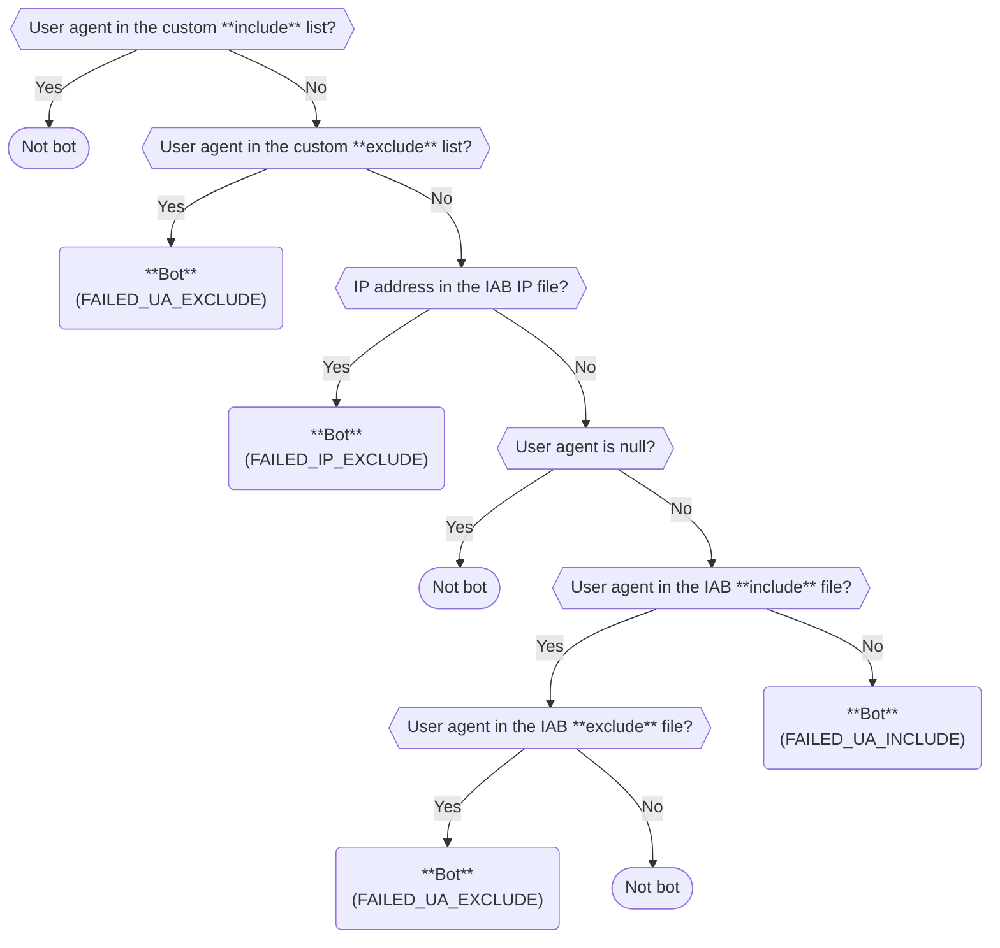

import SchemaProperties from "@site/docs/reusable/schema-properties/_index.md"

The IAB Spiders and Robots enrichment uses the [IAB/ABC International Spiders and Bots List](https://iabtechlab.com/software/iababc-international-spiders-and-bots-list/) to determine whether an event was produced by a user or a robot/spider based on its IP address and user agent.

The Interactive Advertising Bureau (IAB) is an advertising business organization that develops industry standards, conducts research, and provides legal support for the online advertising industry.

Their internationally recognized list of spiders and bots is regularly maintained to try and identify the IP addresses of known bots and spiders.

## How the enrichment works

This enrichment performs several checks using the IAB database files and your custom override lists.

Here is the logic it uses. The values in parentheses are for the `reason` field in the IAB [entity](/docs/fundamentals/entities/index.md) attached to the event.



A user agent string will match one of the lists or files if it contains a string from that list or file. The matching is case-insensitive.

For example, the user agent string `Chrome Chrome MyBot Chrome` will match an entry named `mybot`.


## Configuration

The example shows `database` and `uri` fields. Snowplow CDI customers don't need to worry about these properties: check Console for pre-configured values suitable for your cloud.

<SchemaProperties
  overview={{ enrichment: true }}
  example={{
    schema: "iglu:com.snowplowanalytics.snowplow.enrichments/iab_spiders_and_robots_enrichment/jsonschema/1-0-1",
    data: {
      name: "iab_spiders_and_robots_enrichment",
      vendor: "com.snowplowanalytics.snowplow.enrichments",
      enabled: false,
      parameters: {
        ipFile: {
          database: "ip_exclude_current_cidr.txt",
          uri: "s3://my-private-bucket/iab"
        },
        excludeUseragentFile: {
          database: "exclude_current.txt",
          uri: "s3://my-private-bucket/iab"
        },
        includeUseragentFile: {
          database: "include_current.txt",
          uri: "s3://my-private-bucket/iab"
        },
        excludeUseragents: [],
        includeUseragents: []
      }
    }
  }}
  schema={{ "$schema": "http://iglucentral.com/schemas/com.snowplowanalytics.self-desc/schema/jsonschema/1-0-0#", "description": "Schema for IAB Spiders and Robots enrichment config", "self": { "vendor": "com.snowplowanalytics.snowplow.enrichments", "name": "iab_spiders_and_robots_enrichment", "format": "jsonschema", "version": "1-0-1" }, "type": "object", "properties": { "vendor": { "type": "string" }, "name": { "type": "string" }, "enabled": { "type": "boolean" }, "parameters": { "type": "object", "properties": { "ipFile": { "description": "Path to IP address exclude file", "type": "object", "properties": { "database": { "enum": ["ip_exclude_current_cidr.txt"] }, "uri": { "type": "string", "format": "uri" } }, "required": ["database", "uri"] }, "excludeUseragentFile": { "description": "Path to user agent exclude file", "type": "object", "properties": { "database": { "enum": ["exclude_current.txt"] }, "uri": { "type": "string", "format": "uri" } }, "required": ["database", "uri"] }, "includeUseragentFile": { "description": "Path to user agent include file", "type": "object", "properties": { "database": { "enum": ["include_current.txt"] }, "uri": { "type": "string", "format": "uri" } }, "required": ["database", "uri"] }, "includeUseragents": { "description": "Additional user agent patterns to classify as browsers, extending includeUseragentFile. Case-insensitive substring match.", "type": "array", "items": { "type": "string" } }, "excludeUseragents": { "description": "Additional user agent patterns to classify as spiders/robots, extending excludeUseragentFile. Case-insensitive substring match.", "type": "array", "items": { "type": "string" } } }, "required": ["ipFile", "excludeUseragentFile", "includeUseragentFile"], "additionalProperties": false } }, "required": ["vendor", "name", "enabled", "parameters"], "additionalProperties": false }} />

```mdx-code-block
import TestingWithMicro from "@site/docs/reusable/test-enrichment-with-micro/_index.md"

<TestingWithMicro/>
```

### IAB files

There are three configuration fields that correspond to the IAB/ABC database files:

| Field name             | Description                                                       |
| ---------------------- | ----------------------------------------------------------------- |
| `ipFile`               | Denylist of IP addresses considered to be robots or spiders       |
| `excludeUseragentFile` | Denylist of user agent strings considered to be robots or spiders |
| `includeUseragentFile` | Allowlist of user agent strings considered to be browsers         |

All three are mandatory and must have two inner fields:

- The `database` field containing the name of the database file.
- The `uri` field containing the URI of the bucket in which the database file is found. This field supports `http`, `https`, `gs`, and `s3` schemes.

:::tip[Snowplow CDI]

If you use Snowplow CDI, the necessary files are already provided and updated by Snowplow. You can see the pre-configured URIs of these files in the default enrichment configuration in [Console](https://console.snowplowanalytics.com).

:::

The database filenames must be as follows:

| Field name                      | Filename                        |
| ------------------------------- | ------------------------------- |
| `ipFile.database`               | `"ip_exclude_current_cidr.txt"` |
| `excludeUseragentFile.database` | `"exclude_current.txt"`         |
| `includeUseragentFile.database` | `"include_current.txt"`         |

### Custom user agent lists

:::note[Availability]

This feature is available since version 6.8.0 of Enrich.

:::

In addition to the IAB database files, you can provide custom lists of user agent strings to supplement or override the detection. Two optional fields can be added to the `parameters` section:

| Field name          | Description                                                     |
| ------------------- | --------------------------------------------------------------- |
| `excludeUseragents` | A list of user agent strings to be treated as robots or spiders |
| `includeUseragents` | A list of user agent strings to be treated as browsers          |

Both fields accept a JSON array of strings. They are optional and default to empty lists if omitted.

A user agent matching `excludeUseragents` produces the following output values:

| Field           | Value               |
| --------------- | ------------------- |
| `spiderOrRobot` | `true`              |
| `category`      | `SPIDER_OR_ROBOT`   |
| `reason`        | `FAILED_UA_EXCLUDE` |
| `primaryImpact` | `UNKNOWN`           |

A user agent matching `includeUseragents` produces the following output values:

| Field           | Value        |
| --------------- | ------------ |
| `spiderOrRobot` | `false`      |
| `category`      | `BROWSER`    |
| `reason`        | `PASSED_ALL` |
| `primaryImpact` | `NONE`       |

Example:

```json
"excludeUseragents": ["my-custom-bot/1.0", "internal-crawler"],
"includeUseragents": ["my-legitimate-app/2.0"]
```

This is useful when you need to flag or allowlist specific user agents without modifying the IAB database files themselves.

## Input

This enrichment uses the following [fields](/docs/fundamentals/canonical-event/index.md) of a Snowplow event:

- `useragent` to determine an event's user agent, which will be validated against the databases described in `excludeUseragentFile` and `includeUseragentFile`, as well as the custom lists in `excludeUseragents` and `includeUseragents`
- `user_ipaddress` to determine an event's IP address, which will be validated against the database described in `ipFile`
- `derived_tstamp` to determine an event's datetime. Some entries in the Spiders and Robots List can be considered "stale", and will be given a `category` of `INACTIVE_SPIDER_OR_ROBOT` rather than `ACTIVE_SPIDER_OR_ROBOT` based on their age

## Output

This enrichment adds a `spiders_and_robots` entity to the enriched event.

<SchemaProperties
  overview={{ entity: true }}
  example={{
    spiderOrRobot: false,
    category: "BROWSER",
    reason: "PASSED_ALL",
    primaryImpact: "NONE"
  }}
  schema={{ "$schema": "http://iglucentral.com/schemas/com.snowplowanalytics.self-desc/schema/jsonschema/1-0-0#", "description": "Schema for an entity generated by the IAB Spiders and Robots enrichment", "self": { "vendor": "com.iab.snowplow", "name": "spiders_and_robots", "format": "jsonschema", "version": "1-0-0" }, "type": "object", "properties": { "spiderOrRobot": { "description": "true if the IP address or user agent checked against the list is a spider or robot, false otherwise", "type": "boolean" }, "category": { "description": "Category based on activity if the IP/UA is a spider or robot, BROWSER otherwise", "enum": ["SPIDER_OR_ROBOT", "ACTIVE_SPIDER_OR_ROBOT", "INACTIVE_SPIDER_OR_ROBOT", "BROWSER"] }, "reason": { "description": "Type of failed check if the IP/UA is a spider or robot, PASSED_ALL otherwise", "enum": ["FAILED_IP_EXCLUDE", "FAILED_UA_INCLUDE", "FAILED_UA_EXCLUDE", "PASSED_ALL"] }, "primaryImpact": { "description": "Whether the spider or robot would affect page impression measurement, ad impression measurement, both or none", "enum": ["PAGE_IMPRESSIONS", "AD_IMPRESSIONS", "PAGE_AND_AD_IMPRESSIONS", "UNKNOWN", "NONE"] } }, "required": ["spiderOrRobot", "category", "reason", "primaryImpact"], "additionalProperties": false }} />
