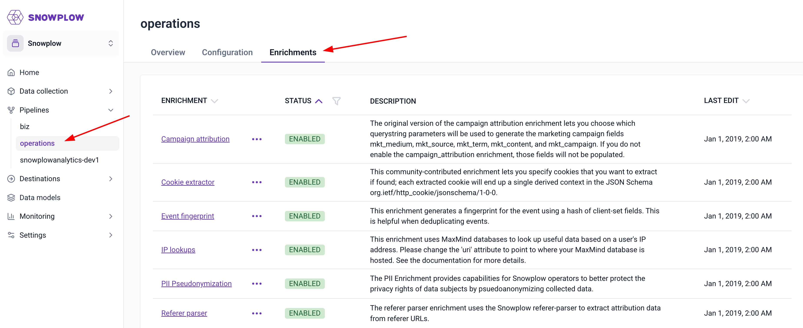
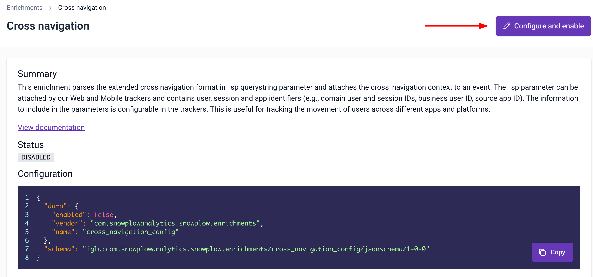
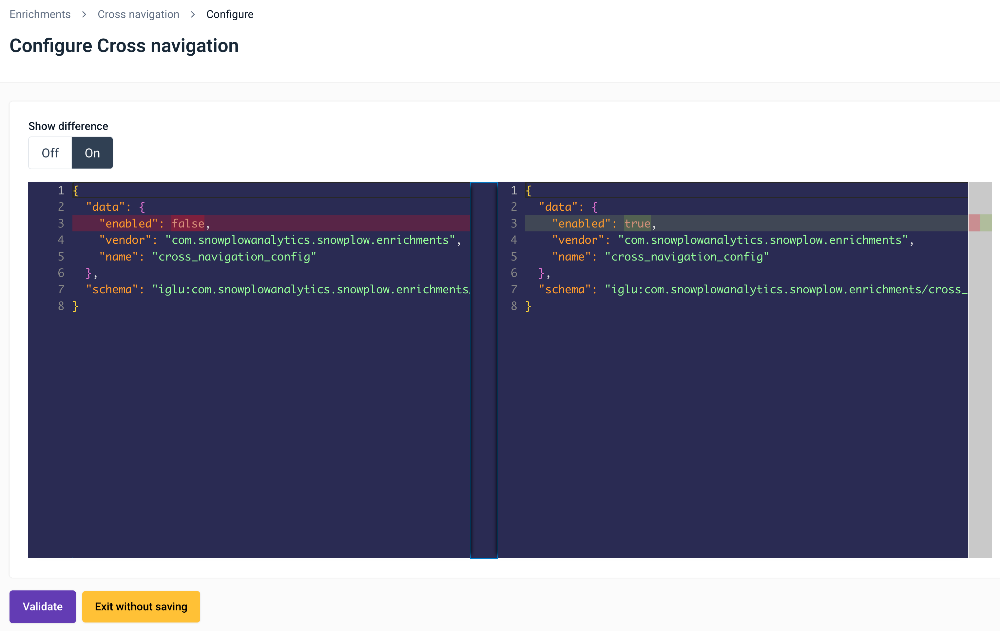
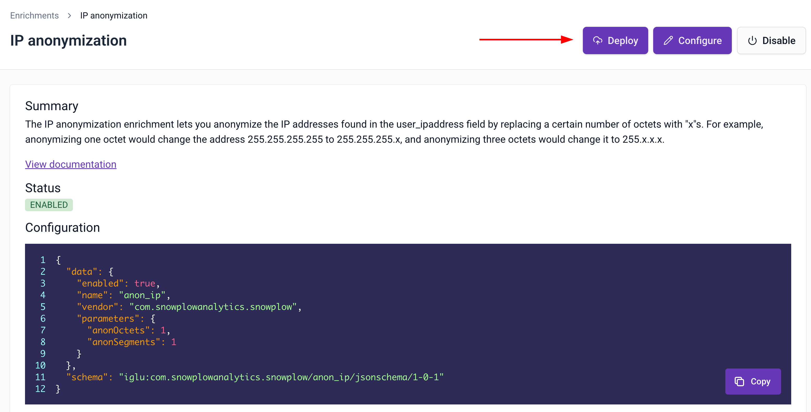
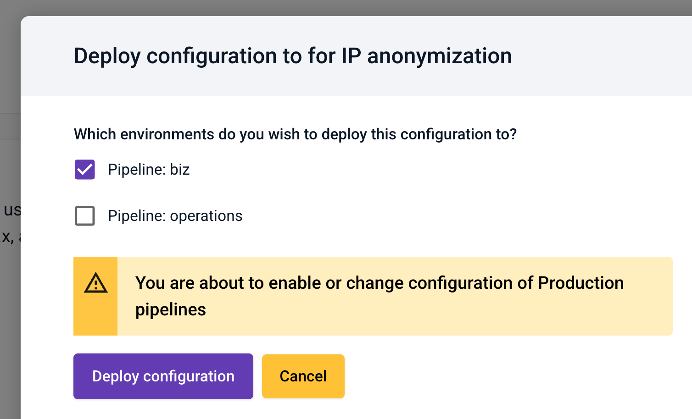

Snowplow Console enables you to manage the Enrichments that run on each of your pipelines.

To start managing Enrichments, navigate to the pipeline you'd like to manage and click on the _Enrichments_ tab.

## View which Enrichments are running for a pipeline

When you select navigate to the Enrichments screen you'll see a listing of all Enrichments and see their current status & last edited date for the pipeline.

## Enable /editing an Enrichment

You can enable and edit enrichments on any pipeline, but we recommend the following workflow to test the configuration before deploying it:

- Navigate to a sandbox (Snowplow Mini)
- Enable and configure the Enrichment as required
- Send some events to your Snowplow Mini endpoint and validate the fields appear as expected in the event payload
- Deploy the configuration to your pipeline(s)

### Enable the enrichment on a sandbox

**Navigate to a Snowplow Mini** and locate the enrichment you wish to enable. In the listing select _Configure and enable / Edit configuration_ from the pop up menu, or click the **Configure and enable / Edit config** button when viewing the enrichment.

**On the configuration screen**, edit the JSON configuration ([refer to each individual enrichments documentation for support](/docs/pipeline/enrichments/available-enrichments/index.md)) and click _Validate._

If your configuration is valid you will be given the option to _Publish_ the enrichment to the environment. If it is invalid you will be given validation errors to correct.

**_Publish_ your configuration** to the environment and then test it by sending some events to the Mini endpoint.

Once you are happy with your configuration, follow [Deploying a configuration across environments](#deploy) to deploy the configuration to a pipeline.

* * *

## Deploying an Enrichment configuration across environments

You will need to copy a configuration across environments when:

- you have followed our recommended _Edit / Enable_ workflow and wish to deploy your changes to a Pipeline
- you want to copy the configuration from one Snowplow Mini instance environment to another Snowplow Mini instance

**Navigate to the Snowplow Mini** that you want to deploy from, and locate the Enrichment you want to deploy to another environment.

**Click _Deploy_**:

In the dialog that appears, select which environments you wish to copy to and click _Deploy configuration._

Important!

Deployments to pipeline environments currently involve work performed by our Support team. You can expect your change to be live within 24 hours.

## Disable an Enrichment

**Navigate to the environment** that contains the Enrichment you wish to disable.

In the listing select _Disable enrichment_ from the pop up menu, or click the **Disable** button when viewing the enrichment.

Confirm that you wish to disable the enrichment.

Important!

Disabling enrichments on pipeline environments currently involves work performed by our Support team. You can expect your change to be live within 24 hours.
