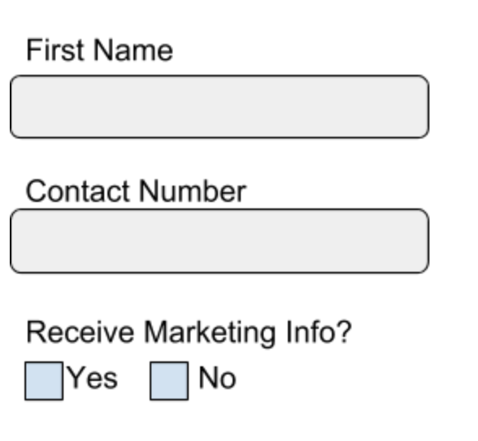

Let’s say we want to track a custom event when the following form is filled:



## Creating the schema

First, let's create the skeleton for our schema that will describe the structure of the data we want to capture from this form.

We'll give it the following details:

- We'll set name to `basic_form_tracking`
- And give it a description of `Schema for tracking our demo form`

:::info BDP Cloud

If you are a BDP Cloud customer, use the [data structures builder UI](/docs/understanding-tracking-design/managing-your-data-structures/builder/index.md) to follow along. You will not need the JSON code.

:::

```json
{
    "$schema" : "http://iglucentral.com/schemas/com.snowplowanalytics.self-desc/schema/jsonschema/1-0-0#",
    "description": "Schema for tracking our demo form",
    "self": {
        "vendor": "com.snowplowanalytics",		
        "name": "basic_form_tracking",						
        "format": "jsonschema",
        "version": "1-0-0"
    },
    "type": "object",
    "properties": {	
        ...
    },
    "additionalProperties": false
}
```

### Adding properties

For the first field (“First Name"), let’s assume the following:

1. The name of the field should be ‘form1_first_name’ (so everyone knows how to find it in the database later)
2. Values entered should be a string (text)
3. The string should have a minimum of two characters (to avoid initials) and a maximum of 100 characters.
4. This field is required.

In the schema for this data structure, we would display these decisions as properties of the field and specify that this field as required:

```json
...
    "properties": {
        "form1_first_name": {
            "type": "string",
            "minLength": 2,
            "maxLength": 100
        }
    },
    "required": [
        "form1_first_name"
    ]
...
```

:::info BDP Cloud

If you are a BDP Cloud customer, you can create an equivalent data structure in the [data structures builder UI](/docs/understanding-tracking-design/managing-your-data-structures/builder/index.md).

:::

For the second form field, let’s say:

1. The name of the field should be “form1_contact_number"
2. The values entered must be a number
3. The minimum and maximum number length should be 10 digits
4. This is an optional field

So we would add another field to the properties in the schema like so:

```json
...
    "properties": {
        "form1_first_name": {
            "type": "string",
            "minLength": 2,
            "maxLength": 100
        },
        "form1_contact_number": {
            "type": ["number", "null"],
            "minLength": 10,
            "maxLength": 10,
            "description": "This is the contact number field from form1 on acme.com/form1"
        }
    },
    "required": [
        "form1_first_name"
    ]
...
```

Adding the “null" type above means that if there is no data value sent across for this field, the event will still pass schema validation.

Finally, for the 3rd form field the decisions are as follows:

1. The name of the field should be “opt_into_marketing"
2. The values sent are True/False; Yes = true, No = false
3. This field is required.

Our schema definition would become:

```json
...
    "properties": {
        "form1_first_name": {
            "type": "string",
            "minLength": 2,
            "maxLength": 100
        },
        "form1_contact_number": {
            "type": ["number", "null"],
            "minLength": 10,
            "maxLength": 10,
            "description": "This is the contact number field from form1 on acme.com/form1"
        },
        "opt_into_marketing": {
            "type": "boolean"
        }
    },
    "required": [
        "form1_first_name",
        "opt_into_marketing"
    ]
...
```

### Putting it all together

Our final schema might look liks this:

```json
{
    "$schema" : "http://iglucentral.com/schemas/com.snowplowanalytics.self-desc/schema/jsonschema/1-0-0#",
    "description": "Schema for tracking our demo form",
    "self": {
        "vendor": "com.snowplowanalytics",        
        "name": "basic_form_tracking",                      
        "format": "jsonschema",
        "version": "1-0-0"
    },
    "type": "object",
    "properties": {
        "form1_first_name": {
            "type": "string",
            "minLength": 2,
            "maxLength": 100
        },
        "form1_contact_number": {
            "type": ["number", "null"],
            "minLength": 10,
            "maxLength": 10,
            "description": "This is the contact number field from form1 on acme.com/form1"
        },
        "opt_into_marketing": {
            "type": "boolean"
        }
    },
    "required": [
        "form1_first_name",
        "opt_into_marketing"
    ],
    "additionalProperties": false
}
```

:::note Additional properties

If you set `additionalProperties` to `false`, any events sent with properties not defined in the schema will fail validation.

If you set it to `true`, the events will pass validation, but they will not be stored in your data warehouse (unless you are using Snowflake — see [how schemas translate to the warehouse](/docs/storing-querying/schemas-in-warehouse/index.md)).

In cases where you have more control over the data collection — like 1st party sources —  you may want to be more strict, whereas with 3rd party sources you might not want to be as strict.

:::

### Uploading your schema

For this step, follow the documentation on [managing your data structures](/docs/understanding-tracking-design/managing-your-data-structures/index.md).

## Testing the schema

Now that you have written your schema and published to the development registry, the next step is to test it to ensure that it works the way you want.

To do this we'll need to:

- Create the HTML for our form
- Initialize the Snowplow Javascript Tracker
- Set up our event tracking
- Use [Snowplow Micro](/docs/testing-debugging/snowplow-micro/index.md) or [Snowplow Mini](/docs/pipeline-components-and-applications/snowplow-mini/overview/index.md) to validate our tracking

### HTML

Create a new HTML page with this content:

```html
<html>
<body>
<form class="form-horizontal">
<fieldset>

<!-- Form Name -->
<legend>Form Name</legend>

<!-- Text input-->
<div class="form-group">
  <label class="col-md-4 control-label" for="form1_first_name">First name</label>  
  <div class="col-md-4">
  <input id="form1_first_name" name="form1_first_name" type="text" placeholder="" class="form-control input-md" required="">
    
  </div>
</div>

<!-- Text input-->
<div class="form-group">
  <label class="col-md-4 control-label" for="form1_contact_number">Contact number</label>  
  <div class="col-md-4">
  <input id="form1_contact_number" name="form1_contact_number" type="text" placeholder="" class="form-control input-md">
    
  </div>
</div>

<!-- Multiple Checkboxes -->
<div class="form-group">
  <label class="col-md-4 control-label" for="opt_into_marketing">Receive marketing info?</label>
  <div class="col-md-4">
  <div class="checkbox">
    <label for="opt_into_marketing-0">
      <input type="checkbox" name="opt_into_marketing" id="opt_into_marketing-0" value="1">
      Yes
    </label>
	</div>
  <div class="checkbox">
    <label for="opt_into_marketing-1">
      <input type="checkbox" name="opt_into_marketing" id="opt_into_marketing-1" value="0">
      No
    </label>
	</div>
  </div>
</div>

<!-- Button -->
<div class="form-group">
  <label class="col-md-4 control-label" for="button"></label>
  <div class="col-md-4">
    <button id="button" name="button" class="btn btn-primary" onclick="form1submit()">Submit</button>
  </div>
</div>

</fieldset>
</form>
</body>
</html>
```

### JavaScript

#### Initializing the tracker

Follow the Web Quick Start Guide to [add it into your HTML](/docs/collecting-data/collecting-from-own-applications/javascript-trackers/web-tracker/quick-start-guide/index.md).

#### Setting up tracking

For our form example, we would likely be using the JavaScript Tracker to send across the necessary data on the submit button click event.

Let's add a function into our page, you'll need to pass in the values from your form:

```javascript
<script>
function form1submit(){ 
  window.snowplow('trackSelfDescribingEvent', {
    schema: 'iglu:com.snowplowanalytics/form1_fields/jsonschema/1-0-0',
    data: {
      form1_first_name: VALUE HERE,
      form1_contact_number: VALUE HERE,
      opt_into_marketing: VALUE HERE
    }
  });
};
</script>
```

#### Testing the tracking

The easiest way to test that your tracking works correctly is via the [Snowplow Inspector](/docs/testing-debugging/snowplow-inspector/index.md). Make sure to [configure](/docs/testing-debugging/snowplow-inspector/adding-schemas/index.md) it with your schema registry.

If you are using BDP Enterprise, you can use [Snowplow Mini](/docs/pipeline-components-and-applications/snowplow-mini/index.md) to validate _and_ inspect your events in more detail in the OpenSearch dashboard.

Finally, regardless of your Snowplow offering, you can also use [Snowplow Micro](/docs/testing-debugging/snowplow-micro/index.md).
