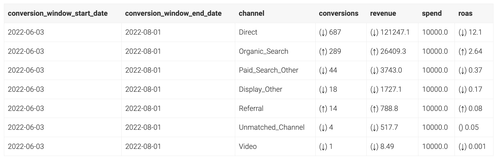
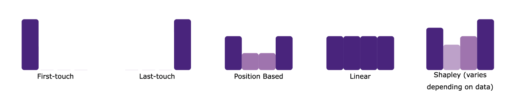
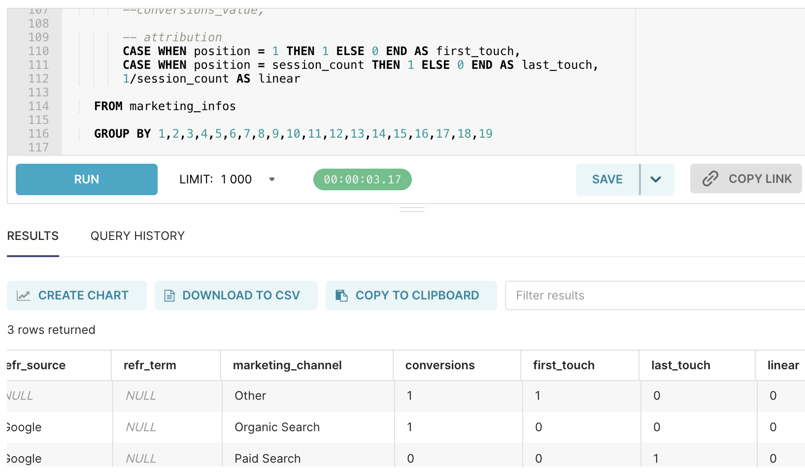
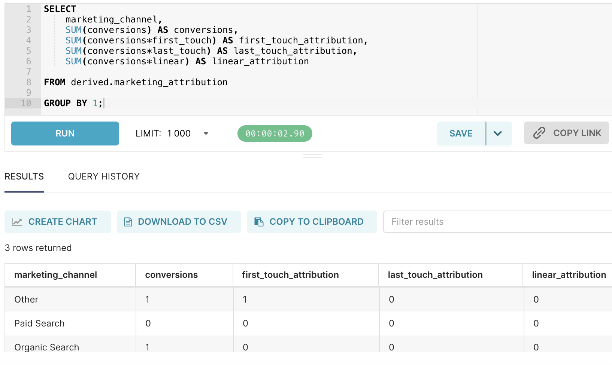
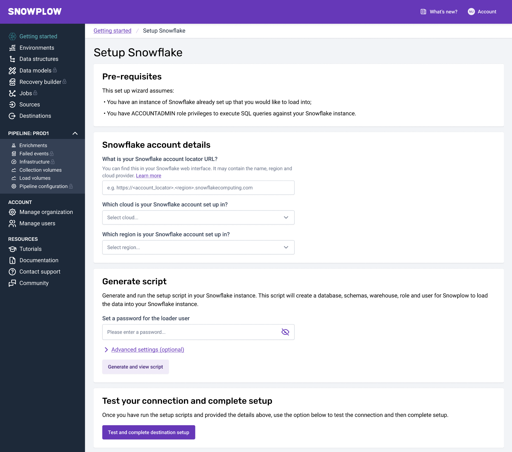
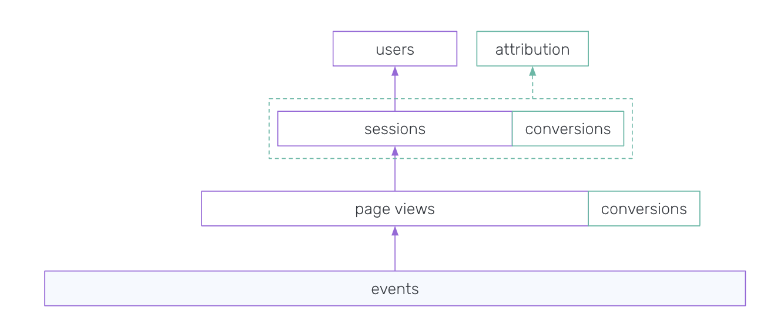
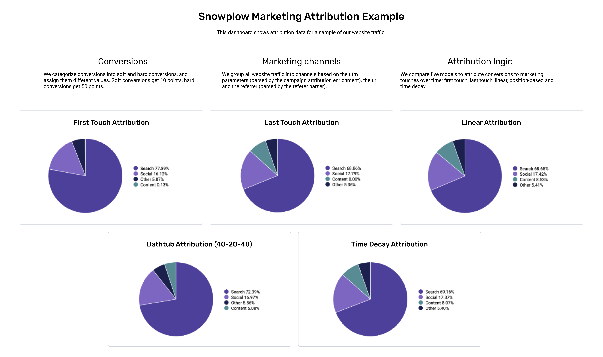

## Introduction

[Attribution modeling](https://snowplow.io/use-cases/marketing-attribution/) is the process of assigning credit for conversions to marketing touch points, vital for every company's acquisition strategy. This is the first use case many companies deploy with Snowplow for a few reasons:
* Snowplow delivers very high quality event data and concurrent multitouch attribution dbt models out of the box
* No custom tracking is required for a first iteration
* Configurability is the key to attribution, with Snowplow everything from the conversion trigger to the session definition and touchpoint weighting algorithm is configurable

By the end of this guide you will have built a table just like this one for your business:



## What you'll be doing
The most important goal of this guide is to help you learn something new about your customers!

:::note
Prerequisites:
* to build a proof of concept: None!
* to build a production-ready model: dbt, a data warehouse / lake, ability to add a JS tag to a website, and a BDP Cloud account

:::

To achieve this, you will:
1. See Snowplow's approach to attribution in just a few clicks in our sandbox trial environment
2. Create data about your real customers to power that same model using automatic Snowplow tracking (no JS skills needed!)
3. Connect Snowplow to your data warehouse and deploy our dbt attribution package in just a few minutes
4. Learn how to configure the tracking and the model to make it most effective for your business

Without even getting to any more advanced customizations, Snowplow gives you the following models out of the box with just automatic page view tracking:




## 1. Proof of concept with sample data

#### Set up a free Snowplow account

Make sure you've set up a free [Snowplow trial account](https://try.snowplowanalytics.com/) and follow the getting started instructions to generate sample events by clicking [the "Web Analytics" button](https://try.snowplowanalytics.com/event-tester).

:::note
Check [this guide](/docs/recipes/querying-try-data/index.md) out if you want help querying the data
:::

#### Create a sessions table



You can see what the fields mean by reviewing [the Snowplow Canonical Event Model docs page](/docs/understanding-your-pipeline/canonical-event/index.md).

```sql
CREATE TABLE derived.marketing_attribution AS(
    WITH session_aggregations AS (

        SELECT
            ev.domain_userid AS domain_userid,
            ev.domain_sessionid AS session_id,
            MIN(ev.derived_tstamp) AS session_start,
            SUM(CASE WHEN ev.event_name = 'page_view' THEN 1 ELSE 0 END) AS page_views,
            SUM(CASE WHEN ev.page_urlpath = '/page2' THEN 1 ELSE 0 END) AS conversions -- !! conversion logic to be customized !!
            --SUM(c.value) AS conversions_value -- conversion value to be added when tracked specifically

        FROM atomic.events AS ev
        --LEFT JOIN atomic.io_snowplow_foundation_conversion_1 AS c -- this join is only relevant if custom conversion events are tracked in the second section of the guide
        --    ON ev.event_id = c.root_id AND ev.collector_tstamp = c.root_tstamp

        WHERE ev.event_name IN ('page_view', 'conversion')
        GROUP BY 1,2

    ), session_count AS(

        SELECT
            domain_userid,
            COUNT(DISTINCT session_id) AS session_count

        FROM session_aggregations

        GROUP BY 1

    ), marketing_infos AS(

        SELECT
            -- session information
            s.domain_userid,
            s.session_id,
            s.session_start,
            s.page_views,

            -- marketing information
            ev.mkt_medium,
            ev.mkt_source,
            ev.mkt_term,
            ev.mkt_content,
            ev.mkt_campaign,
            ev.mkt_network,
            ev.mkt_clickid,

            -- referer information
            ev.refr_medium,
            ev.refr_source,
            ev.refr_term,

            -- marketing channel
            CASE
                WHEN ev.refr_medium IS NULL AND ev.page_url NOT ILIKE '%utm_%' THEN 'Direct'
                WHEN (ev.refr_medium = 'search' AND ev.mkt_medium IS NULL) OR (ev.refr_medium = 'search' AND ev.mkt_medium = 'organic') THEN 'Organic Search'
                WHEN (ev.refr_medium = 'search' AND ev.mkt_medium ILIKE '%(cpc|ppc|paidsearch)%') OR ev.refr_medium = 'paid' THEN 'Paid Search'
                WHEN ev.refr_medium = 'social' OR ev.mkt_medium ILIKE '%(social|social-network|social-media|sm|social network|social media)%' THEN 'Social'
                WHEN ev.refr_medium = 'email' OR ev.mkt_medium ILIKE 'email' THEN 'Email'
                WHEN ev.mkt_medium ILIKE '%(display|cpm|banner)%' THEN 'Display'
                ELSE 'Other'
            END AS marketing_channel,

            -- conversions
            s.conversions,
            --s.conversions_value,

            -- position
            ROW_NUMBER() OVER(PARTITION BY s.domain_userid ORDER BY s.session_start) AS position,
            c.session_count

        FROM atomic.events AS ev
        INNER JOIN session_aggregations AS s
            ON ev.domain_sessionid = s.session_id AND ev.derived_tstamp = s.session_start
        INNER JOIN session_count AS c
            ON s.domain_userid = c.domain_userid

        GROUP BY 1,2,3,4,5,6,7,8,9,10,11,12,13,14,15,16,18

    )

    SELECT
        -- session information
        domain_userid,
        session_id,
        session_start,
        page_views,

        -- marketing information
        mkt_medium,
        mkt_source,
        mkt_term,
        mkt_content,
        mkt_campaign,
        mkt_network,
        mkt_clickid,

        -- referer information
        refr_medium,
        refr_source,
        refr_term,

        -- marketing channel
        marketing_channel,

        -- conversions
        conversions,
        --conversions_value,

        -- attribution
        CASE WHEN position = 1 THEN 1 ELSE 0 END AS first_touch,
        CASE WHEN position = session_count THEN 1 ELSE 0 END AS last_touch,
        1/session_count AS linear

    FROM marketing_infos

    GROUP BY 1,2,3,4,5,6,7,8,9,10,11,12,13,14,15,16,17,18,19

);
```

#### And then view it:



```sql
SELECT
    marketing_channel,
    SUM(conversions) AS conversions,
    SUM(conversions*first_touch) AS first_touch_attribution,
    SUM(conversions*last_touch) AS last_touch_attribution,
    SUM(conversions*linear) AS linear_attribution

FROM derived.marketing_attribution

GROUP BY 1;
```

## 2. First insights using your customer data

When you've completed this section, you should learn something about how you acquire real customers!

#### Auto-track page views via GTM
[Tracking real page view events](/docs/first-steps/tracking/index.md) is very simple, especially if you have Google Tag Manager connected to your website (or your personal blog if you just want to see how it works!) - just copy the snippet from the Snowplow UI into a custom HTML tag or directly into the `<head>` section of your website.


The process will be similar for any popular tag management solution.

#### Run the same SQL on this dataset
Now run the same SQL snippets from step 1 on this new data in Postgres and don't forget to update the conversion logic to something that makes sense for your website such as:

```sql
CREATE TABLE derived.marketing_attribution AS(
    WITH session_aggregations AS (

        SELECT
        ...
            SUM(CASE WHEN ev.page_urlpath = '/thank-you/' THEN 1 ELSE 0 END) AS conversions

        ...
```

#### [Optional] For more confidence, track a dedicated conversion event

<details>
  <summary>
Design and implement a "Conversion" event
  </summary>

#### Designing the `conversion` event

We have already created a custom `conversion` event for you in [Iglu Central](http://iglucentral.com/).

Snowplow uses self-describing JSON schemas to structure events and entities so that they can be validated in the pipeline and loaded into tidy tables in the warehouse. You can learn more about these data structures [here](/docs/understanding-your-pipeline/schemas/index.md), and about why we take this approach [here](https://snowplowanalytics.com/blog/2020/01/24/re-thinking-the-structure-of-event-data/).

While Try Snowplow only ships with a pre-designed set of custom events and entities required for the recipes, Snowplow BDP lets you create an unlimited number of your own via the [Data Structures UI](/docs/understanding-tracking-design/managing-your-data-structures/ui/index.md) (and API) for Enterprise and via [the Data Structures Builder](/docs/understanding-tracking-design/managing-your-data-structures/builder/index.md) for Cloud.

The custom `conversion` event used in this recipe is very flexible so that you can instrument it across as many or as few conversions as possible. Specifically, it has the following fields:

<table><tbody><tr><td><strong>Field</strong></td><td><strong>Description</strong></td><td><strong>Type</strong></td><td><strong>Validation</strong></td><td><strong>Required?</strong></td></tr><tr><td><code>name</code></td><td>The name of the conversion</td><td>string</td><td><code>maxLength: 255</code></td><td>❌</td></tr><tr><td><code>value</code></td><td>The value assigned to the conversion, such as the revenue associated with it</td><td>integer</td><td><code>minimum: 0</code>,<br/><code>maximum: 1000000</code><br/></td><td>❌</td></tr></tbody></table>

#### Implementing the event

Trigger the conversion events wherever you have conversions on your site. Some examples might be:

- Newsletter sign up
- Cart checkout
- Item download

#### In the JavaScript Tracker

```javascript
window.snowplow('trackSelfDescribingEvent', {
   "event": {
      "schema": "iglu:io.snowplow.foundation/conversion/jsonschema/1-0-0",
      "data": {
         "name": "email-signup",
         "value": 10
      }
   }
});
```

#### Via Google Tag Manager

If you are using Google Tag Manager, you can add the variables like so:

```javascript
window.snowplow('trackSelfDescribingEvent', {
   "event": {
      "schema": "iglu:io.snowplow.foundation/conversion/jsonschema/1-0-0",
      "data": {
         "name": "{{example_conversion_variable}}",
         "value": {{example_value_variable}}
      }
   }
});
```
</details>

## 3. Production grade model in your warehouse

Now that you've seen the principles in action, you've actually done the hardest part. Once you have completed this section, you will have a production grade setup to reliably run a custom attribution model.

#### Connect to your Data warehouse with BDP Cloud

Now you just need to connect to your warehouse and starting building up an asset of customer data that you can get better and better attribution insights out of over time!

To connect to your warehouse / lake, you need to go into the Snowplow UI, click 'Upgrade Now' and follow the setup wizard for BDP Cloud (you will need a credit card for this). BDP Cloud is a production-ready platform that can reliably load live events to your warehouse / lake, to continue without a credit card you can always set up [Snowplow Opensource](/docs/getting-started-on-snowplow-open-source/index.md).



#### Ensure Snowplow events are loading to your warehouse

You had already set up tracking in step 2 so you can change the endpoint the events are sent to, to ensure they load to your warehouse, instead of Postgres.

Do this by copying the endpoint from the [Snowplow BDP UI](https://console.snowplowanalytics.com/environments) into your tracking code in GTM:

```js
<script type="text/javascript" async=1>
...

snowplow("newTracker", "sp", "com-acme-saas1.collector.snplow.net", {
...
```

#### Deploy Snowplow's out of the box attribution model



When your connection is confirmed and tracking snippet updated, deploy our prebuilt dbt packages (note that you will need dbt Core or Cloud for this step) following the quickstart guides:

1. Snowplow [web package](/docs/modeling-your-data/modeling-your-data-with-dbt/dbt-quickstart/web/index.md)
2. Snowplow [attribution package](/docs/modeling-your-data/modeling-your-data-with-dbt/dbt-quickstart/fractribution/index.md)

With these dbt packages you will get a series of production ready tables that automatically aggregate and model the raw Snowplow events into BI ready tables. You can read more about our dbt packages in [the docs](/docs/modeling-your-data/modeling-your-data-with-dbt/index.md).

Any BI tool can then be connected to create charts of the output.




## 4. Customizing for a competitive advantage

Now that you have all the out of the box technology set up, you can discover the real power of Snowplow in fully owning all the data and logic behind your analytics and AI. Some suggestions for what you might try next:

- Add additional marketing sources, such as ad impressions or emails
- [Redefine sessions](/docs/collecting-data/collecting-from-own-applications/javascript-trackers/web-tracker/tracker-setup/initialization-options/index.md#configuring-the-session-cookie-duration) to be more meaningful for your business rather than the default '30 minutes of inactivity'
- [Join acquisition costs](https://snowplow.io/blog/marketing-attribution-with-snowplow/), such as the average cpc for paid search based on the click and keyword performance reports from Google
- Add the revenue associated with conversions from your transactional database, or [track these in a custom conversion event](http://snowplow.io/docs/recipes/recipe-marketing-attribution/#optional-for-more-confidence-track-a-dedicated-conversion-event)
- Explore different attribution models and hone a custom one that maps to your customer journey and customers' buying behaviors
- Split out attribution by additional dimensions, such as device type or campaign information
- Consider different types of conversions, or model [intent-to-convert](https://snowplow.io/blog/attribution-models-and-mapping-customer-journeys/)

```mdx-code-block
import { Accelerator } from "@site/src/components/AcceleratorAdmonitions";

<Accelerator href="https://docs.snowplow.io/accelerators/snowplow_fractribution/" name="Fractional Attribution Modeling"/>
```
