This guide will help you understand some of the basic capabilities of Data Products and how they can be used in practice for most tracking implementation setups.

## Prerequisites
- A [collector](/docs/pipeline/collector/index.md) endpoint.
- A [Console API key](/docs/data-product-studio/snowtype/using-the-cli/index.md#authenticating-with-the-console) for generating code using Snowtype.

## What you'll be doing

This recipe will showcase how a basic tracking setup can be implemented using Data Product Studio capabilities such as Source Applications, Data Products and their related Snowtype features.

This basic tracking setup will include:
- Page views and page pings
- Link clicks
- Custom events

For demonstration purposes we are going to be using a [TodoMVC](https://todomvc.com/) clone built with [React.js](https://react.dev/).

If you want to follow along you can:
1. Clone the repository using`git clone git@github.com:snowplow-incubator/data-products-basic-tracking-recipe.git`.
2. Change into the project directory and install the dependencies using `npm install`.
3. Run the development server using `npm run dev`.
4. Open http://localhost:5173/ to see the app.

## Create a Source Application

The basis for every tracking setup is the Source Application. It represents the tracking estate, in a specific platform (_web, Android, iOS, etc._), for an application which in our case would be named _'Todo Web Application'_.

Navigate to the Source Applications section and click the `Add a source application` button.
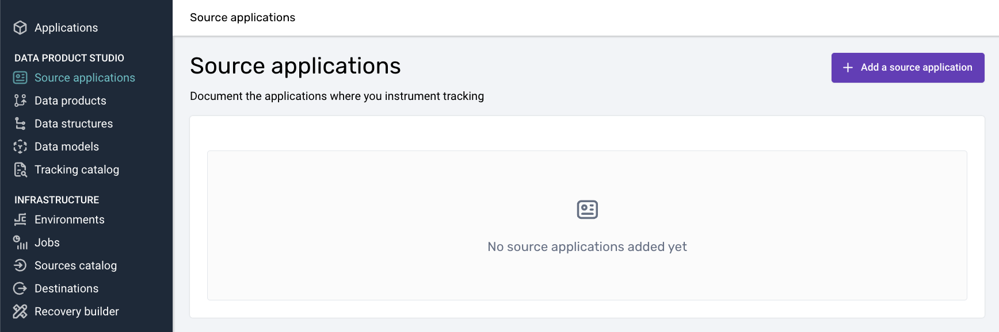

The inputs on the creation screen are:
- **Name**: A name used for this application which is fairly understood across the organization.
- **Description**: A few words on what this Source Application represents and/or any notes.
- **Primary owner**: Owner email address.
- **Application IDs**: The [Application IDs](/docs/data-product-studio/source-applications/index.md#application-ids) expected to be used for this application. _These will automatically flow down to the Data Products and Event specifications you define relating to this Source Application._
- **Application entities**: Here is where you will set the [Application Contexts](/docs/data-product-studio/source-applications/index.md#application-context) you will implement and expect to be available with every event hit coming from this application.

An example of inputs can be the following which you can adjust to your case:
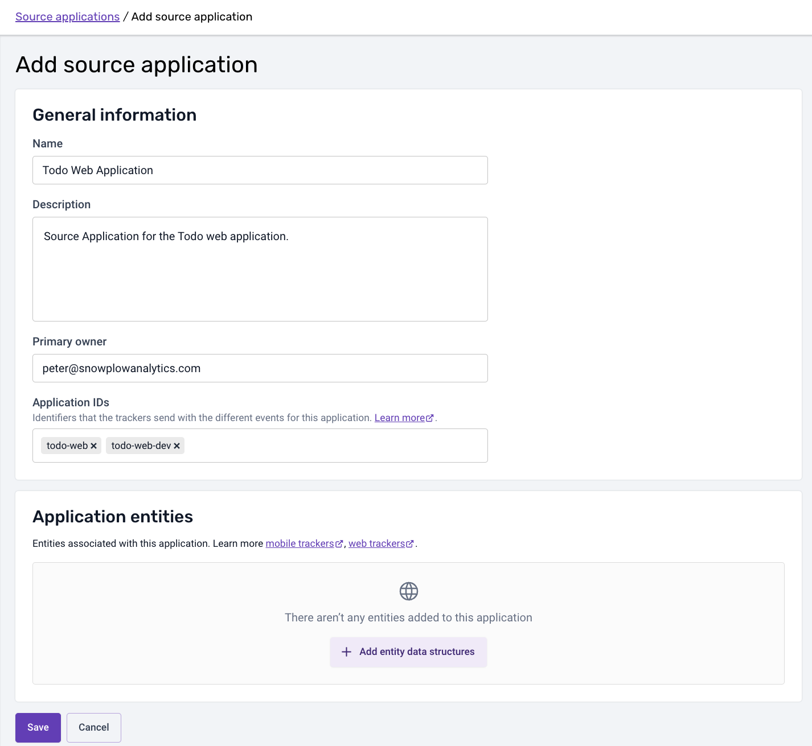

## Create a Base Data Product

After creating a Source Application, the recommended way to keep track of what we consider base events for a tracking setup is through the Base Data Product templates. For this application you can use the [Base Web](/docs/data-product-studio/data-products/data-product-templates/index.md#base-web).

To create a Base Web Data Product for your application, navigate to the Data Products section and after clicking the `Templates` button, select the Base Web template.
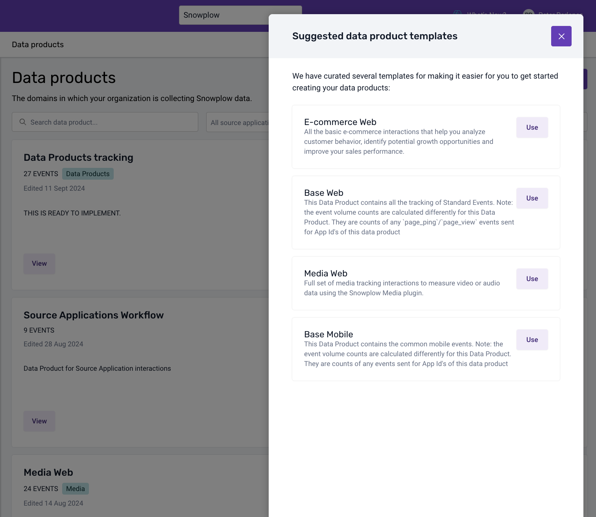

By default, a Base Data Product is not connected to a Source Application and will show all the Base Event application IDs, so for this you need to edit the Data Product and set the Source Application to `Todo Web Application`.
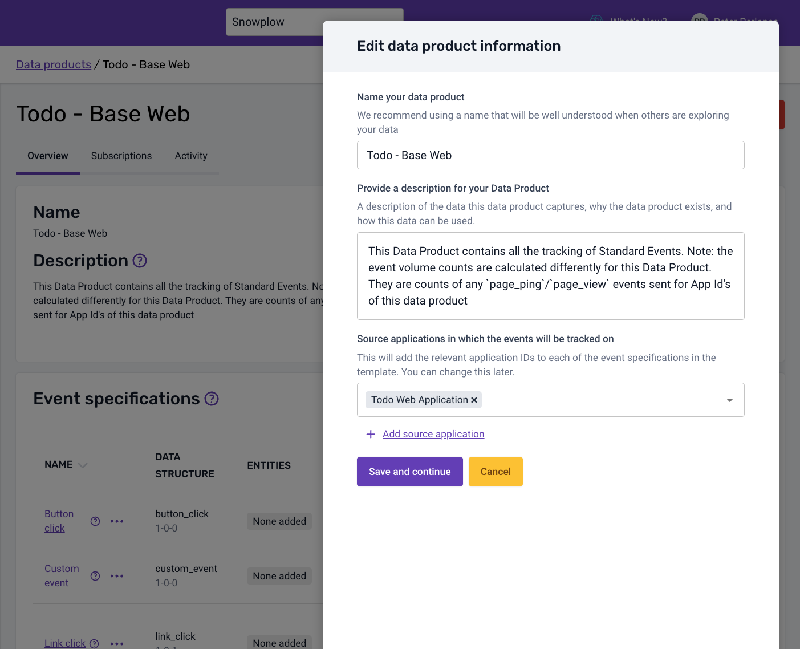

The Base Web (_or Mobile_) data product will monitor and count base events as they are sent for the selected Source Application app IDs, as we will see later on. There is no need for additional implementation.

## Initialize the tracker

For this example application, we will use the [Browser tracker](/docs/sources/trackers/web-trackers/quick-start-guide/index.md#quick-start-basic) which is distributed through npm.

Switch to the project root directory and then install it by running `npm install @snowplow/browser-tracker`.

Next, add the following piece of code at `src/main.tsx`.

```diff
import Todo from "./pages/Todo";
import "./styles.css";

+import {
+  enableActivityTracking,
+  newTracker,
+  trackPageView,
+} from "@snowplow/browser-tracker";

+newTracker("t1", "{{COLLECTOR_URL}}", {
+  appId: "todo-web-dev",
+});

+enableActivityTracking({
+  minimumVisitLength: 30,
+  heartbeatDelay: 10,
+});

+trackPageView();

createRoot(document.getElementById("root")!).render(
```

_For this showcase, placing the initialization code at the main file is enough._

What this code does is:
1. Initializes the tracker with the app ID representing the Todo web application in the development environment.
2. Enables activity tracking which will send periodic page pings.
3. Sends a page view when the main application component is first rendered.

You can validate this step being implemented properly using the [Snowplow Inspector](/docs/data-product-studio/data-quality/snowplow-inspector/index.md) browser extension observing Page view and Page ping events.
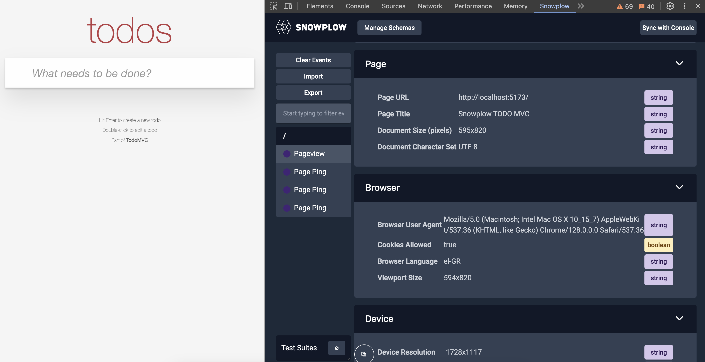

## Add link click tracking

As a next step you will implement link click tracking for the main page link pointing to the TodoMVC website. To track this and other links on your pages, you can install the [Link click](https://docs.snowplow.io/docs/sources/trackers/web-trackers/tracking-events/link-click/) tracking plugin. The plugin provides automatic link click tracking for all links on your page.

To enable it in the application, switch to the project root directory and then install it by running `npm install @snowplow/browser-plugin-link-click-tracking`.

Next, add the following piece of code at `src/main.tsx`.

```diff
import {
  enableActivityTracking,
  newTracker,
  trackPageView,
} from "@snowplow/browser-tracker";
+import {
+  LinkClickTrackingPlugin,
+} from "@snowplow/browser-plugin-link-click-tracking";

newTracker("t1", "{{COLLECTOR_URL}}", {
  appId: "todo-web-dev",
+  plugins: [LinkClickTrackingPlugin()],
});
```

And the following on `src/pages/index.tsx`.

```diff
import Info from "./components/Info";
+import { enableLinkClickTracking } from "@snowplow/browser-plugin-link-click-tracking";
+import { useEffect } from "react";

const Todo = function () {
+  useEffect(() => {
+    enableLinkClickTracking();
+  }, [])
```

With this code, all links that are initially rendered on the page will be tracked automatically.

You can verify this using the Snowplow inspector browser extension observing link click events after clicking the TodoMVC link.
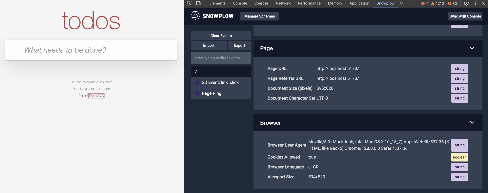

## Verify base events are received

As mentioned previously, if you check the `Todo - Base Web` Data Product you created, you will be able to see the events coming in from the correct environment based on the app ID.

_Note: You might need to wait for a bit, up to a maximum of 2 hours, until the events are visible._
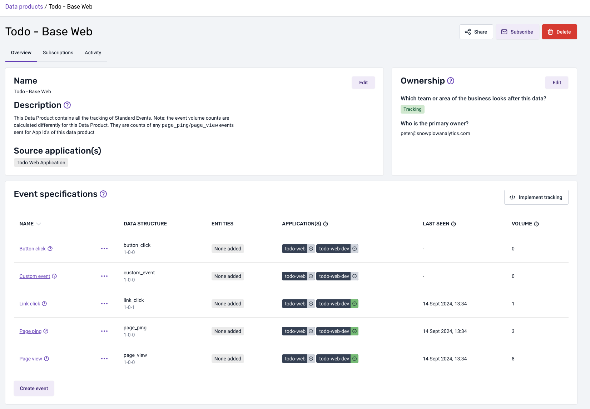

### Create custom Data Structures for the Todo web application

Before you create the custom Data Product for these interactions, you need to create a couple of Data Structures, `todo` and `todo_action`, fitting the use case of the Todo web application.

#### Todo action Data Structure
```json
{
  "$schema": "http://iglucentral.com/schemas/com.snowplowanalytics.self-desc/schema/jsonschema/1-0-0#",
  "type": "object",
  "self": {
    "vendor": "com.your.organization",
    "name": "todo_action",
    "format": "jsonschema",
    "version": "1-0-0"
  },
  "description": "Event Data Structure representing an action taken for a todo",
  "properties": {
    "action": {
      "type": "string",
      "enum": [
        "add",
        "remove",
        "complete"
      ],
      "description": "The action taken for a specific todo item"
    }
  },
  "required": [
    "action"
  ],
  "additionalProperties": false
}
```

#### Todo Data Structure
```json
{
  "$schema": "http://iglucentral.com/schemas/com.snowplowanalytics.self-desc/schema/jsonschema/1-0-0#",
  "type": "object",
  "self": {
    "vendor": "com.your.organization",
    "name": "todo",
    "format": "jsonschema",
    "version": "1-0-0"
  },
  "description": "Entity Data Structure representing a todo",
  "properties": {
    "title": {
      "type": "string",
      "description": "The title of the Todo"
    }
  },
  "required": [
    "title"
  ],
  "additionalProperties": false
}
```

_Note: You might need to publish those to the production environment depending on the pipeline you are using._

## Create a Custom Data Product for application interactions

As in every application, there are interactions that are important to the business and are measured in a custom way. For this application the interactions you need to measure are:

- Adding a todo
- Completing a todo
- Removing a todo

We are going to show how you can create the Data Product for the goal interactions and the Event Specification for a todo addition.

### Create the custom Data Product

To start off, navigate to the Data Products section and click through the `Create` button and `Start` to create a new custom Data Product.

On the basic information screen you can add the inputs as shown below and also select the `Todo Web Application` as the connected Source Application. You can name the Data Product something similar to `Todo - Goals`.

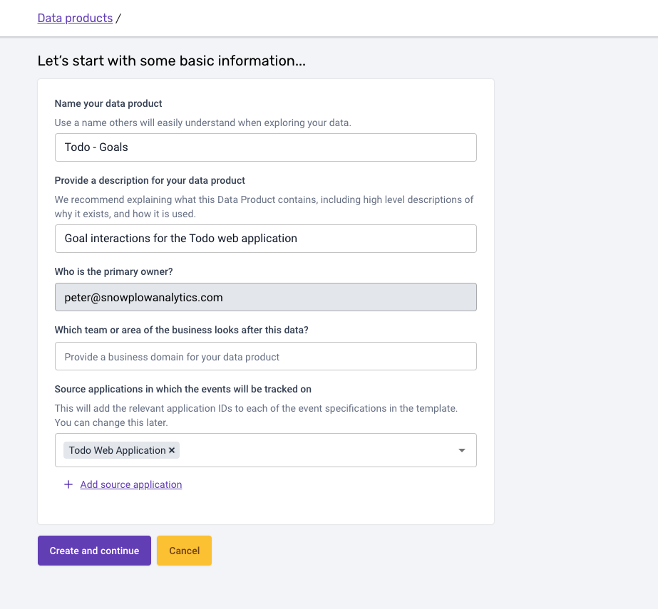

Finally click `Create and continue`.

:::tip
When connecting a Source Application to a Data Product there are a few benefits you get automatically:
- All Event Specifications inherit the expected app IDs from the Source Application. _That way you can be sure that an Event Specification is fired in all environments it needs to._
- All Event Specifications automatically reference the Application Context Data Structures that are expected to be available with each event. _This prevents duplicate information and also understanding which context is going to be available in addition to your Event Specification entities._
:::

### Create the "Add todo" Event Specification

Now you can create the Event Specification representing the todo addition. Click `Create new event specification`, fill the event information modal with the following inputs and click `Save and continue`.

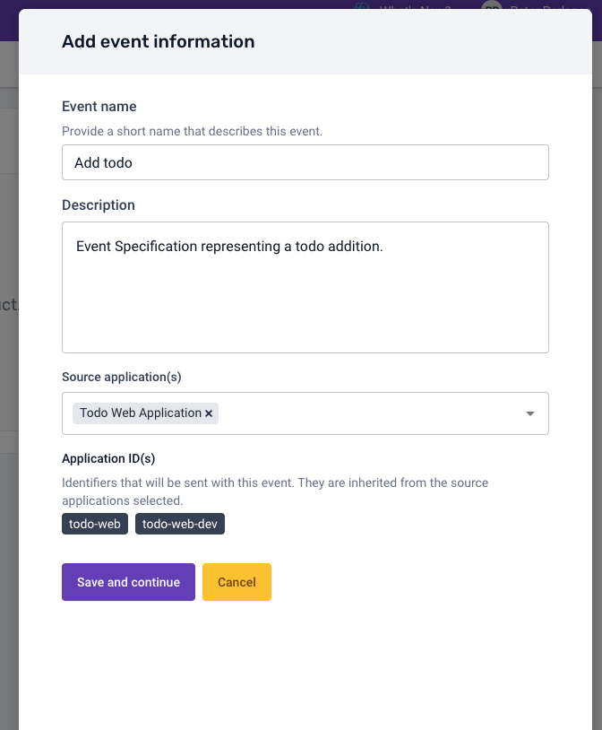

The next step is to add the event Data Structure `todo_action` you created previously to represent the todo addition interaction. Select the Event Specification and on the `Event data structure` panel click `Add existing data structure` and select the `todo_action` custom Data Structure.

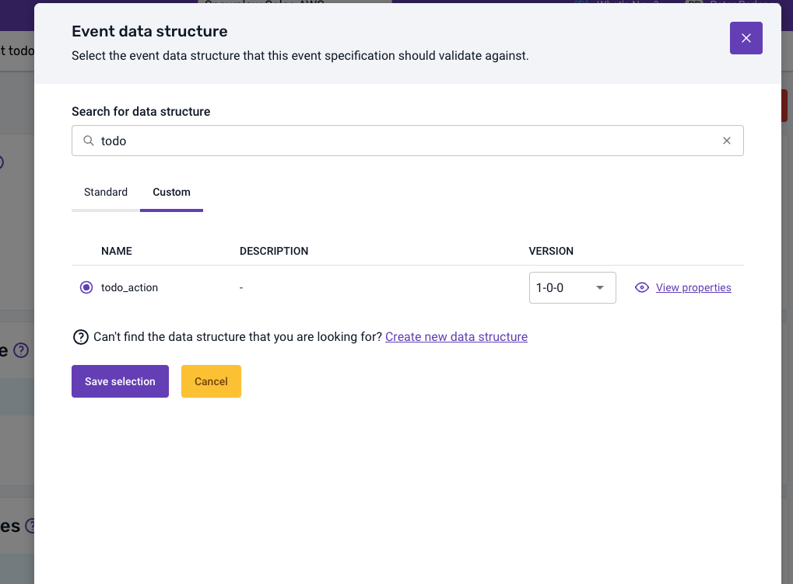

To make sure your intention on this Event Specification is clear and also instructions for implementation are as precise as possible, you should go ahead and add instructions for this event. Click the `Add instructions` button and click `Edit` on the `value` attribute. Now you can fill the instructions with the following inputs, indicating exactly what is expected for this event.

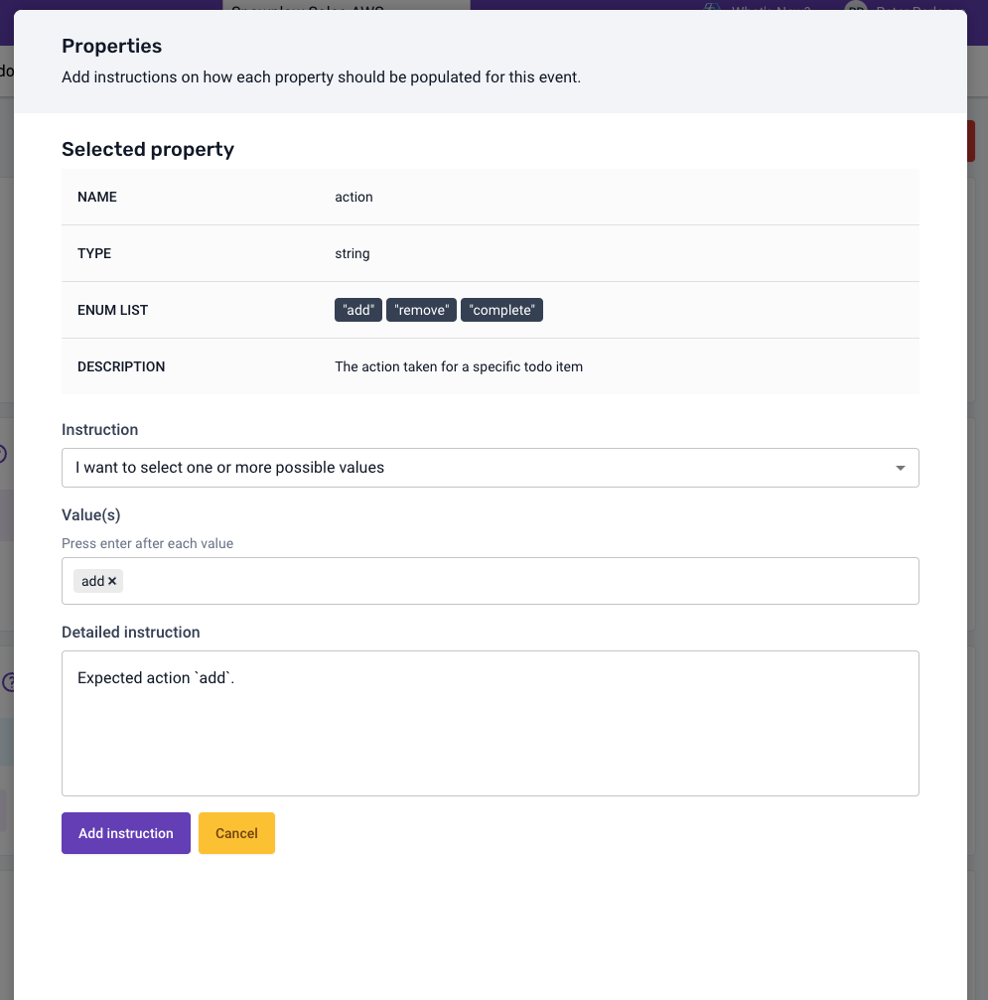

:::tip
Information for implementation instructions, cardinality rules and trigger details will be available for the implementation engineers directly through Snowtype [instructions feature](https://docs.snowplow.io/docs/data-product-studio/snowtype/using-the-cli/#generating-event-specification-instructions).
:::

Now on the Entity data structures section, click `Add existing data structure`, find and select the todo entity created earlier. On the next modal step you can define the expected cardinality, of this entity on the event specification. For the todo entity, you want to have exactly 1 instance.

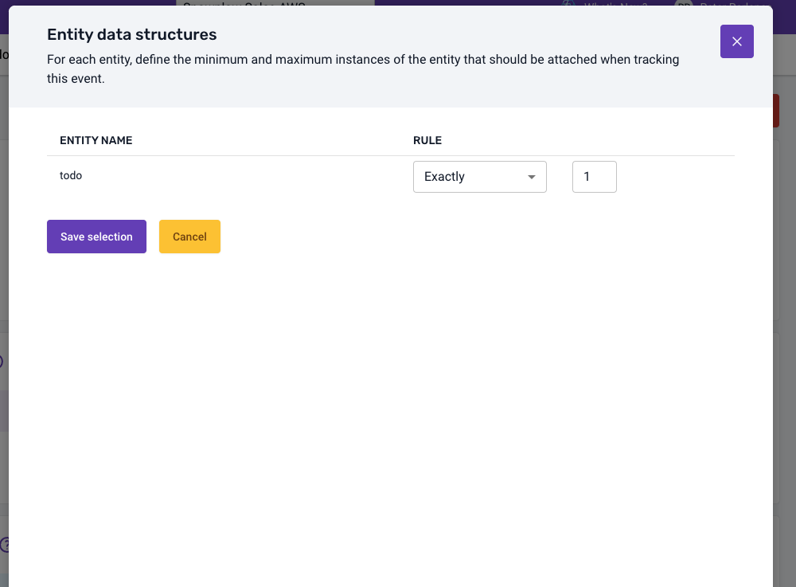

Finally you should add a trigger to represent exactly the conditions when this event should be fired. For this case, you expect the event to be fired when a user hits the Enter key after adding a title for the todo.


**A similar process can be taken to create both the completion and removal Event Specifications.**

## Implement custom Data Product tracking using Snowtype

After defining your Event Specifications, the next step is implementing those events on your app. To do that you are going to use Snowtype to generate the required APIs for tracking the Event Specifications.

:::info
For some Event Specification features, such as event counts, it is required that events are tracked together with the `event_specification` context. Snowtype automatically attaches the context without any additional work required from the implementation engineers.
:::

### Installing Snowtype

After having setup a [Console API key](https://docs.snowplow.io/docs/data-product-studio/snowtype/using-the-cli/#authenticating-with-the-console) you can install Snowtype on this project by switching to the project root directory and running `npm install @snowplow/snowtype --save-dev`.

Since this is a project without previous Snowtype installation, we need to go through the [init flow](https://docs.snowplow.io/docs/data-product-studio/snowtype/using-the-cli/#initializing-snowtype-for-your-project).

To do that, you can go to the Data Product page and click on the `Implement tracking` button. There you can copy the second code command which relates to initializing a new Snowtype project.

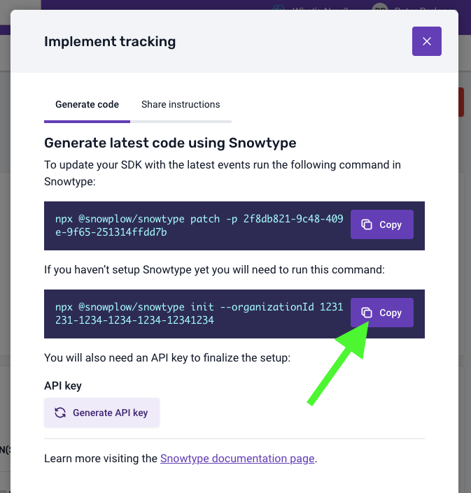

The inputs should look like the following:

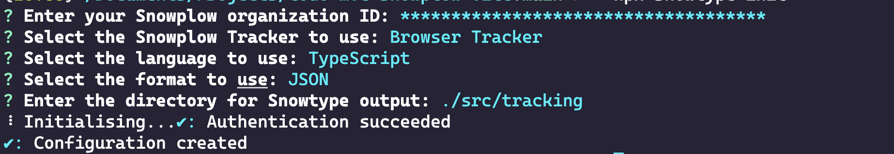

Next you add this Data Product to the Snowtype project by copying the first code command.

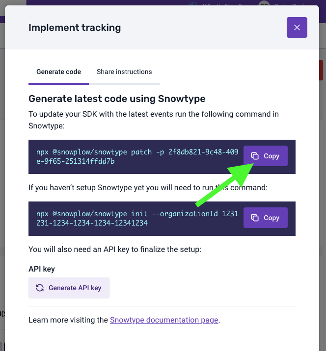

Now your Snowtype configuration file should include the Data Product in the `dataProductIds` array.

### Generating code and implementation instructions

On your terminal now run `npx @snowplow/snowtype generate --instructions`. If all is as expected, after a few seconds, you will have the following files generated:

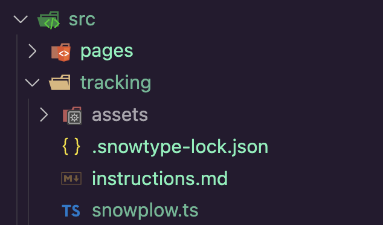

The `src/tracking/instructions.md` file includes detailed instructions and information about the Event Specifications to be implemented while `src/tracking/snowplow.ts` contains all the required code to be used to track the Event Specifications.

:::info
In some editors like [Visual Studio Code](https://code.visualstudio.com/), the APIs that are available in a project are shown to the developer as they type. For Snowtype exposed APIs to track Event Specifications or event Data Structures start with `track` and then the name of the Data Structure or Event Specification. For Event Specification APIs, there is also the suffix of `Spec` or `spec` depending on the language.
E.g. for our custom Data Product, we have available the `trackAddTodoSpec`, `trackCompleteTodoSpec` and `trackRemoveTodoSpec` methods.
:::

### Tracking Data Product interactions

To track interactions such as adding a new todo, you can add the following piece of code at `src/pagesTodo/components/Header.tsx`

```diff
import { useState } from "react";
import { v4 } from "uuid";
import { Todo } from "../../../types";
+import { createTodo, trackAddTodoSpec } from "../../../tracking/snowplow";

// Rest of the code...

  function addItem(e: React.KeyboardEvent<HTMLInputElement>) {
    if (e.key === "Enter" && value) {
      addTodo((preItems) => {
        return [
          {
            id: v4(),
            value,
            completed: false,
          },
          ...preItems,
        ];
      });
+     trackAddTodoSpec({
+       action: "add",
+       context: [createTodo({ title: value })],
+     });
      setValue("");
    }
  }
```

Finally, you can go to the application, add a new todo and observe on the Snowplow Inspector extension as the addition Event Specification is being sent. The event contexts should include the `todo`, `event_specification` and any other extra context you might add.

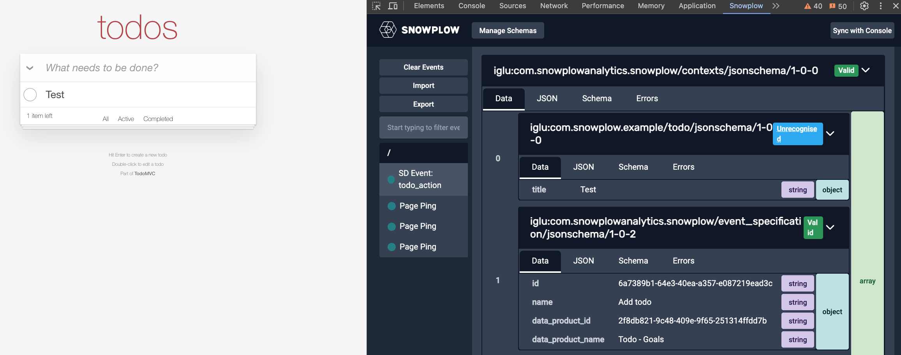

After a while the Event Specification volume counts for each event will be available at the Data Products screen.

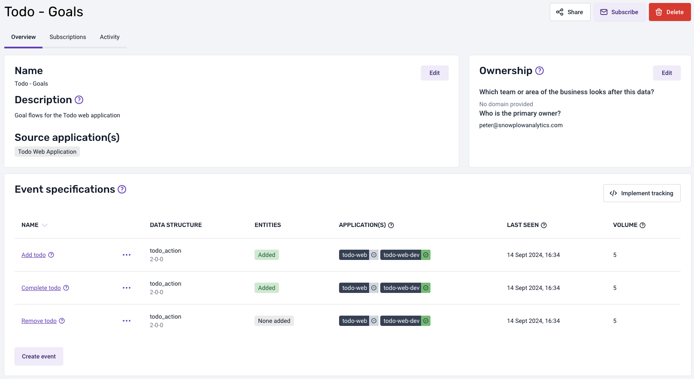

You can checkout the completed code at the ['implemented' branch](https://github.com/snowplow-incubator/data-products-basic-tracking-recipe/tree/implemented).
