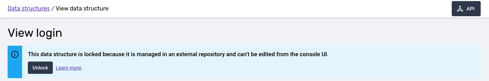

# Introduction

Snowplow Data Structures are the artifacts defining the rules for event validation within the Snowplow data pipeline. As such, they are a description of event shapes that the pipeline will allow through, and essentially the basis for the shape of data in the warehouse.

The fact that Data Structures formalize what the warehouse tables look like makes them a cornerstone of Snowplow's facilities for data governance. An unintended change in a data structure could result in data consumers down the line being unable to process that data (e.g. data models breaking). That is why larger organizations guard Data Structure definitions closely, and need approval workflows to allow or disallow changes. For instance, a Data Protection Officer may want to have the final say about collected events, to ensure no PII is harvested.

On top of that, detailed change history can be crucial for such large organizations. It is important to be able to tell in fine detail what was changed, when, and by whom.

The Snowplow Console's UI offers excellent facilities to get started quickly with Data Structures (either using the Builder or directly the JSON editor), and is a solid tool for smaller teams; but it doesn't implement such approval processes, neither does it offer such fine-grained visibility around changes.

A common solution when faced with these requirements is to move management to some form of version control platform (github/gitlab). This opens up an entire ecosystem of tools and patterns enabling all manner of custom workflows.

We have built [Snowplow CLI](/docs/data-product-studio/snowplow-cli/index.md) to help you bridge the gap between these repository-based workflows and BDP Console.

## Prerequisites

* A deployed Snowplow BDP pipeline
* [Snowplow CLI](/docs/data-product-studio/snowplow-cli/index.md) installed and configured
* A familiarity with [git](https://git-scm.com/) and an understanding of [github actions](https://docs.github.com/en/actions/writing-workflows)
* A sensible [terminal emulator](https://en.wikipedia.org/wiki/Terminal_emulator) and shell


## What you'll be doing

This recipe will walk through creating and deploying a data structure from the command line using [Snowplow CLI](/docs/data-product-studio/snowplow-cli/index.md). It will then show how it is possible to automate the validation and deployment process using [github actions](https://docs.github.com/en/actions/writing-workflows).

## Create a local data structure

Firstly we'll need a place to put things.

```bash
$ mkdir -p snowplow-structures/data-structures
$ cd snowplow-structures
```
:::tip
snowplow-cli data structures commands default to looking for data structures in `./data-structures`.
:::

Now let's create our data structure. We'll create a custom event called 'login'.

```bash
$ snowplow-cli ds generate login --vendor com.example
```
:::note
`ds` is an alias for `data-structures`.
:::

This should provide us the following output

```
3:00PM INFO generate wrote=data-structures/com.example/login.yaml
```

The generated file is written to our default `data-structures` directory under a sub directory matching the `--vendor` we supplied with a filename that mirrors the name we gave the data structure. Help for all the arguments available to `generate` is available by running `snowplow-cli ds generate --help`.

:::note
This directory layout and file naming scheme is also followed by the [download](/docs/data-product-studio/data-structures/manage/cli/index.md#downloading-data-structures) command.
:::

Let's see what it has created for us.

```yml title="data-structures/com.example/login.yaml"
apiVersion: v1
resourceType: data-structure
meta:
  hidden: false
  schemaType: event
  customData: {}
data:
  $schema: http://iglucentral.com/schemas/com.snowplowanalytics.self-desc/schema/jsonschema/1-0-0#
  self:
    vendor: com.example
    name: login
    format: jsonschema
    version: 1-0-0
  type: object
  properties: {}
  additionalProperties: false
```
* `apiVersion` should always be `v1`
* `resourceType` should remain `data-structure`
* `meta.hidden` directly relates to showing and hiding [in BDP Console UI](/docs/data-product-studio/data-structures/manage/ui/index.md#hiding-a-data-structure)
* `meta.schemaType` can be `event` or `entity`
* `meta.customData` is a map of strings to strings that can be used to send across any key/value pairs you'd like to associate with the data structure
* `data` is the actual [snowplow self describing schema](/docs/api-reference/iglu/common-architecture/self-describing-json-schemas/index.md) that this data structure describes

## Modify, validate and publish

Firstly we'll add a property to our data structure definition. We'd like to know if a login succeeded or failed. Our modified `login.yaml` should look like this

```yml {16,17} title="data-structures/com.example/login.yaml"
apiVersion: v1
resourceType: data-structure
meta:
  hidden: false
  schemaType: event
  customData: {}
data:
  $schema: http://iglucentral.com/schemas/com.snowplowanalytics.self-desc/schema/jsonschema/1-0-0#
  self:
    vendor: com.example
    name: login
    format: jsonschema
    version: 1-0-0
  type: object
  properties:
    result:
      enum: [success, failure]
  additionalProperties: false
```

### Validate

We should validate our changes before we attempt to publish them. Let's do that

```bash
$ snowplow-cli ds validate data-structures/com.example/login.yaml
```
:::tip
You can supply snowplow-cli with a directory and it will look for anything that looks like a data structure. Also given the default data structure directory is being used the previous command is equivalent to `snowplow-cli ds validate`.
:::

You should see output similar to this:
```
3:00PM INFO validating from paths=[data-structures/com.example/login.yaml]
3:00PM INFO will create file=data-structures/com.example/login.yaml vendor=com.example name=login version=1-0-0
3:00PM WARN validation file=data-structures/com.example/login.yaml
  messages=
  │ The schema is missing the "description" property (/properties/result)
  │ The schema is missing the "description" property (/)
```

### Publish to development

Apart from the missing descriptions everything looks good. We can fill them in later. Let's go ahead and publish our data structure to our [development](/docs/data-product-studio/data-quality/index.md) environment.

```bash
$ snowplow-cli ds publish dev
```
:::tip
We omit the directory here but as with other commands the default directory will get used and it will attempt to publish any data structures it can find.
:::


The command should output something close to the following:

```
3:00PM INFO publishing to dev from paths=[data-structures]
3:00PM INFO will create file=data-structures/com.example/login.yaml vendor=com.example name=login version=1-0-0
3:00PM WARN validation file=data-structures/com.example/login.yaml
  messages=
  │ The schema is missing the "description" property (/properties/result)
  │ The schema is missing the "description" property (/)
3:00PM INFO all done!
```

:::note
Publishing to `dev` will also run validation. It will only fail on ERROR notifications.
:::

You should now be able to see your published data structure in [BDP Console UI](https://console.snowplowanalytics.com/data-structures). If you click through from the data structure listing to view the `login` data structure you should see the following banner.



Any data structures published using snowplow-cli will automatically get this banner and have UI based editing disabled. It is a good idea to settle on one source of truth for each data structure to avoid potential conflicts.

### Publish to production

With our data structure deployed to develop and working as we expect we can safely publish it to production.

```bash
$ snowplow-cli ds publish prod
```
```
3:00PM INFO publishing to prod from paths=[data-structures]
3:00PM INFO will update file=data-structures/com.example/login.yaml local=1-0-0 remote=""
3:00PM INFO all done!
```
:::note
Data structures must be published to `dev` before they can be published to `prod`
:::

We have now seen how to create, validate and then publish a new data structure from the command line. Next we'll look at how to configure github actions to run validation and publishing automatically for us.


## Automating with github actions

### Set up repository

We'll not go into the details of creating github repositories and initial commits here, the [github docs](https://docs.github.com/) do an excellent job of that already. The next few steps will assume a working github repository containing the directory and data structure we created in the previous section. It will have two branches named `main` and `develop` which should be in sync.

### Publish to develop workflow

We would like pushes to our `develop` branch to be automatically published to our [development](/docs/data-product-studio/data-quality/index.md) environment. Github workflows can be [triggered](https://docs.github.com/en/actions/writing-workflows/choosing-when-your-workflow-runs/triggering-a-workflow) by all kinds of repository events. The one we are interested in here:
```yml
on:
  push:
    branches: [develop]
```

With our trigger point worked out we need to complete a series of steps:
1. Configure snowplow-cli via environment variables provided as [github action secrets](https://docs.github.com/en/actions/security-for-github-actions/security-guides/using-secrets-in-github-actions)
2. Checkout our repo
3. Install snowplow-cli. We'll use our [setup-snowplow-cli](https://github.com/snowplow-product/setup-snowplow-cli) github action here. Behind the scenes it is downloading the [latest](https://github.com/snowplow-product/snowplow-cli/releases/latest) snowplow-cli release and making it available via the workflow job's `path`.
4. Run the `snowplow-cli ds publish dev` command as we did earlier

The full action:

```yml title=".github/workflows/publish-develop.yml"
on:
  push:
    branches: [develop]

jobs:
  publish:
    runs-on: ubuntu-latest
    env:
      SNOWPLOW_CONSOLE_ORG_ID: ${{ secrets.SNOWPLOW_CONSOLE_ORG_ID }}
      SNOWPLOW_CONSOLE_API_KEY_ID: ${{ secrets.SNOWPLOW_CONSOLE_API_KEY_ID }}
      SNOWPLOW_CONSOLE_API_KEY: ${{ secrets.SNOWPLOW_CONSOLE_API_KEY }}

    steps:
      - uses: actions/checkout@v4

      - uses: snowplow-product/setup-snowplow-cli@v1

      - run: snowplow-cli ds publish dev --managed-from $GITHUB_REPOSITORY
```
:::tip
The value of the `--managed-from` flag will be displayed inside the 'This data structure is locked' banner we saw earlier in the UI. It is designed to help people track down the source of truth for this data structure.
:::

### Publish to production workflow

In the same way we want our `develop` branch to deploy to our `develop` environment we want our `main` branch to deploy to our `production` environment.

As we saw earlier publishing to production is very similar to publishing to development. The only new thing we need here is a different workflow trigger.

```yml title=".github/workflows/publish-production.yml"
on:
  push:
    branches: [main]

jobs:
  publish:
    runs-on: ubuntu-latest
    env:
      SNOWPLOW_CONSOLE_ORG_ID: ${{ secrets.SNOWPLOW_CONSOLE_ORG_ID }}
      SNOWPLOW_CONSOLE_API_KEY_ID: ${{ secrets.SNOWPLOW_CONSOLE_API_KEY_ID }}
      SNOWPLOW_CONSOLE_API_KEY: ${{ secrets.SNOWPLOW_CONSOLE_API_KEY }}

    steps:
      - uses: actions/checkout@v4

      - uses: snowplow-product/setup-snowplow-cli@v1

      - run: snowplow-cli ds publish prod --managed-from $GITHUB_REPOSITORY
```

### Validate on pull request workflow

A core component of version control based workflows is the [pull request](https://docs.github.com/en/pull-requests/collaborating-with-pull-requests/proposing-changes-to-your-work-with-pull-requests/about-pull-requests). For our repository we would like to ensure as best we can that any data structure changes are valid and problem free before they get merged into develop. Lucky for us there is a github workflow event for that.

By combining the `snowplow-cli ds validate` command and the github workflow pull request event we arrive at this:
```yml title=".github/workflows/validate-pull-request.yml"
on:
  pull_request:
    branches: [develop, main]

jobs:
  validate:
    runs-on: ubuntu-latest
    env:
      SNOWPLOW_CONSOLE_ORG_ID: ${{ secrets.SNOWPLOW_CONSOLE_ORG_ID }}
      SNOWPLOW_CONSOLE_API_KEY_ID: ${{ secrets.SNOWPLOW_CONSOLE_API_KEY_ID }}
      SNOWPLOW_CONSOLE_API_KEY: ${{ secrets.SNOWPLOW_CONSOLE_API_KEY }}

    steps:
      - uses: actions/checkout@v4

      - uses: snowplow-product/setup-snowplow-cli@v1

      - run: snowplow-cli ds validate --gh-annotate
```
:::tip
The `--gh-annotate` flag will make the validate command output [github workflow command](https://docs.github.com/en/actions/writing-workflows/choosing-what-your-workflow-does/workflow-commands-for-github-actions) compatible output. We'll see an example of what that looks like in the next section.
:::


### Worked example

Now we have our workflows in place let's work through an example. Our login data structure needs some attention. Our requirements have changed and rather than 'success' and 'failure' the login result will now need to report numbers and not strings. So instead of `[success, failure]` it'll be `[200, 403]`.

Having created a [new branch](https://git-scm.com/book/en/v2/Git-Branching-Basic-Branching-and-Merging) called `login-results-error-codes` and making the changes locally we should end up here:
```bash title="git diff develop"
--- a/data-structures/com.example/login.yaml
+++ b/data-structures/com.example/login.yaml
@@ -10,9 +10,9 @@ data:
     vendor: com.example
     name: login
     format: jsonschema
-    version: 1-0-0
+    version: 1-0-1
   type: object
   properties:
     result:
-      enum: [success, failure]
+      enum: [200, 403]
   additionalProperties: false
```

That all looks good so we'll go ahead and push to github and [create a pull request](https://docs.github.com/en/pull-requests/collaborating-with-pull-requests/proposing-changes-to-your-work-with-pull-requests/creating-a-pull-request).

We wait patiently for our validate on pull request workflow to run and then..


Validation has failed. To identify the problem we open the 'file' tab on the pull request and see..


:::note
Validation only takes your configured [destinations](https://console.snowplowanalytics.com/destinations) into account.
:::

Together with the description warnings we forgot to fix earlier we have some errors. Changing the values of the enum would change the type of the `result` property which will cause problems further down the line for our data. The error suggests we need to make a major version bump to avert disaster. We'll do that (and add descriptions).

Our next attempt:
```bash title="git diff develop"
--- a/data-structures/com.example/login.yaml
+++ b/data-structures/com.example/login.yaml
@@ -10,9 +10,11 @@ data:
     vendor: com.example
     name: login
     format: jsonschema
-    version: 1-0-0
+    version: 2-0-0
   type: object
+  description: Login outcome event
   properties:
     result:
-      enum: [success, failure]
+      description: The resulting http error code of a login request
+      enum: [200, 403]
   additionalProperties: false
```

And the workflow result..


Validation has passed. Now our colleagues can feedback on our changes and if everyone is happy we can merge to `develop` which will trigger our `publish-develop.yml` workflow.


Finally, once we are convinced everything works we can open another pull request from `develop` to `main`, merge that and trigger our `publish-production.yml` workflow.

## Following up with data products

Now that we have our data structures set up, we can define data products to organize and document how these structures are used across our applications. We'll walk through creating source applications, data products, and event specifications using the CLI, then integrate them into our automated workflows.

### Create a source applications

First, we'll create a source application to represent our website that will send the `login` event we defined earlier.

```bash
snowplow-cli dp generate --source-app website
```
:::note
`dp` is an alias for `data-products`. Source applications and event specifications are also managed by this command
:::

This should provide the following output
```
INFO generate wrote kind="source app" file=data-products/source-apps/website.yaml
```

The generated file is written to the default `data-products/source-apps` directory. Help for all the arguments available to `generate` is available by running `snowplow-cli dp generate --help`.

Let's examine the generated file:

```yml title="data-products/source-apps/website.yaml"
apiVersion: v1
resourceType: source-application
resourceName: b8261a25-ee81-4c6a-a94c-7717ba835035
data:
    name: website
    appIds: []
    entities:
        tracked: []
        enriched: []
```

* `apiVersion` should always be `v1`
* `resourceType` should remain `source-application`
* `resourceName` is a unique identifier of the source applications. It must be a valid uuid v4
* `data` is the contents of the source app

:::note
For more information about available fields and values you can refer to the [source applications schema](https://raw.githubusercontent.com/snowplow-product/snowplow-cli/main/internal/validation/schema/source-application.json). Making your ide schema aware via a [language server](https://github.com/redhat-developer/yaml-language-server) should provide a much smoother editing experience.
:::

Now let's customize our source application. We'll configure it to handle events from our production website as well as staging and UAT environments. We'll also add an owner field and remove the unused entities section.

```yml {6-7} title="data-products/source-apps/website.yaml"
apiVersion: v1
resourceType: source-application
resourceName: b8261a25-ee81-4c6a-a94c-7717ba835035
data:
    name: website
    appIds: ["website", "website-stage", "website-ua"]
    owner: me@example.com
```

Before publishing, we can validate our changes and preview what will happen:

```bash
snowplow-cli dp publish --dry-run
```

The command will show us the planned changes:
```
publish will create source apps file=.../data-products/source-apps/website.yaml name=website resource name=b8261a25-ee81-4c6a-a94c-7717ba835035
```

When we're happy with the proposed changes, we can publish by removing the `--dry-run` flag:

```bash
snowplow-cli dp publish
```

After publishing, you'll be able to see your new source application in the BDP Console UI.

### Create a data product and an event specification

Let's now create a data product and an event specification by running the following command

```bash
snowplow-cli dp generate --data-product Login
```
This should provide the following output 
```
INFO generate wrote kind="data product" file=data-products/login.yaml
```
Let's see what it has created for us

```yml title="data-products/login.yaml"
apiVersion: v1
resourceType: data-product
resourceName: 0edb4b95-3308-40c4-b266-eae2910d5d2a
data:
    name: Login
    sourceApplications: []
    eventSpecifications: []
```

:::note
For more information about available fields and values you can refer to the [data products schema](https://raw.githubusercontent.com/snowplow-product/snowplow-cli/main/internal/validation/schema/data-product.json). Making your ide schema aware via a [language server](https://github.com/redhat-developer/yaml-language-server) should provide a much smoother editing experience.
:::

Let's amend it to add an event specification, and a reference to a source application:

```yml {6,7,9,11-14} title="data-products/login.yaml"
apiVersion: v1
resourceType: data-product
resourceName: 0edb4b95-3308-40c4-b266-eae2910d5d2a
data:
    name: Login
    owner: me@example.com
    description: Login page
    sourceApplications:
        - $ref: ./source-apps/website.yaml
    eventSpecifications:
        - resourceName: cfb3a227-0482-4ea9-8b0d-f5a569e5d103
          name: Login success
          event:
            source: iglu:com.example/login/jsonschema/1-0-1
```

:::note
You'll need to come up with a valid uuid V4 for the `resourceName` of an event specification. You can do so by using an [online generator](https://www.uuidgenerator.net), or running the `uuidgen` command in your terminal
:::

:::caution Warning

The `iglu:com.example/login/jsonschema/1-0-1` data structure has to be deployed at least to a develop envinroment. Currently referencing local data structures is not supported

:::

We can run the same `publish --dry-run` command as before, to see if the output is as expected. The output should contain the following lines

```bash
snowplow-cli dp publish --dry-run
```

```
INFO publish will create data product file=.../data-products/login.yaml name=Login resource name=0edb4b95-3308-40c4-b266-eae2910d5d2a
INFO publish will update event specifications file=.../data-products/login.yaml name="Login success" resource name=cfb3a227-0482-4ea9-8b0d-f5a569e5d103 in data product=0edb4b95-3308-40c4-b266-eae29
```

We can apply the changes by using the publish command without the `--dry-run` flag

```bash
snowplow-cli dp publish
```

### Add data products validation and publishing in the github actions

Now that we've modeled a source application, data product and event specification, let's see how we can add them to the existing github actions workflows for data structures. You can customize your setup, use a separate repository or a separate actions, but in this example we'll add the data products publishing into the existing workflows.

Lets modify the PR example, and add the following line. This command will validate and print the changes to the github actions log.

```yml {20} title=".github/workflows/validate-pull-request.yml"
on:
  pull_request:
    branches: [develop, main]

jobs:
  validate:
    runs-on: ubuntu-latest
    env:
      SNOWPLOW_CONSOLE_ORG_ID: ${{ secrets.SNOWPLOW_CONSOLE_ORG_ID }}
      SNOWPLOW_CONSOLE_API_KEY_ID: ${{ secrets.SNOWPLOW_CONSOLE_API_KEY_ID }}
      SNOWPLOW_CONSOLE_API_KEY: ${{ secrets.SNOWPLOW_CONSOLE_API_KEY }}

    steps:
      - uses: actions/checkout@v4

      - uses: snowplow-product/setup-snowplow-cli@v1

      - run: snowplow-cli ds validate --gh-annotate

      - run: snowplow-cli dp publish --dry-run --gh-annotate
```

Data products, source applications and event specifications don't have the dev and prod environments, so it's enough to publish them once.
We can add the same command but without the `--dry-run` flag to the publish pipeline.

```yml {20} title=".github/workflows/publish-develop.yml"
on:
  push:
    branches: [develop]

jobs:
  publish:
    runs-on: ubuntu-latest
    env:
      SNOWPLOW_CONSOLE_ORG_ID: ${{ secrets.SNOWPLOW_CONSOLE_ORG_ID }}
      SNOWPLOW_CONSOLE_API_KEY_ID: ${{ secrets.SNOWPLOW_CONSOLE_API_KEY_ID }}
      SNOWPLOW_CONSOLE_API_KEY: ${{ secrets.SNOWPLOW_CONSOLE_API_KEY }}

    steps:
      - uses: actions/checkout@v4

      - uses: snowplow-product/setup-snowplow-cli@v1

      - run: snowplow-cli ds publish dev --managed-from $GITHUB_REPOSITORY

      - run: snowplow-cli dp publish
```

You might want to publish data products in the `.github/workflows/publish-production.yml` as well, or only there. It depends on your setup, but if you strictly follow the rules and always merge to `main` from `develop`, the setup above should be enough.

## Let's break down what we've done

* We have seen how snowplow-cli can be used to work with data structures from the command line
* We have applied that knowledge to build github workflows which support automated validation and publication
* We have added source applications, data products and event specifications to use the same approach as data structures.
