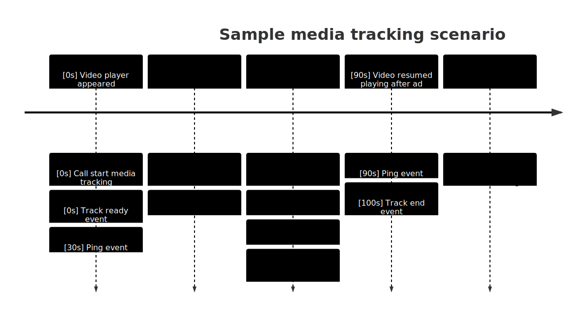

```mdx-code-block
import CodeBlock from '@theme/CodeBlock';
import TOCInline from '@theme/TOCInline';
```

<!-- Note: Docusaurus mermaid theme does not yet support renderAsync required by the timeline diagram, so using a pre-built SVG -->


The Snowplow media tracking APIs enable you to track events from media playback on the Web as well as mobile apps.
The trackers provide a set of tracking APIs that enable you to track changes in the media playback (e.g., play, pause, seek events), playback position (ping and percentage progress events), or ad playback events (e.g., ad breaks, ad progress, ad clicks).

While the trackers provide integrations with a few media players, the media tracking APIs are designed to be player agnostic to enable users to implement tracking for any media player.

<TOCInline toc={toc} maxHeadingLevel={4} />

## Tracked events and entities

The media tracking works with a set of out-of-the-box event and entity schemas.
Additionally, you can track custom entities along with the events.

:::info Example app
To illustrate the tracked events and entities, you can visit an example app that showcases the tracked media events and entities live as you watch a video.

[Visit the app here.](https://snowplow-incubator.github.io/snowplow-javascript-tracker-examples/media)
Source code for the app is [available here.](https://github.com/snowplow-incubator/snowplow-javascript-tracker-examples/tree/master/react)
:::

### Media player events

Each media player event is a self-describing event with a unique schema.

The schema URIs have the format:
`iglu:com.snowplowanalytics.snowplow.media/{EVENT_TYPE}/jsonschema/1-0-0`.

You can see the schemas listed under the event tracking methods below.

### Media player entity

The media player entity is attached to all media events and gives information about the current state of the media player.
It contains the current playback position (`currentTime`) as well as the paused or muted state.

<details>
    <summary>Media player entity properties</summary>

The schemas contain a single `label` property:

| Request Key | Required | Type/Format | Description |
| --- | --- | --- | --- |
| currentTime | Y | number | The current playback time |
| duration | N | number | A double-precision floating-point value indicating the duration of the media in seconds |
| ended | Y | boolean | If playback of the media has ended |
| fullscreen | N | boolean | Whether the video element is fullscreen |
| livestream | N | boolean | If the media is live |
| label | N | string | Human readable name given to tracked media content |
| loop | N | boolean | If the video should restart after ending |
| mediaType | N | enum: `audio` or `video` | Type of media content |
| muted | N | boolean | If the media element is muted |
| paused | Y | boolean | If the media element is paused |
| pictureInPicture | N | boolean | Whether the video element is showing picture-in-picture |
| playbackRate | N | number | Playback rate (1 is normal) |
| playerType | N | string | Type of the media player (e.g., com.youtube-youtube, com.vimeo-vimeo, org.whatwg-media_element) |
| quality | N | string | Quality level of the playback (e.g., 1080p) |
| volume | N | integer | Volume percent |
</details>

*Schema:*
`iglu:com.snowplowanalytics.snowplow.media/player/jsonschema/1-0-0`.

### Media session entity

The media session entity is used to identify the playback using the `mediaSessionId`.
It also contains statistics about the media playback computed on the tracker (e.g., `timePlayed`, `timeBuffering`, `adsClicked`).

<details>
    <summary>Media player session entity properties</summary>

| Request Key | Required | Type/Format | Description |
| --- | --- | --- | --- |
| mediaSessionId | Y | string | An identifier for the media session (can be provided by the user) |
| startedAt | N | date-time | Date-time timestamp of when the session started. |
| pingInterval | N | number | Interval (seconds) in which the ping events will be sent. Default (10s) is assumed if not specified. |
| timePlayed | N | number | Total seconds user spent playing content (excluding ads). |
| timePlayedMuted | N | number | Total seconds user spent playing content on mute (excluding ads). |
| timePaused | N | number | Total seconds user spent with paused content (excluding linear ads) |
| contentWatched | N | number | Total seconds of the content played. Each part of the content played is counted once (i.e., counts rewinding or rewatching the same content only once). Playback rate does not affect this value. |
| timeBuffering | N | number | Total seconds that playback was buffering during the session. |
| timeSpentAds | N | number | Total seconds that ads played during the session. |
| ads | N | integer | Number of ads played. |
| adsClicked | N | integer | Number of ads that the user clicked on |
| adsSkipped | N | integer | Number of ads that the user skipped |
| adBreaks | N | integer | Number of ad breaks played. |
| avgPlaybackRate | N | number | Average playback rate (1 is normal speed). |
</details>

It is an optional entity that is enabled by default.

*Schema:*
`iglu:com.snowplowanalytics.snowplow.media/session/jsonschema/1-0-0`.

### Media ad and ad break entities

These entities give information about the currently playing ad and ad break.

<details>
    <summary>Media ad break entity properties</summary>

| Request Key | Required | Type/Format | Description |
| --- | --- | --- | --- |
| name | N | string | Ad break name such as pre-roll, mid-roll, and post-roll. |
| breakId | N | string | ID of the ad break. |
| startTime | Y | number | Playback time in seconds at the start of the ad break. |
| podSize | N | integer | The number of ads to be played within the ad break. |
| breakType | N | enum: linear, nonlinear, companion | linear  – take full control of the video for a period of time
nonlinear – run concurrently to the video
companion – accompany the video but placed outside the player |
</details>

*Schema for the ad break entity:*
`iglu:com.snowplowanalytics.snowplow.media/ad_break/jsonschema/1-0-0`.

<details>
    <summary>Media player ad entity properties</summary>

| Request Key | Required | Type/Format | Description |
| --- | --- | --- | --- |
| name | N | string | Friendly name of the ad |
| adId | Y | string | Unique identifier for the ad. |
| creativeId | N | string | The ID of the ad creative |
| podPosition | N | integer | The number position of the ad within the ad break, starting with 1. |
| duration | Y | number | Length of the video ad in seconds |
| skippable | N | boolean | Indicating whether skip controls are made available to the end user |
</details>

*Schema for the ad entity:*
`iglu:com.snowplowanalytics.snowplow.media/ad/jsonschema/1-0-0`.

## Starting and ending media tracking

The tracker keeps track of ongoing media tracking instances in order to manage entities that are tracked along with the media events.

Media tracking instances are identified by a unique ID (that is tracked in the media session entity as `mediaSessionId`).
You provide the identifier in the `startMediaTracking` call that initializes the media tracking instance.
All subsequent media track calls will be processed within this media tracking if given the same ID.
Make sure that each media player and content tracked have a different ID.

<>{(props.tracker == 'js-tag') && (<CodeBlock language="javascript">
{`const id = 'XXXXX'; // randomly generated ID
window.snowplow('startMediaTracking', { id });`}
</CodeBlock>)}</>

<>{(props.tracker == 'js-browser') && (<CodeBlock language="javascript">
{`import { startMediaTracking } from "@snowplow/browser-plugin-media";
const id = 'XXXXX'; // randomly generated ID
startMediaTracking({ id });`}
</CodeBlock>)}</>

<>{(props.tracker == 'ios') && (<CodeBlock language="swift">
{`let id = "XXXXX"
let tracker = Snowplow.defaultTracker()
let mediaTracking = tracker.media.startMediaTracking(id: id)`}
</CodeBlock>)}</>

<>{(props.tracker == 'android-kotlin') && (<CodeBlock language="kotlin">
{`val id = "XXXXX"
val tracker = Snowplow.defaultTracker
val mediaTracking = tracker?.media?.startMediaTracking(id)`}
</CodeBlock>)}</>

<>{(props.tracker == 'android-java') && (<CodeBlock language="java">
{`String id = "XXXXX";
TrackerController tracker = Snowplow.getDefaultTracker();
MediaTracking mediaTracking = tracker.getMedia().startMediaTracking(id, null);`}
</CodeBlock>)}</>

Use the `endMediaTracking` call to end media tracking. This will clear the local state for the media tracking and stop any background updates.

<>{(props.tracker == 'js-tag') && (<CodeBlock language="javascript">
{`window.snowplow('endMediaTracking', { id });`}
</CodeBlock>)}</>

<>{(props.tracker == 'js-browser') && (<CodeBlock language="javascript">
{`import { endMediaTracking } from "@snowplow/browser-plugin-media";
endMediaTracking({ id });`}
</CodeBlock>)}</>

<>{(props.tracker == 'ios') && (<CodeBlock language="swift">
{`tracker.media.endMediaTracking(id: id)`}
</CodeBlock>)}</>

<>{(props.tracker == 'android-kotlin') && (<CodeBlock language="kotlin">
{`tracker?.media?.endMediaTracking(id)`}
</CodeBlock>)}</>

<>{(props.tracker == 'android-java') && (<CodeBlock language="java">
{`tracker.getMedia().endMediaTracking(id);`}
</CodeBlock>)}</>

### Configuration

You can provide additional configuration to the `startMediaTracking` call to configure the tracking or give initial information about the media played.

#### Media player properties

The `media` property lets you provide information about the media playback that will be used to populate the media player entity tracked with media events.

<>{(props.tracker == 'js-tag') && (<CodeBlock language="javascript">
{`window.snowplow('startMediaTracking', {
    id,
    player: {
        currentTime: 0, // The current playback time
        duration: 150, // A double-precision floating-point value indicating the duration of the media in seconds
        ended: false, // If playback of the media has ended
        livestream: false, // If the media is live
        label: 'Sample video', // A human-readable title for the media
        loop: false, // If the video should restart after ending
        mediaType: 'video', // The type of media
        muted: false, // If the media element is muted
        paused: false, // If the media element is paused
        pictureInPicture: false, // If the media is in picture-in-picture mode
        playerType: 'html5', // The type of player
        playbackRate: 1.0, // Playback rate (1 is normal)
        quality: '1080p', // The quality level of the playback
        volume: 100, // Volume level
    }
});`}
</CodeBlock>)}</>

<>{(props.tracker == 'js-browser') && (<CodeBlock language="javascript">
{`import { MediaType } from "@snowplow/browser-plugin-media";
startMediaTracking({
    id,
    player: {
        currentTime: 0, // The current playback time
        duration: 150, // A double-precision floating-point value indicating the duration of the media in seconds
        ended: false, // If playback of the media has ended
        livestream: false, // If the media is live
        label: 'Sample video', // A human-readable title for the media
        loop: false, // If the video should restart after ending
        mediaType: MediaType.Video, // The type of media
        muted: false, // If the media element is muted
        paused: false, // If the media element is paused
        pictureInPicture: false, // If the media is in picture-in-picture mode
        playerType: 'html5', // The type of player
        playbackRate: 1.0, // Playback rate (1 is normal)
        quality: '1080p', // The quality level of the playback
        volume: 100, // Volume level
    }
});`}
</CodeBlock>)}</>

<>{(props.tracker == 'ios') && (<CodeBlock language="swift">
{`let player = MediaPlayer()
    .currentTime(0) // The current playback time
    .duration(150.0) // A double-precision floating-point value indicating the duration of the media in seconds
    .ended(false) // If playback of the media has ended
    .livestream(false) // If the media is live
    .label("Sample video") // A human-readable title for the media
    .loop(false) // If the video should restart after ending
    .mediaType(.video) // Type of media content
    .muted(false) // If the media element is muted
    .paused(true) // If the media element is paused
    .pictureInPicture(false) // If the media is in picture-in-picture mode
    .playbackRate(1.0) // Playback rate (1 is normal)
    .quality("1080p") // The quality level of the playback
    .volume(100) // Volume level
let mediaTracking = tracker.media.startMediaTracking(id: id, player: player)
`}
</CodeBlock>)}</>

<>{(props.tracker == 'android-kotlin') && (<CodeBlock language="kotlin">
{`val player = MediaPlayerEntity(
    currentTime = 0.0, // The current playback time
    duration = 150.0, // A double-precision floating-point value indicating the duration of the media in seconds
    ended = false, // If playback of the media has ended
    livestream = false, // If the media is live
    label = "Sample video", // A human-readable title for the media
    loop = false, // If the video should restart after ending
    mediaType = MediaType.Video, // Type of media content
    muted = false, // If the media element is muted
    paused = true, // If the media element is paused
    pictureInPicture = false, // If the media is in picture-in-picture mode
    playbackRate = 1.0, // Playback rate (1 is normal)
    quality = "1080p", // The quality level of the playback
    volume = 100 // Volume level
)`}
</CodeBlock>)}</>

<>{(props.tracker == 'android-java') && (<CodeBlock language="java">
{`MediaPlayerEntity player = new MediaPlayerEntity();
player.setCurrentTime(0.0); // The current playback time
player.setDuration(150.0); // A double-precision floating-point value indicating the duration of the media in seconds
player.setEnded(false); // If playback of the media has ended
player.setLivestream(false); // If the media is live
player.setLabel("Sample video"); // A human-readable title for the media
player.setLoop(false); // If the video should restart after ending
player.setMediaType(MediaType.Video); // Type of media content
player.setMuted(false); // If the media element is muted
player.setPaused(true); // If the media element is paused
player.setPictureInPicture(false); // If the media is in picture-in-picture mode
player.setPlaybackRate(1.0); // Playback rate (1 is normal)
player.setQuality("1080p"); // The quality level of the playback
player.setVolume(100); // Volume level`}
</CodeBlock>)}</>

#### Media ping events

Media ping events (not to be confused with page ping events, see below) are events sent in a regular interval while media tracking is active.
They inform about the current state of the media playback.

By default, ping events are sent every 30 seconds.
This can be configured as follows:

<>{(props.tracker == 'js-tag') && (<CodeBlock language="javascript">
{`window.snowplow('startMediaTracking', {
    id,
    pings: { pingInterval: 30 }, // Interval in seconds for sending ping events. Defaults to 30s. 
});`}
</CodeBlock>)}</>

<>{(props.tracker == 'js-browser') && (<CodeBlock language="javascript">
{`startMediaTracking({
    id,
    pings: { pingInterval: 30 }, // Interval in seconds for sending ping events. Defaults to 30s. 
});
`}
</CodeBlock>)}</>

<>{(props.tracker == 'ios') && (<CodeBlock language="swift">
{`let configuration = MediaTrackingConfiguration(id: id)
    .pingInterval(30)
let mediaTracking = tracker.media.startMediaTracking(configuration: configuration)
`}
</CodeBlock>)}</>

<>{(props.tracker == 'android-kotlin') && (<CodeBlock language="kotlin">
{`val configuration = MediaTrackingConfiguration(
    id = id,
    pingInterval = 30
)
val mediaTracking = tracker?.media?.startMediaTracking(configuration)`}
</CodeBlock>)}</>

<>{(props.tracker == 'android-java') && (<CodeBlock language="java">
{`MediaTrackingConfiguration configuration = new MediaTrackingConfiguration(id, null);
configuration.setPingInterval(30);
MediaTracking mediaTracking = tracker.getMedia().startMediaTracking(configuration);`}
</CodeBlock>)}</>

The ping events are sent in an interval that is unrelated to the media playback.
However, to prevent sending too many events while the player is paused in background (e.g., in a background tab), there is a limit to how many ping events can be sent while the media is paused.
By default, this is set to 1, but it is configurable:

<>{(props.tracker == 'js-tag') && (<CodeBlock language="javascript">
{`window.snowplow('startMediaTracking', {
    id,
    pings: { maxPausedPings: 3 }, // Maximum number of consecutive ping events to send when playback is paused. Defaults to 1.
});`}
</CodeBlock>)}</>

<>{(props.tracker == 'js-browser') && (<CodeBlock language="javascript">
{`startMediaTracking({
    id,
    pings: { maxPausedPings: 3 }, // Maximum number of consecutive ping events to send when playback is paused. Defaults to 1.
});
`}
</CodeBlock>)}</>

<>{(props.tracker == 'ios') && (<CodeBlock language="swift">
{`let configuration = MediaTrackingConfiguration(id: id)
    .maxPausedPings(3)
let mediaTracking = tracker.media.startMediaTracking(configuration: configuration)
`}
</CodeBlock>)}</>

<>{(props.tracker == 'android-kotlin') && (<CodeBlock language="kotlin">
{`val configuration = MediaTrackingConfiguration(
    id = id,
    maxPausedPings = 3
)
val mediaTracking = tracker?.media?.startMediaTracking(configuration)`}
</CodeBlock>)}</>

<>{(props.tracker == 'android-java') && (<CodeBlock language="java">
{`MediaTrackingConfiguration configuration = new MediaTrackingConfiguration(id, null);
configuration.setMaxPausedPings(3);
MediaTracking mediaTracking = tracker.getMedia().startMediaTracking(configuration);`}
</CodeBlock>)}</>

You can disable ping events as follows:

<>{(props.tracker == 'js-tag') && (<CodeBlock language="javascript">
{`window.snowplow('startMediaTracking', { id, pings: false });`}
</CodeBlock>)}</>

<>{(props.tracker == 'js-browser') && (<CodeBlock language="javascript">
{`startMediaTracking({ id, pings: false });
`}
</CodeBlock>)}</>

<>{(props.tracker == 'ios') && (<CodeBlock language="swift">
{`let configuration = MediaTrackingConfiguration(id: id)
    .pings(false)
let mediaTracking = tracker.media.startMediaTracking(configuration: configuration)
`}
</CodeBlock>)}</>

<>{(props.tracker == 'android-kotlin') && (<CodeBlock language="kotlin">
{`val configuration = MediaTrackingConfiguration(
    id = id,
    pings = false
)
val mediaTracking = tracker?.media?.startMediaTracking(configuration)`}
</CodeBlock>)}</>

<>{(props.tracker == 'android-java') && (<CodeBlock language="java">
{`MediaTrackingConfiguration configuration = new MediaTrackingConfiguration(id, null);
configuration.setPings(false);
MediaTracking mediaTracking = tracker.getMedia().startMediaTracking(configuration);`}
</CodeBlock>)}</>

Media ping events have the following schema:
`iglu:com.snowplowanalytics.snowplow.media/ping_event/jsonschema/1-0-0`.

<>{(props.tracker == 'js-browser' || props.tracker == 'js-tag') && (<>
<h4>Page ping events</h4>
<p>
Page ping events are tracked when activity tracking is enabled in the tracker as long as the user engages with the page (clicks, moves the cursor, scrolls, ...).
In contrast with the media ping events, page ping events don't contain any information about the media playback (e.g., the player or session entity).
</p>
<p>
However, when the user watches a video on the page, they might not be interacting with it, causing page ping events not to be tracked.
The media tracking plugin addresses this problem and automatically keeps the page pings alive while the video is being played.
On the background, it calls the <code>updatePageActivity</code> function in activity tracking every time the media tracking is updated or a media event is tracked.
</p>
<p>
The behaviour is enabled by default.
In case you don't want the page activity to be automatically updated when the video is playing, you can disable it as follows:
</p>
<>{(props.tracker == 'js-tag') && (<CodeBlock language="javascript">
{`window.snowplow('startMediaTracking', { id, updatePageActivityWhilePlaying: false });`}
</CodeBlock>)}</>
<>{(props.tracker == 'js-browser') && (<CodeBlock language="javascript">
{`startMediaTracking({ id, updatePageActivityWhilePlaying: false });
`}
</CodeBlock>)}</>
</>)}</>

#### Media player session

Tracking the media player session entity with all media events is enabled by default, you can disable it as follows:

<>{(props.tracker == 'js-tag') && (<CodeBlock language="javascript">
{`window.snowplow('startMediaTracking', { id, session: false });`}
</CodeBlock>)}</>

<>{(props.tracker == 'js-browser') && (<CodeBlock language="javascript">
{`startMediaTracking({ id, session: false });
`}
</CodeBlock>)}</>

<>{(props.tracker == 'ios') && (<CodeBlock language="swift">
{`let configuration = MediaTrackingConfiguration(id: id)
    .session(false)
let mediaTracking = tracker.media.startMediaTracking(configuration: configuration)
`}
</CodeBlock>)}</>

<>{(props.tracker == 'android-kotlin') && (<CodeBlock language="kotlin">
{`val configuration = MediaTrackingConfiguration(
    id = id,
    session = false
)
val mediaTracking = tracker?.media?.startMediaTracking(configuration)`}
</CodeBlock>)}</>

<>{(props.tracker == 'android-java') && (<CodeBlock language="java">
{`MediaTrackingConfiguration configuration = new MediaTrackingConfiguration(id, null);
configuration.setSession(false);
MediaTracking mediaTracking = tracker.getMedia().startMediaTracking(configuration);`}
</CodeBlock>)}</>

#### Percentage progress events

Percentage progress events are tracked when the playback reaches some percentage boundaries.
To send percentage progress events, set the percentage boundaries when they should be tracked:

<>{(props.tracker == 'js-tag') && (<CodeBlock language="javascript">
{`window.snowplow('startMediaTracking', { id, boundaries: [10, 25, 50, 75] });`}
</CodeBlock>)}</>

<>{(props.tracker == 'js-browser') && (<CodeBlock language="javascript">
{`startMediaTracking({ id, boundaries: [10, 25, 50, 75] });
`}
</CodeBlock>)}</>

<>{(props.tracker == 'ios') && (<CodeBlock language="swift">
{`let configuration = MediaTrackingConfiguration(id: id)
    .boundaries([10, 25, 50, 75])
let mediaTracking = tracker.media.startMediaTracking(configuration: configuration)
`}
</CodeBlock>)}</>

<>{(props.tracker == 'android-kotlin') && (<CodeBlock language="kotlin">
{`val configuration = MediaTrackingConfiguration(
    id = id,
    boundaries = listOf(10, 25, 50, 75),
)
val mediaTracking = tracker?.media?.startMediaTracking(configuration)`}
</CodeBlock>)}</>

<>{(props.tracker == 'android-java') && (<CodeBlock language="java">
{`MediaTrackingConfiguration configuration = new MediaTrackingConfiguration(id, null);
configuration.setBoundaries(Arrays.asList(10, 25, 50, 75));
MediaTracking mediaTracking = tracker.getMedia().startMediaTracking(configuration);`}
</CodeBlock>)}</>

Percentage progress events have the following schema:
`iglu:com.snowplowanalytics.snowplow.media/percent_progress_event/jsonschema/1-0-0`.

#### Filter captured events

In case you want to discard some of the events that are tracked during the media tracking, you can set the `captureEvents` property to a list of event types that are allowed (all other event types will be ignored):

<>{(props.tracker == 'js-tag') && (<CodeBlock language="javascript">
{`window.snowplow('startMediaTracking', { id, captureEvents: ['play'] });`}
</CodeBlock>)}</>

<>{(props.tracker == 'js-browser') && (<CodeBlock language="javascript">
{`import { MediaEventType } from "@snowplow/browser-plugin-media";
startMediaTracking({ id, captureEvents: [MediaEventType.Play] });
`}
</CodeBlock>)}</>

<>{(props.tracker == 'ios') && (<CodeBlock language="swift">
{`let configuration = MediaTrackingConfiguration(id: id)
    .captureEvents([MediaPlayEvent.self])
let mediaTracking = tracker.media.startMediaTracking(configuration: configuration)
`}
</CodeBlock>)}</>

<>{(props.tracker == 'android-kotlin') && (<CodeBlock language="kotlin">
{`val configuration = MediaTrackingConfiguration(
    id = id,
    captureEvents = listOf(MediaPlayEvent::class)
)
val mediaTracking = tracker?.media?.startMediaTracking(configuration)`}
</CodeBlock>)}</>

<>{(props.tracker == 'android-java') && (<CodeBlock language="java">
{`MediaTrackingConfiguration configuration = new MediaTrackingConfiguration(id, null);
configuration.setCaptureEvents(Collections.singletonList(MediaPlayEvent.class));
MediaTracking mediaTracking = tracker.getMedia().startMediaTracking(configuration);`}
</CodeBlock>)}</>

#### Add context entities to all events

You can provide custom context entities to describe the media playback.
They will be added to all events tracked in the media tracking.

<>{(props.tracker == 'js-tag') && (<CodeBlock language="javascript">
{`window.snowplow('startMediaTracking', {
    id,
    context: [
        {
            schema: 'iglu:org.schema/video/jsonschema/1-0-0',
            data: { creativeId: '1234' }
        }
    ]
});`}
</CodeBlock>)}</>

<>{(props.tracker == 'js-browser') && (<CodeBlock language="javascript">
{`startMediaTracking({
    id,
    context: [
        {
            schema: 'iglu:org.schema/video/jsonschema/1-0-0',
            data: { creativeId: '1234' }
        }
    ]
});
`}
</CodeBlock>)}</>

<>{(props.tracker == 'ios') && (<CodeBlock language="swift">
{`let configuration = MediaTrackingConfiguration(id: id)
    .entities([
        SelfDescribingJson(
            schema: "iglu:org.schema/video/jsonschema/1-0-0",
            andData: ["creativeId": "1234"]
        )
    ])
let mediaTracking = tracker.media.startMediaTracking(configuration: configuration)
`}
</CodeBlock>)}</>

<>{(props.tracker == 'android-kotlin') && (<CodeBlock language="kotlin">
{`val configuration = MediaTrackingConfiguration(
    id = id,
    entities = listOf(
        SelfDescribingJson(
            schema = "iglu:org.schema/video/jsonschema/1-0-0",
            data = mapOf("creativeId" to "1234")
        )
    )
)
val mediaTracking = tracker?.media?.startMediaTracking(configuration)`}
</CodeBlock>)}</>

<>{(props.tracker == 'android-java') && (<CodeBlock language="java">
{`MediaTrackingConfiguration configuration = new MediaTrackingConfiguration(id, null);
configuration.setEntities(Collections.singletonList(
        new SelfDescribingJson(
                "iglu:org.schema/video/jsonschema/1-0-0",
                new HashMap<String, Object>() {{
                    put("creativeId", "1234");
                }}
        )
));
MediaTracking mediaTracking = tracker.getMedia().startMediaTracking(configuration);`}
</CodeBlock>)}</>

## Updating playback properties

Updates stored attributes of the media player such as the current playback.
Use this function to continually update the player attributes so that they can be sent in the background ping events.
We recommend updating the playback position every 1 second.

<>{(props.tracker == 'js-tag') && (<CodeBlock language="javascript">
{`window.snowplow('updateMediaTracking', {
    id,
    player: { currentTime: 10 }
});`}
</CodeBlock>)}</>

<>{(props.tracker == 'js-browser') && (<CodeBlock language="javascript">
{`import { updateMediaTracking } from "@snowplow/browser-plugin-media";
updateMediaTracking({
    id,
    player: { currentTime: 10 }
});
`}
</CodeBlock>)}</>

<>{(props.tracker == 'ios') && (<CodeBlock language="swift">
{`mediaTracking.update(player: MediaPlayer().currentTime(10.0))`}
</CodeBlock>)}</>

<>{(props.tracker == 'android-kotlin') && (<CodeBlock language="kotlin">
{`mediaTracking?.update(player = MediaPlayerEntity(currentTime = 10.0))`}
</CodeBlock>)}</>

<>{(props.tracker == 'android-java') && (<CodeBlock language="java">
{`MediaPlayerEntity player = new MediaPlayerEntity();
player.setCurrentTime(10.0);
mediaTracking.update(player, null, null);`}
</CodeBlock>)}</>

## Tracking media events

Having started a media tracking instance, you can use it to track media events as you receive them from the media player.

Typically, you would subscribe to notifications from the media player (e.g., user clicks play, volume changes, content is buffering) with callbacks that would track the Snowplow events.
For an example, see the code that subscribes for events from an HTML5 media player [here](https://github.com/snowplow-incubator/snowplow-javascript-tracker-examples/tree/master/react/src/components/video.jsx).

### Providing additional information

This section explains how to update information in the media entities along with tracked events.

#### Update media player properties

You can update properties for the media player entity as events are tracked.
The updated properties will apply for the current and all following events.

<>{(props.tracker == 'js-tag') && (<CodeBlock language="javascript">
{`window.snowplow('trackMediaSeekEnd', {
    id,
    player: { currentTime: 30.0 }
});`}
</CodeBlock>)}</>

<>{(props.tracker == 'js-browser') && (<CodeBlock language="javascript">
{`import { trackMediaSeekEnd } from "@snowplow/browser-plugin-media";
trackMediaSeekEnd({
    id,
    media: { currentTime: 30.0 }
});`}
</CodeBlock>)}</>

<>{(props.tracker == 'ios') && (<CodeBlock language="swift">
{`mediaTracking.track(MediaSeekEndEvent(), media: MediaPlayer().currentTime(30.0)`}
</CodeBlock>)}</>

<>{(props.tracker == 'android-kotlin') && (<CodeBlock language="kotlin">
{`mediaTracking?.track(MediaSeekEndEvent(), player = MediaPlayerEntity(currentTime = 30.0))`}
</CodeBlock>)}</>

<>{(props.tracker == 'android-java') && (<CodeBlock language="java">
{`MediaPlayerEntity player = new MediaPlayerEntity();
player.setCurrentTime(30.0);
mediaTracking.track(new MediaSeekEndEvent(), player, null, null);`}
</CodeBlock>)}</>

#### Update ad and ad break properties

When tracking ad events, you can attach information about the currently playing ad or ad break.
It is only necessary to attach this information once – at the start of the ad break for ad break properties, or at the start of an ad for ad properties.
The tracker will remember the information and attach it to all following ad events until the next ad complete or ad break end event.

<>{(props.tracker == 'js-tag') && (<CodeBlock language="javascript">
{`window.snowplow('trackMediaAdStart', {
    id,
    ad: {
        name: 'Podcast Ad', // Friendly name of the ad
        adId: '1234', // Unique identifier for the ad
        creativeId: '4321', // The ID of the ad creative
        duration: 15, // Length of the video ad in seconds
        skippable: true, // Indicating whether skip controls are made available to the end user
    }
});`}
</CodeBlock>)}</>

<>{(props.tracker == 'js-browser') && (<CodeBlock language="javascript">
{`import { trackMediaAdStart } from "@snowplow/browser-plugin-media";
trackMediaAdStart({
    id,
    ad: {
        name: 'Podcast Ad', // Friendly name of the ad
        adId: '1234', // Unique identifier for the ad
        creativeId: '4321', // The ID of the ad creative
        duration: 15, // Length of the video ad in seconds
        skippable: true, // Indicating whether skip controls are made available to the end user
    }
});
`}
</CodeBlock>)}</>

<>{(props.tracker == 'ios') && (<CodeBlock language="swift">
{`let ad = MediaAd(adId: "1234") // Unique identifier for the ad
    .name("Podcast Ad") // Friendly name of the ad
    .creativeId("4321") // The ID of the ad creative
    .duration(15) // Length of the video ad in seconds
    .skippable(true) // Indicating whether skip controls are made available to the end user
mediaTracking.track(MediaAdStartEvent(), ad: ad)`}
</CodeBlock>)}</>

<>{(props.tracker == 'android-kotlin') && (<CodeBlock language="kotlin">
{`val ad = MediaAdEntity(
    adId = "1234",
    name = "Podcast Ad",
    creativeId = "4321",
    duration = 15.0,
    skippable = true
)
mediaTracking?.track(MediaAdStartEvent(), ad = ad)`}
</CodeBlock>)}</>

<>{(props.tracker == 'android-java') && (<CodeBlock language="java">
{`MediaAdEntity ad = new MediaAdEntity("1234");
ad.setName("Podcast Ad");
ad.setCreativeId("4321");
ad.setDuration(15.0);
ad.setSkippable(true);
mediaTracking.track(new MediaAdStartEvent(), null, ad, null);`}
</CodeBlock>)}</>

<>{(props.tracker == 'js-tag') && (<CodeBlock language="javascript">
{`window.snowplow('trackMediaAdBreakStart', {
    id,
    adBreak: {
        name: 'pre-roll', // Ad break name
        breakId: '2345', // An identifier for the ad break
        podSize: 2, // The number of ads to be played within the ad break
        breakType: 'linear', // Type of ads within the break
    }
});`}
</CodeBlock>)}</>

<>{(props.tracker == 'js-browser') && (<CodeBlock language="javascript">
{`import { trackMediaAdBreakStart, MediaPlayerAdBreakType } from "@snowplow/browser-plugin-media";
trackMediaAdBreakStart({
    id,
    adBreak: {
        name: 'pre-roll', // Ad break name
        breakId: '2345', // An identifier for the ad break
        podSize: 2, // The number of ads to be played within the ad break
        breakType: MediaPlayerAdBreakType.Linear, // Type of ads within the break
    }
});`}
</CodeBlock>)}</>

<>{(props.tracker == 'ios') && (<CodeBlock language="swift">
{`let adBreak = MediaAdBreak(breakId: "2345") // An identifier for the ad break
    .name("pre-roll") // Ad break name
    .podSize(2) // The number of ads to be played within the ad break
    .breakType(.linear) // Type of ads within the break
mediaTracking.track(MediaAdBreakStartEvent(), adBreak: adBreak)`}
</CodeBlock>)}</>

<>{(props.tracker == 'android-kotlin') && (<CodeBlock language="kotlin">
{`val adBreak = MediaAdBreakEntity(
    name = "pre-roll",
    breakId = "2345",
    podSize = 2,
    breakType = MediaAdBreakType.Linear
)
mediaTracking?.track(MediaAdBreakStartEvent(), adBreak = adBreak)`}
</CodeBlock>)}</>

<>{(props.tracker == 'android-java') && (<CodeBlock language="java">
{`MediaAdBreakEntity adBreak = new MediaAdBreakEntity("2345");
adBreak.setName("pre-roll");
adBreak.setPodSize(2);
adBreak.setBreakType(MediaAdBreakType.Linear);
mediaTracking.track(new MediaAdBreakStartEvent(), null, null, adBreak);`}
</CodeBlock>)}</>

#### Add context entities to tracked event

You can add custom context entities to tracked events.
This will only apply to the currently tracked event.

<>{(props.tracker == 'js-tag') && (<CodeBlock language="javascript">
{`window.snowplow('trackMediaPlay', {
    id,
    context: [
        {
            schema: 'iglu:org.schema/video/jsonschema/1-0-0',
            data: { creativeId: '1234' }
        }
    ]
});`}
</CodeBlock>)}</>

<>{(props.tracker == 'js-browser') && (<CodeBlock language="javascript">
{`import { trackMediaPlay } from "@snowplow/browser-plugin-media";
trackMediaPlay({
    id,
    context: [
        {
            schema: 'iglu:org.schema/video/jsonschema/1-0-0',
            data: { creativeId: '1234' }
        }
    ]
});
`}
</CodeBlock>)}</>

<>{(props.tracker == 'ios') && (<CodeBlock language="swift">
{`mediaTracking.track(MediaPlayEvent().entities([
    SelfDescribingJson(
        schema: "iglu:org.schema/video/jsonschema/1-0-0",
        andData: [
            "creativeId": "1234"
        ]
    )
]))`}
</CodeBlock>)}</>

<>{(props.tracker == 'android-kotlin') && (<CodeBlock language="kotlin">
{`mediaTracking?.track(MediaPlayEvent().entities(listOf(
    SelfDescribingJson(
        schema = "iglu:org.schema/video/jsonschema/1-0-0",
        data = mapOf("creativeId" to "1234")
    ),
)))`}
</CodeBlock>)}</>

<>{(props.tracker == 'android-java') && (<CodeBlock language="java">
{`mediaTracking.track(
        new MediaPlayEvent().entities(Collections.singletonList(
                new SelfDescribingJson(
                        "iglu:org.schema/video/jsonschema/1-0-0",
                        new HashMap<String, Object>() {{
                            put("creativeId", "1234");
                        }}
                )
        )), null, null, null
);`}
</CodeBlock>)}</>

### Available event types

#### Events for controlling the playback

##### Ready

Tracks a media player ready event that is fired when the media tracking is successfully attached to the player and can track events.

<>{(props.tracker == 'js-tag') && (<CodeBlock language="javascript">
{`window.snowplow('trackMediaReady', { id });`}
</CodeBlock>)}</>

<>{(props.tracker == 'js-browser') && (<CodeBlock language="javascript">
{`trackMediaReady({ id });`}
</CodeBlock>)}</>

<>{(props.tracker == 'ios') && (<CodeBlock language="swift">
{`mediaTracking.track(MediaReadyEvent())`}
</CodeBlock>)}</>

<>{(props.tracker == 'android-kotlin') && (<CodeBlock language="kotlin">
{`mediaTracking?.track(MediaReadyEvent())`}
</CodeBlock>)}</>

<>{(props.tracker == 'android-java') && (<CodeBlock language="java">
{`mediaTracking.track(new MediaReadyEvent(), null, null, null);`}
</CodeBlock>)}</>

*Schema:*
`iglu:com.snowplowanalytics.snowplow.media/ready_event/jsonschema/1-0-0`.

##### Play

Tracks a media player play event sent when the player changes state to playing from previously being paused.

Tracking this event will automatically set the `paused` property in the media player entity to `false`.

<>{(props.tracker == 'js-tag') && (<CodeBlock language="javascript">
{`window.snowplow('trackMediaPlay', { id });`}
</CodeBlock>)}</>

<>{(props.tracker == 'js-browser') && (<CodeBlock language="javascript">
{`trackMediaPlay({ id });`}
</CodeBlock>)}</>

<>{(props.tracker == 'ios') && (<CodeBlock language="swift">
{`mediaTracking.track(MediaPlayEvent())`}
</CodeBlock>)}</>

<>{(props.tracker == 'android-kotlin') && (<CodeBlock language="kotlin">
{`mediaTracking?.track(MediaPlayEvent())`}
</CodeBlock>)}</>

<>{(props.tracker == 'android-java') && (<CodeBlock language="java">
{`mediaTracking.track(new MediaPlayEvent(), null, null, null);`}
</CodeBlock>)}</>

*Schema:*
`iglu:com.snowplowanalytics.snowplow.media/play_event/jsonschema/1-0-0`.

##### Pause

Tracks a media player pause event sent when the user pauses the playback.

Tracking this event will automatically set the `paused` property in the media player entity to `true`.

<>{(props.tracker == 'js-tag') && (<CodeBlock language="javascript">
{`window.snowplow('trackMediaPause', { id });`}
</CodeBlock>)}</>

<>{(props.tracker == 'js-browser') && (<CodeBlock language="javascript">
{`trackMediaPause({ id });`}
</CodeBlock>)}</>

<>{(props.tracker == 'ios') && (<CodeBlock language="swift">
{`mediaTracking.track(MediaPauseEvent())`}
</CodeBlock>)}</>

<>{(props.tracker == 'android-kotlin') && (<CodeBlock language="kotlin">
{`mediaTracking?.track(MediaPauseEvent())`}
</CodeBlock>)}</>

<>{(props.tracker == 'android-java') && (<CodeBlock language="java">
{`mediaTracking.track(new MediaPauseEvent(), null, null, null);`}
</CodeBlock>)}</>

*Schema:*
`iglu:com.snowplowanalytics.snowplow.media/pause_event/jsonschema/1-0-0`.

##### End

Tracks a media player end event sent when playback stops when end of the media is reached or because no further data is available.

Tracking this event will automatically set the `ended` and `paused` properties in the media player entity to `true`.

<>{(props.tracker == 'js-tag') && (<CodeBlock language="javascript">
{`window.snowplow('trackMediaEnd', { id });`}
</CodeBlock>)}</>

<>{(props.tracker == 'js-browser') && (<CodeBlock language="javascript">
{`trackMediaEnd({ id });`}
</CodeBlock>)}</>

<>{(props.tracker == 'ios') && (<CodeBlock language="swift">
{`mediaTracking.track(MediaEndEvent())`}
</CodeBlock>)}</>

<>{(props.tracker == 'android-kotlin') && (<CodeBlock language="kotlin">
{`mediaTracking?.track(MediaEndEvent())`}
</CodeBlock>)}</>

<>{(props.tracker == 'android-java') && (<CodeBlock language="java">
{`mediaTracking.track(new MediaEndEvent(), null, null, null);`}
</CodeBlock>)}</>

*Schema:*
`iglu:com.snowplowanalytics.snowplow.media/end_event/jsonschema/1-0-0`.

##### Seek start

Tracks a media player seek start event sent when a seek operation begins.

If multiple seek start events are tracked after each other (without a seek end event), the tracker tracks only the first one.

<>{(props.tracker == 'js-tag') && (<CodeBlock language="javascript">
{`window.snowplow('trackMediaSeekStart', { id });`}
</CodeBlock>)}</>

<>{(props.tracker == 'js-browser') && (<CodeBlock language="javascript">
{`trackMediaSeekStart({ id });`}
</CodeBlock>)}</>

<>{(props.tracker == 'ios') && (<CodeBlock language="swift">
{`mediaTracking.track(MediaSeekStartEvent())`}
</CodeBlock>)}</>

<>{(props.tracker == 'android-kotlin') && (<CodeBlock language="kotlin">
{`mediaTracking?.track(MediaSeekStartEvent())`}
</CodeBlock>)}</>

<>{(props.tracker == 'android-java') && (<CodeBlock language="java">
{`mediaTracking.track(new MediaSeekStartEvent(), null, null, null);`}
</CodeBlock>)}</>

*Schema:*
`iglu:com.snowplowanalytics.snowplow.media/seek_start_event/jsonschema/1-0-0`.

##### Seek end

Tracks a media player seek end event sent when a seek operation completes.

<>{(props.tracker == 'js-tag') && (<CodeBlock language="javascript">
{`window.snowplow('trackMediaSeekEnd', { id });`}
</CodeBlock>)}</>

<>{(props.tracker == 'js-browser') && (<CodeBlock language="javascript">
{`trackMediaSeekEnd({ id });`}
</CodeBlock>)}</>

<>{(props.tracker == 'ios') && (<CodeBlock language="swift">
{`mediaTracking.track(MediaSeekEndEvent())`}
</CodeBlock>)}</>

<>{(props.tracker == 'android-kotlin') && (<CodeBlock language="kotlin">
{`mediaTracking?.track(MediaSeekEndEvent())`}
</CodeBlock>)}</>

<>{(props.tracker == 'android-java') && (<CodeBlock language="java">
{`mediaTracking.track(new MediaSeekEndEvent(), null, null, null);`}
</CodeBlock>)}</>

*Schema:*
`iglu:com.snowplowanalytics.snowplow.media/seek_end_event/jsonschema/1-0-0`.

#### Events for changes in playback settings

##### Playback rate change

Tracks a media player playback rate change event sent when the playback rate has changed.

The event schema has two properties:

| Request Key | Required | Type/Format | Description |
| --- | --- | --- | --- |
| previousRate | N | number | Playback rate before the change (1 is normal) |
| newRate | Y | number | Playback rate after the change (1 is normal) |

The `previousRate` is set automatically based on the last `playbackRate` value in the `player` entity.
The `newRate` is passed when tracking the event and is automatically updated in the `player` entity.

<>{(props.tracker == 'js-tag') && (<CodeBlock language="javascript">
{`window.snowplow('trackMediaPlaybackRateChange', { id, newRate: 1.5 });`}
</CodeBlock>)}</>

<>{(props.tracker == 'js-browser') && (<CodeBlock language="javascript">
{`trackMediaPlaybackRateChange({ id, newRate: 1.5 });`}
</CodeBlock>)}</>

<>{(props.tracker == 'ios') && (<CodeBlock language="swift">
{`mediaTracking.track(MediaPlaybackRateChangeEvent(newRate: 1.5))`}
</CodeBlock>)}</>

<>{(props.tracker == 'android-kotlin') && (<CodeBlock language="kotlin">
{`mediaTracking?.track(MediaPlaybackRateChangeEvent(newRate = 1.5))`}
</CodeBlock>)}</>

<>{(props.tracker == 'android-java') && (<CodeBlock language="java">
{`mediaTracking.track(new MediaPlaybackRateChangeEvent(null, 1.5), null, null, null);`}
</CodeBlock>)}</>

*Schema:*
`iglu:com.snowplowanalytics.snowplow.media/playback_rate_change_event/jsonschema/1-0-0`.

##### Volume change

Tracks a media player volume change event sent when the volume has changed.

The event schema has two properties:

| Request Key | Required | Type/Format | Description |
| --- | --- | --- | --- |
| previousVolume | N | integer | Volume percentage before the change |
| newVolume | Y | integer | Volume percentage after the change |

The `previousVolume` is set automatically based on the last `volume` value in the `player` entity.
The `newVolume` is passed when tracking the event and is automatically updated in the `player` entity.

<>{(props.tracker == 'js-tag') && (<CodeBlock language="javascript">
{`window.snowplow('trackMediaVolumeChange', { id, newVolume: 80 });`}
</CodeBlock>)}</>

<>{(props.tracker == 'js-browser') && (<CodeBlock language="javascript">
{`trackMediaVolumeChange({ id, newVolume: 80 });`}
</CodeBlock>)}</>

<>{(props.tracker == 'ios') && (<CodeBlock language="swift">
{`mediaTracking.track(MediaVolumeChangeEvent(newVolume: 80))`}
</CodeBlock>)}</>

<>{(props.tracker == 'android-kotlin') && (<CodeBlock language="kotlin">
{`mediaTracking?.track(MediaVolumeChangeEvent(newVolume = 80))`}
</CodeBlock>)}</>

<>{(props.tracker == 'android-java') && (<CodeBlock language="java">
{`mediaTracking.track(new MediaVolumeChangeEvent(null, 80), null, null, null);`}
</CodeBlock>)}</>

*Schema:*
`iglu:com.snowplowanalytics.snowplow.media/volume_change_event/jsonschema/1-0-0`.

##### Fullscreen change

Tracks a media player fullscreen change event fired immediately after the browser switches into or out of full-screen mode.

The event schema has one property:

| Request Key | Required | Type/Format | Description |
| --- | --- | --- | --- |
| fullscreen | Y | boolean | Whether the video element is fullscreen |

The `fullscreen` value is passed when tracking the event and is automatically updated in the `player` entity.

<>{(props.tracker == 'js-tag') && (<CodeBlock language="javascript">
{`window.snowplow('trackMediaFullscreenChange', { id, fullscreen: true });`}
</CodeBlock>)}</>

<>{(props.tracker == 'js-browser') && (<CodeBlock language="javascript">
{`trackMediaFullscreenChange({ id, fullscreen: true });`}
</CodeBlock>)}</>

<>{(props.tracker == 'ios') && (<CodeBlock language="swift">
{`mediaTracking.track(MediaFullscreenChangeEvent(fullscreen: true))`}
</CodeBlock>)}</>

<>{(props.tracker == 'android-kotlin') && (<CodeBlock language="kotlin">
{`mediaTracking?.track(MediaFullscreenChangeEvent(fullscreen = true))`}
</CodeBlock>)}</>

<>{(props.tracker == 'android-java') && (<CodeBlock language="java">
{`mediaTracking.track(new MediaFullscreenChangeEvent(true), null, null, null);`}
</CodeBlock>)}</>

*Schema:*
`iglu:com.snowplowanalytics.snowplow.media/fullscreen_change_event/jsonschema/1-0-0`.

##### Picture-in-picture change

Tracks a media player picture-in-picture change event fired immediately after the browser switches into or out of picture-in-picture mode.

The event schema has one property:

| Request Key | Required | Type/Format | Description |
| --- | --- | --- | --- |
| pictureInPicture | Y | boolean | Whether the video element is showing picture-in-picture |

The `pictureInPicture` value is passed when tracking the event and is automatically updated in the `player` entity.

<>{(props.tracker == 'js-tag') && (<CodeBlock language="javascript">
{`window.snowplow('trackMediaPictureInPictureChange', { id, pictureInPicture: true });`}
</CodeBlock>)}</>

<>{(props.tracker == 'js-browser') && (<CodeBlock language="javascript">
{`trackMediaPictureInPictureChange({ id, pictureInPicture: true });`}
</CodeBlock>)}</>

<>{(props.tracker == 'ios') && (<CodeBlock language="swift">
{`mediaTracking.track(MediaPictureInPictureChangeEvent(pictureInPicture: true))`}
</CodeBlock>)}</>

<>{(props.tracker == 'android-kotlin') && (<CodeBlock language="kotlin">
{`mediaTracking?.track(MediaPictureInPictureChangeEvent(pictureInPicture = true))`}
</CodeBlock>)}</>

<>{(props.tracker == 'android-java') && (<CodeBlock language="java">
{`mediaTracking.track(new MediaPictureInPictureChangeEvent(true), null, null, null);`}
</CodeBlock>)}</>

*Schema:*
`iglu:com.snowplowanalytics.snowplow.media/picture_in_picture_change_event/jsonschema/1-0-0`.

#### Events for ad events

##### Ad-break start

Tracks a media player ad break start event that signals the start of an ad break.

Tracking this event will increase the counter of `adBreaks` in the session entity.

<>{(props.tracker == 'js-tag') && (<CodeBlock language="javascript">
{`window.snowplow('trackMediaAdBreakStart', { id });`}
</CodeBlock>)}</>

<>{(props.tracker == 'js-browser') && (<CodeBlock language="javascript">
{`trackMediaAdBreakStart({ id });`}
</CodeBlock>)}</>

<>{(props.tracker == 'ios') && (<CodeBlock language="swift">
{`mediaTracking.track(MediaAdBreakStartEvent())`}
</CodeBlock>)}</>

<>{(props.tracker == 'android-kotlin') && (<CodeBlock language="kotlin">
{`mediaTracking?.track(MediaAdBreakStartEvent())`}
</CodeBlock>)}</>

<>{(props.tracker == 'android-java') && (<CodeBlock language="java">
{`mediaTracking.track(new MediaAdBreakStartEvent(), null, null, null);`}
</CodeBlock>)}</>

*Schema:*
`iglu:com.snowplowanalytics.snowplow.media/ad_break_start_event/jsonschema/1-0-0`.

##### Ad-break end

Tracks a media player ad break end event that signals the end of an ad break.

<>{(props.tracker == 'js-tag') && (<CodeBlock language="javascript">
{`window.snowplow('trackMediaAdBreakEnd', { id });`}
</CodeBlock>)}</>

<>{(props.tracker == 'js-browser') && (<CodeBlock language="javascript">
{`trackMediaAdBreakEnd({ id });`}
</CodeBlock>)}</>

<>{(props.tracker == 'ios') && (<CodeBlock language="swift">
{`mediaTracking.track(MediaAdBreakEndEvent())`}
</CodeBlock>)}</>

<>{(props.tracker == 'android-kotlin') && (<CodeBlock language="kotlin">
{`mediaTracking?.track(MediaAdBreakEndEvent())`}
</CodeBlock>)}</>

<>{(props.tracker == 'android-java') && (<CodeBlock language="java">
{`mediaTracking.track(new MediaAdBreakEndEvent(), null, null, null);`}
</CodeBlock>)}</>

*Schema:*
`iglu:com.snowplowanalytics.snowplow.media/ad_break_end_event/jsonschema/1-0-0`.

##### Ad start

Tracks a media player ad start event that signals the start of an ad.

Tracking this event will increase the counter of `ads` in the session entity.

<>{(props.tracker == 'js-tag') && (<CodeBlock language="javascript">
{`window.snowplow('trackMediaAdStart', { id });`}
</CodeBlock>)}</>

<>{(props.tracker == 'js-browser') && (<CodeBlock language="javascript">
{`trackMediaAdStart({ id });`}
</CodeBlock>)}</>

<>{(props.tracker == 'ios') && (<CodeBlock language="swift">
{`mediaTracking.track(MediaAdStartEvent())`}
</CodeBlock>)}</>

<>{(props.tracker == 'android-kotlin') && (<CodeBlock language="kotlin">
{`mediaTracking?.track(MediaAdStartEvent())`}
</CodeBlock>)}</>

<>{(props.tracker == 'android-java') && (<CodeBlock language="java">
{`mediaTracking.track(new MediaAdStartEvent(), null, null, null);`}
</CodeBlock>)}</>

*Schema:*
`iglu:com.snowplowanalytics.snowplow.media/ad_start_event/jsonschema/1-0-0`.

##### Ad skip

Tracks a media player ad skip event fired when the user activated a skip control to skip the ad creative.

The event schema has one optional property:

| Request Key | Required | Type/Format | Description |
| --- | --- | --- | --- |
| percentProgress | N | integer | The percent of the way through the ad |

Tracking this event will increase the counter of `adsSkipped` in the session entity.

<>{(props.tracker == 'js-tag') && (<CodeBlock language="javascript">
{`window.snowplow('trackMediaAdSkip', { id, percentProgress: 60 });`}
</CodeBlock>)}</>

<>{(props.tracker == 'js-browser') && (<CodeBlock language="javascript">
{`trackMediaAdSkip({ id, percentProgress: 60 });`}
</CodeBlock>)}</>

<>{(props.tracker == 'ios') && (<CodeBlock language="swift">
{`mediaTracking.track(MediaAdSkipEvent(percentProgress: 60))`}
</CodeBlock>)}</>

<>{(props.tracker == 'android-kotlin') && (<CodeBlock language="kotlin">
{`mediaTracking?.track(MediaAdSkipEvent(percentProgress = 33))`}
</CodeBlock>)}</>

<>{(props.tracker == 'android-java') && (<CodeBlock language="java">
{`mediaTracking.track(new MediaAdSkipEvent(33), null, null, null);`}
</CodeBlock>)}</>

*Schema:*
`iglu:com.snowplowanalytics.snowplow.media/ad_skip_event/jsonschema/1-0-0`.

##### Ad first quartile

Tracks a media player ad first quartile played event fired when a quartile of ad is reached after continuous ad playback at normal speed.

The event schema has one required property – it is set automatically to 25%:

| Request Key | Required | Type/Format | Description |
| --- | --- | --- | --- |
| percentProgress | Y | integer | The percent of the way through the ad |

<>{(props.tracker == 'js-tag') && (<CodeBlock language="javascript">
{`window.snowplow('trackMediaAdFirstQuartile', { id });`}
</CodeBlock>)}</>

<>{(props.tracker == 'js-browser') && (<CodeBlock language="javascript">
{`trackMediaAdFirstQuartile({ id });`}
</CodeBlock>)}</>

<>{(props.tracker == 'ios') && (<CodeBlock language="swift">
{`mediaTracking.track(MediaAdFirstQuartileEvent())`}
</CodeBlock>)}</>

<>{(props.tracker == 'android-kotlin') && (<CodeBlock language="kotlin">
{`mediaTracking?.track(MediaAdFirstQuartileEvent())`}
</CodeBlock>)}</>

<>{(props.tracker == 'android-java') && (<CodeBlock language="java">
{`mediaTracking.track(new MediaAdFirstQuartileEvent(), null, null, null);`}
</CodeBlock>)}</>

*Schema:*
`iglu:com.snowplowanalytics.snowplow.media/ad_quartile_event/jsonschema/1-0-0`.

##### Ad midpoint

Tracks a media player ad midpoint played event fired when a midpoint of ad is reached after continuous ad playback at normal speed.

The event schema has one required property – it is set automatically to 50%:

| Request Key | Required | Type/Format | Description |
| --- | --- | --- | --- |
| percentProgress | Y | integer | The percent of the way through the ad |

<>{(props.tracker == 'js-tag') && (<CodeBlock language="javascript">
{`window.snowplow('trackMediaAdMidpoint', { id });`}
</CodeBlock>)}</>

<>{(props.tracker == 'js-browser') && (<CodeBlock language="javascript">
{`trackMediaAdMidpoint({ id });`}
</CodeBlock>)}</>

<>{(props.tracker == 'ios') && (<CodeBlock language="swift">
{`mediaTracking.track(MediaAdMidpointEvent())`}
</CodeBlock>)}</>

<>{(props.tracker == 'android-kotlin') && (<CodeBlock language="kotlin">
{`mediaTracking?.track(MediaAdMidpointEvent())`}
</CodeBlock>)}</>

<>{(props.tracker == 'android-java') && (<CodeBlock language="java">
{`mediaTracking.track(new MediaAdMidpointEvent(), null, null, null);`}
</CodeBlock>)}</>

*Schema:*
`iglu:com.snowplowanalytics.snowplow.media/ad_quartile_event/jsonschema/1-0-0`.

##### Ad third quartile

Tracks media player ad third quartile played event fired when a quartile of ad is reached after continuous ad playback at normal speed.

The event schema has one required property – it is set automatically to 75%:

| Request Key | Required | Type/Format | Description |
| --- | --- | --- | --- |
| percentProgress | Y | integer | The percent of the way through the ad |

<>{(props.tracker == 'js-tag') && (<CodeBlock language="javascript">
{`window.snowplow('trackMediaAdThirdQuartile', { id });`}
</CodeBlock>)}</>

<>{(props.tracker == 'js-browser') && (<CodeBlock language="javascript">
{`trackMediaAdThirdQuartile({ id });
`}
</CodeBlock>)}</>

<>{(props.tracker == 'ios') && (<CodeBlock language="swift">
{`mediaTracking.track(MediaAdThirdQuartileEvent())`}
</CodeBlock>)}</>

<>{(props.tracker == 'android-kotlin') && (<CodeBlock language="kotlin">
{`mediaTracking?.track(MediaAdThirdQuartileEvent())`}
</CodeBlock>)}</>

<>{(props.tracker == 'android-java') && (<CodeBlock language="java">
{`mediaTracking.track(new MediaAdThirdQuartileEvent(), null, null, null);`}
</CodeBlock>)}</>

*Schema:*
`iglu:com.snowplowanalytics.snowplow.media/ad_quartile/jsonschema/1-0-0`.

##### Ad complete

Tracks a media player ad complete event that signals the ad creative was played to the end at normal speed.

<>{(props.tracker == 'js-tag') && (<CodeBlock language="javascript">
{`window.snowplow('trackMediaAdComplete', { id });`}
</CodeBlock>)}</>

<>{(props.tracker == 'js-browser') && (<CodeBlock language="javascript">
{`trackMediaAdComplete({ id });`}
</CodeBlock>)}</>

<>{(props.tracker == 'ios') && (<CodeBlock language="swift">
{`mediaTracking.track(MediaAdCompleteEvent())`}
</CodeBlock>)}</>

<>{(props.tracker == 'android-kotlin') && (<CodeBlock language="kotlin">
{`mediaTracking?.track(MediaAdCompleteEvent())`}
</CodeBlock>)}</>

<>{(props.tracker == 'android-java') && (<CodeBlock language="java">
{`mediaTracking.track(new MediaAdCompleteEvent(), null, null, null);`}
</CodeBlock>)}</>

*Schema:*
`iglu:com.snowplowanalytics.snowplow.media/ad_complete/jsonschema/1-0-0`.

##### Ad click

Tracks a media player ad click event fired when the user clicked on the ad.

The event schema has one optional property:

| Request Key | Required | Type/Format | Description |
| --- | --- | --- | --- |
| percentProgress | N | integer | The percent of the way through the ad |

Tracking this event will increase the counter of `adsClicked` in the session entity.

<>{(props.tracker == 'js-tag') && (<CodeBlock language="javascript">
{`window.snowplow('trackMediaAdClick', { id, percentProgress: 30 });`}
</CodeBlock>)}</>

<>{(props.tracker == 'js-browser') && (<CodeBlock language="javascript">
{`trackMediaAdClick({ id, percentProgress: 30 });`}
</CodeBlock>)}</>

<>{(props.tracker == 'ios') && (<CodeBlock language="swift">
{`mediaTracking.track(MediaAdClickEvent(percentProgress: 30))`}
</CodeBlock>)}</>

<>{(props.tracker == 'android-kotlin') && (<CodeBlock language="kotlin">
{`mediaTracking?.track(MediaAdClickEvent(percentProgress = 33))`}
</CodeBlock>)}</>

<>{(props.tracker == 'android-java') && (<CodeBlock language="java">
{`mediaTracking.track(new MediaAdClickEvent(33), null, null, null);`}
</CodeBlock>)}</>

*Schema:*
`iglu:com.snowplowanalytics.snowplow.media/ad_click_event/jsonschema/1-0-0`.

##### Ad pause

Tracks a media player ad pause event fired when the user clicked the pause control and stopped the ad creative.

The event schema has one optional property:

| Request Key | Required | Type/Format | Description |
| --- | --- | --- | --- |
| percentProgress | N | integer | The percent of the way through the ad |

<>{(props.tracker == 'js-tag') && (<CodeBlock language="javascript">
{`window.snowplow('trackMediaAdPause', { id, percentProgress: 30 });`}
</CodeBlock>)}</>

<>{(props.tracker == 'js-browser') && (<CodeBlock language="javascript">
{`trackMediaAdPause({ id, percentProgress: 30 });`}
</CodeBlock>)}</>

<>{(props.tracker == 'ios') && (<CodeBlock language="swift">
{`mediaTracking.track(MediaAdPauseEvent(percentProgress: 30))`}
</CodeBlock>)}</>

<>{(props.tracker == 'android-kotlin') && (<CodeBlock language="kotlin">
{`mediaTracking?.track(MediaAdPauseEvent(percentProgress = 33))`}
</CodeBlock>)}</>

<>{(props.tracker == 'android-java') && (<CodeBlock language="java">
{`mediaTracking.track(new MediaAdPauseEvent(33), null, null, null);`}
</CodeBlock>)}</>

*Schema:*
`iglu:com.snowplowanalytics.snowplow.media/ad_pause_event/jsonschema/1-0-0`.

##### Ad resume

Tracks a media player ad resume event fired when the user resumed playing the ad creative after it had been stopped or paused.

<>{(props.tracker == 'js-tag') && (<CodeBlock language="javascript">
{`window.snowplow('trackMediaAdResume', { id, percentProgress: 30 });`}
</CodeBlock>)}</>

<>{(props.tracker == 'js-browser') && (<CodeBlock language="javascript">
{`trackMediaAdResume({ id, percentProgress: 30 });`}
</CodeBlock>)}</>

<>{(props.tracker == 'ios') && (<CodeBlock language="swift">
{`mediaTracking.track(MediaAdResumeEvent(percentProgress: 30))`}
</CodeBlock>)}</>

<>{(props.tracker == 'android-kotlin') && (<CodeBlock language="kotlin">
{`mediaTracking?.track(MediaAdResumeEvent(percentProgress = 33))`}
</CodeBlock>)}</>

<>{(props.tracker == 'android-java') && (<CodeBlock language="java">
{`mediaTracking.track(new MediaAdResumeEvent(33), null, null, null);`}
</CodeBlock>)}</>

*Schema:*
`iglu:com.snowplowanalytics.snowplow.media/ad_resume_event/jsonschema/1-0-0`.

#### Events for data quality

##### Buffer start

Tracks a media player buffering start event fired when the player goes into the buffering state and begins to buffer content.

The tracker will calculate the time since this event until either the buffer end event or play event or a change in playback position and add the duration to the `timeBuffering` property in the session entity.

<>{(props.tracker == 'js-tag') && (<CodeBlock language="javascript">
{`window.snowplow('trackMediaBufferStart', { id });`}
</CodeBlock>)}</>

<>{(props.tracker == 'js-browser') && (<CodeBlock language="javascript">
{`trackMediaBufferStart({ id });`}
</CodeBlock>)}</>

<>{(props.tracker == 'ios') && (<CodeBlock language="swift">
{`mediaTracking.track(MediaBufferStartEvent())`}
</CodeBlock>)}</>

<>{(props.tracker == 'android-kotlin') && (<CodeBlock language="kotlin">
{`mediaTracking?.track(MediaBufferStartEvent())`}
</CodeBlock>)}</>

<>{(props.tracker == 'android-java') && (<CodeBlock language="java">
{`mediaTracking.track(new MediaBufferStartEvent(), null, null, null);`}
</CodeBlock>)}</>

*Schema:*
`iglu:com.snowplowanalytics.snowplow.media/buffer_start_event/jsonschema/1-0-0`.

##### Buffer end

Tracks a media player buffering end event fired when the the player finishes buffering content and resumes playback.

<>{(props.tracker == 'js-tag') && (<CodeBlock language="javascript">
{`window.snowplow('trackMediaBufferEnd', { id });`}
</CodeBlock>)}</>

<>{(props.tracker == 'js-browser') && (<CodeBlock language="javascript">
{`trackMediaBufferEnd({ id });`}
</CodeBlock>)}</>

<>{(props.tracker == 'ios') && (<CodeBlock language="swift">
{`mediaTracking.track(MediaBufferEndEvent())`}
</CodeBlock>)}</>

<>{(props.tracker == 'android-kotlin') && (<CodeBlock language="kotlin">
{`mediaTracking?.track(MediaBufferEndEvent())`}
</CodeBlock>)}</>

<>{(props.tracker == 'android-java') && (<CodeBlock language="java">
{`mediaTracking.track(new MediaBufferEndEvent(), null, null, null);`}
</CodeBlock>)}</>

*Schema:*
`iglu:com.snowplowanalytics.snowplow.media/buffer_end_event/jsonschema/1-0-0`.

##### Quality change

Tracks a media player quality change event tracked when the video playback quality changes.

The event schema has the following properties:

| Request Key | Required | Type/Format | Description |
| --- | --- | --- | --- |
| previousQuality | N | string | Quality level before the change (e.g., 1080p) |
| newQuality | N | string | Quality level after the change (e.g., 1080p) |
| bitrate | N | integer | The current bitrate in bits per second |
| framesPerSecond | N | integer | The current number of frames per second |
| automatic | N | boolean | Whether the change was automatic or triggered by the user |

The `previousQuality` is set automatically based on the last `quality` value in the `player` entity.
The `newQuality` is passed when tracking the event and is automatically updated in the `player` entity.

<>{(props.tracker == 'js-tag') && (<CodeBlock language="javascript">
{`window.snowplow('trackMediaQualityChange', {
    id,
    newQuality: '1080p',
    bitrate: 1000,
    framesPerSecond: 30,
    automatic: false,
});`}
</CodeBlock>)}</>

<>{(props.tracker == 'js-browser') && (<CodeBlock language="javascript">
{`trackMediaQualityChange({
    id,
    newQuality: '1080p',
    bitrate: 1000,
    framesPerSecond: 30,
    automatic: false,
});`}
</CodeBlock>)}</>

<>{(props.tracker == 'ios') && (<CodeBlock language="swift">
{`mediaTracking.track(MediaQualityChangeEvent(
    newQuality: "1080p",
    bitrate: 1000,
    framesPerSecond: 30,
    automatic: false,
))`}
</CodeBlock>)}</>

<>{(props.tracker == 'android-kotlin') && (<CodeBlock language="kotlin">
{`mediaTracking?.track(MediaQualityChangeEvent(
    newQuality = "1080p",
    bitrate = 1000,
    framesPerSecond = 60,
    automatic = false
))`}
</CodeBlock>)}</>

<>{(props.tracker == 'android-java') && (<CodeBlock language="java">
{`MediaQualityChangeEvent event = new MediaQualityChangeEvent();
event.setNewQuality("1080p");
event.setBitrate(1000);
event.setFramesPerSecond(60);
event.setAutomatic(false);
mediaTracking.track(event, null, null, null);`}
</CodeBlock>)}</>

*Schema:*
`iglu:com.snowplowanalytics.snowplow.media/quality_change_event/jsonschema/1-0-0`.

##### Error

Tracks a media player error event tracked when the resource could not be loaded due to an error.

The event schema has the following properties:

| Request Key | Required | Type/Format | Description |
| --- | --- | --- | --- |
| errorCode | N | string | Error-identifying code for the playback issue. E.g. E522 |
| errorName | N | string | Name for the type of error that occurred in the playback. E.g. forbidden |
| errorDescription | N | string | Longer description for the error occurred in the playback |

<>{(props.tracker == 'js-tag') && (<CodeBlock language="javascript">
{`window.snowplow('trackMediaError', {
    id,
    errorCode: '500',
    errorName: 'forbidden',
    errorDescription: 'Failed to load media',
});`}
</CodeBlock>)}</>

<>{(props.tracker == 'js-browser') && (<CodeBlock language="javascript">
{`trackMediaError({
    id,
    errorCode: '500',
    errorName: 'forbidden',
    errorDescription: 'Failed to load media',
});`}
</CodeBlock>)}</>

<>{(props.tracker == 'ios') && (<CodeBlock language="swift">
{`mediaTracking.track(MediaErrorEvent(
    errorCode: "500",
    errorName: "forbidden",
    errorDescription: "Failed to load media",
))`}
</CodeBlock>)}</>

<>{(props.tracker == 'android-kotlin') && (<CodeBlock language="kotlin">
{`mediaTracking?.track(MediaErrorEvent(
    errorCode = "500",
    errorName = "forbidden",
    errorDescription = "Failed to load media"
))`}
</CodeBlock>)}</>

<>{(props.tracker == 'android-java') && (<CodeBlock language="java">
{`MediaErrorEvent event = new MediaErrorEvent();
event.setErrorCode("500");
event.setErrorName("forbidden");
event.setErrorDescription("Failed to load media");
mediaTracking.track(event, null, null, null);`}
</CodeBlock>)}</>

*Schema:*
`iglu:com.snowplowanalytics.snowplow.media/error_event/jsonschema/1-0-0`.

### Custom self-describing events

You may also define your custom event schemas to address your specific needs not covered by the events above.
When tracked within the context of a media tracking, the tracker will attach the player, session, ad, and ad break entities to these events.

<>{(props.tracker == 'js-tag') && (<CodeBlock language="javascript">
{`window.snowplow('trackMediaSelfDescribingEvent', {
    id,
    event: {
        schema: 'iglu:com.acme/event/jsonschema/1-0-0',
        data: { foo: 'bar' },
    },
});`}
</CodeBlock>)}</>

<>{(props.tracker == 'js-browser') && (<CodeBlock language="javascript">
{`trackMediaSelfDescribingEvent({
    id,
    event: {
        schema: 'iglu:com.acme/event/jsonschema/1-0-0',
        data: { foo: 'bar' },
    },
});`}
</CodeBlock>)}</>

<>{(props.tracker == 'ios') && (<CodeBlock language="swift">
{`mediaTracking.track(SelfDescribing(
    schema: "iglu:com.acme/event/jsonschema/1-0-0",
    payload: ["foo": "bar"]
))`}
</CodeBlock>)}</>

<>{(props.tracker == 'android-kotlin') && (<CodeBlock language="kotlin">
{`mediaTracking?.track(SelfDescribing(
    "iglu:com.acme/event/jsonschema/1-0-0",
    mapOf("foo" to "bar")
))`}
</CodeBlock>)}</>

<>{(props.tracker == 'android-java') && (<CodeBlock language="java">
{`mediaTracking.track(new SelfDescribing(
        "iglu:com.acme/event/jsonschema/1-0-0",
        new HashMap<String, Object>() {{
            put("foo", "bar");
        }}
), null, null, null);`}
</CodeBlock>)}</>
