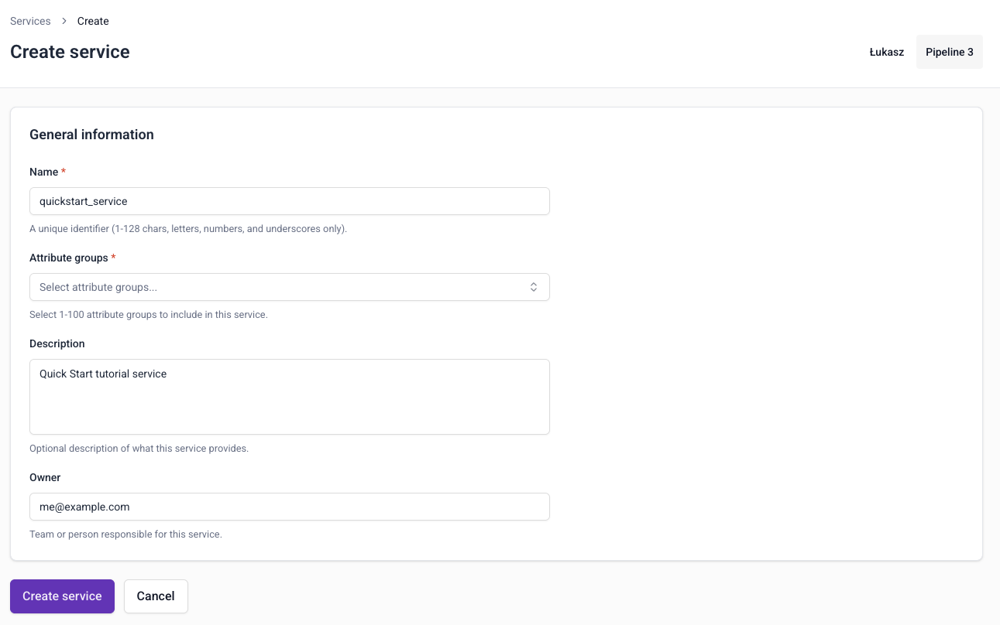
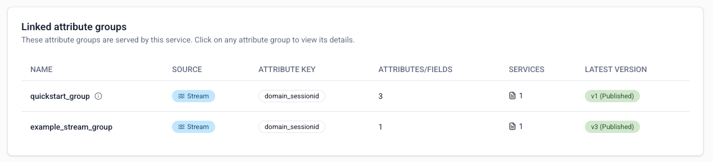
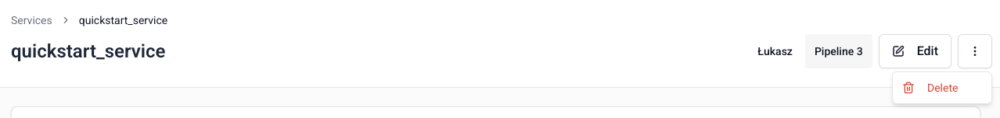

```mdx-code-block
import Tabs from '@theme/Tabs';
import TabItem from '@theme/TabItem';
```

[Services](/docs/signals/concepts/index.md#services) group attribute groups together for serving to your applications. They provide a stable interface for [retrieving attributes](/docs/signals/applications/retrieve-attributes/index.md): we strongly recommend using services in production applications.

<Tabs groupId="signals-impl" queryString>
<TabItem value="console" label="Console" default>

To create a service, go to **Signals** > **Services** in Snowplow Console and follow the instructions.



To configure a service, you'll need to specify:
* A unique name
* An optional description
* The email address of the primary owner or maintainer
* Which attribute groups to include

</TabItem>
<TabItem value="sdk" label="Python SDK">

Use the `Service` class to define a service. You can refer to attribute groups either by passing the objects directly, or by name and version using a dictionary:

```python
from snowplow_signals import Service

# Refer to attribute groups by name and version
my_service = Service(
    name='my_service',
    description='A collection of attribute groups',
    owner="user@company.com",
    attribute_groups=[
        {"name": "user_attributes", "version": 2},
        {"name": "session_attributes", "version": 1},
    ],
)

# Or pass the objects directly
my_service = Service(
    name='my_service',
    description='A collection of attribute groups',
    owner="user@company.com",
    attribute_groups=[
        my_attribute_group,
        another_attribute_group,
    ],
)
```

The table below lists all available arguments for a `Service`:

| Argument | Description | Type | Required? |
| --- | --- | --- | --- |
| `name` | The name of the service | `string` | ✅ |
| `description` | A description of the service | `string` | ❌ |
| `owner` | The owner of the service | `string` | ✅ |
| `attribute_groups` | List of attribute groups with optional version specification | list of `AttributeGroup` or dict | ❌ |

</TabItem>
</Tabs>

## Versioning

When choosing which attribute groups to include, you'll select a specific version of each attribute group.

Services themselves are not versioned. You can update them to use different attribute groups, or different attribute group versions, at any time.

<Tabs groupId="signals-impl" queryString>
<TabItem value="console" label="Console" default>



</TabItem>
<TabItem value="sdk" label="Python SDK">

Specify the version of each attribute group in the `attribute_groups` list using a dictionary with `name` and `version` keys, or by using a versioned `AttributeGroup` object directly.

</TabItem>
</Tabs>

## Manage services

<Tabs groupId="signals-impl" queryString>
<TabItem value="console" label="Console" default>

Services are automatically published as soon as they're created. They're a wrapper for consuming calculated attributes, and don't cause any additional processing themselves.

To edit a service definition, go to the service details page and click the **Edit** button.

To delete a service, go to the service details page and click the `⋮` button, then choose **Delete**.



</TabItem>
<TabItem value="sdk" label="Python SDK">

Use `publish()` to register services with Signals.

```python
from snowplow_signals import Signals

sp_signals = Signals({{ config }})

sp_signals.publish([
    my_service,
    my_other_service,
])
```

</TabItem>
</Tabs>
