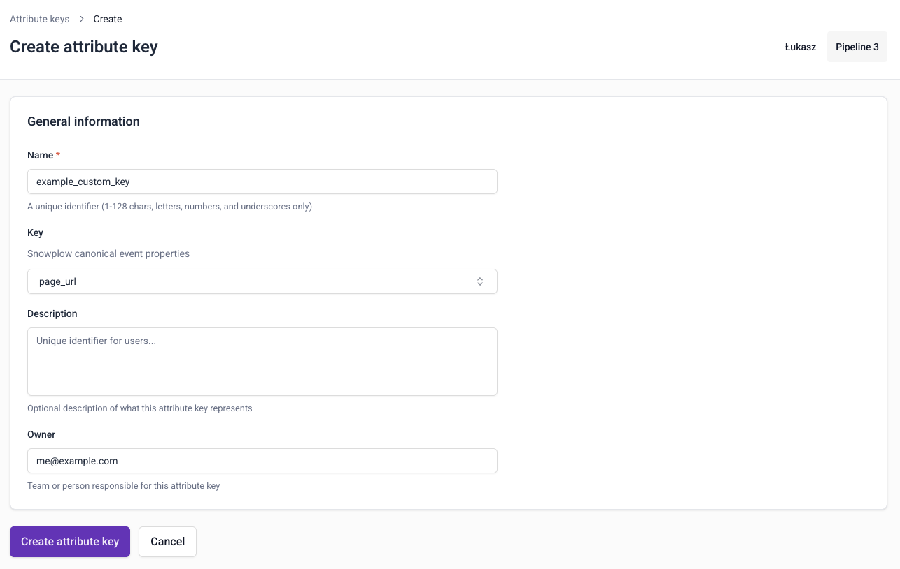

Define the behavior you want to capture in [attribute groups](/docs/signals/concepts/index.md#attribute-groups). Choose whether to calculate attributes from your event stream or sync pre-calculated values from your warehouse.

To create an attribute group, go to **Signals** > **Attribute groups** in Snowplow Console and follow the instructions.

The first step is to specify:
* A unique name
* An optional description
* The email address of the primary owner or maintainer
* Which data source you want to use

## Data source

There are two [sources](/docs/signals/concepts/index.md#data-sources) to choose from:
* **Stream**: real-time Snowplow event stream, with an optional warehouse backfill
* **Warehouse**: pre-calculated values in a warehouse table that you sync to the Profiles Store

Attribute groups are configured differently based on the data source.

### Stream

Signals calculates attributes from events in your real-time stream. Check out the [quick start tutorial](/tutorials/signals-quickstart/start) for a step-by-step guide.

You'll need to define the [attributes](/docs/signals/attributes/attributes/index.md) you want to calculate from your event stream.

#### Backfill attributes

:::note[Warehouse connection]
A warehouse connection is required to use the backfill option.
:::

Stream attribute groups only calculate attributes from the moment they are published. If you want to include historical data, enable **Backfill attributes** when creating the group.

When enabled, a date picker appears. Select the date from which Signals should backfill attribute values from your `atomic` events table. On publish, Signals backfills all events from that date up to the publish timestamp using your warehouse. From the publish timestamp onwards, the streaming engine takes over and processes events in real time.

### Warehouse

Attribute groups with a warehouse source don't require attribute definition, as no calculation is performed. This source type syncs existing, pre-calculated warehouse values to your Profiles Store. The batch engine runs on a fixed interval and only sends rows that are newer than the last sync, based on a timestamp field you configure. Once a sync period has passed, those rows will not be reprocessed. If a dataset has multiple rows for the same attribute key within a sync period, Signals uses the most recent value.

Provide the warehouse and table details, and select which fields you want to send to Signals.

## Attribute keys

All attribute groups need an [attribute key](/docs/signals/concepts/index.md#attribute-keys).

Signals includes four built-in attribute keys, based on commonly used identifiers from the atomic [user-related fields](/docs/fundamentals/canonical-event/index.md#user-fields) in all Snowplow events.

To create a custom attribute key, navigate to **Signals** > **Attribute keys** within Console. Click the **Create attribute key** button.

You will need to provide:
* A unique name
* An optional description
* An optional email address for the primary owner or maintainer
* Which [atomic](/docs/fundamentals/canonical-event/index.md#common-fields) property you want to calculate attributes against

To edit or delete a custom attribute key, go to the key details page and click the **Edit** button, or the `⋮` button followed by **Delete**.

## Attribute lifetimes

We recommend setting a Time to live (TTL) value for each attribute. Some attributes will only be relevant for a certain amount of time, and eventually stop being updated. To avoid stale attribute values staying in your Profiles Store forever, configure a TTL when creating or updating an attribute group.

The default TTL is 7 days for stream attribute groups and 365 days for warehouse synced values.

When none of the attributes within a group have been updated for the defined lifespan, all attribute values in that group will be deleted: fetching them will return `None` values.

If Signals then processes a new event that calculates the attribute again, or syncs new data from the warehouse, the expiration timer is reset.

## Testing the attribute definitions

:::note[Warehouse connection]
A warehouse connection is required to test attribute definitions.
:::

After defining one or more [attributes](/docs/signals/attributes/attributes/index.md) for stream attribute groups, you can test out the configuration with the **Run preview** button.

This will output a table of attributes calculated from your `atomic` events table, using a random subset of events from the last hour.

## Publishing the attribute group

Once you're happy with your attribute group configuration, click **Create attribute group** to save it. It will be saved as a draft, and not yet available to Signals.

Click the **Edit** button if you want to make changes to the attribute group.

To send the attribute group configuration to your Signals infrastructure, click the **Publish** button. This will allow Signals to start calculating attributes or syncing tables, and populating the Profiles Store.

### Versioning

Attribute groups are versioned. This allows you to iterate on the definitions without breaking downstream processes. You'll select specific attribute group versions when you define [services](/docs/signals/attributes/services/index.md).

All attribute groups start as `v1`. If you make changes to the definition, the version will be automatically incremented.

## Deleting an attribute group

To unpublish or delete an attribute group, click the `⋮` button on the group details page.

Unpublishing is version specific. It will stop Signals from calculating attributes for this version of this group. Existing attribute values will remain in your Profiles Store, but they won't be updated. You can republish it later if needed.

Choose **Delete** to permanently delete all versions of the attribute group, along with attribute values in your Profiles Store for this group.

If the attribute group version is used by a [service](/docs/signals/concepts/index.md#services), you'll need to update the service definition before unpublishing or deleting.

If the attribute group version is used by a published [intervention](/docs/signals/concepts/index.md#interventions), deleting or unpublishing it will unpublish the intervention.
