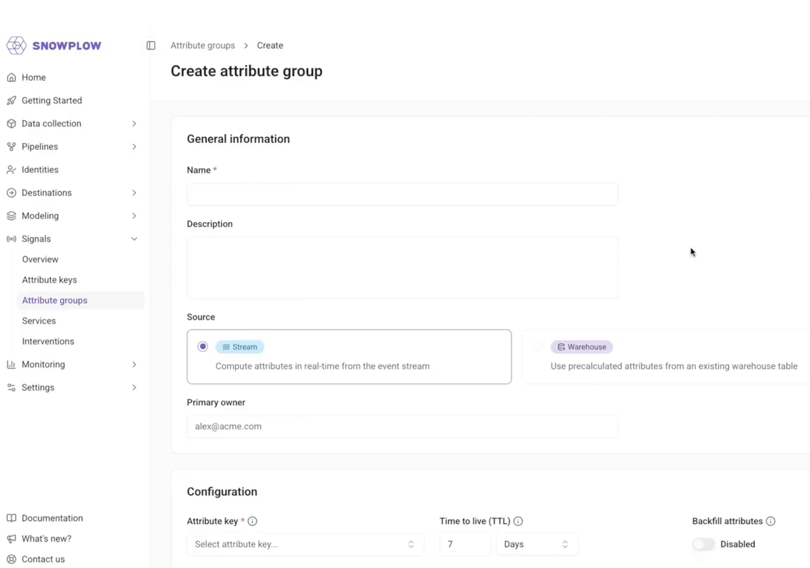
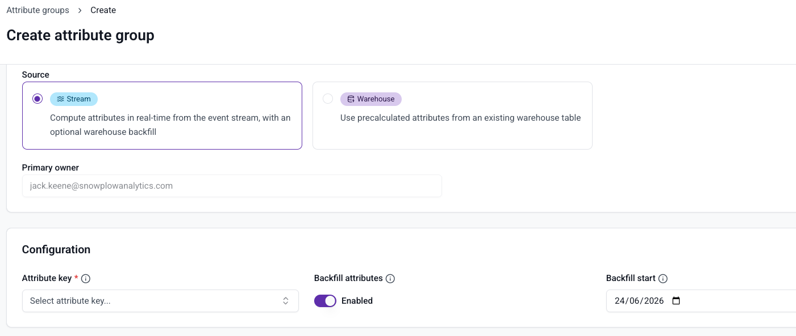
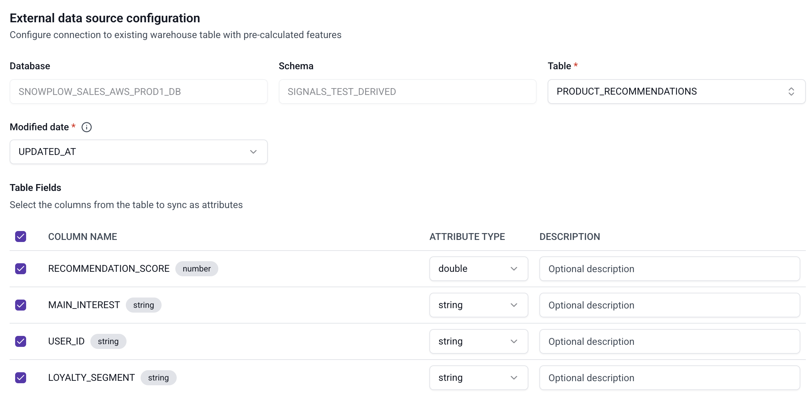
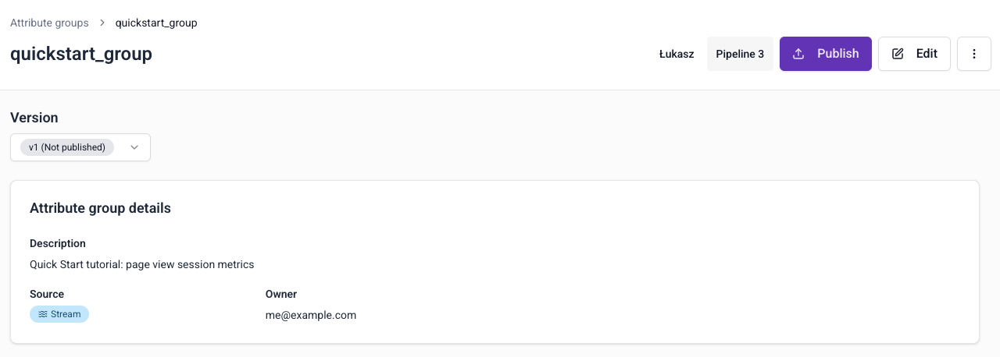
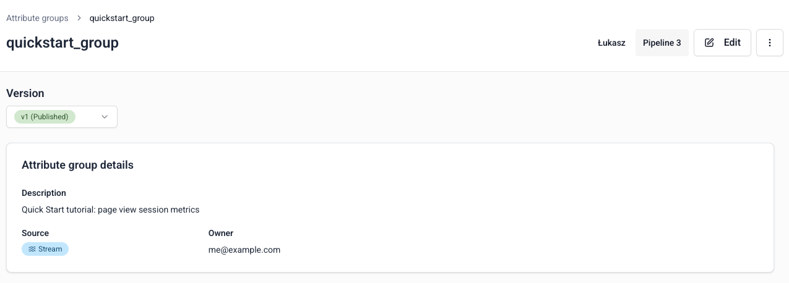
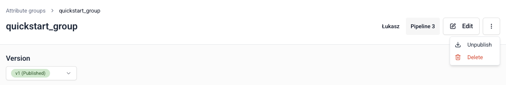

```mdx-code-block
import Tabs from '@theme/Tabs';
import TabItem from '@theme/TabItem';
```

Define the behavior you want to capture in [attribute groups](/docs/signals/concepts/index.md#attribute-groups). Choose whether to calculate attributes from your event stream or sync pre-calculated values from your warehouse.

<Tabs groupId="signals-impl" queryString>
<TabItem value="console" label="Console" default>

To create an attribute group, go to **Signals** > **Attribute groups** in Snowplow Console and follow the instructions.



The first step is to specify:
* A unique name
* An optional description
* The email address of the primary owner or maintainer
* Which data source you want to use

</TabItem>
<TabItem value="sdk" label="Python SDK">

Use a `StreamAttributeGroup` to calculate attributes from the real-time event stream.

```python
from snowplow_signals import StreamAttributeGroup, domain_sessionid

my_stream_attribute_group = StreamAttributeGroup(
    name="my_stream_attribute_group",
    version=1,
    attribute_key=domain_sessionid,
    owner="user@company.com",
    attributes=[
        # Previously defined attributes
        page_view_count,
        products_added_to_cart_feature,
    ],
)
```

</TabItem>
</Tabs>

## Data source

There are two [sources](/docs/signals/concepts/index.md#data-sources) to choose from:

<Tabs groupId="signals-impl" queryString>
<TabItem value="console" label="Console" default>

* **Stream**: real-time Snowplow event stream, with an optional warehouse backfill
* **Warehouse**: pre-calculated values in a warehouse table that you sync to the Profiles Store

</TabItem>
<TabItem value="sdk" label="Python SDK">

* **`StreamAttributeGroup`**: calculates attributes from the real-time event stream, with an optional backfill
* **`ExternalBatchAttributeGroup`**: syncs pre-calculated values from an existing warehouse table to the Profiles Store

</TabItem>
</Tabs>

Attribute groups are configured differently based on the data source.

### Stream

Signals calculates attributes from events in your real-time stream. Check out the [quick start tutorial](/tutorials/signals-quickstart/start) for a step-by-step guide.

You'll need to define the [attributes](/docs/signals/attributes/attributes/index.md) you want to calculate from your event stream.

#### Backfill attributes

Stream attribute groups only calculate attributes from the moment they are published. If you want to include historical data, enable backfill when creating the group.

<Tabs groupId="signals-impl" queryString>
<TabItem value="console" label="Console" default>

:::note[Warehouse connection]
A warehouse connection is required to use the backfill option.
:::

Enable **Backfill attributes** when creating the group. A date picker appears — select the date from which Signals should backfill attribute values from your `atomic` events table. On publish, Signals backfills all events from that date up to the publish timestamp using your warehouse. From the publish timestamp onwards, the streaming engine takes over.



</TabItem>
<TabItem value="sdk" label="Python SDK">

Set `backfill_since_tstamp` on your `StreamAttributeGroup` to specify the earliest date to backfill from.

```python
from datetime import datetime, timezone
from snowplow_signals import StreamAttributeGroup, domain_userid

my_stream_attribute_group = StreamAttributeGroup(
    name="my_stream_attribute_group",
    version=1,
    attribute_key=domain_userid,
    owner="user@company.com",
    attributes=[page_view_count],
    backfill_since_tstamp=datetime(2025, 1, 1, tzinfo=timezone.utc),
)
```

</TabItem>
</Tabs>

### Warehouse

Attribute groups with a warehouse source don't require attribute definition, as no calculation is performed. This source type syncs existing, pre-calculated warehouse values to your Profiles Store using the batch engine.

See [Warehouse configuration](/docs/signals/attributes/warehouse-config/index.md) for full configuration details.

<Tabs groupId="signals-impl" queryString>
<TabItem value="console" label="Console" default>

Provide the warehouse and table details, and select which fields you want to send to Signals.



</TabItem>
<TabItem value="sdk" label="Python SDK">

Use `ExternalBatchAttributeGroup` instead of `StreamAttributeGroup`. See [Warehouse configuration](/docs/signals/attributes/warehouse-config/index.md) for the full SDK reference.

</TabItem>
</Tabs>

## Attribute group options

<Tabs groupId="signals-impl" queryString>
<TabItem value="console" label="Console" default>

The first step when creating an attribute group is to specify:
* A unique name
* An optional description
* The email address of the primary owner or maintainer
* Which data source you want to use

</TabItem>
<TabItem value="sdk" label="Python SDK">

The table below lists all available arguments for `StreamAttributeGroup`:

| Argument | Description | Type | Default | Required? |
| --- | --- | --- | --- | --- |
| `name` | The name of the attribute group | `string` | | ✅ |
| `version` | The version of the attribute group | `int` | 1 | ❌ |
| `attribute_key` | The attribute key associated with the attribute group | `AttributeKey` | | ✅ |
| `owner` | The owner of the attribute group | `Email` | | ✅ |
| `description` | A description of the attribute group | `string` | | ❌ |
| `ttl` | Time-to-live for attributes in the Profile Store | `timedelta` | | ❌ |
| `attributes` | List of attributes to calculate | list of `Attribute` | | ✅ |
| `online` | Calculate attributes (`True`) or not (`False`) | `bool` | `True` | ❌ |
| `backfill_since_tstamp` | How far in time to backfill from | `datetime` | | ❌ |

Use the `online` property to control whether Signals should actively compute the attributes, or just register the configuration. If you only want to publish the attribute group definitions without calculating attribute values yet, set `online=False`.

</TabItem>
</Tabs>

## Attribute keys

All attribute groups need an [attribute key](/docs/signals/concepts/index.md#attribute-keys). See [Attribute keys](/docs/signals/attributes/attribute-keys/index.md) for details on using built-in keys and creating custom ones.

## Attribute lifetimes

TTL configuration applies to **lifetime attributes** only. For time windowed attributes, the TTL is set automatically to match the attribute's time window — a 10-minute window attribute expires after 10 minutes, regardless of any TTL you configure.

For lifetime attribute groups, we recommend setting a TTL to avoid stale values persisting in your Profiles Store indefinitely.

The defaults for lifetime attribute groups are 7 days for stream attributes and 365 days for warehouse synced values. If no TTL is set on the attribute group, the attribute key's TTL is used; if neither is set, the defaults apply.

When a lifetime attribute has not been updated for its defined TTL, its value is deleted: fetching it will return a `None` value. If Signals then processes a new event that updates the attribute, or syncs new data from the warehouse, the expiration timer is reset.

<Tabs groupId="signals-impl" queryString>
<TabItem value="console" label="Console" default>

Configure a TTL when creating or updating the attribute group.

</TabItem>
<TabItem value="sdk" label="Python SDK">

Set `ttl` on your attribute group using a `timedelta`:

```python
from datetime import timedelta
from snowplow_signals import StreamAttributeGroup, user_id

stream_attribute_group = StreamAttributeGroup(
    name="comprehensive_stream_attribute_group",
    version=2,
    attribute_key=user_id,
    owner="data-team@company.com",
    attributes=[page_view_count, session_duration],
    ttl=timedelta(days=90),
)
```

</TabItem>
</Tabs>

## Testing attribute definitions

After defining one or more [attributes](/docs/signals/attributes/attributes/index.md) for stream attribute groups, you can test the configuration before publishing.

<Tabs groupId="signals-impl" queryString>
<TabItem value="console" label="Console" default>

:::note[Warehouse connection]
A warehouse connection is required to test attribute definitions.
:::

Click the **Run preview** button. This outputs a table of attributes calculated from your `atomic` events table, using a random subset of events from the last hour.

</TabItem>
<TabItem value="sdk" label="Python SDK">

Use the `test()` method to output a table of attributes calculated from your `atomic` events table.

```python
from snowplow_signals import Signals

sp_signals = Signals({{ config }})

test_data = sp_signals.test(
    attribute_group=my_attribute_group,
    app_ids=["website"]
)
```

To inspect an existing attribute group's definition, use `get_attribute_group()`:

```python
attribute_definitions = sp_signals.get_attribute_group(
    name="my_attribute_group",
    version=1,
)
print(attribute_definitions)
```

| Argument | Description | Type | Required? |
| --- | --- | --- | --- |
| `name` | The name of the attribute group | `string` | ✅ |
| `version` | The attribute group version | `int` | ❌ |

If you don't specify a version, Signals retrieves the latest version.

</TabItem>
</Tabs>

## Publishing attribute groups

<Tabs groupId="signals-impl" queryString>
<TabItem value="console" label="Console" default>

Once you're happy with your attribute group configuration, click **Create attribute group** to save it as a draft.



Click **Edit** to make changes. To send the configuration to your Signals infrastructure, click **Publish**. This allows Signals to start calculating attributes or syncing tables, and populating the Profiles Store.



</TabItem>
<TabItem value="sdk" label="Python SDK">

Use the [`publish()` method](/docs/signals/connection/index.md#publishing-and-deleting) to register attribute groups with Signals.

```python
from snowplow_signals import Signals

sp_signals = Signals({{ config }})

sp_signals.publish([
    my_attribute_group,
    my_other_attribute_group,
])
```

</TabItem>
</Tabs>

## Versioning

Attribute groups are versioned, which allows you to iterate on definitions without breaking downstream processes. You'll select specific attribute group versions when you define [services](/docs/signals/attributes/services/index.md).

All attribute groups start as `v1`. If you make changes to the definition, the version is automatically incremented.

<Tabs groupId="signals-impl" queryString>
<TabItem value="console" label="Console" default>

Version increments are handled automatically when you edit and republish an attribute group.

</TabItem>
<TabItem value="sdk" label="Python SDK">

Use `version=1` for the first version. After publishing, if you want to change the definition, increment the version number manually.

</TabItem>
</Tabs>

## Deleting an attribute group

<Tabs groupId="signals-impl" queryString>
<TabItem value="console" label="Console" default>

To unpublish or delete an attribute group, click the `⋮` button on the group details page.



Unpublishing is version specific. It stops Signals from calculating attributes for that version, but existing attribute values remain in your Profiles Store. You can republish it later if needed.

Choose **Delete** to permanently delete all versions of the attribute group, along with attribute values in your Profiles Store for this group.

If the attribute group version is used by a [service](/docs/signals/concepts/index.md#services), you'll need to update the service definition before unpublishing or deleting.

If the attribute group version is used by a published [intervention](/docs/signals/concepts/index.md#interventions), deleting or unpublishing it will unpublish the intervention.

</TabItem>
<TabItem value="sdk" label="Python SDK">

Use the [`delete()` method](/docs/signals/connection/index.md#publishing-and-deleting) to remove an attribute group and its values from the Profiles Store.

</TabItem>
</Tabs>
