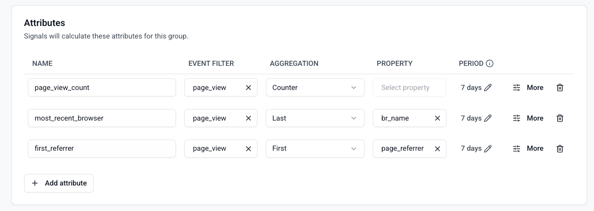
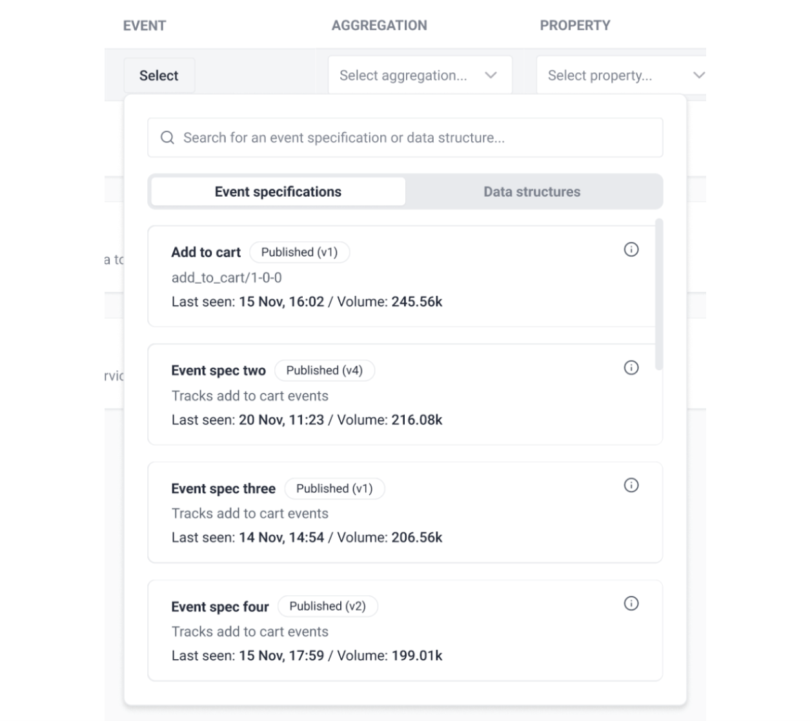
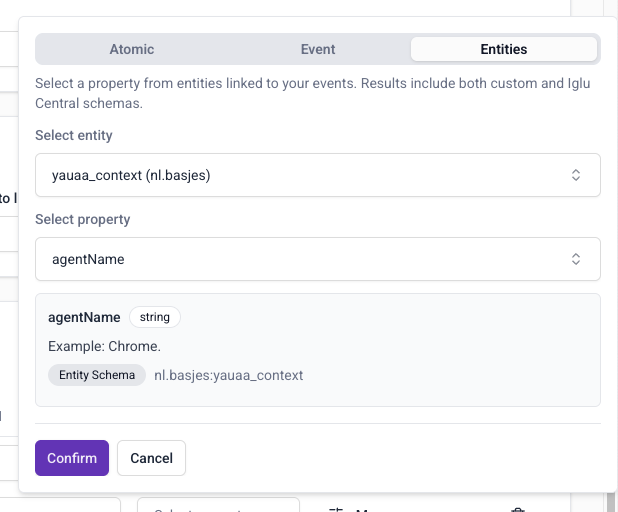
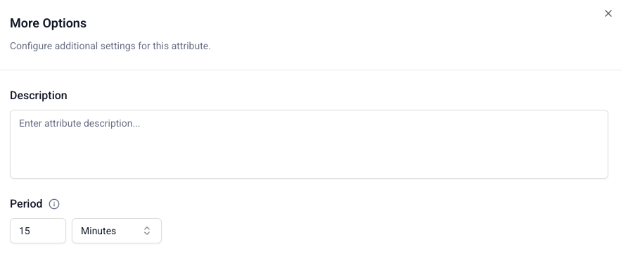
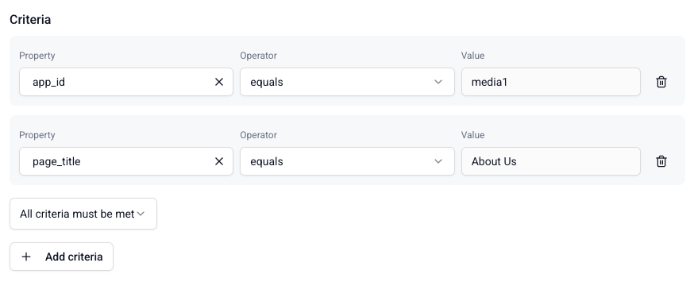

```mdx-code-block
import Tabs from '@theme/Tabs';
import TabItem from '@theme/TabItem';
```

[Attributes](/docs/signals/concepts/index.md#attribute-groups) are defined as part of attribute groups. To create an attribute, you'll need to set:
* A name that describes the attribute
* Which event schema or event specification to calculate it from
* What property in the schema to consider for the calculation
* What kind of aggregation you want to calculate over time, e.g. `mean` or `last`

Attribute calculation starts when the definitions are published, and values are not backdated.

## Minimal example

<Tabs groupId="signals-impl" queryString>
<TabItem value="console" label="Console" default>

Open your attribute group in Snowplow Console and use the attribute configuration interface to fill in the required fields.



</TabItem>
<TabItem value="sdk" label="Python SDK">

This is the minimum configuration needed to create an attribute:

```python
from snowplow_signals import Attribute, Event

my_attribute = Attribute(
    name="button_click_counter",
    type="int32",
    events=[
        Event(
            vendor="com.snowplowanalytics.snowplow",
            name="button_click",
            version="1-0-0",
        )
    ],
    aggregation="counter"
)
```

Once applied and active, this definition triggers every time Signals processes an event with the schema `iglu:com.snowplowanalytics.snowplow/button_click/jsonschema/1-0-0`. The stored attribute starts at 0 and increases by 1 with every `button_click` event.

</TabItem>
</Tabs>

## Event selection

Use the event filter to choose which event type to calculate the attribute from.

<Tabs groupId="signals-impl" queryString>
<TabItem value="console" label="Console" default>



Click the dropdown to see the available events, listed by name and vendor:

* **Event Specifications**: select any [event specification](/docs/event-studio/tracking-plans/event-specifications/index.md) from an existing [tracking plan](/docs/event-studio/tracking-plans/index.md).
* **Snowplow events**: select any built-in Snowplow or [Iglu Central](https://iglucentral.com) schema. For legacy reasons, to calculate an attribute from [structured](/docs/events/custom-events/index.md#structured-events) events find `event (com.google.analytics.measurement-protocol)`.
* **Custom events**: select any schema or data structure available within your pipeline.

:::note[Searching for events]
The search finds direct matches only, so use the exact name of the event, schema, or vendor.
:::

Once you've selected an event and version, click **Confirm** to add the attribute to your attribute group.

</TabItem>
<TabItem value="sdk" label="Python SDK">

The `events` list describes the types of events the attribute is calculated from, as references to Snowplow event schemas.

An `Event` accepts the following parameters:

| Argument | Description | Type |
| --- | --- | --- |
| `name` | `event_name` column in `atomic.events` table | `string` |
| `vendor` | `event_vendor` column in `atomic.events` table | `string` |
| `version` | `event_version` column in `atomic.events` table | `string` |

All parameters are optional and work as wildcards. Some examples:

```python
# A specific event version
Event(
    name="destination",
    vendor="com.snowplowanalytics.snowplow.media",
    version="2-0-2"
)

# All versions of an event
Event(
    name="destination",
    vendor="com.snowplowanalytics.snowplow.media",
)

# All events for a vendor
Event(vendor="com.snowplowanalytics.snowplow.media")

# Built-in Snowplow events
sp_page_view = Event(name="page_view", vendor="com.snowplowanalytics.snowplow", version="1-0-0")
sp_page_ping = Event(name="page_ping", vendor="com.snowplowanalytics.snowplow", version="1-0-0")
# Structured events
sp_structured = Event(name="event", vendor="com.google.analytics", version="1-0-0")
```

</TabItem>
</Tabs>

## Aggregation options

Signals supports the following aggregation types:

| Aggregation | Description | Required property type in schema |
| --- | --- | --- |
| Counter | Count events | No property used for this aggregation |
| Sum | Sum of property values | Numeric |
| Min | Minimum property value | Numeric |
| Max | Maximum property value | Numeric |
| Mean | Average of property values | Numeric |
| First | First property value seen | String, Numeric, Boolean |
| Last | Last property value seen | String, Numeric, Boolean |
| Most Frequent | Most frequent property value seen | String, Numeric, Boolean |
| Least Frequent | Least frequent property value seen | String, Numeric, Boolean |
| Approx Count Distinct | Approximate distinct count ([HyperLogLog](https://redis.io/docs/latest/develop/data-types/probabilistic/hyperloglogs/)) | String, Numeric, Boolean |
| Category Count | Dictionary of unique values and their counts | String, Numeric, Boolean |
| Unique List | List of unique property values | String, Numeric, Boolean |

A property isn't used for `counter` aggregation. To only count events with a specific property value, use a criteria filter.

<Tabs groupId="signals-impl" queryString>
<TabItem value="console" label="Console" default>

Select the aggregation type from the dropdown in the attribute configuration interface.

</TabItem>
<TabItem value="sdk" label="Python SDK">

Set the `aggregation` argument using the lowercase snake_case version of the aggregation name, e.g. `"counter"`, `"most_frequent"`, `"approx_count_distinct"`.

</TabItem>
</Tabs>

## Property selection

You can calculate attributes based on properties in any part of your events:
* [Atomic](/docs/fundamentals/canonical-event/index.md) properties: available for all events
* Event schema properties: properties within your chosen event
* Entity properties: properties from schemas tracked as entities with your chosen event

<Tabs groupId="signals-impl" queryString>
<TabItem value="console" label="Console" default>



Click **Confirm** to specify the property for this attribute.

</TabItem>
<TabItem value="sdk" label="Python SDK">

Use the `property` argument on `Attribute` with one of these helper classes:

* `AtomicProperty` — targets atomic properties in the event payload
* `EventProperty` — targets properties in the event data structure
* `EntityProperty` — targets properties in entity data structures

```python
# Atomic property
AtomicProperty(name="app_id")

# Property in an event data structure
EventProperty(
    vendor="com.example",
    name="test_event",
    major_version=1,
    path="action"
)

# Property in an entity
EntityProperty(
    vendor="com.example",
    name="user_context",
    major_version=1,
    path="age"
)
```

</TabItem>
</Tabs>

## Time period

Add an optional time period to aggregate over a rolling window. Signals won't include events older than the specified time period in the calculation.

<Tabs groupId="signals-impl" queryString>
<TabItem value="console" label="Console" default>

Find the time period option within **More options**. Click **Done** to save it.



</TabItem>
<TabItem value="sdk" label="Python SDK">

Set `period` on your `Attribute` using a Python `timedelta`:

```python
from datetime import timedelta

my_attribute = Attribute(
    ...,
    period=timedelta(minutes=10),
)
```

</TabItem>
</Tabs>

## Filtering with criteria

Use criteria to filter the events used to calculate an attribute. They allow you to be specific about which subsets of events should trigger attribute updates. For example, instead of counting all page views in a user's session, you may wish to calculate only views for the homepage, or a login page.

<Tabs groupId="signals-impl" queryString>
<TabItem value="console" label="Console" default>

Find the criteria option within **More options**.

Defining criteria has three steps:
1. Select which property to filter on, similarly to the property selection for the attribute
2. Choose which logical operator to use
3. Enter the value to filter on

If you enter multiple criteria, you will have the option to require `all` or `any` of them to be met for the attribute to update.



Click **Done** to save the criteria when you're finished.

</TabItem>
<TabItem value="sdk" label="Python SDK">

The `criteria` argument takes a `Criteria` object, which contains `Criterion` conditions.

| Argument | Description | Type |
| --- | --- | --- |
| `all` | All conditions must be met | list of `Criterion` |
| `any` | At least one condition must be met | list of `Criterion` |

Use `Criterion` operator methods to define filtering rules:
* `.eq` — equality (`=`)
* `.neq` — non-equality (`!=`)
* `.gt` — greater than
* `.gte` — greater than or equal to
* `.lt` — less than
* `.lte` — less than or equal to
* `.like` — pattern match (`LIKE`)
* `.in_list` — value in list (`IN`)

For example, to calculate an attribute for page views of either the FAQs or contact page:

```python
from snowplow_signals import Criteria, Criterion, AtomicProperty

criteria = Criteria(
    any=[
        Criterion.like(AtomicProperty(name="page_url"), "%/faq%"),
        Criterion.like(AtomicProperty(name="page_url"), "%/contact-us%"),
    ]
)
```

</TabItem>
</Tabs>

## All attribute options

<Tabs groupId="signals-impl" queryString>
<TabItem value="console" label="Console" default>

All attribute options are available in the attribute configuration interface within your attribute group. Use **More options** to access time period and criteria settings.

</TabItem>
<TabItem value="sdk" label="Python SDK">

The table below lists all available arguments for an `Attribute`:

| Argument | Description | Type | Required? |
| --- | --- | --- | --- |
| `name` | The name of the attribute | `string` | ✅ |
| `description` | The description of the attribute | `string` | ❌ |
| `events` | List of Snowplow `Event`s to calculate the attribute from | list of `Event` | ✅ |
| `aggregation` | The calculation to perform | one of: `counter`, `sum`, `min`, `max`, `mean`, `first`, `last`, `most_frequent`, `least_frequent`, `approx_count_distinct`, `category_count`, `unique_list` | ✅ |
| `type` | The type of the aggregation result | one of: `bytes`, `string`, `int32`, `int64`, `double`, `float`, `bool`, `dict`, `unix_timestamp`, `bytes_list`, `string_list`, `int32_list`, `int64_list`, `double_list`, `float_list`, `bool_list`, `unix_timestamp_list` | ✅ |
| `criteria` | Filters to apply to events | `Criteria` | ❌ |
| `property` | The property of the event or entity to use in the aggregation | `string` | ❌ |
| `period` | The time window over which to calculate the aggregation | `timedelta` | ❌ |
| `default_value` | Default value if aggregation returns no results | | ❌ |

</TabItem>
</Tabs>

## Extended examples

<Tabs groupId="signals-impl" queryString>
<TabItem value="console" label="Console" default>

For complex attribute configurations, use the **More options** section in the attribute editor to add time periods and criteria filters.

</TabItem>
<TabItem value="sdk" label="Python SDK">

### Example 1: filtered counter with a time window

Count `button_click` events only where the button `id` is `generate_emoji_btn`, over a rolling 10-minute window.

```python
from snowplow_signals import Attribute, Event, Criteria, Criterion, EventProperty
from datetime import timedelta

button_click_counter_attribute = Attribute(
    name="emoji_button_click_counter",
    description="The number of clicks for the 'generate emoji' button",
    type="int32",
    events=[
        Event(
            vendor="com.snowplowanalytics.snowplow",
            name="button_click",
            version="1-0-0",
        )
    ],
    aggregation="counter",
    criteria=Criteria(
        all=[
            Criterion.eq(
                EventProperty(
                    vendor="com.snowplowanalytics.snowplow",
                    name="button_click",
                    major_version=1,
                    path="id"
                ),
                "generate_emoji_btn"
            )
        ]
    ),
    period=timedelta(minutes=10),
    default_value=0
)
```

### Example 2: last atomic property value

Track the most recent referrer source using the `mkt_medium` atomic property, calculated from either a page view or a custom event.

```python
from snowplow_signals import Attribute, Event, AtomicProperty

referrer_source_attribute = Attribute(
    name="referrer_source",
    description="Referrer",
    type="string",
    events=[
        Event(name="page_view", vendor="com.snowplowanalytics.snowplow", version="1-0-0"),
        Event(name="login_landing", vendor="com.business.example", version="1-0-0"),
    ],
    aggregation="last",
    property=AtomicProperty(name="mkt_medium"),
)
```

### Example 3: sum of an entity property

Sum the `price` of the first product entity in ecommerce transaction events.

```python
from snowplow_signals import Attribute, Event, Criteria, Criterion, EntityProperty

my_new_attribute = Attribute(
    name="products_total_purchase_value",
    description="Total purchase value for all products",
    type="int64",
    events=[
        Event(
            vendor="com.snowplowanalytics.snowplow.ecommerce",
            name="snowplow_ecommerce_action",
            version="1-0-2",
        )
    ],
    aggregation="sum",
    criteria=Criteria(
        all=[
            Criterion.eq(
                EntityProperty(
                    vendor="com.snowplowanalytics.snowplow.ecommerce",
                    name="product",
                    major_version=1,
                    index=[0],
                    path="price"
                ),
                "transaction"
            )
        ]
    ),
    property=EntityProperty(
        vendor="com.snowplowanalytics.snowplow.ecommerce",
        name="product",
        major_version=1,
        path="price",
    ),
    default_value=0
)
```

</TabItem>
</Tabs>
