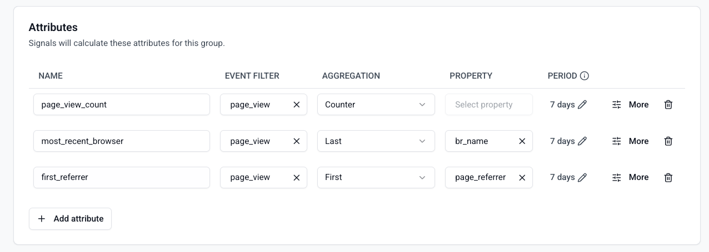
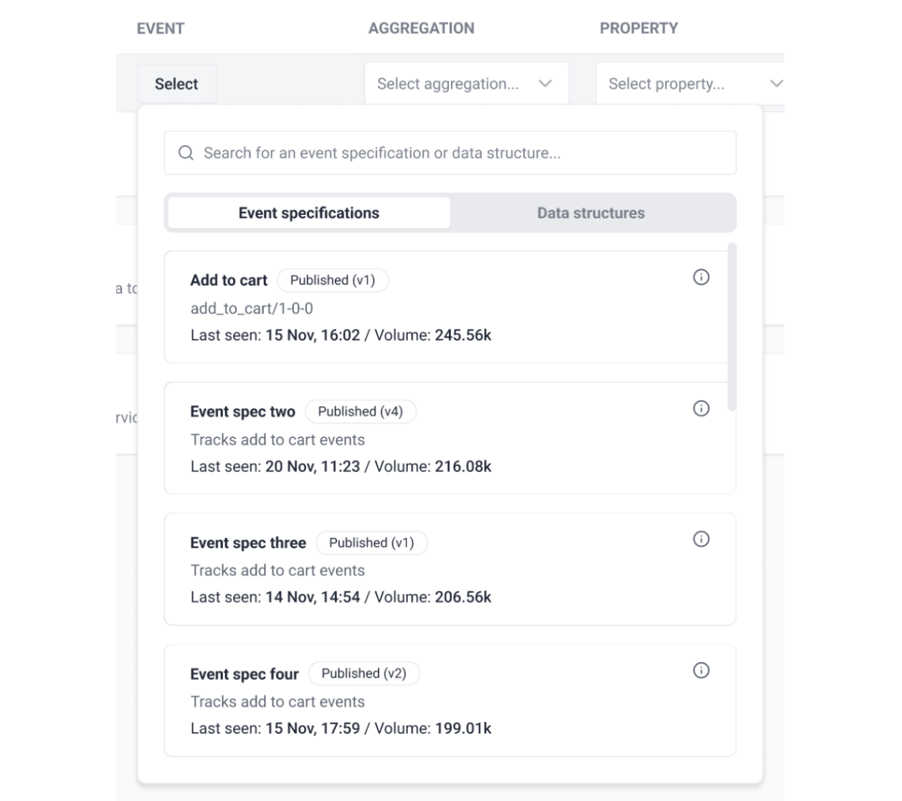
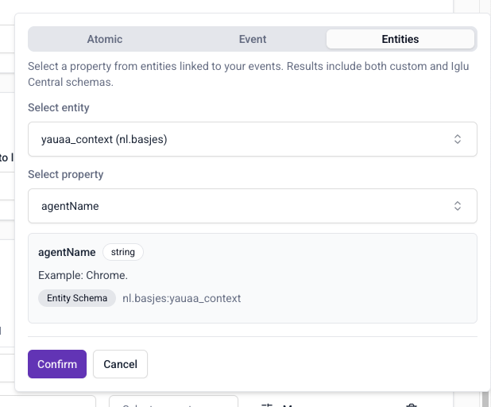
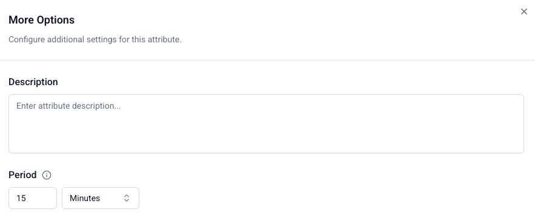
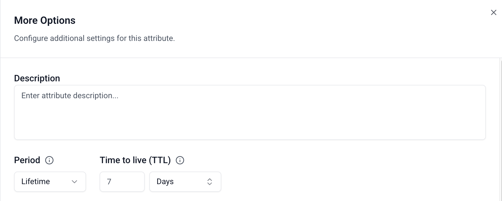
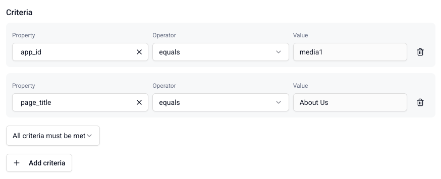

```mdx-code-block
import Tabs from '@theme/Tabs';
import TabItem from '@theme/TabItem';
```

[Attributes](/docs/signals/concepts/index.md#attribute-groups) are defined as part of attribute groups. To create an attribute, you'll need to set:
* A name that describes the attribute
* Which event schema or event specification to calculate it from
* What property in the schema to consider for the calculation
* What kind of aggregation you want to calculate over time, e.g. `mean` or `last`

Attribute calculation starts when the definitions are published, and values are not backdated.

## Configure the attribute

Every attribute needs [events](#select-events) to calculate from, and an [aggregation](#choose-an-aggregation) to calculate. Most aggregations also operate on a [property](#select-a-property) of those events. The [time period](#set-the-period) and [criteria](#filter-with-criteria) settings are optional refinements.

In Console, open your attribute group and use the attribute configuration interface to fill in the fields. The time period and criteria settings are within **More options**.



With the Python SDK, these settings are arguments to the `Attribute` class, listed in [all attribute options](#all-attribute-options).

### Select events

Use the event filter to choose which event type to calculate the attribute from.

<Tabs groupId="signals-impl" queryString>
<TabItem value="console" label="Console" default>



Click the dropdown to see the available events, listed by name and vendor:

* **Event Specifications**: select any [event specification](/docs/event-studio/tracking-plans/event-specifications/index.md) from an existing [tracking plan](/docs/event-studio/tracking-plans/index.md).
* **Snowplow events**: select any built-in Snowplow or [Iglu Central](https://iglucentral.com) schema. For legacy reasons, to calculate an attribute from [structured](/docs/events/custom-events/index.md#structured-events) events find `event (com.google.analytics.measurement-protocol)`.
* **Custom events**: select any schema or data structure available within your pipeline.

:::note[Searching for events]
The search finds direct matches only, so use the exact name of the event, schema, or vendor.
:::

Once you've selected an event and version, click **Confirm** to add the attribute to your attribute group.

</TabItem>
<TabItem value="sdk" label="Python SDK">

The `events` list describes the types of events the attribute is calculated from, as references to Snowplow event schemas.

An `Event` accepts the following parameters:

| Argument | Description | Type |
| --- | --- | --- |
| `name` | `event_name` column in `atomic.events` table | `string` |
| `vendor` | `event_vendor` column in `atomic.events` table | `string` |
| `version` | `event_version` column in `atomic.events` table | `string` |

All parameters are optional and work as wildcards. Some examples:

```python
# A specific event version
Event(
    name="destination",
    vendor="com.snowplowanalytics.snowplow.media",
    version="2-0-2"
)

# All versions of an event
Event(
    name="destination",
    vendor="com.snowplowanalytics.snowplow.media",
)

# All events for a vendor
Event(vendor="com.snowplowanalytics.snowplow.media")

# Built-in Snowplow events
sp_page_view = Event(name="page_view", vendor="com.snowplowanalytics.snowplow", version="1-0-0")
sp_page_ping = Event(name="page_ping", vendor="com.snowplowanalytics.snowplow", version="1-0-0")
# Structured events
sp_structured = Event(name="event", vendor="com.google.analytics", version="1-0-0")
```

</TabItem>
</Tabs>

### Choose an aggregation

Signals supports the following aggregation types:

| Aggregation | Description | Required property type in schema | Notes |
| --- | --- | --- | --- |
| Counter | Count events | No property used for this aggregation | |
| Sum | Sum of property values | Numeric | |
| Min | Minimum property value | Numeric | |
| Max | Maximum property value | Numeric | |
| Mean | Average of property values | Numeric | |
| First | First property value seen | String, Numeric, Boolean | Earliest by `derived_tstamp`, not by arrival order |
| Last | Last property value seen | String, Numeric, Boolean | Latest by `derived_tstamp`, not by arrival order |
| Most Frequent | Most frequent property value seen | String, Numeric, Boolean | Tracks up to 100 distinct values; ties are broken arbitrarily |
| Least Frequent | Least frequent property value seen | String, Numeric, Boolean | Tracks up to 100 distinct values; ties are broken arbitrarily |
| Approx Count Distinct | Approximate distinct count ([HyperLogLog](https://redis.io/docs/latest/develop/data-types/probabilistic/hyperloglogs/)) | String, Numeric, Boolean | Approximate, with a typical error around 1%. Don't use where an exact count matters |
| Category Count | Dictionary of unique values and their counts | String, Numeric, Boolean | Keeps the 100 highest-count values; lower-count values are dropped |
| Unique List | List of unique property values | String, Numeric, Boolean | Ordered oldest to newest by `derived_tstamp`, capped at 100 values. See below |
| Time Since Last | Duration since the most recent matching event | Always uses `derived_tstamp` | Requires `time_unit`. Result type must be `float` or `double`. See below |
| Time Since First | Duration since the earliest matching event | Always uses `derived_tstamp` | Requires `time_unit`. Result type must be `float` or `double`. See below |

A property isn't used for `counter` aggregation. To only count events with a specific property value, use a criteria filter.

Attributes calculated over high-cardinality properties, such as a product ID or a search term, can exceed the 100-value limits noted above. Consider a criteria filter to narrow the set of events, or a lower-cardinality property.

#### Unique list ordering

A unique list is ordered by when each value was *most recently* seen, oldest first. Seeing a value again doesn't add a second entry: it moves the existing entry to the end of the list. For example, viewing pages `/home`, `/products`, then `/home` again produces `["/products", "/home"]`.

This also determines which values are dropped once the list reaches 100 entries: the least recently seen value is removed first, so a frequently repeated value is retained even if it was first seen long ago.

#### Time since aggregations

The `time_since_last` and `time_since_first` aggregations measure how long ago the most recent or earliest matching event occurred. The result is a fractional duration in the unit you choose with the `time_unit` argument: `s` (seconds), `min` (minutes), `h` (hours), or `d` (days).

These aggregations always operate on the event's `derived_tstamp` property. You don't need to set a `property` - it defaults to `derived_tstamp`, and no other property is accepted. The result type must be `float` or `double`.

The value is recomputed at read time, so it reflects the elapsed time between the stored event timestamp and the moment the attribute is retrieved. The result is never negative - if the stored event timestamp is later than the retrieval time (which can happen with out-of-order events), the value is clamped at 0.

<Tabs groupId="signals-impl" queryString>
<TabItem value="console" label="Console" default>

Select the aggregation type from the dropdown in the attribute configuration interface.

</TabItem>
<TabItem value="sdk" label="Python SDK">

Set the `aggregation` argument using the lowercase snake_case version of the aggregation name, e.g. `"counter"`, `"most_frequent"`, `"approx_count_distinct"`.

</TabItem>
</Tabs>

### Select a property

You can calculate attributes based on properties in any part of your events:
* [Atomic](/docs/fundamentals/canonical-event/index.md) properties: available for all events
* Event schema properties: properties within your chosen event
* Entity properties: properties from schemas tracked as entities with your chosen event

<Tabs groupId="signals-impl" queryString>
<TabItem value="console" label="Console" default>



Click **Confirm** to specify the property for this attribute.

</TabItem>
<TabItem value="sdk" label="Python SDK">

Use the `property` argument on `Attribute` with one of these helper classes:

* `AtomicProperty` — targets atomic properties in the event payload
* `EventProperty` — targets properties in the event data structure
* `EntityProperty` — targets properties in entity data structures

```python
# Atomic property
AtomicProperty(name="app_id")

# Property in an event data structure
EventProperty(
    vendor="com.example",
    name="test_event",
    major_version=1,
    path="action"
)

# Property in an entity
EntityProperty(
    vendor="com.example",
    name="user_context",
    major_version=1,
    path="age"
)
```

</TabItem>
</Tabs>

### Set the period

Every stream attribute has a period that controls the time window for the calculation. Choose a rolling time window (for example, 7 days or 15 minutes) to aggregate over recent events, or select **Lifetime** to aggregate over all available data.

<Tabs groupId="signals-impl" queryString>
<TabItem value="console" label="Console" default>

Select the period when creating or editing an attribute.

When you select a rolling time window, Signals only includes events within that window in the calculation:



When you select **Lifetime**, a **Time to live (TTL)** field appears. TTL controls how long a stale value is retained in the Profiles Store before it is deleted. The default is 7 days. If Signals processes a new event that updates the attribute, the TTL timer resets.



</TabItem>
<TabItem value="sdk" label="Python SDK">

Set `period` on your `Attribute` using a Python `timedelta`. For lifetime attributes, omit `period` and set `ttl` instead:

```python
from datetime import timedelta

# Rolling period
my_attribute = Attribute(
    ...,
    period=timedelta(minutes=10),
)

# Lifetime with TTL
my_lifetime_attribute = Attribute(
    ...,
    ttl=timedelta(days=7),
)
```

</TabItem>
</Tabs>

### Filter with criteria

Use criteria to filter the events used to calculate an attribute. They allow you to be specific about which subsets of events should trigger attribute updates. For example, instead of counting all page views in a user's session, you may wish to calculate only views for the homepage, or a login page.

<Tabs groupId="signals-impl" queryString>
<TabItem value="console" label="Console" default>

Find the criteria option within **More options**.

Defining criteria has three steps:
1. Select which property to filter on, similarly to the property selection for the attribute
2. Choose which logical operator to use
3. Enter the value to filter on

If you enter multiple criteria, you will have the option to require `all` or `any` of them to be met for the attribute to update.



Click **Done** to save the criteria when you're finished.

</TabItem>
<TabItem value="sdk" label="Python SDK">

The `criteria` argument takes a `Criteria` object, which contains `Criterion` conditions.

| Argument | Description | Type |
| --- | --- | --- |
| `all` | All conditions must be met | list of `Criterion` |
| `any` | At least one condition must be met | list of `Criterion` |

Use `Criterion` operator methods to define filtering rules:
* `.eq` — equality (`=`)
* `.neq` — non-equality (`!=`)
* `.gt` — greater than
* `.gte` — greater than or equal to
* `.lt` — less than
* `.lte` — less than or equal to
* `.like` — pattern match (`LIKE`)
* `.in_list` — value in list (`IN`)

For example, to calculate an attribute for page views of either the FAQs or contact page:

```python
from snowplow_signals import Criteria, Criterion, AtomicProperty

criteria = Criteria(
    any=[
        Criterion.like(AtomicProperty(name="page_url"), "%/faq%"),
        Criterion.like(AtomicProperty(name="page_url"), "%/contact-us%"),
    ]
)
```

</TabItem>
</Tabs>

## All attribute options

The table below lists all available arguments for a Python SDK `Attribute`. The same options are available in the Console attribute configuration interface.

| Argument | Description | Type | Required? |
| --- | --- | --- | --- |
| `name` | The name of the attribute | `string` | ✅ |
| `description` | The description of the attribute | `string` | ❌ |
| `events` | List of Snowplow `Event`s to calculate the attribute from | list of `Event` | ✅ |
| `aggregation` | The calculation to perform | one of: `counter`, `sum`, `min`, `max`, `mean`, `first`, `last`, `most_frequent`, `least_frequent`, `approx_count_distinct`, `category_count`, `unique_list`, `time_since_last`, `time_since_first` | ✅ |
| `type` | The type of the aggregation result | one of: `bytes`, `string`, `int32`, `int64`, `double`, `float`, `bool`, `dict`, `unix_timestamp`, `bytes_list`, `string_list`, `int32_list`, `int64_list`, `double_list`, `float_list`, `bool_list`, `unix_timestamp_list` | ✅ |
| `criteria` | Filters to apply to events | `Criteria` | ❌ |
| `property` | The property of the event or entity to use in the aggregation | `string` | ❌ |
| `period` | The time window over which to calculate the aggregation, or `Lifetime` to aggregate over all available data | `timedelta` | ❌ |
| `ttl` | Time-to-live for lifetime attributes (no `period`). Falls back to the attribute group TTL if not set. Cannot be used together with `period`. | `timedelta` | ❌ |
| `time_unit` | The unit for `time_since_last`/`time_since_first` results | one of: `s`, `min`, `h`, `d` | Required for `time_since_last`/`time_since_first` |
| `default_value` | Default value if aggregation returns no results | | ❌ |

## Examples

The following examples show complete attribute configurations, using the Python SDK.

### Minimal example

This is the minimum configuration needed to create an attribute:

```python
from snowplow_signals import Attribute, Event

my_attribute = Attribute(
    name="button_click_counter",
    type="int32",
    events=[
        Event(
            vendor="com.snowplowanalytics.snowplow",
            name="button_click",
            version="1-0-0",
        )
    ],
    aggregation="counter"
)
```

Once applied and active, this definition triggers every time Signals processes an event with the schema `iglu:com.snowplowanalytics.snowplow/button_click/jsonschema/1-0-0`. The stored attribute starts at 0 and increases by 1 with every `button_click` event.

### Filtered counter with a time window

Count `button_click` events only where the button `id` is `generate_emoji_btn`, over a rolling 10-minute window.

```python
from snowplow_signals import Attribute, Event, Criteria, Criterion, EventProperty
from datetime import timedelta

button_click_counter_attribute = Attribute(
    name="emoji_button_click_counter",
    description="The number of clicks for the 'generate emoji' button",
    type="int32",
    events=[
        Event(
            vendor="com.snowplowanalytics.snowplow",
            name="button_click",
            version="1-0-0",
        )
    ],
    aggregation="counter",
    criteria=Criteria(
        all=[
            Criterion.eq(
                EventProperty(
                    vendor="com.snowplowanalytics.snowplow",
                    name="button_click",
                    major_version=1,
                    path="id"
                ),
                "generate_emoji_btn"
            )
        ]
    ),
    period=timedelta(minutes=10),
    default_value=0
)
```

### Last atomic property value

Track the most recent referrer source using the `mkt_medium` atomic property, calculated from either a page view or a custom event.

```python
from snowplow_signals import Attribute, Event, AtomicProperty

referrer_source_attribute = Attribute(
    name="referrer_source",
    description="Referrer",
    type="string",
    events=[
        Event(name="page_view", vendor="com.snowplowanalytics.snowplow", version="1-0-0"),
        Event(name="login_landing", vendor="com.business.example", version="1-0-0"),
    ],
    aggregation="last",
    property=AtomicProperty(name="mkt_medium"),
)
```

### Sum of an entity property

Sum the `price` of product entities in ecommerce events, counting only `transaction` events.

```python
from snowplow_signals import Attribute, Event, Criteria, Criterion, EntityProperty, EventProperty

my_new_attribute = Attribute(
    name="products_total_purchase_value",
    description="Total purchase value for all products",
    type="double",
    events=[
        Event(
            vendor="com.snowplowanalytics.snowplow.ecommerce",
            name="snowplow_ecommerce_action",
            version="1-0-2",
        )
    ],
    aggregation="sum",
    criteria=Criteria(
        all=[
            Criterion.eq(
                EventProperty(
                    vendor="com.snowplowanalytics.snowplow.ecommerce",
                    name="snowplow_ecommerce_action",
                    major_version=1,
                    path="type"
                ),
                "transaction"
            )
        ]
    ),
    property=EntityProperty(
        vendor="com.snowplowanalytics.snowplow.ecommerce",
        name="product",
        major_version=1,
        path="price",
    ),
    default_value=0
)
```

### Time since last event

Track how many minutes have passed since the user's most recent page view.

```python
from snowplow_signals import Attribute, Event

recency = Attribute(
    name="minutes_since_last_page_view",
    description="Minutes since the user's most recent page view",
    type="double",
    events=[
        Event(
            vendor="com.snowplowanalytics.snowplow",
            name="page_view",
            version="1-0-0",
        )
    ],
    aggregation="time_since_last",
    time_unit="min",
)
```
