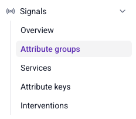

```mdx-code-block
import Tabs from '@theme/Tabs';
import TabItem from '@theme/TabItem';
```

[Attributes](/docs/signals/concepts/index.md#attribute-groups) are the behavioral facts you want Signals to calculate, such as a user's page view count or lifetime value. You define attributes within [attribute groups](/docs/signals/attributes/attribute-groups/index.md), then retrieve calculated values through [services](/docs/signals/attributes/services/index.md) or directly from individual groups.

## Define attributes

There are three methods for defining attributes in Signals:
* Snowplow Console UI
* [Signals Python SDK](/docs/signals/attributes/using-python-sdk/index.md)
* [Signals API](/docs/signals/connection/index.md#signals-api)

### Snowplow Console

To use the UI to manage Signals, log in to [Console](https://console.snowplowanalytics.com) and navigate to the **Signals** section.

Use the configuration interface to define [attribute groups](/docs/signals/attributes/attribute-groups/index.md) and [services](/docs/signals/attributes/services/index.md).



## Retrieve attributes

Your calculated attributes are stored in the Profiles Store, and retrieved using [services](/docs/signals/concepts/index.md#services).

To use attributes to take action in your application, you'll want to retrieve only the relevant values. This would usually be the attributes for the current user.

For example, use the current user's unique `domain_userid` identifier to retrieve attributes defined against the `domain_userid` attribute key.

You have three options for consuming attributes, depending on your use case or application:
* [Signals Node.js SDK](https://www.npmjs.com/package/@snowplow/signals-node) (TypeScript)
* [Signals Python SDK](https://pypi.org/project/snowplow-signals/)
* [Signals API](/docs/signals/connection/index.md#signals-api)

Start by [connecting to Signals](/docs/signals/connection/index.md).

### Using a service

The preferred way to retrieve attributes is by using a [service](/docs/signals/concepts/index.md#services). This allows you to retrieve attributes in bulk, from multiple attribute groups.

<Tabs groupId="signals" queryString>
<TabItem value="python" label="Python" default>

Use `get_service_attributes()` to retrieve attributes from a service. Signals will return the attributes as a dictionary.

Here's an example:

```python
# The Signals connection object has been created as sp_signals

calculated_values = sp_signals.get_service_attributes(
    name="my_service",
    attribute_key="domain_userid",
    identifier="218e8926-3858-431d-b2ed-66da03a1cbe5",
)
```

The table below lists all available arguments for `get_service_attributes()`

| Argument        | Description                                  | Type     | Required? |
| --------------- | -------------------------------------------- | -------- | --------- |
| `name`          | The name of the service                      | `string` | ✅         |
| `attribute_key` | The attribute key to retrieve attributes for | `string` | ✅         |
| `identifier`    | The specific attribute key value             | `string` | ✅         |

</TabItem>
<TabItem value="nodejs" label="Node.js">

Use `getServiceAttributes()` to retrieve attributes for a single identifier from a specific service. Signals will return the attributes as a JavaScript object.

Here's an example:

```typescript
// The Signals connection object has been created as signals

const calculatedValues = await signals.getServiceAttributes({
  name: "my_service",
  attribute_key: "domain_userid",
  identifier: "218e8926-3858-431d-b2ed-66da03a1cbe5",
});
```

The table below lists all available arguments for `getServiceAttributes()`

| Argument        | Description                                  | Type     | Required? |
| --------------- | -------------------------------------------- | -------- | --------- |
| `name`          | The name of the service                      | `string` | ✅         |
| `attribute_key` | The attribute key to retrieve attributes for | `string` | ✅         |
| `identifier`    | The specific attribute key value             | `string` | ✅         |

Use `getBatchServiceAttributes()` to retrieve attributes for multiple identifiers from a service in a single API call. This is more efficient than calling `getServiceAttributes()` multiple times.

```typescript
// Retrieve cart data for multiple users
const batchResults = await signals.getBatchServiceAttributes({
  name: "shopping_cart_service",
  attribute_key: "domain_userid",
  identifiers: [
    "218e8926-3858-431d-b2ed-66da03a1cbe5",
    "f47ac10b-58cc-4372-a567-0e02b2c3d479",
    "6ba7b810-9dad-11d1-80b4-00c04fd430c8"
  ]
});
```

The table below lists all available arguments for `getBatchServiceAttributes()`

| Argument        | Description                                  | Type       | Required? |
| --------------- | -------------------------------------------- | ---------- | --------- |
| `name`          | The name of the service                      | `string`   | ✅         |
| `attribute_key` | The attribute key to retrieve attributes for | `string`   | ✅         |
| `identifiers`   | Array of attribute key values to look up     | `string[]` | ✅         |

</TabItem>
</Tabs>

### Retrieve individual attributes

You can also retrieve attributes directly from a specific [attribute group](/docs/signals/concepts/index.md#attribute-groups). This is useful when:
* You want to retrieve only a small subset of attributes
* You haven't defined a service yet

<Tabs groupId="signals" queryString>
<TabItem value="python" label="Python" default>

Use `get_group_attribtues()` to retrieve specific attributes. Signals will return the attributes as a dictionary.

Here's an example:

```python
# The Signals connection object has been created as sp_signals

calculated_values = sp_signals.get_group_attribtues(
    name="my_attribute_group",
    version=1,
    attributes=["page_view_count"],
    attribute_key="domain_userid",
    identifier="218e8926-3858-431d-b2ed-66da03a1cbe5",
)
```

The table below lists all available arguments for `get_group_attribtues()`

| Argument        | Description                             | Type                         | Required? |
| --------------- | --------------------------------------- | ---------------------------- | --------- |
| `name`          | The name of the attribute group         | `string`                     | ✅         |
| `version`       | The attribute group version             | `int`                        | ✅         |
| `attributes`    | The names of the attributes to retrieve | `string` or list of `string` | ✅         |
| `attribute_key` | The attribute key name                  | `string`                     | ✅         |
| `identifier`    | The specific attribute key value        | `string`                     | ✅         |

</TabItem>
<TabItem value="nodejs" label="Node.js">

Use `getGroupAttributes()` to retrieve specific attributes from an attribute group. Signals will return the attributes as a JavaScript object.

Here's an example:

```typescript
// The Signals connection object has been created as signals

const calculatedValues = await signals.getGroupAttributes({
  name: "my_attribute_group",
  version: 1,
  attributes: ["page_view_count"],
  attribute_key: "domain_userid",
  identifier: "218e8926-3858-431d-b2ed-66da03a1cbe5",
});
```

The table below lists all available arguments for `getGroupAttributes()`

| Argument        | Description                             | Type       | Required? |
| --------------- | --------------------------------------- | ---------- | --------- |
| `name`          | The name of the attribute group         | `string`   | ✅         |
| `version`       | The attribute group version             | `number`   | ✅         |
| `attributes`    | The names of the attributes to retrieve | `string[]` | ✅         |
| `attribute_key` | The attribute key name                  | `string`   | ✅         |
| `identifier`    | The specific attribute key value        | `string`   | ✅         |

</TabItem>
</Tabs>
