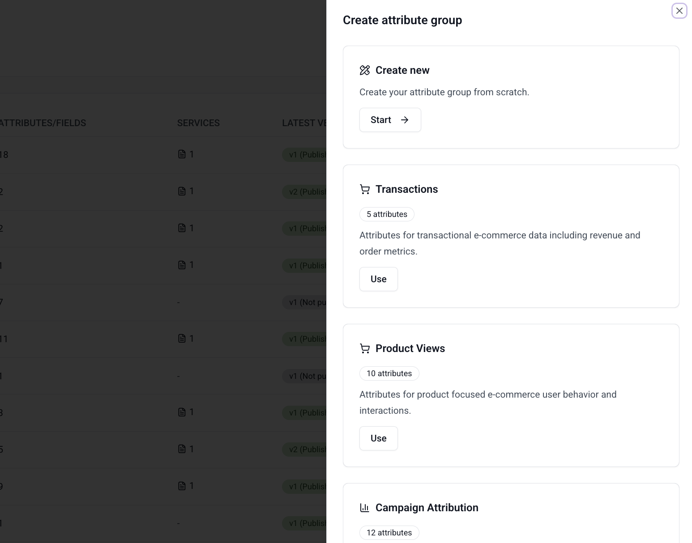

Signals provides prebuilt attribute group templates for common use cases. Instead of defining [attributes](/docs/signals/attributes/attributes/index.md) from scratch, select a template to create an [attribute group](/docs/signals/attributes/attribute-groups/index.md) with pre-configured attributes that you can customize before publishing.

Signals provides templates for three categories of use case:

| Category | Template | Attributes | Description |
| --- | --- | --- | --- |
| Web analytics | [Basic web](#basic-web) | 4 | Page view counts, unique pages visited, first and last event timestamps |
| Web analytics | [User agent](#user-agent) | 7 | Device, operating system, and browser information |
| Marketing | [Campaign attribution](#campaign-attribution) | 12 | First, last, and unique values for UTM campaign parameters |
| Ecommerce | [Product views](#product-views) | 10 | Product-focused browsing behavior and interactions |
| Ecommerce | [Transactions](#transactions) | 5 | Transactional data including revenue and order metrics |

## Create from a template

To create an attribute group from a template:

1. Go to **Signals** > **Attribute groups** in Snowplow Console.
2. Click **Create attribute group**.
3. Choose **From a template**.
4. Select a template from the list.
5. Review the pre-filled attribute definitions and edit them as needed.
6. Configure the remaining attribute group settings (attribute key, TTL, data source) as described in [attribute groups](/docs/signals/attributes/attribute-groups/index.md).
7. Save and publish the attribute group.

All template attributes are fully editable. You can remove attributes you don't need, modify aggregation types, add criteria filters, or add new attributes before publishing.

## Available templates

Each template pre-fills a set of attributes with appropriate event selections, property mappings, and aggregation types. The sections below list the attributes included in each template.

### Basic web

Tracks page view activity using Snowplow [page view](/docs/sources/web-trackers/tracking-events/page-views/index.md) events.

| Attribute | Description | Aggregation |
| --- | --- | --- |
| `page_views_count` | Number of page views | Counter |
| `unique_pages_viewed` | Unique page URLs viewed | Unique list |
| `first_event_timestamp` | Timestamp of the first event | First |
| `last_event_timestamp` | Timestamp of the most recent event | Last |

### User agent

Captures device and browser information from page view events using the [YAUAA](/docs/pipeline/enrichments/available-enrichments/yauaa-enrichment/index.md) entity.

:::note[Enrichment required]
This template requires the [YAUAA enrichment](/docs/pipeline/enrichments/available-enrichments/yauaa-enrichment/index.md) to be enabled in your pipeline.
:::

| Attribute | Description | Aggregation |
| --- | --- | --- |
| `last_device_class` | Most recent device class (e.g. Desktop, Phone) | Last |
| `last_device_brand` | Most recent device brand | Last |
| `last_device_name` | Most recent device name | Last |
| `last_operating_system_class` | Most recent OS class | Last |
| `last_operating_system_name` | Most recent OS name | Last |
| `last_operating_system_version` | Most recent OS version | Last |
| `last_browser_name_version` | Most recent browser name and version | Last |

### Campaign attribution

Captures [marketing campaign data](/docs/fundamentals/canonical-event/index.md#marketing-fields) from UTM parameters attached to page view events. Provides first-touch, last-touch, and full-history views of campaign parameters.

| Attribute | Description | Aggregation |
| --- | --- | --- |
| `first_mkt_medium` | First marketing medium | First |
| `first_mkt_source` | First marketing source | First |
| `first_mkt_campaign` | First marketing campaign | First |
| `first_mkt_term` | First marketing term | First |
| `last_mkt_medium` | Most recent marketing medium | Last |
| `last_mkt_source` | Most recent marketing source | Last |
| `last_mkt_campaign` | Most recent marketing campaign | Last |
| `last_mkt_term` | Most recent marketing term | Last |
| `mkt_medium_list` | Unique marketing mediums | Unique list |
| `mkt_source_list` | Unique marketing sources | Unique list |
| `mkt_campaign_list` | Unique marketing campaigns | Unique list |
| `mkt_term_list` | Unique marketing terms | Unique list |

### Product views

Tracks product browsing behavior using Snowplow [ecommerce](/docs/sources/web-trackers/tracking-events/ecommerce/index.md) events.

:::note[Ecommerce tracking required]
You must have [ecommerce tracking](/docs/sources/web-trackers/tracking-events/ecommerce/index.md) configured in your tracker to use this template.
:::

| Attribute | Description | Aggregation |
| --- | --- | --- |
| `product_view_count` | Number of product views | Counter |
| `product_brands_viewed` | Brands of products viewed | Unique list |
| `product_categories_viewed` | Categories of products viewed | Unique list |
| `product_names_viewed` | Names of products viewed | Unique list |
| `approx_count_distinct_product_names_viewed` | Approximate number of distinct products viewed | Approx count distinct |
| `product_category_view_counts` | Number of product views per category | Category count |
| `most_viewed_product_name` | Most frequently viewed product name | Most frequent |
| `least_viewed_product_name` | Least frequently viewed product name | Least frequent |
| `product_views_with_brand_count` | Number of product views for branded products | Counter |
| `product_views_without_brand_count` | Number of product views for products with no brand | Counter |

### Transactions

Tracks transactional ecommerce data using Snowplow [ecommerce](/docs/sources/web-trackers/tracking-events/ecommerce/index.md) events.

:::note[Ecommerce tracking required]
You must have [ecommerce tracking](/docs/sources/web-trackers/tracking-events/ecommerce/index.md) configured in your tracker to use this template.
:::

| Attribute | Description | Aggregation |
| --- | --- | --- |
| `transaction_count` | Number of transactions | Counter |
| `transaction_revenue_sum` | Total transaction revenue | Sum |
| `product_names_in_transactions` | Names of products in transactions | Unique list |
| `product_brands_in_transactions` | Brands of products in transactions | Unique list |
| `product_categories_in_transactions` | Categories of products in transactions | Unique list |
