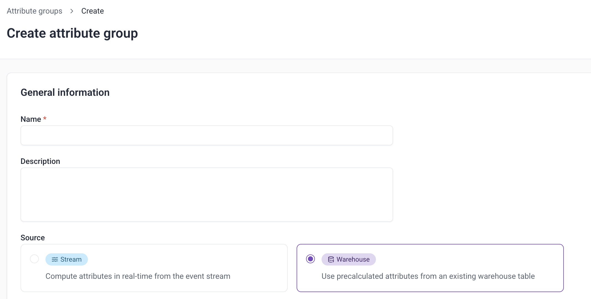
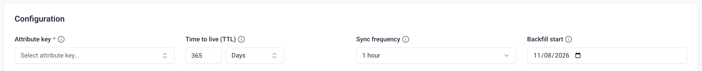
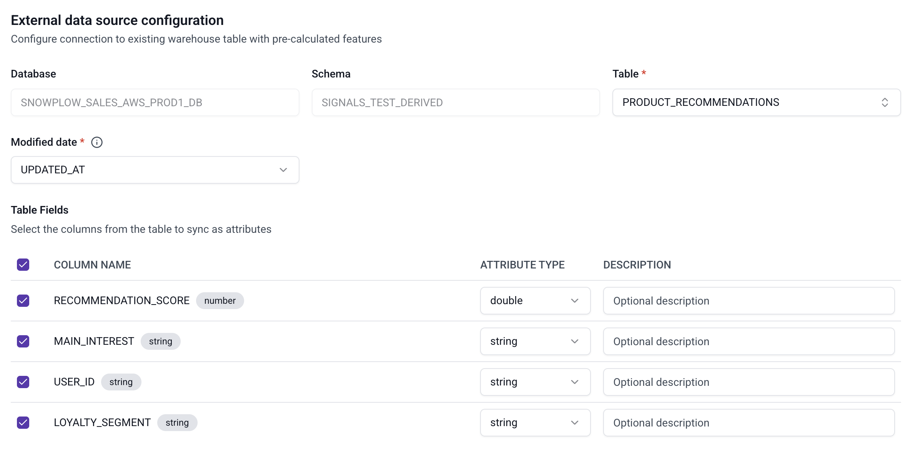

```mdx-code-block
import Tabs from '@theme/Tabs';
import TabItem from '@theme/TabItem';
```

To sync existing, pre-calculated attributes from your warehouse to Signals, configure an attribute group with a warehouse source. No additional modeling is required — the batch engine reads rows from your warehouse table at a fixed interval and sends them to the Profiles Store.

:::tip[Use stream attributes with backfill when possible]
If your source data comes from Snowplow events, consider using a stream attribute group with the backfill option enabled instead. It gives you real-time updates from your event stream alongside historical backfill, without needing to maintain a separate warehouse table. Attributes that are fetched from a warehouse are best suited for pre-calculated values from non-Snowplow sources, or tables that already exist independently of your event pipeline.
:::

## Configure a warehouse source

<Tabs groupId="signals-impl" queryString>
<TabItem value="console" label="Console" default>

When creating an attribute group, select **Warehouse** as the data source.



### Provide the basic configuration

Select the **Attribute key** you have data for. The [attribute key](/docs/signals/attributes/attribute-keys/index.md) for the group must correspond to a column in the table that contains the key values.

Set the **TTL** to control how long the data persists in the Profiles Store.

Updates run hourly by default. Use the **Sync frequency** selector to sync less often (6h, 12h, or 24h).

You must also specify a **Backfill start date**: the earliest date from which Signals should read rows on the first sync.



### Define which fields to sync

Select which **Table** to sync from.

Choose the **Modified date** column: the column that tells when a particular row was last written or updated in the table (for example, a `load_tstamp` or `updated_at` column populated by your ETL process on every write). The **Modified date** column must be in UTC. A column in local time causes rows to be silently matched against the wrong sync window, with no error raised. If multiple rows exist for the same attribute key within a sync period, the engine uses the row with the latest **Modified date** value.

:::warning[Use a last-modified timestamp]
Don't use a business or event timestamp that doesn't change when a row is reloaded or updated. The batch engine won't be able to tell the row has changed, and the data may be missed.
:::

Finally, select which **Table fields** you want to send to Signals.



</TabItem>
<TabItem value="sdk" label="Python SDK">

Start by configuring which table to sync by specifying a `BatchSource` object.

```python
from snowplow_signals import BatchSource

data_source = BatchSource(
    name="ecommerce_transaction_interactions_source",
    database="SNOWPLOW_DEV1",
    schema="SIGNALS",
    table="SNOWPLOW_ECOMMERCE_TRANSACTION_INTERACTIONS_FEATURES",
    timestamp_field="UPDATED_AT",
    owner="user@company.com",
)
```

The table below lists all available arguments for a `BatchSource`:

| Argument | Description | Type | Required? |
| --- | --- | --- | --- |
| `name` | The name of the source | `string` | ✅ |
| `description` | A description of the source | `string` | ❌ |
| `database` | The database where the attributes are stored | `string` | ✅ |
| `schema` | The schema for the table of interest | `string` | ✅ |
| `table` | The table where the attributes are stored | `string` | ✅ |
| `timestamp_field` | Primary timestamp of the attribute value, indicating data freshness | `string` | ✅ |
| `owner` | The owner of the source | `string` | ❌ |

The batch engine uses `timestamp_field` as the change-watermark for incremental syncs — it must reflect when a row was actually last written or updated in the table (for example, a `load_tstamp` or `updated_at` column populated by your ETL process on every write), not a business or event timestamp that stays fixed once set. `timestamp_field` must be in UTC. A column in local time causes rows to be silently matched against the wrong sync window, with no error raised.

If multiple rows exist for the same attribute key within a sync period, the engine uses the row with the greatest `timestamp_field` value.

:::warning[Use a last-modified timestamp]
Don't use a business or event timestamp that doesn't change when a row is reloaded or updated. The batch engine won't be able to tell the row has changed, and the data may be missed.
:::

### Define which fields to sync

Use `ExternalBatchAttributeGroup` to define which source table and fields to use. Instead of `attributes`, this class uses `fields` — abstractions over the warehouse columns.

You must set `backfill_since_tstamp` to tell the batch engine the earliest timestamp from which to read rows on the first sync. Without this, no historical data will be loaded.

The attribute key must correspond to a column in the source table. The example below uses the built-in `domain_userid` key, so the table must have a `domain_userid` column. To key on a different column, [define a custom attribute key](/docs/signals/attributes/attribute-keys/index.md#custom-attribute-keys) with `external_column` set to the column name.

```python
from datetime import datetime, timedelta, timezone
from snowplow_signals import ExternalBatchAttributeGroup, domain_userid, Field

attribute_group = ExternalBatchAttributeGroup(
    name="ecommerce_transaction_interactions_attributes",
    version=1,
    attribute_key=domain_userid,
    owner="user@company.com",
    batch_source=data_source,
    backfill_since_tstamp=datetime(2026, 6, 1, tzinfo=timezone.utc),
    refresh_rate=timedelta(hours=6),
    fields=[
        Field(name="TOTAL_TRANSACTIONS", type="int32"),
        Field(name="TOTAL_REVENUE", type="int32"),
        Field(name="AVG_TRANSACTION_REVENUE", type="int32"),
    ],
)
```

The table below lists all available arguments for `ExternalBatchAttributeGroup`:

| Argument | Description | Type | Required? |
| --- | --- | --- | --- |
| `name` | The name of the attribute group | `string` | ✅ |
| `version` | The version of the attribute group | `int` | ✅ |
| `attribute_key` | The key used to identify profiles. Its name must match a column in the source table | `AttributeKey` | ✅ |
| `batch_source` | The `BatchSource` defining the warehouse table to sync from | `BatchSource` | ✅ |
| `backfill_since_tstamp` | The earliest timestamp from which to read rows on the first sync. Accepts tz-aware or naive UTC `datetime`; tz-aware is recommended. | `datetime` | ✅ |
| `refresh_rate` | How frequently the attribute group should be synced (e.g. `timedelta(hours=1)`, `timedelta(hours=6)`, `timedelta(days=1)`). Defaults to hourly. | `timedelta` | ❌ |
| `fields` | The list of `Field` objects defining which columns to sync | `list` | ✅ |
| `description` | A description of the attribute group | `string` | ❌ |
| `owner` | The owner of the attribute group | `string` | ❌ |

The table below lists all available arguments for a `Field`:

| Argument | Description | Type | Required? |
| --- | --- | --- | --- |
| `name` | The name of the field | `string` | ✅ |
| `description` | A description of the field | `string` | ❌ |
| `type` | The type of the field | one of: `bytes`, `string`, `int32`, `int64`, `double`, `float`, `bool`, `unix_timestamp`, `bytes_list`, `string_list`, `int32_list`, `int64_list`, `double_list`, `float_list`, `bool_list`, `unix_timestamp_list` | ✅ |

</TabItem>
</Tabs>
