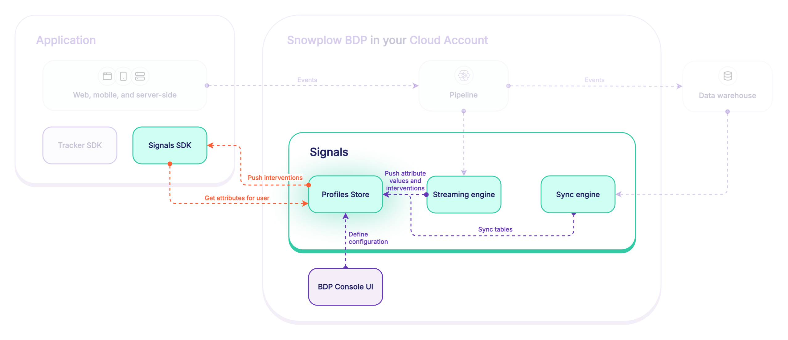
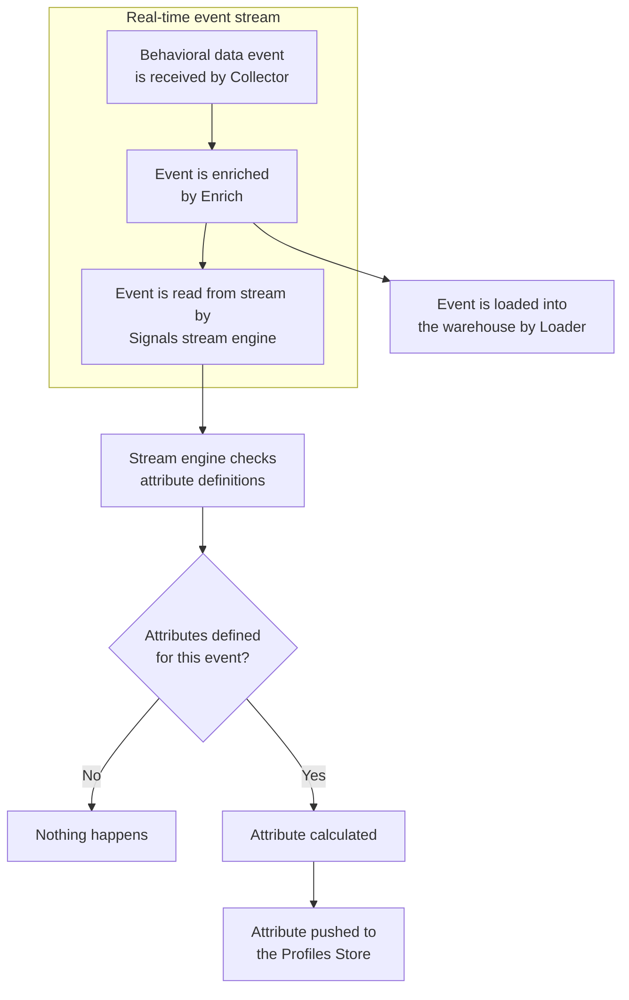
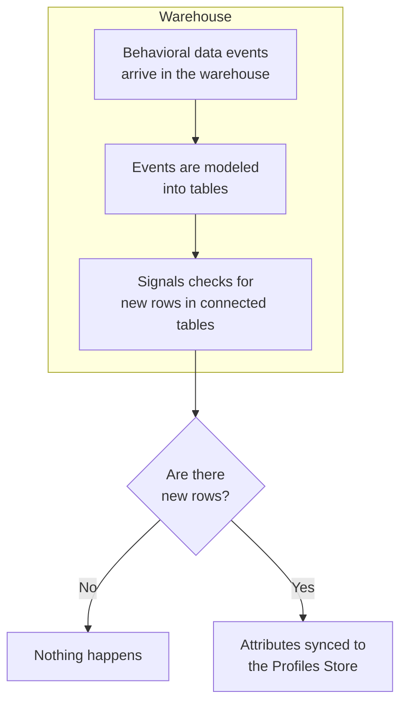
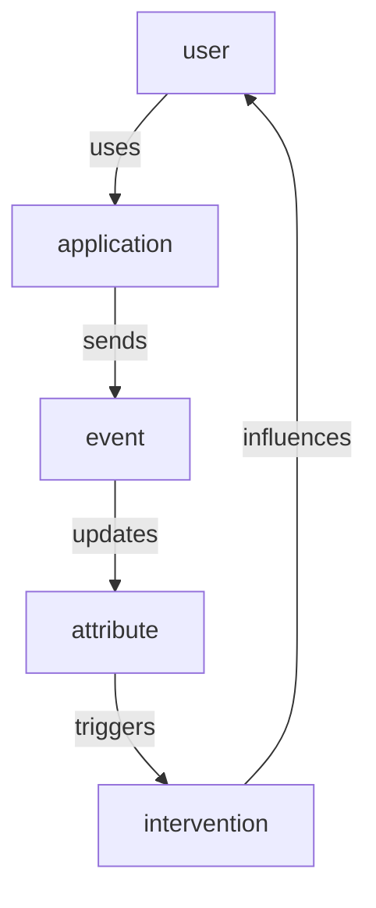
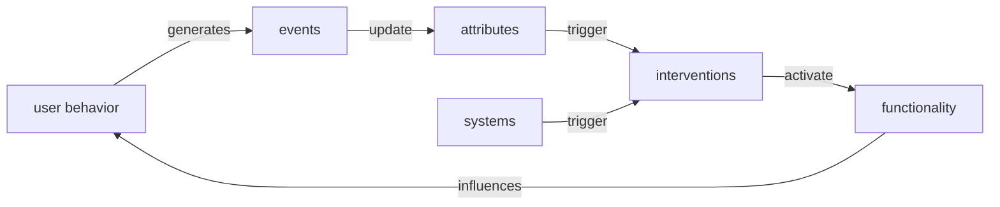

Signals introduces a new set of data governance concepts to Snowplow. As with schemas for Snowplow event data, Signals components are strictly defined, structured, and versioned.

Signals has three main configurable components:
* **Attribute groups**, for defining and calculating attributes
* **Services**, for consuming calculated attributes in your applications
* **Interventions**, for consuming calculated attributes and triggering actions in your applications

**Attribute groups** are where you define the behavioral data you want to calculate. Each attribute group contains multiple **attributes** - the specific facts about user behavior you want to measure or take action on - along with the configuration that defines how to calculate them, and from what data. Attributes can only be defined within attribute groups; they are effectively properties of the attribute group.

To use attributes to trigger actions such as in-app messages, discounts, or personalized journeys, use services or interventions.

**Services** provide a stable interface layer between your calculated attributes and your applications. Each service can contain multiple attribute groups, pinned to specific versions. You'd build the logic within your application for how to use the retrieved attributes. **Interventions** are a separate abstraction for defining when to trigger actions in your application.

## Attribute groups

Attribute groups are where you define the data you want to calculate. Each attribute group is a versioned collection that specifies:
* The **attributes** to calculate - the specific behavioral facts about users
* The **data source** - whether to calculate from the real-time stream, or in batch from the warehouse
* The **attribute key** that provides the analytical context
* Other metadata such as description or owner

### Types of attribute

Attributes describe what kind of calculation to perform, and what event data to evaluate. They can only exist within attribute groups.

Attributes can be categorized into four main types, depending on the type of user behavior you want to understand:

| Type          | Description                                            | Example                              |
| ------------- | ------------------------------------------------------ | ------------------------------------ |
| Time windowed | Actions that happened within the last X period of time | `products_added_to_cart_last_10_min` |
| Lifetime      | Calculated over all the available data                 | `total_product_price_clv`            |
| First touch   | The first event or property that happened              | `first_mkt_source`                   |
| Last touch    | The most recent event or property that happened        | `last_device_class`                  |

Signals includes a range of different aggregations for calculating attributes, including `mean`, `counter`, or `unique_list`. See the full list in the [attribute configuration](/docs/signals/define-attributes/attributes/index.md) page.

### Attribute keys

An attribute key is an identifier that provides the analytical context for all attribute calculations within a group. The identifier can be any atomic field of a Snowplow event, such as `domain_userid`.

To demonstrate the necessity of attribute keys, consider the attribute `num_views_in_last_10_min`. It represents a count of page view events, with a 10 minute time limit. This table lists some possible meanings of the attribute, based on the attribute key configured for its attribute group:

| Attribute                  | Attribute key      | Description                                                                         |
| -------------------------- | ------------------ | ----------------------------------------------------------------------------------- |
| `num_views_in_last_10_min` | User               | How many pages a user has viewed within the last 10 minutes                         |
| `num_views_in_last_10_min` | Page               | How many page views a page has received within the last 10 minutes                  |
| `num_views_in_last_10_min` | Product            | How many times a product has been viewed within the last 10 minutes                 |
| `num_views_in_last_10_min` | App                | How many page views occurred within an app in the last 10 minutes                   |
| `num_views_in_last_10_min` | Device             | How many page views came from a specific device in the last 10 minutes              |
| `num_views_in_last_10_min` | Marketing campaign | How many page views were generated by a campaign in the last 10 minutes             |
| `num_views_in_last_10_min` | Geographic region  | How many page views came from users in one region within the last 10 minutes        |
| `num_views_in_last_10_min` | Customer segment   | How many page views were generated by users in a segment within the last 10 minutes |

Each of these is likely to have a different calculated value.

You can [define your own attribute keys](/docs/signals/define-attributes/attribute-groups/index.md#creating-a-custom-attribute-key), or use the built-in ones. Signals comes with predefined attribute keys for user, device, and session. Their identifiers are from the out-of-the-box atomic [user-related fields](/docs/fundamentals/canonical-event/index.md#user-related-fields) in all Snowplow events.

| Attribute key      | Type     |
| ------------------ | -------- |
| `user_id`          | `string` |
| `domain_userid`    | `uuid`   |
| `network_userid`   | `uuid`   |
| `domain_sessionid` | `uuid`   |

## Data sources

Whether to compute attributes in real-time from the event stream or in batch from the warehouse is an important decision. Broadly, you might use:
* **Stream** for real-time use cases, such as tracking the latest product a user viewed, or the number of page views in a session
* **Batch** sources (warehouse tables) for historical analysis, such as calculating a user's purchase history or average session length

This table summarizes the options for different types of processing:

| Feature                            | Supported in real-time stream                                                 | Supported in batch            |
| ---------------------------------- | ----------------------------------------------------------------------------- | ----------------------------- |
| Real-time calculation              | ✅                                                                             | ❌                             |
| Computing user lifetime attributes | ✅ from the point at which the attribute was defined                           | ✅                             |
| Time windowing operations          | ✅ but only the last 100 values might be included, depending on the definition | ✅                             |
| Reprocessing data                  | ❌ attributes are only calculated from the moment they are defined             | ✅                             |
| Non-Snowplow data                  | ❌                                                                             | ✅ using external batch source |  |

### Stream source

When Signals is deployed in your Snowplow BDP pipeline, the event stream is read by the streaming engine. All tracked events are inspected. If you've configured Signals to calculate an attribute from a certain type of event, when that event type is received, the engine will compute the attribute data and forward it to the Profiles Store, in real time. If that event type isn't registered as containing attribute data, nothing happens.

Real-time stream flow:

### Batch source

The batch data source uses dbt to generate and calculate new tables of attributes from your
 Snowplow atomic events table. Signals then syncs them to the Profiles Store periodically using the sync engine.

### External batch source

Use an external batch source to sync tables of existing, pre-calculated values to the Profiles Store. The external batch tables can be any data. For example, you may want to include transactional data in your Signals use case.

## Services

Services are where you define how to use the calculated attributes in your applications.

Rather than connecting applications directly to attribute groups, services allow you to consume specific attribute group versions. This provides a consistent set of consumable attributes. We strongly recommend using services in production applications.

By using services you can:
* Iterate on attribute definitions without worrying about breaking downstream processes
* Migrate to new attribute group versions by updating the service definition, without having to update the application code

Here's a service that combines the stream attribute group from before with an additional batch attribute group:

<!-- TODO image service -->

In this example, both attribute groups have the same attribute key.

This service could be imagined like this as a table:

| `user_id`            | `number_of_pageviews` | `last_product_viewed` | `previous_purchases`       | `previous_returns` |
| -------------------- | --------------------- | --------------------- | -------------------------- | ------------------ |
| `abc123@example.com` | 5                     | `"Red Shoes"`         | `[Blue Shoes", "Red Hat"]` | `["Red Hat"]`      |
| `def456@example.com` | 10                    | `"Yellow Hat"`        | `[]`                       | `[]`               |

## Interventions

Interventions are opportunities to take actions to improve user outcomes. They're calculated on top of changes in attribute values, or fired by your own applications.

This allows you to influence user behavior without requiring application updates, since you can control when the intervention should fire through Signals.

Like attributes, interventions target specific attribute key instances.

Interventions can be triggered automatically based on attribute changes, or directly using the Signals API.
Subscribe [within your application](/docs/signals/retrieve-interventions/index.md) for real-time updates to interventions for attribute keys of interest, or [user devices can subscribe](/docs/signals/retrieve-interventions/index.md) to interventions that apply to their own attribute keys while they use your application.

For example, you could subscribe to interventions for a specific `domain_userid`, the current `app_id`, the current `page`, and the current `product`.
When new interventions are published for any of those, they are delivered and the contents include any relevant attribute values, that can be used by your application to react.
This enables both individual-level and broadcast-level real-time messaging: for example, offering a specific user a personalized message, while also notifying all users on a specific product page that limited stock is selling fast.

TODO
Interventions are a way to communicate that an action should be performed to work towards better outcomes for particular users.

Each intervention is usually only valid "in the moment", so they have a limited lifetime and are not repeatedly sent if consumers aren't requesting them.
This pairs well with the Signals streaming engine, which:
- Processes data in near-real-time for users that are using your offering right now
- Can publish interventions at an individual attribute key level in real time based on changes to its attributes

Your application decides how to react to a delivered intervention.

Because [attribute keys are configurable](/docs/signals/define-attributes/attribute-groups/index.md), the targeting used for interventions can be as broad or specific as you like, including:
- A specific user/session
- A specific pageview that a user is in the middle of
- All users on a specific page
- All users currently on your site/app

## Profiles Store

The Profiles Store is a database where Signals saves all your calculated attribute values. When Signals calculates attributes from your events or warehouse data, or syncs pre-calculated data, it stores them here organized by attribute group. Your applications retrieve these stored values using the Signals SDKs or API.

The Profiles Store keeps track of current attribute values, and automatically removes old data based on the TTL settings you configure for each attribute group. It acts as the central source of truth for your Signals deployment.
