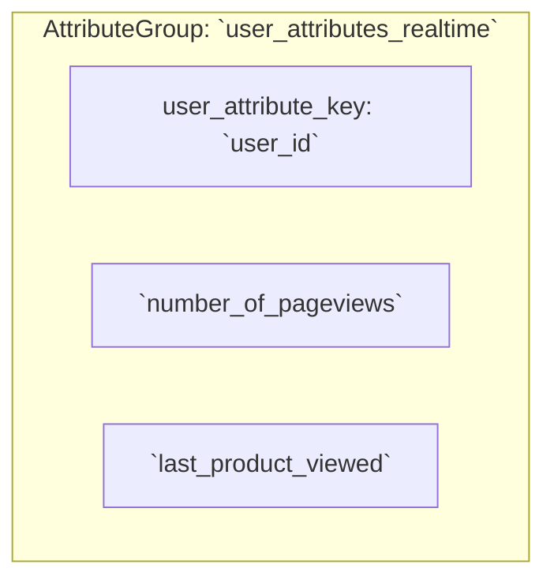
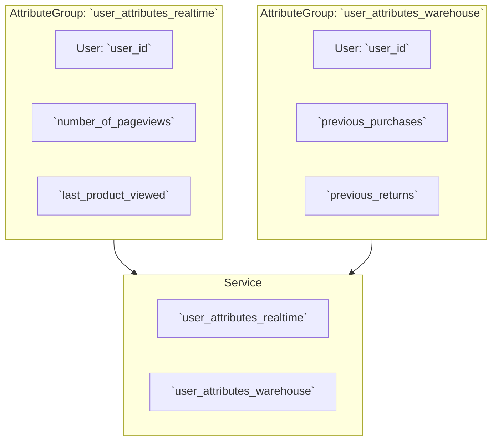
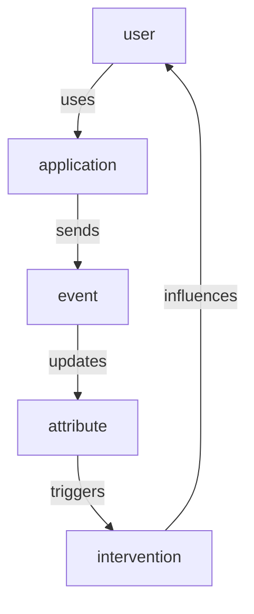

Signals introduces a new set of data governance concepts to Snowplow. As with schemas for Snowplow event data, Signals components are strictly defined, structured, and versioned.

Signals has two main configuration components:
* **Attribute groups**, for defining and calculating attributes from behavioral data
* **Services**, for consuming calculated attributes in your applications

**Attribute groups** are where you define the behavioral data you want to calculate. Each attribute group contains multiple **attributes** - the specific facts about user behavior you want to measure - along with the configuration that defines how to calculate them, and from what data. Attributes can only be defined within attribute groups: they are effectively properties of the attribute group.

Apply the attribute group configuration to Signals, so that it can start calculating attributes and populating your Profiles Store. You'll need additional configuration if you're using batch processing.

Next, choose which attributes from which attribute groups you want to consume in your applications. Group them into services, and apply the configuration to Signals.

Finally, retrieve calculated attributes in your application, and use them to trigger actions.

## Attribute groups

Attribute groups are where you define the behavioral data you want to calculate. Each attribute group is a versioned collection that specifies:
* The **attributes** to calculate - the specific behavioral facts about users
* The **attribute key** that provides the analytical context
* The **data source** - whether to calculate from the real-time stream, or in batch from the warehouse
* Processing and versioning configuration

Attributes can only be defined within attribute groups. They describe what kind of calculation to perform and what event data to evaluate.

### Attribute types

Within attribute groups, you can define four main types of attributes, depending on the type of user behavior you want to understand:

| Type          | Description                                            | Example                              |
| ------------- | ------------------------------------------------------ | ------------------------------------ |
| Time windowed | Actions that happened within the last X period of time | `products_added_to_cart_last_10_min` |
| Lifetime      | Calculated over all the available data                 | `total_product_price_clv`            |
| First touch   | The first event or property that happened              | `first_mkt_source`                   |
| Last touch    | The most recent event or property that happened        | `last_device_class`                  |

### Data sources and updates

Attribute values within groups can be updated in multiple ways, depending how the attribute group is configured:
* Events in real time (stream source only)
* Data in warehouse (batch source only)
* Interventions

Real-time attribute calculation uses the Snowplow event stream, and therefore ingests only Snowplow events. For historical warehouse attributes, you can import values from any table—whether created by Signals or not, even whether derived from Snowplow data or not.

Calculated attribute values are stored in the Profiles Store.

### Example attribute group configuration

Here's an example configuration for an attribute group based on a user attribute key, with a stream (default) source:

When this attribute group configuration is applied to Signals, the attributes will be calculated and stored in the Profiles Store. On retrieval, this attribute group might look something like this as a table:

| `user_id`            | `number_of_pageviews` | `last_product_viewed` |
| -------------------- | --------------------- | --------------------- |
| `abc123@example.com` | 5                     | `"Red Shoes"`         |
| `def456@example.com` | 10                    | `"Blue Hat"`          |

## Attribute keys

An attribute key is an identifier that provides the analytical context for all attribute calculations within an attribute group. The identifier can be any field of a Snowplow event, such as `domain_userid`.

To demonstrate the necessity of attribute keys, consider the attribute `num_views_in_last_10_min` defined within different attribute groups. This table lists some possible meanings of the attribute, based on the attribute key configured for its attribute group:

| Attribute                  | Attribute key      | Description                                                                         |
| -------------------------- | ------------------ | ----------------------------------------------------------------------------------- |
| `num_views_in_last_10_min` | User               | How many pages a user has viewed within the last 10 minutes                         |
| `num_views_in_last_10_min` | Page               | How many page views a page has received within the last 10 minutes                  |
| `num_views_in_last_10_min` | Product            | How many times a product has been viewed within the last 10 minutes                 |
| `num_views_in_last_10_min` | App                | How many page views occurred within an app in the last 10 minutes                   |
| `num_views_in_last_10_min` | Device             | How many page views came from a specific device in the last 10 minutes              |
| `num_views_in_last_10_min` | Marketing campaign | How many page views were generated by a campaign in the last 10 minutes             |
| `num_views_in_last_10_min` | Geographic region  | How many page views came from users in a region within the last 10 minutes          |
| `num_views_in_last_10_min` | Customer segment   | How many page views were generated by users in a segment within the last 10 minutes |

Each of these is likely to have a different calculated value.

You can define your own attribute keys, or use the built-in ones. Signals comes with predefined attribute keys for user, device, and session. Their identifiers are from the out-of-the-box atomic [user-related fields](/docs/fundamentals/canonical-event/index.md#user-related-fields) in all Snowplow events.

This table lists the built-in attribute keys, and suggests others that could be useful:

| Attribute key     | Identifier                                                                                                                 | Built-in |
| ----------------- | -------------------------------------------------------------------------------------------------------------------------- | -------- |
| User              | `user_id` from [atomic fields](/docs/fundamentals/canonical-event/index.md#user-related-fields)                            | ✅        |
| Device            | `domain_userid` and `network_userid` from [atomic fields](/docs/fundamentals/canonical-event/index.md#user-related-fields) | ✅        |
| Session           | `domain_sessionid` from [atomic fields](/docs/fundamentals/canonical-event/index.md#user-related-fields)                   | ✅        |
| App               | `app_id` from [atomic fields](/docs/fundamentals/canonical-event/index.md#application-fields)                              |          |
| Page              | `page_urlpath` from [atomic fields](/docs/fundamentals/canonical-event/index.md#platform-specific-fields)                  |          |
| Product           | `id` from [ecommerce product](/docs/events/ootb-data/ecommerce-events/index.md#product) or custom entity                   |          |
| Screen view       | `id` in `screen_view` entity                                                                                               |          |
| Geographic region | `geo_country` from [IP Enrichment](/docs/pipeline/enrichments/available-enrichments/ip-lookup-enrichment/index.md)         |          |
| Content category  | from custom entity                                                                                                         |          |
| Video game level  | from custom entity                                                                                                         |          |

## Services

Services are where you define how to use the calculated attributes in your applications.

Each service can contain multiple entire attribute groups, or individual attributes from different attribute groups, even if they have different attribute keys or different sources.
They provide a stable interface to use in your applications: by pinning specific attribute group versions, they provide a consistent set of consumable attributes.

By using services you can:
* Iterate on attribute definitions without worrying about breaking downstream processes
* Migrate to new attribute group versions by updating the service definition, without having to update the application code

Here's a service that combines the stream attribute group from before with an additional batch attribute group:

In this example, both attribute groups have the same attribute key, and all attributes from both attribute groups are included in the service.

This service could be imagined like this as a table:

| `user_id`            | `number_of_pageviews` | `last_product_viewed` | `previous_purchases`       | `previous_returns` |
| -------------------- | --------------------- | --------------------- | -------------------------- | ------------------ |
| `abc123@example.com` | 5                     | `"Red Shoes"`         | `[Blue Shoes", "Red Hat"]` | `["Red Hat"]`      |
| `def456@example.com` | 10                    | `"Yellow Hat"`        | `[]`                       | `[]`               |

## Interventions

Interventions are a way to trigger actions in your application, such as in-app messages, discounts, or personalized journeys.
They're calculated on top of changes in attribute values, or fired by your own applications.

This allows you to influence user behavior without requiring application updates, since you can control when the intervention should fire through Signals.

Like attributes, interventions target specific attribute key instances.

Interventions can be triggered automatically [based on attribute changes](/docs/signals/configuration/interventions/index.md), or manually [using the Signals API](/docs/signals/interventions/index.md#custom-intervention-via-the-api).
Subscribe [within your application](/docs/signals/interventions/index.md#retrieving-interventions-with-the-signals-sdk) for real-time updates to interventions for attribute keys of interest, or [user devices can subscribe](/docs/signals/interventions/index.md#retrieving-interventions-on-the-web-with-the-browser-tracker-plugin) to interventions that apply to their own attribute keys while they use your application.

For example, you could subscribe to interventions for a specific `domain_userid`, the current `app_id`, the current `page`, and the current `product`.
When new interventions are published for any of those, they are delivered and the contents include any relevant attribute values, that can be used by your application to react.
This enables both individual-level and broadcast-level real-time messaging: for example, offering a specific user a personalized message, while also notifying all users on a specific product page that limited stock is selling fast.
