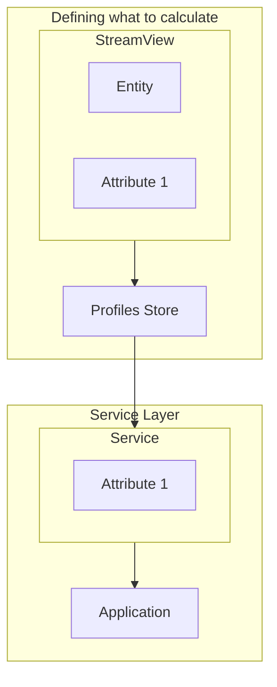
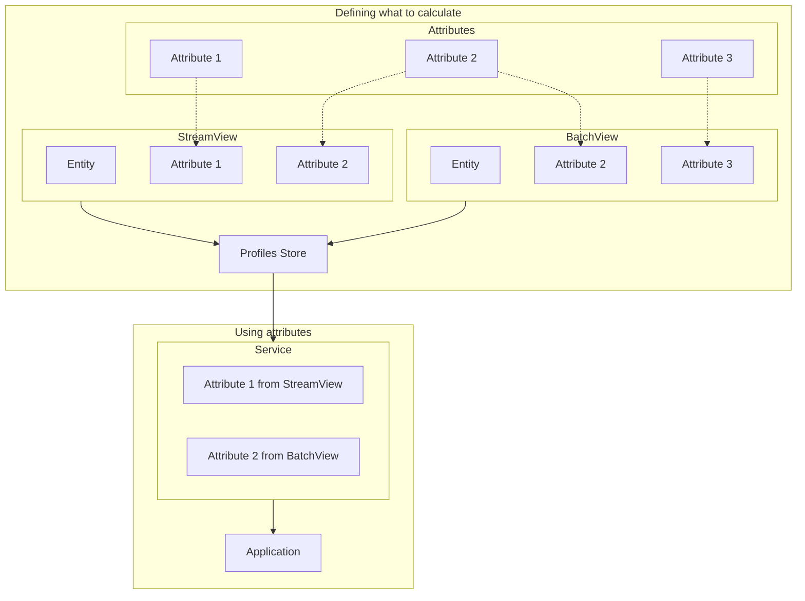
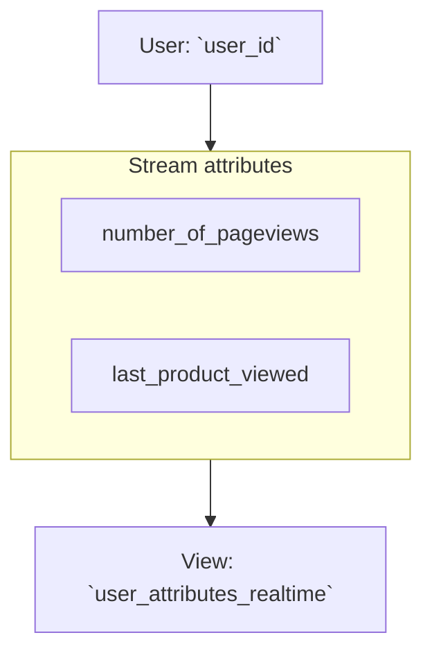
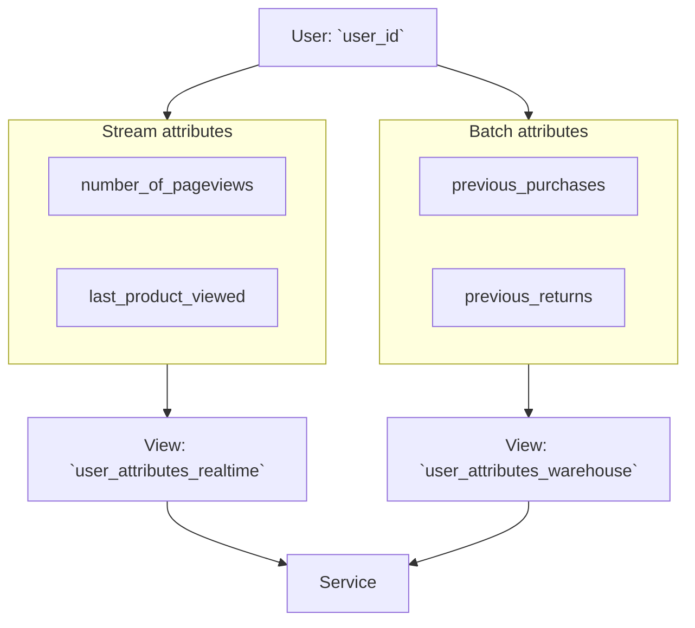
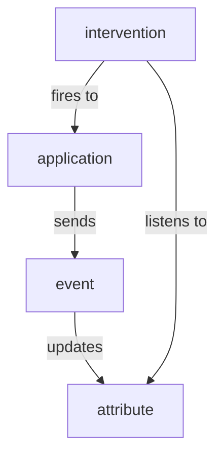

Signals introduces a new set of data governance concepts to Snowplow. As with schemas for Snowplow event data, Signals components are strictly defined, structured, and versioned.

## Overview

**Attributes** define what event data to evaluate, and what kind of calculation to perform. They don't include any configuration for real-time or batch processing, versioning, or calculation context. To add that important metadata, you'll need to create attribute groups.

Signals has two attribute groupings:
* **Views**, for defining attributes
* **Services**, for consuming attributes

Start by creating views. At this point, you'll define:
* The data source - whether to calculate the attributes from the real-time stream, or from the warehouse
* What **entity** to calculate the attributes for
* The version number of the view

Apply the view configuration to Signals, so that it can start calculating attributes and populating your **Profiles Store**. You'll need additional configuration if you're using batch processing.

Next, choose which attributes from which views you want to consume in your applications. Group them into services, and apply the configuration to Signals.

Finally, retrieve calculated attributes in your application, and use them to trigger actions.

### Example diagrams

This diagram shows a very simple example configuration.

A single attribute has been defined and is being calculated.

The next diagram shows a more complex example configuration. Things to note:
* Views can have multiple attributes, but only one entity
* Attributes can be reused across views
* All calculated attributes are stored in the Profiles Store
* Services can selectively retrieve attribute values from different views

## Attributes

An attribute defines a specific fact about user behavior.

There are four main types of attribute:

| Type          | Description                                            | Example                              |
| ------------- | ------------------------------------------------------ | ------------------------------------ |
| Time windowed | Actions that happened within the last X number of days | `products_added_to_cart_last_7_days` |
| Lifetime      | Calculated over all the available data                 | `total_product_price_clv`            |
| First touch   | The first event or property that happened              | `first_mkt_source`                   |
| Last touch    | The most recent event or property that happened        | `last_device_class`                  |

Attribute values can be updated in multiple ways, depending how they're configured:
* Events in real time (stream source only)
* Data in warehouse (batch source only)
* Interventions

Real-time attribute calculation uses the Snowplow event stream, and therefore ingests only Snowplow events. For historical warehouse attributes, you can import values from any table—whether created by Signals or not, even whether derived from Snowplow data or not.

Calculated attribute values are stored in the Profiles Store.

## Entities

An entity is an identifier that provides the analytical context for attribute calculations. The identifier can be any field of a Snowplow event, such as `domain_userid`.

To demonstrate the necessity of entities, consider the attribute `num_views_in_last_7_days`. This table lists the possible meanings of the attribute, based on the entity it's calculated against:

| Attribute                  | Entity             | Description                                                                   |
| -------------------------- | ------------------ | ----------------------------------------------------------------------------- |
| `num_views_in_last_7_days` | User               | How many pages a user has viewed within the past week                         |
| `num_views_in_last_7_days` | Page               | How many page views a page has received within the past week                  |
| `num_views_in_last_7_days` | Product            | How many times a product has been viewed within the past week                 |
| `num_views_in_last_7_days` | App                | How many page views occurred within an app in the past week                   |
| `num_views_in_last_7_days` | Device             | How many page views came from a specific device in the past week              |
| `num_views_in_last_7_days` | Session            | How many page views occurred within an individual session in the past week    |
| `num_views_in_last_7_days` | Marketing campaign | How many page views were generated by a campaign in the past week             |
| `num_views_in_last_7_days` | Content category   | How many page views occurred for content in a category within the past week   |
| `num_views_in_last_7_days` | Geographic region  | How many page views came from users in a region within the past week          |
| `num_views_in_last_7_days` | Customer segment   | How many page views were generated by users in a segment within the past week |

Each of these is likely to have a different calculated value.

You can define your own entities, or use the built-in ones. Signals comes with predefined entities for user, device, and session. These are defined based on the out-of-the-box atomic [user-related fields](/docs/fundamentals/canonical-event/index.md#user-related-fields) in all Snowplow events.

This table lists the built-in entities, and gives suggestions for others that could be useful:

| Entity            | Possible identifier                                                                                                        | Built-in |
| ----------------- | -------------------------------------------------------------------------------------------------------------------------- | -------- |
| User              | `user_id` from [atomic fields](/docs/fundamentals/canonical-event/index.md#user-related-fields)                            | ✅        |
| Device            | `domain_userid` and `network_userid` from [atomic fields](/docs/fundamentals/canonical-event/index.md#user-related-fields) | ✅        |
| Session           | `domain_sessionid` from [atomic fields](/docs/fundamentals/canonical-event/index.md#user-related-fields)                   | ✅        |
| App               | `app_id` from [atomic fields](/docs/fundamentals/canonical-event/index.md#application-fields)                              |          |
| Page              | `page_urlpath` from [atomic fields](/docs/fundamentals/canonical-event/index.md#platform-specific-fields)                  |          |
| Product           | `id` from [ecommerce product](/docs/events/ootb-data/ecommerce-events/index.md#product) or custom entity                   |          |
| Screen view       | `id` in `screen_view` entity                                                                                               |          |
| Geographic region | `geo_country` from [IP Enrichment](/docs/pipeline/enrichments/available-enrichments/ip-lookup-enrichment/index.md)         |          |
| Content category  | from custom entity                                                                                                         |          |
| Video game level  | from custom entity                                                                                                         |          |

---
TODO tidy this up

## Attributes can be grouped for ease of management

### Views group attributes

Configure attributes by grouping them into views. Each view is associated with a specific entity, source, version, and owner. It also has other optional metadata.

Choose the source which fits your use case. For example, the attribute `last_product_viewed` is best calculated from events in-stream during a session, while `num_views_in_last_7_days` is best calculated from historical events.

An example configuration for a view based on a user entity:

This view could be imagined like this as a table once the attributes are calculated:

| `user_id` | `number_of_pageviews` | `last_product_viewed` |
| --------- | --------------------- | --------------------- |
| `abc123`  | 5                     | `"Red Shoes"`         |
| `def456`  | 10                    | `"Blue Hat"`          |

You can use views individually in your application to retrieve attributes, or combine them into services.

### Services group views

Services allow you to retrieve attributes in bulk from multiple views. One service can combine views with different sources, as long as they share the same entity.

Because each view is pinned to a specific version, a defined service is also effectively versioned, ensuring that the returned values are consistent with what you expect.

Here's the same example as before, with an additional batch view:

This service could be imagined like this as a table:

| `user_id` | `number_of_pageviews` | `last_product_viewed` | `previous_purchases`       | `previous_returns` |
| --------- | --------------------- | --------------------- | -------------------------- | ------------------ |
| `abc123`  | 5                     | `"Red Shoes"`         | `[Blue Shoes", "Red Hat"]` | `["Red Hat"]`      |
| `def456`  | 10                    | `"Yellow Hat"`        | `[]`                       | `[]`               |

Retrieve calculated attributes in your application using one of the Signals SDKs, or manually using the Signals API.

## Interventions trigger actions

Interventions are a way to trigger actions in your application, such as in-app messages, discounts, or personalized journeys. They're calculated on top of changes in attribute values.

They allow you to define logic within Signals rather than in your application. This allows you to update the behavior without requiring application updates, as well as streamlining management, development, and ownership.

Like attributes, interventions are specific to an entity.

Interventions can be triggered automatically based on attribute changes, or manually using the Signals API. Subscribe within your application for real-time updates to interventions for entities of interest.

For example, you could subscribe to interventions for `domain_userid`, the current `app_id`, the current `page`, and the current `product`. When new interventions are published for any of those, the retrieved contents includes any relevant attribute values, or custom data that you defined. This enables both individual-level and broadcast-level real-time messaging: for example, offering a specific user a personalized message, while also notifying all users on a specific product page that limited stock is selling fast.

Interventions can also perform built-in automatic operations, including updating attribute values.

## Attributes can be set to expire

Some attributes will only be relevant for a certain amount of time, and eventually stop being updated.

To avoid stale attributes staying in your Profiles Store forever, you can configure TTL lifetimes for entities and views. When none of the attributes for an entity or view have been updated for the defined lifespan, the entity or view expires. Any attribute values for this entity or view will be deleted: fetching them will return `None` values.

If Signals then processes a new event that calculates the attribute again, or materializes the attribute from the warehouse again, the expiration timer is reset.
