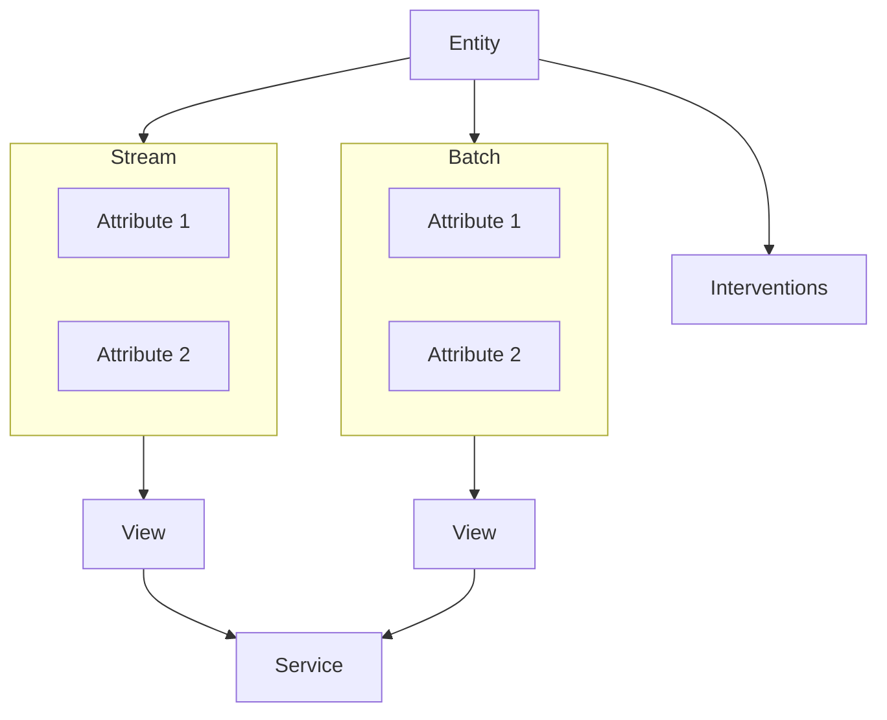

Signals introduces a new set of data governance concepts to Snowplow. As with schemas for Snowplow event data, Signals components are strictly defined, structured, and versioned.

The fundamental Signals building block is the `Entity`. Attributes and interventions are all defined relative to entities. Attributes can be grouped together into Views or Services for ease of management and deployment.

## Entities

The foundation of Signals are entities (distinct from [Snowplow entities](/docs/fundamentals/entities/index.md), but they can be related).

An <dfn>entity</dfn> is the core unit that all the other Signals features relate to, and can be anything with an "identifier" that you can capture in a Snowplow event.

For example, the simplest entities to think about (and which come predefined when you start with Signals) are concepts like "users", "devices", or "sessions"; these would be entities that you describe in events with the out-of-the-box [user-related fields](/docs/fundamentals/canonical-event/index.md#user-related-fields) like `user_id`, `domain_userid`/`network_userid`, or `domain_sessionid` (respectively).

You can define any entities you like, and expand this to broader concepts. For example:
- Apps (perhaps described by [`app_id`](/docs/fundamentals/canonical-event/index.md#application-fields))
- Pages (perhaps [`page_urlpath`](/docs/fundamentals/canonical-event/index.md#platform-specific-fields) or a page identifier captured in a custom entity)
- Products (that you might capture in an [ecommerce entity](/docs/events/ootb-data/ecommerce-events/index.md#product) or other custom entity)
- Page/Screen views (as captured in the `web_page` and `screen_view` entities)
- Content categories
- Levels in a game

Defining an entity and how to identify it unlocks other features so you can do things like compute [attributes](#attributes) for it, or publish [interventions](#interventions) to it.

## Attributes

After defining an entity, you can start to calculate attributes for it.

An <dfn>attribute</dfn> represents a specific fact about behavior with an entity and gets defined as part of a [view](#views).

For example: (attributes for an entity in **bold**)
- _Number of **page** views in the last 7 days:_ counts how many pages a page has received within the past week.
- _Number of pages viewed by a **user** in the last 7 days:_ counts how many pages a user has viewed within the past week.
- _Last product viewed by a **user**:_ identifies the most recent product a user interacted with.
- _Last product sold from **product category**:_ identifies the most recent product any user has bought within a product category.
- _Previous purchases by **user**:_ provides a record of the user's past transactions.

All attributes get defined as part of a [view](#views), which ties them to a specific entity and source, defining how their values get updated.

You can also set them manually via the APIs, or dynamically via interventions.

Read more [about attributes](/docs/signals/configuration/attributes/index.md).

### Views

A <dfn>View</dfn> is a versioned collection of attributes associated with a specific entity that are populated from the same source.

You can picture the result of a View as a table of attributes for an entity instance.

For example, from the [previous example attributes](#attributes) for a user-entity keyed by `user_id`:

| `user_id` | `number_of_pageviews` | `last_product_viewed` | `previous_purchases`      |
| --------- | --------------------- | --------------------- | ------------------------- |
| `abc123`  | 5                     | Red Shoes             | [`Blue Shoes`, `Red Hat`] |

The attributes of a view can be set to expire for instances if they aren't updated after a certain period of time.

Each view can be associated with metadata such as an owner, description, and tags.

When you're happy with a version of a View definition, you can associate it with a service to be consistently requested via the API for personalization.

### Services

A <dfn>Service</dfn> is a collection of [views](#views) that are grouped to make the retrieval of attributes simpler.

They allow you to retrieve attributes in bulk from multiple views, that are each pinned to specific versions so you can ensure the returned values are consistent with what you expect.
This allows you to freely iterate on your view/attribute definitions without impacting production applications that rely on your attributes, and letting you migrate to new versions when ready.

## Interventions

Once an entity is defined in Signals you can start to retrieve interventions for it, and start publishing to them.

An <dfn>intervention</dfn> describes an action that can be performed for a user to achieve a more successful result.

User devices and your own systems can request interventions for a list of specific entities, which are then delivered in real-time as they are published.
You can publish interventions manually using the API, or define them to trigger automatically when [attributes](#attributes) get updated and meet specific criteria.
There are built-in operations that interventions can perform or that can be handled by Signals SDKs, but the contents of an intervention can contain custom data to use however you need to, and can include current attribute values for dynamic, personalized, actions using the latest real-time data.

For example, a user can subscribe to interventions for their own `domain_userid`, the current `app_id`, the current `page`, and the current `product`, and any interventions published targeting any of those entities get received.
This enables both individual-level and broadcast-level messaging, so you can offer a specific user a personalized message, while also notifying all users on a specific product page that limited stock is selling fast.

<!-- TODO: Read more about interventions -->
