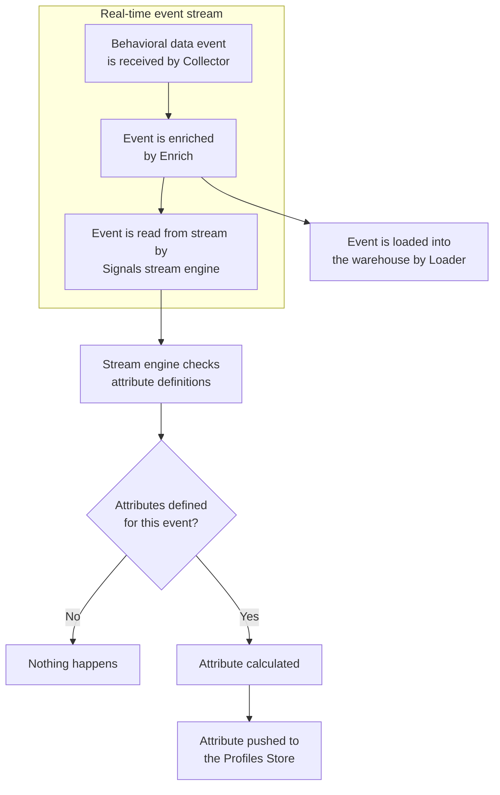
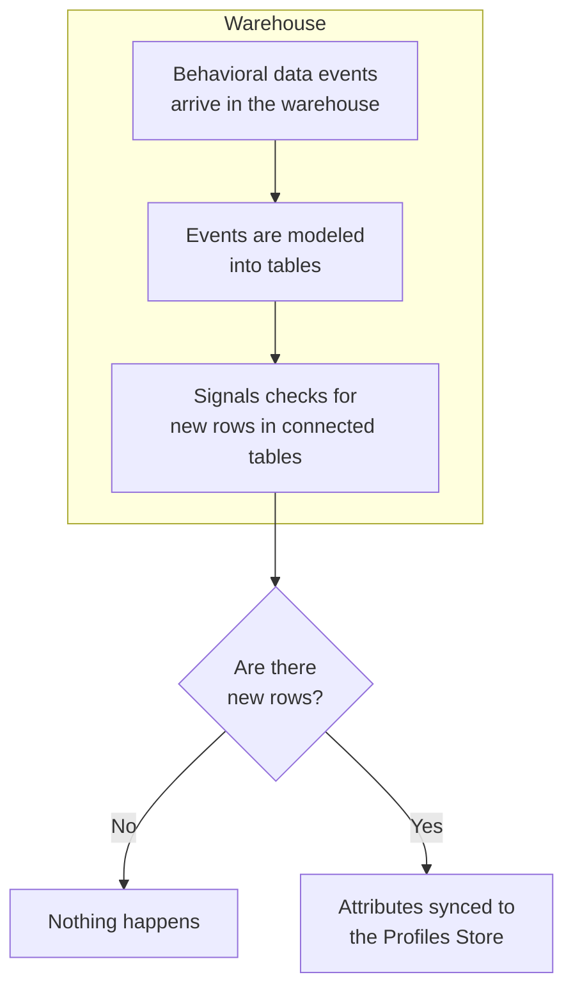

Signals introduces a new set of data governance concepts to Snowplow. As with schemas for Snowplow event data, Signals components are strictly defined, structured, and versioned.

Signals has three main configurable components:
* **Attribute groups**, for defining and calculating attributes
* **Services**, for consuming calculated attributes in your applications
* **Interventions**, for consuming calculated attributes and triggering actions in your applications

**Attribute groups** are where you define the behavioral data you want to calculate. Each attribute group contains multiple **attributes** - the specific facts about user behavior you want to measure or take action on - along with the configuration that defines how to calculate them, and from what data. Attributes can only be defined within attribute groups; they are effectively properties of the attribute group.

To use attributes to trigger actions such as in-app messages, discounts, or personalized journeys, use services or interventions.

**Services** provide a stable interface layer between your calculated attributes and your applications. Each service can contain multiple attribute groups, pinned to specific versions. You'd build the logic within your application for how to use the retrieved attributes. **Interventions** are a separate abstraction for defining when to trigger actions in your application.

## Attribute groups

Attribute groups are where you define the data you want to calculate. Each attribute group is a versioned collection that specifies:
* The **attributes** to calculate - the specific behavioral facts about users
* The **data source** - whether to calculate from the real-time stream, or in batch from the warehouse
* The **attribute key** that provides the analytical context
* Other metadata such as description or owner

### Types of attribute

Attributes describe what kind of calculation to perform, and what event data to evaluate. They can only exist within attribute groups.

Attributes can be categorized into four main types, depending on the type of user behavior you want to understand:

| Type          | Description                                            | Example                              |
| ------------- | ------------------------------------------------------ | ------------------------------------ |
| Time windowed | Actions that happened within the last X period of time | `products_added_to_cart_last_10_min` |
| Lifetime      | Calculated over all the available data                 | `total_product_price_clv`            |
| First touch   | The first event or property that happened              | `first_mkt_source`                   |
| Last touch    | The most recent event or property that happened        | `last_device_class`                  |

Signals includes a range of different aggregations for calculating attributes, including `mean`, `counter`, or `unique_list`. See the full list in the [attribute configuration](/docs/signals/define-attributes/attributes/index.md) page.

### Attribute keys

An attribute key is an identifier that provides the analytical context for all attribute calculations within a group. The identifier can be any atomic field of a Snowplow event, such as `domain_userid`.

To demonstrate the necessity of attribute keys, consider the attribute `num_views_in_last_10_min`. It represents a count of page view events, with a 10 minute time limit. This table lists some possible meanings of the attribute, based on the attribute key configured for its attribute group:

| Attribute                  | Attribute key      | Description                                                                         |
| -------------------------- | ------------------ | ----------------------------------------------------------------------------------- |
| `num_views_in_last_10_min` | User               | How many pages a user has viewed within the last 10 minutes                         |
| `num_views_in_last_10_min` | Page               | How many page views a page has received within the last 10 minutes                  |
| `num_views_in_last_10_min` | Product            | How many times a product has been viewed within the last 10 minutes                 |
| `num_views_in_last_10_min` | App                | How many page views occurred within an app in the last 10 minutes                   |
| `num_views_in_last_10_min` | Device             | How many page views came from a specific device in the last 10 minutes              |
| `num_views_in_last_10_min` | Marketing campaign | How many page views were generated by a campaign in the last 10 minutes             |
| `num_views_in_last_10_min` | Geographic region  | How many page views came from users in one region within the last 10 minutes        |
| `num_views_in_last_10_min` | Customer segment   | How many page views were generated by users in a segment within the last 10 minutes |

Each of these is likely to have a different calculated value.

You can [define your own attribute keys](/docs/signals/define-attributes/attribute-groups/index.md#creating-a-custom-attribute-key), or use the built-in ones. Signals comes with predefined attribute keys for user, device, and session. Their identifiers are from the out-of-the-box atomic [user-related fields](/docs/fundamentals/canonical-event/index.md#user-related-fields) in all Snowplow events.

| Attribute key      | Type     |
| ------------------ | -------- |
| `user_id`          | `string` |
| `domain_userid`    | `uuid`   |
| `network_userid`   | `uuid`   |
| `domain_sessionid` | `uuid`   |

## Data sources

Whether to compute attributes in real-time from the event stream or in batch from the warehouse is an important decision. Broadly, you might use:
* **Stream** for real-time use cases, such as tracking the latest product a user viewed, or the number of page views in a session
* **Batch** sources (warehouse tables) for historical analysis, such as calculating a user's purchase history or average session length

This table summarizes the options for different types of processing:

| Feature                            | Supported in real-time stream                                                 | Supported in batch            |
| ---------------------------------- | ----------------------------------------------------------------------------- | ----------------------------- |
| Real-time calculation              | ✅                                                                             | ❌                             |
| Computing user lifetime attributes | ✅ from the point at which the attribute was defined                           | ✅                             |
| Time windowing operations          | ✅ but only the last 100 values might be included, depending on the definition | ✅                             |
| Reprocessing data                  | ❌ attributes are only calculated from the moment they are defined             | ✅                             |
| Non-Snowplow data                  | ❌                                                                             | ✅ using external batch source |  |

### Stream source

When Signals is deployed in your Snowplow BDP pipeline, the event stream is read by the streaming engine. All tracked events are inspected. If you've configured Signals to calculate an attribute from a certain type of event, when that event type is received, the engine will compute the attribute data and forward it to the Profiles Store, in real time. If that event type isn't registered as containing attribute data, nothing happens.

Real-time stream flow:

### Batch source

The batch data source uses dbt to generate and calculate new tables of attributes from your
 Snowplow atomic events table. Signals then syncs them to the Profiles Store periodically using the sync engine.

### External batch source

Use an external batch source to sync tables of existing, pre-calculated values to the Profiles Store. The external batch tables can be any data. For example, you may want to include transactional data in your Signals use case.

## Services

Services are where you define how to use the calculated attributes in your applications.

Rather than connecting applications directly to attribute groups, services allow you to consume specific attribute group versions. This provides a consistent set of consumable attributes. We strongly recommend using services in production applications.

By using services you can:
* Iterate on attribute definitions without worrying about breaking downstream processes
* Migrate to new attribute group versions by updating the service definition, without having to update the application code

Here's a service that combines the stream attribute group from before with an additional batch attribute group:

<!-- TODO image service -->

In this example, both attribute groups have the same attribute key.

This service could be imagined like this as a table:

| `user_id`            | `number_of_pageviews` | `last_product_viewed` | `previous_purchases`       | `previous_returns` |
| -------------------- | --------------------- | --------------------- | -------------------------- | ------------------ |
| `abc123@example.com` | 5                     | `"Red Shoes"`         | `[Blue Shoes", "Red Hat"]` | `["Red Hat"]`      |
| `def456@example.com` | 10                    | `"Yellow Hat"`        | `[]`                       | `[]`               |

## Interventions

Interventions are opportunities to take actions to improve user outcomes. They're automated triggers fired by changes in attribute values, or by your own applications.

They can be thought of as "if-then" rules that run in real time. For example:
* `If` a user has viewed five products in the last ten minutes
* `Then` automatically send that user a personalized offer

In practise, this rule could work like this:
1. User views product pages
2. The application tracks the user behavior and sends events
3. Signals evaluates the events and updates attribute values
4. Signals checks whether the new attribute values meet any intervention conditions
5. The attribute `product_view_count_last_10_min` has just been updated to `5`, so the intervention is triggered
6. The application receives the subscribed intervention payload
7. The application sends a personalized offer to the user

Interventions are usually relevant only within a certain moment.

Standard rule-based interventions can have multiple conditions, or trigger criteria, based on the values of different attributes.

### Targeting

Interventions are targeted based on attribute keys, which determine both the scope and specificity of when they're delivered.

:::note Key constraints
Interventions can be defined against any attribute key, as long as its values are non-enumerable. For example, the built-in Snowplow attribute keys `domain_userid`, `domain_sessionid`, and `network_userid` are suitable targets since their values are UUIDs.
:::

For individual-level targeting, use user-specific attribute keys. For example, use `domain_userid` to target individual users, or `domain_sessionid` to target users during specific sessions, when session-level conditions are met.

For broadcast-level targeting, use attribute keys related to the application context. For example, you could use `campaign_id` to target all users who arrived from a specific marketing campaign.

Interventions can have multiple attribute keys. By default, the intervention will target the attribute keys associated with their criteria attributes.

Custom targeting can be useful when you have broad criteria but want a more narrow target. For example, if your criteria use a broad attribute like `page_id`, you might not want to send the intervention to everyone on that page. If you're also checking user-specific criteria, target `domain_userid` to reach only the specific user who meets all conditions.

Another use for custom targeting is when you want to target an attribute key that's available in the triggering event, but isn't part of your intervention logic. For example, to send an intervention to a `domain_userid` when they do a certain number of things in a single `pageview_id`. You might want to target the user so that the intervention is received even if they've gone onto a new page by the time the triggering event is processed, or if the application is not subscribed to the `pageview_id`.

### Subscribing

To receive and take action on interventions, you'll need to:
* [Subscribe](/docs/signals/receive-interventions/index.md) to them within your application
* Define the logic of how the application should react

:::note Attribute key IDs
Subscription is by attribute key, not by intervention.

A subscription using a specific attribute key ID, for example a `domain_userid` ID for the current user, will receive all triggered interventions for that ID.
:::

Once subscribed, all triggered interventions will be streamed to the consumer application.

For back-end applications using the [Signals Python SDK](https://pypi.org/project/snowplow-signals/), [Signals Node.js SDK](https://www.npmjs.com/package/@snowplow/signals-node), or [Signals API](/docs/signals/connection/index.md#signals-api), subscribe within the application code by passing in the relevant attribute key IDs. For web applications, use the [Signals Interventions plugin](/docs/signals/receive-interventions/index.md) for the JavaScript tracker to subscribe automatically to relevant interventions.

### Targeting example

As an example, consider these two interventions:
* `intervention1` targets the `domain_userid` and `domain_sessionid` attribute keys
  * It has two criteria rules, where `any` must be met
  * The first rule is: `attribute_group1:page_view_count == 10`
  * The second rule is: `attribute_group2:ad_count is not null`
* `intervention2` targets the `domain_userid` attribute key
  * It has one criteria rule, `attribute_group3:button_click_count > 20`

To receive interventions for the current user and session, subscribe to their interventions by providing the `domain_userid` and `domain_sessionid` ID values.

Interventions will be received when:
* The user views 10 pages, or the session has an ad event
  * `intervention1` will be delivered to one of the subscribed targets.
  * Signals will initially create a payload for each target. However, they'll have the same ID as they're triggered by a single event, and will be deduped.
* The user exceeds 20 button clicks for the first time
  * `intervention2` will be delivered to the subscribed user.

Assuming it's the user's first session, the flow looks like this:
* First page view
* First ad event
  * `intervention1` is triggered and delivered to one of the targets
* More page views, button clicks, and ad events
* Tenth page view
  * Nothing happens: because `intervention1` triggered already on seeing the ad event in this session, it's not triggered again
* Twenty-first button click
  * The attribute value changes from 20 to 21, crossing the required threshold
  * `intervention2` is triggered and delivered to the user target
* Twenty-second button click
  * Nothing happens: the threshold has already passed

This user has already seen more than 10 pages, so `intervention1` can never be triggered by that rule for them. However, if their current session expires, and the application subscribes to their new `domain_sessionid` ID, `intervention1` can be triggered again by the first ad event of the session.

### Types of intervention

Signals has two types of interventions: rule-based or direct.

**Rule-based** interventions are the default, and are:
* Based on attribute values
* Defined in advance via Snowplow Console, Python SDK, or API
* Triggered automatically when their criteria are met

Use cases include:
* Real-time personalization
* Agentic chatbots
* Dynamic pricing

**Direct** interventions are:
* Not based on attribute values or rules
* Configurable only via the Python SDK or API
* Sent directly on pushing an intervention configuration to Signals

Use cases for direct interventions include:
* Emergency notifications, e.g. system outages
* Real-time business decisions, e.g. breaking news
* Manual campaign targeting

## Profiles Store

The Profiles Store is a database where Signals saves all your calculated attribute values. When Signals calculates attributes from your events or warehouse data, or syncs pre-calculated data, it stores them here organized by attribute group. Your applications retrieve these stored values using the Signals SDKs or API.

The Profiles Store keeps track of current attribute values, and automatically removes old data based on the TTL settings you configure for each attribute group. It acts as the central source of truth for your Signals deployment.
