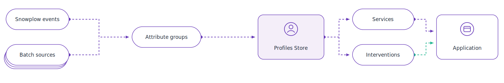
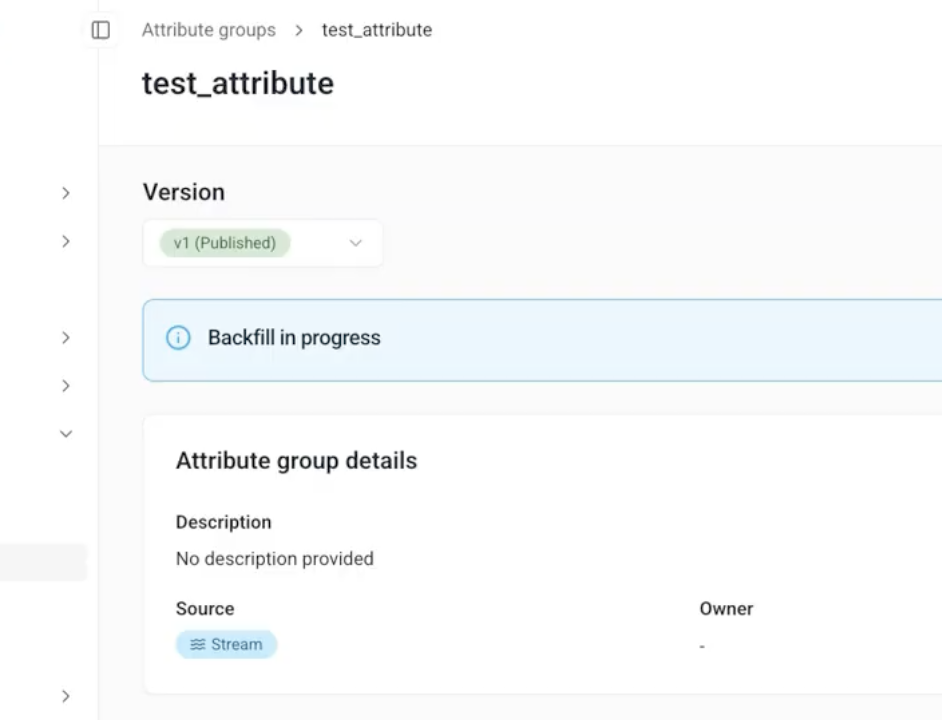

Signals introduces a new set of data governance concepts to Snowplow. As with schemas for Snowplow event data, Signals components are strictly defined, structured, and versioned.

Signals has three main configurable components:
* **Attribute groups**, for defining and calculating attributes
* **Services**, for consuming calculated attributes in your applications
* **Interventions**, for consuming calculated attributes and triggering actions in your applications

**Attribute groups** are where you define the behavioral data you want to calculate. Each attribute group contains multiple **attributes** - the specific facts about user behavior you want to measure or take action on - along with the configuration that defines how to calculate them, and from what data. Attributes can only be defined within attribute groups; they are effectively properties of the attribute group.

To use attributes to trigger actions such as in-app messages, discounts, or personalized journeys, use services or interventions.

**Services** provide a stable interface layer between your calculated attributes and your applications. Each service can contain multiple attribute groups, pinned to specific versions. You'd build the logic within your application for how to use the retrieved attributes. **Interventions** are a separate abstraction for defining when to trigger actions in your application.

## Attribute groups

Attribute groups are where you define the data you want to calculate. Each attribute group is a versioned collection that specifies:
* The **attributes** to calculate - the specific behavioral facts about users
* The **data source** - whether to calculate from the real-time stream, or in batch from the warehouse
* The **attribute key** that provides the analytical context
* Other metadata such as description or owner

### Types of attribute

Attributes describe what kind of calculation to perform, and what event data to evaluate. They can only exist within attribute groups.

Attributes can be categorized into four main types, depending on the type of user behavior you want to understand:

| Type         | Description                                            | Example                              |
| ------------ | ------------------------------------------------------ | ------------------------------------ |
| Period-based | Actions that happened within a configured period       | `products_added_to_cart_last_10_min` |
| No-period aggregate | Calculated over all available data (subject to TTL) | `total_product_price_clv`            |
| First touch  | The first event or property that happened              | `first_mkt_source`                   |
| Last touch   | The most recent event or property that happened        | `last_device_class`                  |

For period-based attributes, the period is configured on each attribute. Data retention is controlled by the TTL configured on the attribute group.

Signals includes a range of different aggregations for calculating attributes, including `mean`, `counter`, or `unique_list`. See the full list in the [attribute configuration](/docs/signals/attributes/attributes/index.md) page.

### Attribute keys

An attribute key is an identifier that provides the analytical context for all attribute calculations within a group. The identifier can be any property of a Snowplow event: an atomic field such as `domain_userid`, a property within a [self-describing event](/docs/fundamentals/events/index.md#self-describing-events), or a property within an [entity](/docs/fundamentals/entities/index.md).

To demonstrate the necessity of attribute keys, consider the attribute `num_views_in_last_10_min`. It represents a count of page view events, with a 10 minute time limit. This table lists some possible meanings of the attribute, based on the attribute key configured for its attribute group:

| Attribute                  | Attribute key      | Description                                                                         |
| -------------------------- | ------------------ | ----------------------------------------------------------------------------------- |
| `num_views_in_last_10_min` | User               | How many pages a user has viewed within the last 10 minutes                         |
| `num_views_in_last_10_min` | Page               | How many page views a page has received within the last 10 minutes                  |
| `num_views_in_last_10_min` | Product            | How many times a product has been viewed within the last 10 minutes                 |
| `num_views_in_last_10_min` | App                | How many page views occurred within an app in the last 10 minutes                   |
| `num_views_in_last_10_min` | Device             | How many page views came from a specific device in the last 10 minutes              |
| `num_views_in_last_10_min` | Marketing campaign | How many page views were generated by a campaign in the last 10 minutes             |
| `num_views_in_last_10_min` | Geographic region  | How many page views came from users in one region within the last 10 minutes        |
| `num_views_in_last_10_min` | Customer segment   | How many page views were generated by users in a segment within the last 10 minutes |

Each of these is likely to have a different calculated value.

You can [define your own attribute keys](/docs/signals/attributes/attribute-groups/index.md#attribute-keys), or use the built-in ones. Signals comes with predefined attribute keys for users and sessions. Their identifiers are from the out-of-the-box atomic [user-related fields](/docs/fundamentals/canonical-event/index.md#user-fields) in all Snowplow events.

| Attribute key      | Type     |
| ------------------ | -------- |
| `user_id`          | `string` |
| `domain_userid`    | `uuid`   |
| `network_userid`   | `uuid`   |
| `domain_sessionid` | `uuid`   |

## Data sources

Whether to compute attributes in real-time from the event stream or to sync pre-calculated values from your warehouse is an important decision. Broadly, you might use:
* **Stream** for real-time use cases, such as tracking the latest product a user viewed, or the number of page views in a session. You can optionally enable backfill to enrich stream attributes with historical data from your warehouse, such as a user's purchase history.
* **Warehouse** to bring in modeled data from your warehouse, such as transactional data or CRM attributes

This table summarizes the options for different types of processing:

| Feature                                        | Stream                                                            | Stream with backfill                                                    | Warehouse                 |
| ---------------------------------------------- | ----------------------------------------------------------------- | ----------------------------------------------------------------------- | ------------------------- |
| Real-time calculation                           | ✅                                                                 | ✅                                                                       | ❌                         |
| Period-based calculations                       | ✅                                                                 | ✅                                                                       | ❌                         |
| Calculations over all available data (within TTL) | ✅ from the point at which the attribute was defined               | ✅ from the configured backfill start date                               | ❌                         |
| Historical data                                 | ❌ attributes are only calculated from the moment they are defined | ✅ backfilled from the `atomic` events table up to the publish timestamp | ✅ any pre-calculated data |
| Non-Snowplow data                               | ❌                                                                 | ❌                                                                       | ✅                         |
| Warehouse connection required                   | ❌                                                                 | ✅                                                                       | ✅                         |

### Stream source

When Signals is deployed in your pipeline, the event stream is read by the streaming engine. All tracked events are inspected.

Real-time stream flow:
1. Behavioral data event is received by [Collector](/docs/pipeline/collector/index.md)
2. Event is enriched by [Enrich](/docs/pipeline/enrichments/index.md)
3. The Signals stream engine reads from the events stream
4. The stream engine checks if attributes are defined for the event
5. Are there any attributes to calculate?
   * No: nothing happens, and the process ends
   * Yes: processing continues
6. Signals evaluates and computes the attributes
7. Updated attributes are pushed to the Profiles Store

#### Backfill

Stream attribute groups by default only calculate attributes from the moment they are published. If you would like to pre-populate your attributes with values from your warehouse, you can optionally enable backfill when creating the group. Backfilling stream attributes requires a warehouse connection.

When backfill is enabled, you select a start date. On publish, Signals uses your Snowplow `atomic` events table to calculate attribute values for all events from that date up to the publish timestamp. The streaming engine starts immediately and processes all new events in real time. Backfill operates within this defined period and can take some time depending on data volume. Once backfill completes, only the streaming engine remains active.

You can monitor progress in Snowplow Console on the attribute group's details page. While historical values are syncing, a status bar labeled `Backfill in progress` is shown. This status remains visible until the backfill period has completed.

### Warehouse source

Use a warehouse source to sync tables of existing, pre-calculated values to the Profiles Store. The warehouse tables can be any data. For example, you may want to include transactional data or CRM attributes in your Signals use case.

## Services

Services are where you define how to use the calculated attributes in your applications.

Rather than connecting applications directly to attribute groups, services allow you to consume specific attribute group versions. This provides a consistent set of consumable attributes. We strongly recommend using services in production applications.

By using services you can:
* Iterate on attribute definitions without worrying about breaking downstream processes
* Migrate to new attribute group versions by updating the service definition, without having to update the application code

## Interventions

Interventions are opportunities to take actions to improve user outcomes. They're automated triggers fired by changes in attribute values, or by your own applications.

They can be thought of as "if-then" rules that run in real time. For example:
* `If` a user has viewed five products in the last ten minutes
* `Then` automatically send that user a personalized offer

In practice, this rule could work like this:
1. User views product pages
2. The application tracks the user behavior and sends events
3. Signals evaluates the events and updates attribute values
4. Signals checks whether the new attribute values meet any intervention conditions
5. The attribute `product_view_count_last_10_min` has just been updated to `5`, matching the intervention's trigger criteria
6. The application receives the subscribed intervention payload
7. The application sends a personalized offer to the user

Interventions are usually relevant only within a certain moment. Therefore, an intervention is sent only the first time the criteria are met.

Standard rule-based interventions can have multiple conditions, or trigger criteria, based on the values of different attributes.

### Targeting

Interventions are targeted based on attribute keys, which determine both the scope and specificity of when they're delivered.

For individual-level targeting, use user-specific attribute keys. For example, use `domain_userid` to target individual users, or `domain_sessionid` to target users during specific sessions, when session-level conditions are met.

For broadcast-level targeting, use attribute keys related to the application context. For example, you could use `campaign_id` to target all users who arrived from a specific marketing campaign.

Interventions can have multiple attribute keys. By default, the intervention will target the attribute keys associated with their criteria attributes. See [Define interventions](/docs/signals/interventions/index.md#target-and-payload) for guidance on choosing custom targets.

### Subscribing

To receive and take action on interventions, you'll need to [subscribe](/docs/signals/applications/subscribe/index.md) to them within your application, and define the logic for how the application should react. Once subscribed, all triggered interventions are streamed to the consumer application.

Subscription is by attribute key, not by intervention: a subscription using a specific attribute key ID, for example a `domain_userid` ID for the current user, will receive all triggered interventions for that ID. See the [delivery example](/docs/signals/applications/subscribe/index.md#delivery-example) for how targeting, subscription, and the send-once rule work together.

### Types of intervention

Signals has two types of interventions: rule-based or direct.

**Rule-based** interventions are the default, and are:
* Based on attribute values
* Defined in advance via Snowplow Console, Python SDK, or API
* Triggered automatically when their criteria are met

Use cases include:
* Real-time personalization
* Agentic chatbots
* Dynamic pricing

**Direct** interventions are:
* Not based on attribute values or rules
* Configurable only via the Python SDK or API
* Sent directly on pushing an intervention configuration to Signals

Use cases for direct interventions include:
* Emergency notifications, e.g. system outages
* Real-time business decisions, e.g. breaking news
* Manual campaign targeting
* Sensitive communications requiring authentication or authorization

## Profiles Store

The Profiles Store is a database where Signals saves all your calculated attribute values. When Signals calculates attributes from your events or warehouse data, or syncs pre-calculated data, it stores them here organized by attribute group. Your applications retrieve these stored values using the Signals SDKs or API.

The Profiles Store keeps track of current attribute values, and automatically removes old data based on the TTL settings you configure for each attribute group. It acts as the central source of truth for your Signals deployment.
