Signals introduces a new set of data governance concepts to Snowplow. As with schemas for Snowplow event data, Signals components are strictly defined, structured, and versioned.

The fundamental Signals building block is the `Entity`. The Signals components attributes and interventions are defined relative to entities. Attributes for a given entity are grouped together into views and services, for ease of management and deployment.

The components in bold are versioned.

## Entities

An entity can be anything with an "identifier" that you can capture in a Snowplow event.

This diagram shows some entities that could be useful for analysis:

```mermaid
flowchart TD
    User["  o<br/> /|\ <br/> / \ <br/>User"] --> Device["  ___<br/> |___|<br/> |___|<br/>Device"]
    User --> PhoneDevice[" |---| <br/> |    | <br/> |__| <br/>Device"]

    Device --> App1["[www] App"]
    PhoneDevice --> App2["[app] App"]

    App1 -.-> Page[Page]
    App1 -.-> Product[Product]

    App2 -.-> Screen[Screen]
    App2 -.-> ScreenView[Screen View]
```

Signals comes with predefined entities for user, device, and session. These are defined based on the out-of-the-box atomic [user-related fields](/docs/fundamentals/canonical-event/index.md#user-related-fields) in all Snowplow events.

| Entity  | Out-of-the-box identifier           |
| ------- | ----------------------------------- |
| User    | `user_id`                           |
| Device  | `domain_userid` and`network_userid` |
| Session | `domain_sessionid`                  |

You can define any entities you like, and expand this to broader concepts.

| Entity           | Possible identifier                                                                                       |
| ---------------- | --------------------------------------------------------------------------------------------------------- |
| App              | `app_id` from [atomic fields](/docs/fundamentals/canonical-event/index.md#application-fields)             |
| Page             | `page_urlpath` from [atomic fields](/docs/fundamentals/canonical-event/index.md#platform-specific-fields) |
| Product          | `id` from [ecommerce product](/docs/events/ootb-data/ecommerce-events/index.md#product) or custom entity  |
| Screen view      | `id` in `screen_view` entity                                                                              |
| Content category | from custom entity                                                                                        |
| Video game level | from custom entity                                                                                        |

## Attributes

After defining an entity, you can start to calculate attributes for it. An attribute defines a specific fact about behavior relating to an entity.

Example attributes for different entities:

| Entity         | Attribute                         | Description                                                         |
| -------------- | --------------------------------- | ------------------------------------------------------------------- |
| User           | `num_pages_viewed_in_last_7_days` | Counts how many pages the user has viewed within the past week      |
| User           | `last_product_viewed`             | Identifies the most recent product the user interacted with         |
| User           | `previous_purchases`              | Provides a record of the user's past transactions                   |
| Page           | `num_views_in_last_7_days`        | Counts how many page views a page has received within the past week |
| Media category | `most_popular_article`            | Identifies the most popular article for all users within a category |

Attribute values can be updated in multiple ways, depending how they're configured:
* Events in real time (stream source only)
* Events in warehouse (batch source only)
* Interventions
* Manually via Signals API

Attributes can be defined precisely. For example, an attribute could be calculated from one event type only, or based on values in defined event fields.

### Views

Configure attributes by grouping them into views. Each view is associated with a specific entity, source, version, and owner. It also has other optional metadata.

Choose the source which fits your use case. For example, the attribute `last_product_viewed` is best calculated from events in-stream during a session, while `num_views_in_last_7_days` is best calculated from historical events.

An example configuration for a view based on a user entity:

This view could be imagined like this as a table once the attributes are calculated:

| `user_id` | `number_of_pageviews` | `last_product_viewed` |
| --------- | --------------------- | --------------------- |
| `abc123`  | 5                     | `"Red Shoes"`         |
| `def456`  | 10                    | `"Blue Hat"`          |

You can use views individually in your application to retrieve attributes, or combine them into services.

### Services

Services allow you to retrieve attributes in bulk from multiple views. One service can combine views with different sources, as long as they share the same entity.

Because each view is pinned to a specific version, a defined service is also effectively versioned, ensuring that the returned values are consistent with what you expect.

Here's the same example as before, with an additional batch view:

This service could be imagined like this as a table:

| `user_id` | `number_of_pageviews` | `last_product_viewed` | `previous_purchases`       | `previous_returns` |
| --------- | --------------------- | --------------------- | -------------------------- | ------------------ |
| `abc123`  | 5                     | `"Red Shoes"`         | `[Blue Shoes", "Red Hat"]` | `["Red Hat"]`      |
| `def456`  | 10                    | `"Yellow Hat"`        | `[]`                       | `[]`               |

Retrieve calculated attributes in your application using one of the Signals SDKs, or manually using the Signals API.

## Interventions

Interventions are a way to trigger actions in your application, such as in-app messages, discounts, or personalized journeys. They're calculated on top of changes in attribute values.

They allow you to define logic within Signals rather than in your application. This allows you to update the behavior without requiring application updates, as well as streamlining management, development, and ownership.

Like attributes, interventions are specific to an entity.

Interventions can be triggered automatically based on attribute changes, or manually using the Signals API. Subscribe within your application for real-time updates to interventions for entities of interest.

For example, you could subscribe to interventions for `domain_userid`, the current `app_id`, the current `page`, and the current `product`. When new interventions are published for any of those, the retrieved contents includes any relevant attribute values, or custom data that you defined. This enables both individual-level and broadcast-level real-time messaging: for example, offering a specific user a personalized message, while also notifying all users on a specific product page that limited stock is selling fast.

Interventions can also perform built-in automatic operations, including updating attribute values.
