Signals introduces a new set of data governance concepts to Snowplow. As with schemas for Snowplow event data, Signals components are strictly defined, structured, and versioned.

The fundamental Signals building block is the `Entity`. The Signals components attributes and interventions are defined relative to entities. Group attributes together into Views or Services for ease of management and deployment.

The components in bold are versioned.

## Entities

An entity can be anything with an "identifier" that you can capture in a Snowplow event.

This diagram shows some entities that could be useful for analysis:

```mermaid
flowchart TD
    User["  o<br/> /|\ <br/> / \ <br/>User"] --> Device["  ___<br/> |___|<br/> |___|<br/>Device"]
    User --> PhoneDevice[" |---| <br/> |    | <br/> |__| <br/>Device"]

    Device --> App1["[www] App"]
    PhoneDevice --> App2["[app] App"]

    App1 -.-> Page[Page]
    App1 -.-> Product[Product]

    App2 -.-> Screen[Screen]
    App2 -.-> ScreenView[Screen View]
```

Signals comes with predefined entities: "users", "devices", and "sessions". These are defined based on the out-of-the-box [user-related fields](/docs/fundamentals/canonical-event/index.md#user-related-fields) in all Snowplow events.

| Signals out-of-the-box entity | Identifier                       |
| ----------------------------- | -------------------------------- |
| User                          | `user_id`                        |
| Device                        | `domain_userid`/`network_userid` |
| Session                       | `domain_sessionid`               |

You can define any entities you like, and expand this to broader concepts.

| Possible entity  | Possible identifier                                                                                      |
| ---------------- | -------------------------------------------------------------------------------------------------------- |
| App              | [`app_id`](/docs/fundamentals/canonical-event/index.md#application-fields)                               |
| Page             | [`page_urlpath`](/docs/fundamentals/canonical-event/index.md#platform-specific-fields)                   |
| Product          | `id` from [ecommerce product](/docs/events/ootb-data/ecommerce-events/index.md#product) or custom entity |
| Screen view      | `id` in `screen_view` entity                                                                             |
| Content category | from custom entity                                                                                       |
| Video game level | from custom entity                                                                                       |

## Attributes

After defining an entity, you can start to calculate attributes for it. An attribute defines a specific fact about behavior relating to an entity.

Example attributes for different entities:

| Entity           | Attribute                         | Description                                                                      |
| ---------------- | --------------------------------- | -------------------------------------------------------------------------------- |
| User             | `num_pages_viewed_in_last_7_days` | Counts how many pages the user has viewed within the past week                   |
| User             | `last_product_viewed`             | Identifies the most recent product the user interacted with                      |
| User             | `previous_purchases`              | Provides a record of the user's past transactions                                |
| Page             | `num_views_in_last_7_days`        | Counts how many page views a page has received within the past week              |
| Product Category | `last_product_sold`               | Identifies the most recent product any user has bought within a product category |

Attribute values can be updated in multiple ways, depending how they are configured:
* Events in real time (stream source only)
* Events in warehouse (batch source only)
* Interventions
* Manually via Signals API

### Views

Configure attributes by grouping them into views. Each view is associated with a specific entity, source, and owner. It also has a version.

Check out the attributes configuration page ADD LINK for the full list of configuration options.

Choose the source which fits your use case. For example, the attribute `last_product_viewed` is best calculated from events in-stream during a session, while `num_views_in_last_7_days` is best calculated from historical events.

An example configuration for a view based on a user entity:

This view could be imagined like this as a table once the attributes are calculated:

| `user_id` | `number_of_pageviews` | `last_product_viewed` |
| --------- | --------------------- | --------------------- |
| `abc123`  | 5                     | `"Red Shoes"`         |
| `def456`  | 10                    | `"Blue Hat"`          |

You can use views individually in your application to retrieve attributes, or combine them into services.

### Services

Services allow you to retrieve attributes in bulk from multiple views. Each view is pinned to a specific version, to ensure that the returned values will be consistent with what you expect. One service can combine views with different sources.

This service could be imagined like this as a table:

| `user_id` | `number_of_pageviews` | `last_product_viewed` | `previous_purchases`       | `previous_returns` |
| --------- | --------------------- | --------------------- | -------------------------- | ------------------ |
| `abc123`  | 5                     | `"Red Shoes"`         | `[Blue Shoes", "Red Hat"]` | `["Red Hat"]`      |
| `def456`  | 10                    | `"Yellow Hat"`        | `[]`                       | `[]`               |

Attribute values retrieved using a service are returned in the form TODO.

## Interventions

Once an entity is defined in Signals you can start to retrieve interventions for it, and start publishing to them.

An <dfn>intervention</dfn> describes an action that can be performed for a user to achieve a more successful result.

User devices and your own systems can request interventions for a list of specific entities, which are then delivered in real-time as they are published.
You can publish interventions manually using the API, or define them to trigger automatically when [attributes](#attributes) get updated and meet specific criteria.
There are built-in operations that interventions can perform or that can be handled by Signals SDKs, but the contents of an intervention can contain custom data to use however you need to, and can include current attribute values for dynamic, personalized, actions using the latest real-time data.

For example, a user can subscribe to interventions for their own `domain_userid`, the current `app_id`, the current `page`, and the current `product`, and any interventions published targeting any of those entities get received.
This enables both individual-level and broadcast-level messaging, so you can offer a specific user a personalized message, while also notifying all users on a specific product page that limited stock is selling fast.

<!-- TODO: Read more about interventions -->
