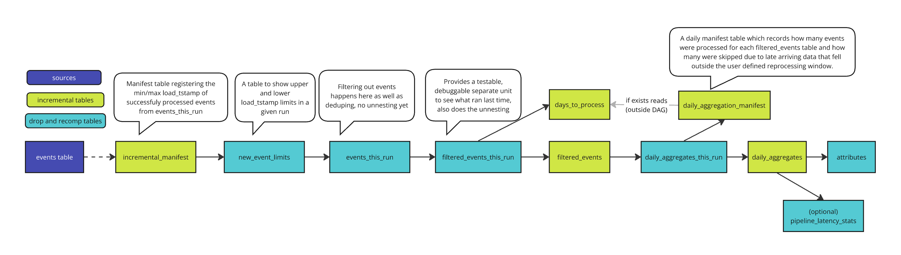

intro TODO


## Generating the dbt project
Here we assume you already defined your View(s) related to custom Batch Attributes, you want the Batch Engine to help generate for you.

It is best to follow our step-by-step tutorial, please check it out [here](/tutorials/snowplow-batch-engine/start/).

## Understanding the autogenerated data models
The Signals Batch Engine-generated dbt models process the events for Attribute generation, to help you save resources by avoiding unnecessary processing. In each incremental run, only the data that has been loaded since the last time the data models ran get processed and deduplicated. Only the relevant events and properties that are part of the Attribute definition (defined in the same View) are used to create a `filtered_events_table`. Upon successful run, the `snowplow_incremental_manifest` is updated to keep records of where each run left off.

:::info
For those familiar with existing Snowplow dbt packages, it is worth to note that the incrementalization follows a completely different logic, based on newly loaded data and not by reprocessing sessions as a whole.
:::

There is a second layer of incremental processing logic dictated by the `daily_aggregation_manifest` table. After the `filtered_events` table is created or updated, the `daily_aggregates` table gets updated with the help of this manifest. It is needed due to late arriving data, which may mean that some days will need to be reprocessed as a whole. For optimization purposes there are variables to fine-tune how this works such as the `snowplow__reprocess_days` and the `snowplow__min_rows_to_process`.

Finally, the `Attributes` table is generated which is a drop and recompute table, fully updated each time an incremental update runs. This is cost-effective as the data is already pre-aggregated on a daily level.


## Variables

```yml title="dbt_project.yml"
snowplow__start_date: '2025-01-01' # date from where it starts looking for events based on both load and derived_tstamp
snowplow__app_id: [] # already gets applied in base_events_this_run
snowplow__backfill_limit_days: 1 # limit backfill increments for the filtered_events_table
snowplow__late_event_lookback_days: 5 # the number of days to allow for late arriving data to be reprocessed fully in the daily aggregate table
snowplow__min_late_events_to_process: 1 # the number of total daily events that have been skipped in previous runs, if it falls within the late_event_lookback_days, if the treshold is reached, those events will be processed in the daily aggregate model
snowplow__allow_refresh: false # if true, the snowplow_incremental_manifest will be dropped when running with a --full-refresh flag
snowplow__dev_target_name: dev
snowplow__databricks_catalog: "hive_metastore"
snowplow__atomic_schema: 'atomic' # Only set if not using 'atomic' schema for Snowplow events data
snowplow__database: # Only set if not using target.database for Snowplow events data -- WILL BE IGNORED FOR DATABRICKS
snowplow__events_table: "events" # Only set if not using 'events' table for Snowplow events data
```
