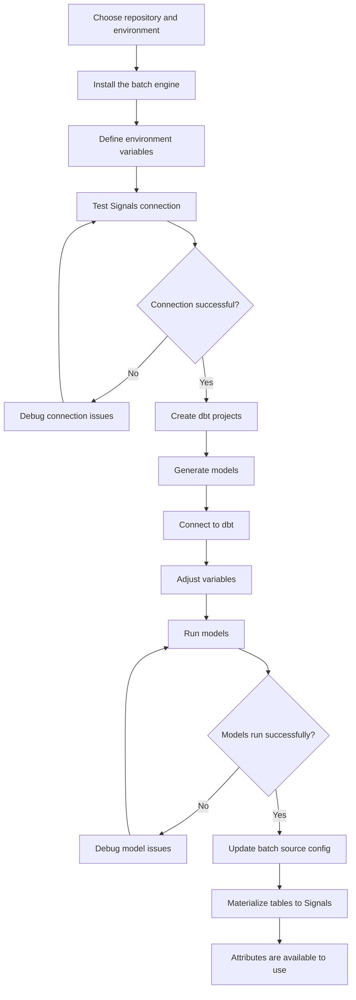

To use Signals for calculating new attributes from your existing warehouse data, you will need to use the batch engine. It's a CLI tool that's part of the Signals Python SDK.

The batch engine uses dbt to generate the tables.

This flowchart explains the process of creating new batch attributes using Signals, and adding them to the Profiles Store.



## Installing

The batch engine is installed separately from the main Python SDK.

Choose where your new Signals dbt projects will live. Install the CLI tool there with:

```bash
pip install 'snowplow-signals[batch-engine]'
```

This adds the `snowplow-batch-autogen` tool to your environment.

### CLI commands

The available options are:

```
  init              # Initialize dbt project structure and base configuration
  generate          # Generate dbt project assets
  materialize       # Registers the attribute table as a data source with Signals
  test_connection   # Test the connection to the authentication and API services
```

A `--verbose` flag is available for every command.

Here's an example of using the CLI:

```bash
snowplow-batch-autogen init --verbose
```

## Creating and registering tables

Check out the [batch engine tutorial](/tutorials/signals-batch-engine/start/) for a walkthrough of the required steps.

### Incremental data models

The dbt models generated by the batch engine process events incrementally. This avoids unnecessary reprocessing, and along with the pre-aggregation logic, minimizes computational costs.


### Model variables

The model created for each Attribute Group has configurable variables. The most important one to update before running is the `snowplow__start_date` variable. This will depend on how far back you have data, and how much of it you want to process.

You will need to update the variables for each Attribute Group individually, by editing the `dbt_project.yml` files. The table below lists the configurable variables for each model:

| Variable                               | Description                                                                                           | Default Value  |
| -------------------------------------- | ----------------------------------------------------------------------------------------------------- | -------------- |
| `snowplow__start_date`                 | Date from where the model starts looking for events, based on both `load_tstamp` and `derived_tstamp` | `'2025-01-01'` |
| `snowplow__app_id`                     | Filter the data on specific `app_id`s                                                                 | `[]`           |
| `snowplow__backfill_limit_days`        | Limit backfill increments for the `filtered_events_table`                                             | `1`            |
| `snowplow__late_event_lookback_days`   | The number of days to allow for late arriving data to be reprocessed during daily aggregation         | `5`            |
| `snowplow__min_late_events_to_process` | The threshold number of skipped daily events to process during daily aggregation                      | `1`            |
| `snowplow__allow_refresh`              | If set to true, the incremental manifest will be dropped when running with a `--full-refresh` flag    | `false`        |
| `snowplow__dev_target_name`            | The target name of your development environment as defined in your dbt `profiles.yml` file            | `dev`          |
| `snowplow__atomic_schema`              | Change this if you aren't using `atomic` schema for Snowplow event data                               | `'atomic'`     |
| `snowplow__database`                   | Change this if you aren't using `target.database` for Snowplow event data                             |                |
| `snowplow__events_table`               | Change this if you aren't using `events` table for Snowplow event data                                | `"events"`     |
