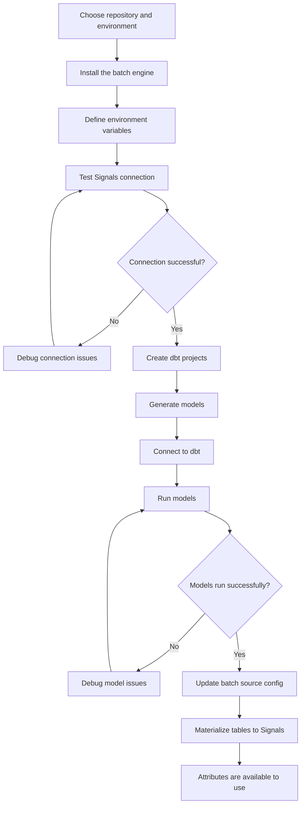

To use Signals for calculating new attributes from your existing warehouse data, you will need to use the batch engine. It's a CLI tool that's part of the Signals Python SDK.

The batch engine uses dbt to generate the tables.

This flowchart explains the process of creating new batch attributes using Signals, and adding them to the Profiles Store.



## Installing

The batch engine is installed separately from the main Python SDK.

Choose where your new Signals dbt projects will live. Install the CLI tool there with:

```bash
pip install 'snowplow-signals[batch-engine]'
```

This will make the `snowplow-batch-autogen` tool available within your environment.

### CLI commands

The available options are:

```
  init              # Initialize dbt project structure and base configuration
  generate          # Generate dbt project assets
  materialize       # Registers the attribute table as a data source with Signals
  test_connection   # Test the connection to the authentication and API services
```

A `--verbose` flag is available for every command.

Here's an example of using the CLI:

```bash
snowplow-batch-autogen init --verbose
```

## Creating and registering tables

Check out the [batch engine tutorial](/tutorials/snowplow-batch-engine/start/) for a walkthrough of the required steps.

## Incremental data models

The dbt models generated by the batch engine process events incrementally. This avoids unnecessary reprocessing, and along with the pre-aggregation logic, minimizes computational costs.


## Variables TODO

where does this go?

```yml title="dbt_project.yml"
snowplow__start_date: '2025-01-01' # date from where it starts looking for events based on both load and derived_tstamp
snowplow__app_id: [] # already gets applied in base_events_this_run
snowplow__backfill_limit_days: 1 # limit backfill increments for the filtered_events_table
snowplow__late_event_lookback_days: 5 # the number of days to allow for late arriving data to be reprocessed fully in the daily aggregate table
snowplow__min_late_events_to_process: 1 # the number of total daily events that have been skipped in previous runs, if it falls within the late_event_lookback_days, if the treshold is reached, those events will be processed in the daily aggregate model
snowplow__allow_refresh: false # if true, the snowplow_incremental_manifest will be dropped when running with a --full-refresh flag
snowplow__dev_target_name: dev
snowplow__databricks_catalog: "hive_metastore"
snowplow__atomic_schema: 'atomic' # Only set if not using 'atomic' schema for Snowplow events data
snowplow__database: # Only set if not using target.database for Snowplow events data -- WILL BE IGNORED FOR DATABRICKS
snowplow__events_table: "events" # Only set if not using 'events' table for Snowplow events data
```
