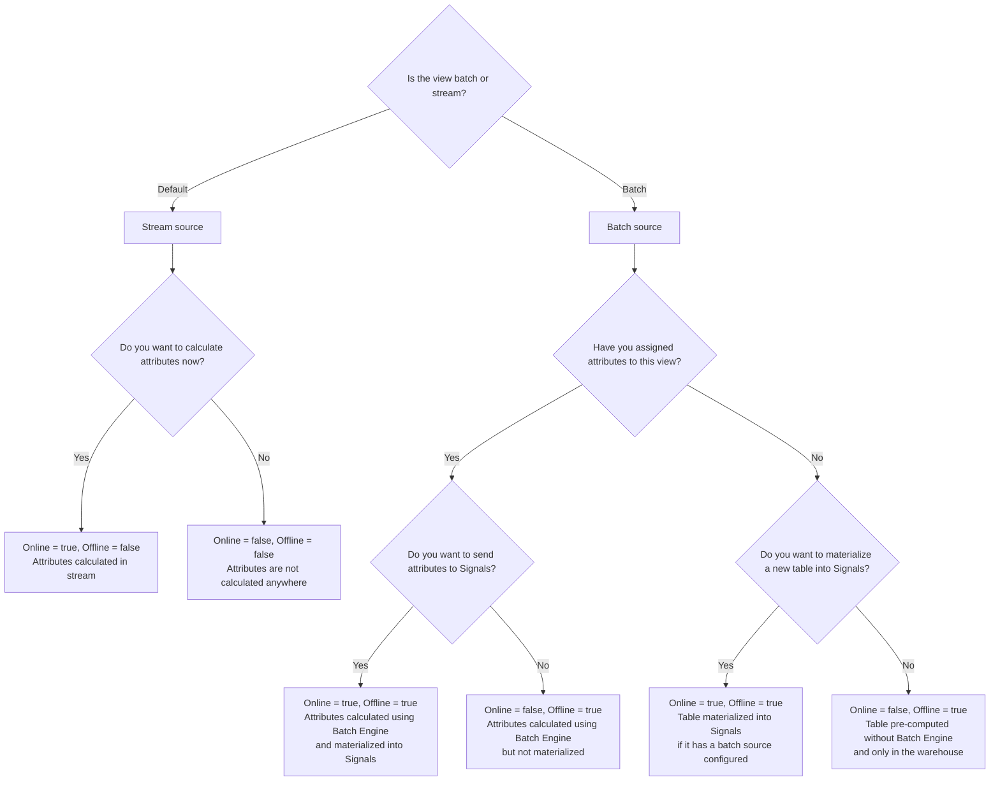

To manage and access attributes, they're grouped into a versioned `View`. You can group multiple views into a `Service` to retrieve calculated values easily.

## Attribute management

Every view has a version number. If you change the attributes of a view, increase the version number.

Signals provides functionality for separating attribute definition from calculation. This allows you to set up your attributes and business logic before putting them into production. The options are different depending on whether the view is for stream or batch attributes.

To configure a table for batch attributes, you may choose to set up a view using that source without defining any attributes initially. This ensures that the table is ready and tested for adding and calculating attributes. Read more about configuring batch attributes and views in the [Batch calculations](/docs/signals/configuration/batch-calculations/index.md) section.

Deciding when to calculate and materialize the attributes using the `online` and `offline` view configuration options:

TODO how does this work with existing tables vs new tables?



When defining batch attributes, it's possible to apply configurations that just create a table without attributes, or calculate attributes in a table without materializing them to the Profiles Store. You could also define views with fields instead of attributes, for using pre-existing tables with pre-calculated attributes.

For stream attributes, you can choose to configure and apply views that don't calculate their attribute values.

This means that configuration, calculation, materialization, and retrieval are fully decoupled.

## Minimal stream view example

You can define a `View` by passing in a list of previously defined attributes. Here's a minimal example:

```python
from snowplow_signals import View, domain_sessionid

my_attribute_view = View(
    name="my_attribute_view",
    version=1,
    entity=domain_sessionid,
    owner="user@company.com",
    attributes=[
        # Previously defined attributes
        page_view_count,
        products_added_to_cart_feature,
    ],
)
```

By default, views will calculate attributes from the real-time event stream. Read more about this in the [Stream calculations](/docs/signals/configuration/stream-calculations/index.md) section.

## View options

The table below lists all available arguments for a `View`:

| Argument       | Description                                                                         | Type           | Default | Required? | For batch only? |
| -------------- | ----------------------------------------------------------------------------------- | -------------- | ------- | --------- | --------------- |
| `name`         | The name of the view                                                                | `string`       |         | ✅         |                 |
| `version`      | The version of the view                                                             | `int`          | 1       | ❌         |                 |
| `entity`       | The entity associated with the view                                                 | `Entity`       |         | ✅         |                 |
| `owner`        | The owner of the feature view, typically the email of the primary maintainer        | email `string` |         | ✅         |                 |
| `attributes`   | The list of attributes that will be calculated from events as part of this view     | `Attribute`    |         | ❌         |                 |
| `description`  | A description of the view                                                           | `string`       |         | ❌         |                 |
| `ttl`          | The amount of time that this group of attributes will live for in the Profile Store | `timedelta`    |         | ❌         |                 |
| `offline`      | Whether the view is calculated in the warehouse (`True`) or in real-time (`False`)  | `bool`         | `False` | ❌         |                 |
| `online`       | Whether online retrieval is enabled (`True`) or not (`False`)                       | `bool`         | `True`  | ❌         |                 |
| `batch_source` | The batch data source for the view                                                  | `BatchSource`  |         | ❌         | ✅               |
| `fields`       | The list of table columns that are part of this view during materialization         | `Field`        |         | ❌         | ✅               |
| `tags`         | String key-value pairs of arbitrary metadata                                        | `dict`         |         | ❌         |                 |

If no `ttl` is set, the entity's `ttl` will be used. If the entity also has no `ttl`, there will be no time limit for attributes.

## Extended stream view example

This example shows all the available configuration options for a stream view. To find out how to configure a batch view, see the [Batch calculations](/docs/signals/configuration/batch-calculations/index.md) section.

This view groups attributes for a user entity, to be calculated in real-time.

```python
from snowplow_signals import View, user_id

stream_view = View(
    name="comprehensive_stream_view",
    version=2,
    entity=user_id,
    owner="data-team@company.com",

    attributes=[
        page_view_count,
        session_duration,
        conversion_rate,
    ],

    offline=False,  # Stream processing (default)
    online=True,    # Calculate and serve attributes (default)

    description="User engagement attributes in real-time",
    ttl=timedelta(days=90),  # Attributes live in the Profiles Store for 90 days
    tags={
        "team": "growth",
        "priority": "high",
    },

    # Note: batch_source and fields are not used for stream views
)
```

Signals will start calculating attributes as soon as this view configuration is applied.

## Testing views

To understand what the output of a view will look like, use the Signals `test` method. This will output a table of attributes calculated from your `atomic` events table.

```python
from snowplow_signals import Signals

# Connect to Signals
# See the main Configuration section for more on this
sp_signals = Signals(
        {{ config }}
    )

# Run the test
test_data = sp_signals.test(
    view=my_attribute_view,
    app_ids=["website"] # The app_id in your Snowplow events
)
```

TODO example output

## Services
A `Service` groups multiple views together, allowing you to conveniently retrieve calculated values from all the included views. Here's an example:

```python
from snowplow_signals import Service

my_service = Service(
    name='my_service',
    description='A collection of views',
    owner="user@company.com",
    views=[
        # Previously defined views
        my_attribute_view,
        another_view
    ],
)
```

TODO how does it work when one service has batch and stream views? Why use services?

### Service options

The table below lists all available arguments for a `Service`

| Argument      | Description                                                             | Type        | Required? |
| ------------- | ----------------------------------------------------------------------- | ----------- | --------- |
| `name`        | The name of the service                                                 | `string`    | ✅         |
| `description` | A description of the service                                            | `string`    | ❌         |
| `owner`       | The owner of the service, typically the email of the primary maintainer | `string`    | ✅         |
| `views`       | A list of views                                                         | `timedelta` | ❌         |
| `tags`        | String key-value pairs of arbitrary metadata                            | dictionary  | ❌         |
