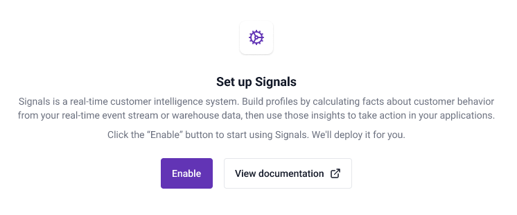
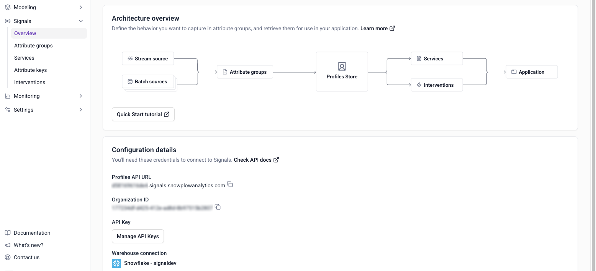
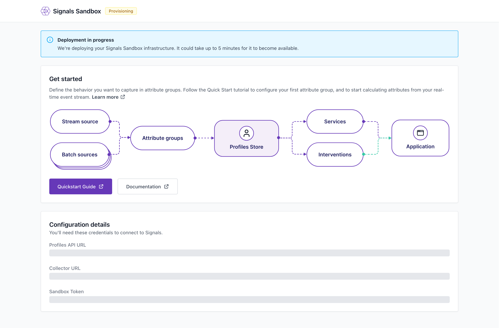

```mdx-code-block
import Tabs from '@theme/Tabs';
import TabItem from '@theme/TabItem';
```

If you're new to Signals, you'll need to set up a Signals connection in one of two ways:

- Log in to [Snowplow Console](https://console.snowplowanalytics.com) and navigate to the **Signals** section (for Snowplow customers with Signals).
- Set up a Signals instance with [Signals Sandbox](https://try-signals.snowplow.io/dashboard) to explore the product's features and capabilities.


## Snowplow Console

Click **Enable** to start setting up a Signals connection.



:::note Warehouse Connection
Signals can also be deployed without connecting to a warehouse.
:::

You'll need to:
* Select which warehouse to use
* Specify your warehouse account details
* Specify your Snowplow atomic events table
* Run the provided script

Click **Test and create connection** to trigger the Signals deployment. You'll be able to start using Signals as soon as the infrastructure is ready.

To use the UI to manage Signals, navigate to the **Signals** section.

Use the configuration interface to define [attribute groups](/docs/signals/define-attributes/attribute-groups/index.md), [services](/docs/signals/define-attributes/services/index.md), and [interventions](/docs/signals/define-interventions/index.md).



## Signals Sandbox

Alternatively, you can use the Signals Sandbox to test out the functionality and features of Signals. When you log in to the Signals Sandbox dashboard, a temporary Signals instance will be deployed.



## Connection credentials

You will need different connection values depending on your deployment type.

<Tabs groupId="connection" queryString>
  <TabItem value="console" label="Console" default>

To connect to Signals using the Signals SDKs or API, you will need four values. Use the Console **Overview** page to access them.

| Value           | Description                             | Where to get it                                                  | Format                                             |
| --------------- | --------------------------------------- | ---------------------------------------------------------------- | -------------------------------------------------- |
| Signals API URL | The API URL for your Signals deployment | Console > **Signals** > **Overview**                             | `https://{{123abc}}.signals.snowplowanalytics.com` |
| API key         | A Snowplow API key                      | [Generated by you](/docs/account-management/index.md) in Console | UUID                                               |
| API key ID      | A Snowplow API key ID                   | [Generated by you](/docs/account-management/index.md) in Console | UUID                                               |
| Organization ID | Your Snowplow organization ID           | Console > **Signals** > **Overview**                             | UUID                                               |

Add these four tokens to your environment secrets.

</TabItem>
  <TabItem value="sandbox" label="Signals Sandbox">

To connect to Signals using the Signals SDKs or API, you will need two values. These are found at the bottom of the Signals Sandbox dashboard under **Configuration details**.

| Value           | Description                                  | Where to get it  | Format                              |
| --------------- | -------------------------------------------- | ---------------- | ----------------------------------- |
| Signals API URL | The API URL for your Signals deployment      | Profiles API URL | `https://{{123abc}}.svc.snplow.net` |
| Sandbox Token   | An authorization token to connect to Signals | Sandbox Token    | UUID                                |

Add these values to your environment secrets.

  </TabItem>
</Tabs>

## Signals Python SDK

Use the [Signals Python SDK](https://pypi.org/project/snowplow-signals/) to define attribute groups, services, and interventions via code. You can also retrieve calculated attributes and subscribe to interventions using this SDK.

To use the Python SDK, first choose where to store your Signals configurations. We recommend creating a new repository. The easiest way to use the SDK is within a Jupyter notebook.

Install the SDK into your environment:

```bash
pip install snowplow-signals
```

Once installed, you can start to define configuration components. To test or publish your configuration, or retrieve calculated attributes or interventions from the Profiles Store, you'll need to connect to your Signals deployment.

Create a `Signals` object by passing in the required values depending on your deployment type.


<Tabs groupId="connection" queryString>
  <TabItem value="console" label="Console" default>

```python
from snowplow_signals import Signals

sp_signals = Signals(
    api_url=SIGNALS_DEPLOYED_URL,
    api_key=CONSOLE_API_KEY,
    api_key_id=CONSOLE_API_KEY_ID,
    org_id=ORG_ID,
)
```

</TabItem>
  <TabItem value="sandbox" label="Signals Sandbox">

```python
from snowplow_signals import SignalsSandbox

sp_signals = SignalsSandbox(
    api_url=SIGNALS_DEPLOYED_URL,
    sandbox_token=SIGNALS_SANDBOX_TOKEN,
)
```

  </TabItem>
</Tabs>


The created `Signals` object has the following methods:

| Method                   | Description                                                                 |
| ------------------------ | --------------------------------------------------------------------------- |
| `publish`                | Registers the provided objects with Signals                                 |
| `unpublish`              | Unpublishes objects from Signals                                            |
| `delete`                 | Fully deletes objects from Signals (must unpublish first)                   |
| `test`                   | Tests an attribute group against the atomic events table                    |
| `get_service_attributes` | Retrieves attributes for a specific service from the Profiles Store         |
| `get_group_attributes`   | Retrieves attributes for a specific attribute group from the Profiles Store |
| `get_attribute_group`    | Retrieves an attribute group from the Profiles Store                        |
| `push_intervention`      | Push an intervention to subscribers for a set of attribute keys             |
| `pull_interventions`     | Open a streaming subscription of interventions for a set of attribute keys  |

Check out the [attribute groups](/docs/signals/define-attributes/using-python-sdk/attribute-groups/index.md), [services](/docs/signals/define-attributes/using-python-sdk/services/index.md), and [interventions](/docs/signals/define-attributes/using-python-sdk/index.md) pages to learn how to configure them programmatically.

Read more about retrieving calculated attributes [here](/docs/signals/retrieve-attributes/index.md), and about interventions [here](/docs/signals/receive-interventions/index.md).

### Publishing and deleting

Use the same object management methods for attribute groups, services, attribute keys, and interventions:
* Use `publish()` to register objects with Signals. This makes them available for real-time calculation and retrieval.
* Use `unpublish()` to stop active calculation without losing the object definitions.
* Use `delete()` to permanently remove objects from Signals. Objects must be unpublished before deletion. If you delete an attribute group, the calculated attributes in the Profiles Store will also be deleted.

```python
from snowplow_signals import StreamAttributeGroup, Service, RuleIntervention

# Define your objects (assuming these are already created)
objects_to_manage = [my_attribute_group, my_service, my_intervention]

# 1. Publish objects
published_objects = sp_signals.publish(objects_to_manage)

# 2. Unpublish objects
unpublished_objects = sp_signals.unpublish(objects_to_manage)

# 3. Delete objects permanently - must unpublish first
sp_signals.delete(objects_to_manage)
```

## Signals Node.js SDK

Use the [Node.js SDK](https://www.npmjs.com/package/@snowplow/signals-node) to retrieve calculated attributes.

Install the SDK into your application:

```bash
npm i @snowplow/signals-node
# or
yarn add @snowplow/signals-node
# or
pnpm i @snowplow/signals-node
```

Create a `Signals` object by passing in the required values.


<Tabs groupId="connection" queryString>
  <TabItem value="console" label="Console" default>

```typescript
import { Signals } from '@snowplow/signals-node';

const signals = new Signals({
  baseUrl: SIGNALS_DEPLOYED_URL,
  apiKey: CONSOLE_API_KEY,
  apiKeyId: CONSOLE_API_KEY_ID,
  organizationId: ORG_ID,
});
```

</TabItem>
  <TabItem value="sandbox" label="Signals Sandbox">

```typescript
import { Signals } from '@snowplow/signals-node';

const signals = new Signals({
  baseUrl: SIGNALS_DEPLOYED_URL,
  sandboxToken: SIGNALS_SANDBOX_TOKEN,
});
```

  </TabItem>
</Tabs>

The created `Signals` object has the following methods:

| Method                      | Description                                                                 |
| --------------------------- | --------------------------------------------------------------------------- |
| `getServiceAttributes`      | Retrieves attributes for a specific service from the Profiles Store         |
| `getGroupAttributes`        | Retrieves attributes for a specific attribute group from the Profiles Store |
| `getBatchServiceAttributes` | Retrieves attributes for multiple identifiers from a service                |

Read more about retrieving calculated attributes [here](/docs/signals/retrieve-attributes/index.md), and about interventions [here](/docs/signals/receive-interventions/index.md).

## Signals API

The Signals API allows you to directly configure and retrieve attributes and interventions. To access the full Swagger API documentation for your Signals deployment, use your Signals API URL followed by `/docs/`:

```bash
{{API_URL}}/docs/
```

Your API documentation is linked in Console on the **Overview** page, under **Configuration details**.
