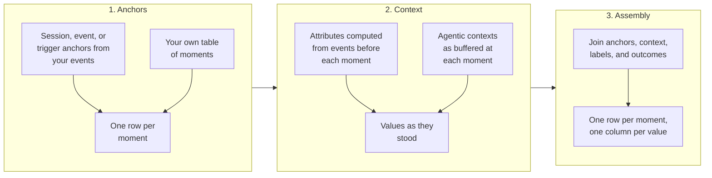

<NotebookLinks path="snowplow/documentation/blob/main/static/notebooks/signals-dataset-builder.ipynb" />

The Signals dataset builder creates datasets from your Snowplow event data, with one row per moment in time and the values your application would have seen at that moment. It computes those values from your existing [attribute groups](/docs/signals/attributes/attribute-groups/index.md) and [agentic contexts](/docs/signals/agentic-contexts/index.md), using only the events that occurred up to each moment. A model trained or tested on the dataset sees the same values it receives in production.

You can use the dataset builder for two kinds of work:

- Train a machine learning model: build a labeled dataset of features, train a model on it, and serve the same attributes to the model in real time.
- Evaluate a decision model: rebuild the moments your application would have called a model such as a System One model or an LLM prompt, the state it would have sent, and what each user did next. Then ask the model at every moment and check its answers before you change anything in production. See [Evaluate decision models on past traffic](/docs/signals/datasets/evaluate-decision-models/index.md).

Start by [connecting to Signals](/docs/signals/connection/index.md) to create a `Signals` client object.

## Why point-in-time correctness matters

When your application calls a model in real time, it only has access to events that have happened so far in the session. If a dataset includes values computed from the full session, including events after the moment of the call, the model trains or is tested on information it will never have in production. This is called data leakage. It makes a model look better in testing than it performs after deployment.

The dataset builder prevents leakage by construction. It computes each value using only events that occurred before the moment, from the same attribute group and agentic context definitions that power your real-time Signals deployment.

## How it works

A dataset build has three stages:

1. Anchors: decide the moments that become rows. Signals can derive them from your events, by session goal, by matching events, or by replaying an attribute trigger, or you can supply your own table. See [Choose dataset anchors](/docs/signals/datasets/anchors/index.md).
2. Context: for each anchor, compute attribute values and agentic context entries using only the events before it. See [Add context and outcomes](/docs/signals/datasets/context-and-outcomes/index.md).
3. Assembly: join anchors with their context, plus labels or outcome columns, into a single table with one row per anchor.

For example, with two attributes (`product_view_count` and `add_to_cart_count`) and a transaction goal, the final dataset looks like this:

| domain_sessionid | anchor_ts | label | product_view_count | add_to_cart_count |
| --- | --- | --- | --- | --- |
| `abc-123` | 2024-01-15 09:32:00 | 1 | 5 | 2 |
| `def-456` | 2024-01-15 10:01:00 | 0 | 3 | 0 |
| `ghi-789` | 2024-01-16 14:22:00 | 1 | 8 | 4 |

Each row captures the values as they were at the anchor timestamp, not at the end of the session.

## Supported warehouses

The dataset builder currently supports Snowflake only. A [Signals warehouse connection](/docs/signals/setup/index.md) is required for [managed runs](/docs/signals/datasets/run/index.md#submit-a-managed-run). If you [build the SQL yourself](/docs/signals/datasets/run/index.md#build-and-execute-sql-yourself), you can run it directly against your warehouse without a connection configured in Signals.

| Feature | Snowflake |
| --- | --- |
| Session anchors | ✅ |
| Event anchors | ✅ |
| Trigger anchors | ✅ |
| User-supplied anchors | ✅ |
| Outcome columns | ✅ |
| Agentic contexts | ✅ |
| Managed runs | ✅ |
| Self-built SQL | ✅ |

## Workflow

Building and using a dataset follows this process:

1. [Define your attribute groups](/docs/signals/attributes/attribute-groups/index.md), and your [agentic contexts](/docs/signals/agentic-contexts/index.md) if your model reads recent activity
2. [Choose the anchors](/docs/signals/datasets/anchors/index.md) that define the rows
3. [Add context and outcomes](/docs/signals/datasets/context-and-outcomes/index.md) to each row
4. [Run the build](/docs/signals/datasets/run/index.md), either as a managed run or by executing the SQL yourself
5. Train your model on the dataset, or [evaluate a decision model](/docs/signals/datasets/evaluate-decision-models/index.md) against it
6. Serve the same attributes and agentic contexts to your model in real time via [Retrieve attributes](/docs/signals/applications/retrieve-attributes/index.md) and [Retrieve agentic contexts](/docs/signals/applications/agentic-contexts/index.md)
