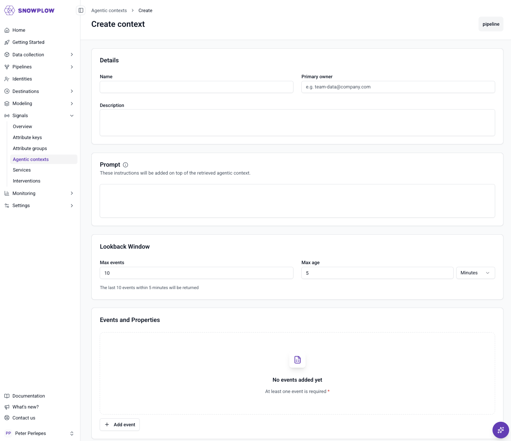
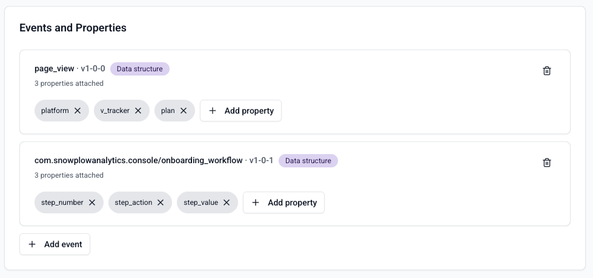

An agentic context is a live, rolling record of a user's recent activity that you can hand to an agent to ground it in what the user is doing right now. You choose which events to capture and which of their details to keep, attach a written instruction for the agent, and read the result as JSON or as a plain-language narrative.

There are two methods for defining agentic contexts in Signals:
* Snowplow Console UI
* [Signals Python SDK](/docs/signals/define-agentic-contexts/using-python-sdk/index.md)

Once defined, [retrieve an agentic context](/docs/signals/define-agentic-contexts/retrieving/index.md) in your application using the Signals SDKs.

To create an agentic context using the UI, go to **Signals** > **Agentic contexts** in Snowplow Console and follow the instructions.

The first step is to specify:
* A unique name
* An optional description
* Optional prompt instructions
* The email address of the primary owner or maintainer

## Selecting events

Choose which events to capture in the agentic context, and which details to keep from each one. This lets you shape the context around a purpose, so your system or an agent reads only what's relevant to its job. You can select up to 20 events, and for each event project up to 50 properties. Properties can come from the [atomic](/docs/fundamentals/canonical-event/index.md) event, the event schema, or entities attached to the event.

## Limits

An agentic context is a rolling window of recent activity, not a full history. It keeps the most recent events, up to the limits you set:
* A maximum number of events (up to 100)
* A maximum age (up to 1 hour)

Older activity rolls off once either limit is reached.

<!--  -->

:::note Session scope
An agentic context tracks a single user's activity within their current session, scoped to the `domain_sessionid` attribute key. Following a user across sessions is on the roadmap, but not available yet.
:::

## Prompt

Each agentic context carries a free-text prompt: guidance and role framing that's handed to the agent alongside the activity. It shapes how the agent interprets what it reads, but has no effect on which events are captured. Refine an agent's tone, focus, or rules by editing this text and re-publishing.

## Publishing an agentic context

Every change you make starts as a draft. Your currently published agentic context stays live while you edit with no danger of half finished changes getting live. Click **Publish** when you're happy with the draft, and that's the moment it goes live. Publishing takes effect within a few seconds. If you change your mind, discard the draft and the live version is unaffected.

:::note No versions to manage
Unlike other Signals resources, agentic contexts aren't versioned. There's one published agentic context per name, and it's always the one in effect. Publishing a draft replaces what was live.
:::

## Deleting an agentic context

You can't delete an agentic context while it's published. Unpublish it first, then delete it. This prevents accidentally breaking any live system depending on an agentic context.