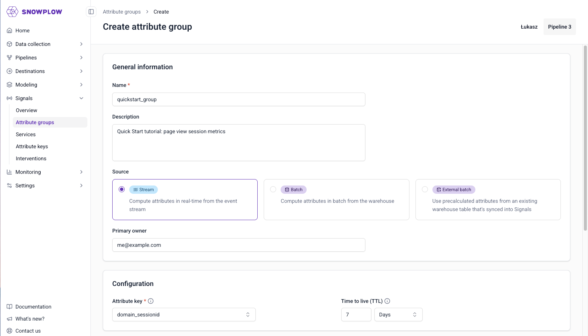
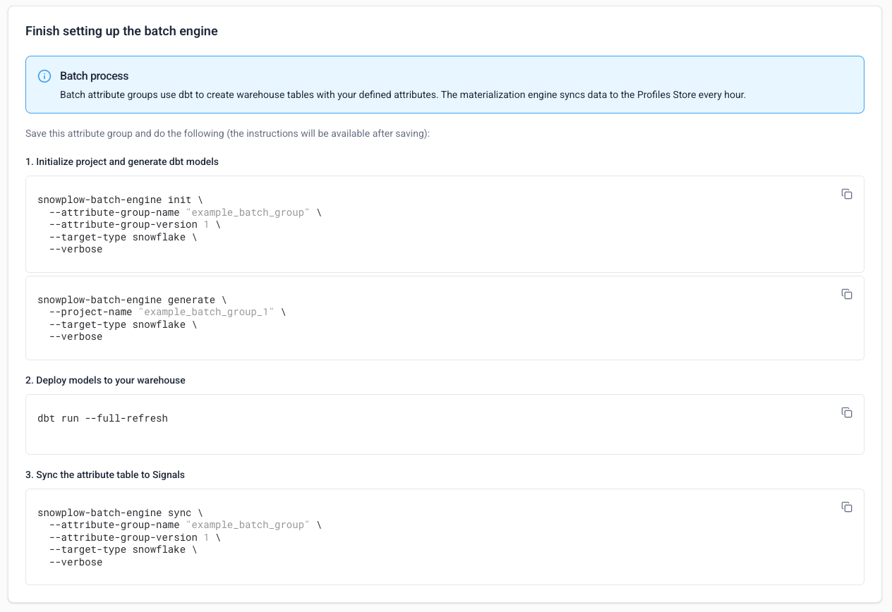
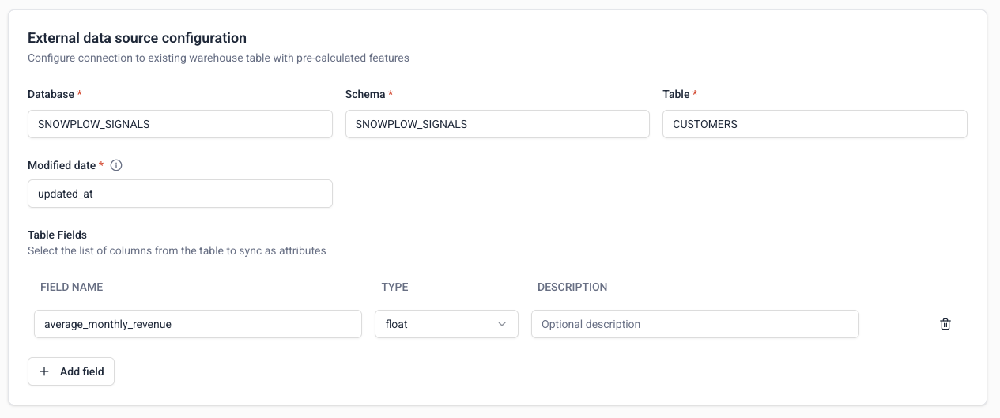
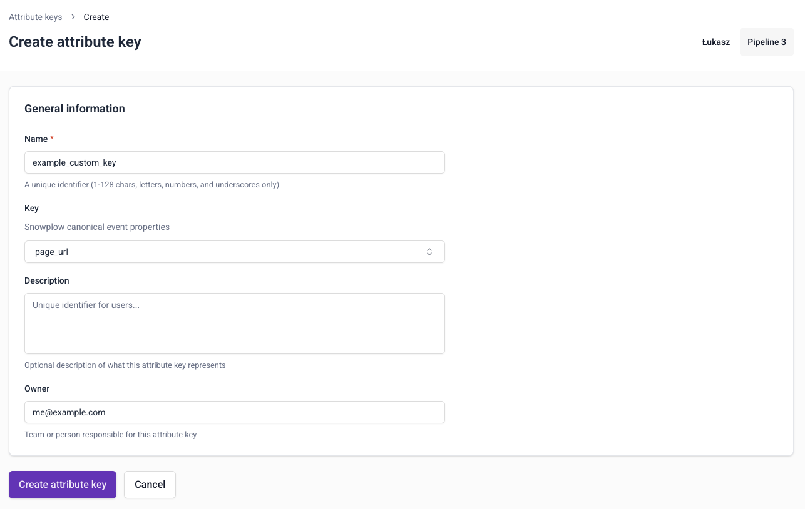
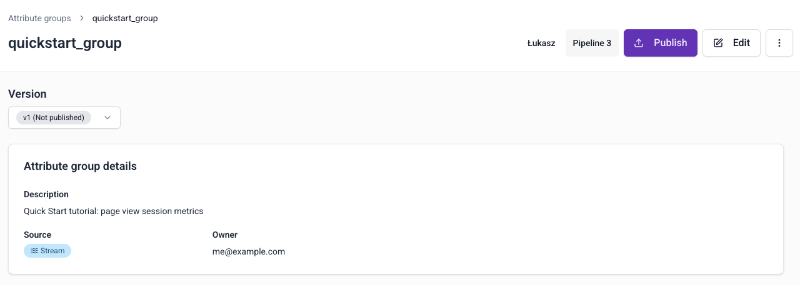
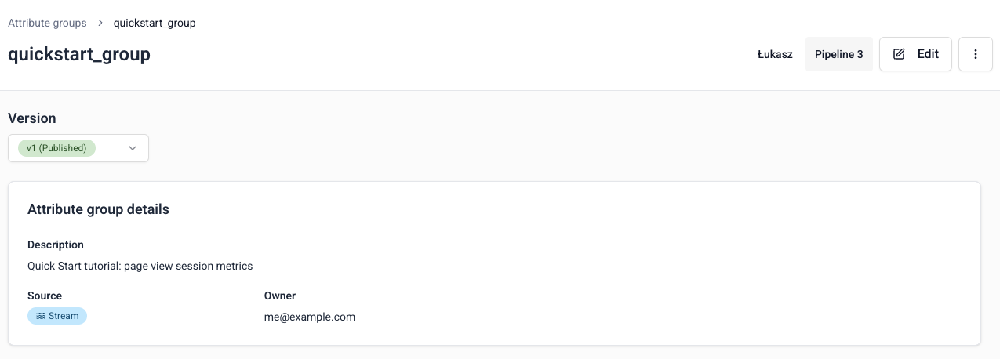
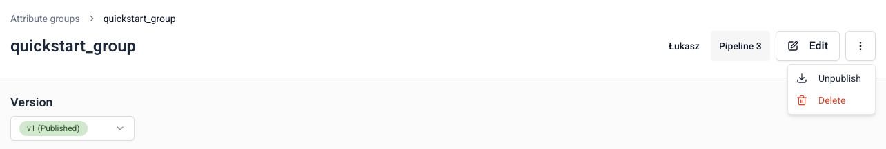

Define the behavior you want to capture in [attribute groups](/docs/signals/concepts/index.md#attribute-groups). Choose whether to calculate attributes from your event stream or warehouse.

To create an attribute group, go to **Signals** > **Attribute groups** in Snowplow Console and follow the instructions.

The first step is to specify:
* A unique name
* An optional description
* The email address of the primary owner or maintainer
* Which data source you want to use

## Data source

:::note Warehouse Connection
A warehouse connection is required to create `Batch` and `External Batch` attributes.
:::

There are three [sources](/docs/signals/concepts/index.md#data-sources) to choose from:
* **Stream**: real-time Snowplow event stream
* **Batch**: a new warehouse table created by Signals, calculated from your `atomic` events table
* **External batch**: pre-calculated values in a warehouse table that you can sync to the Profiles Store

Attribute groups are configured differently based on the data source.

### Stream

By default, Signals will calculate attributes from events in your real-time stream: the stream source. Check out the [quick start tutorial](/tutorials/signals-quickstart/start) for a step-by-step guide.

You'll need to define the [attributes](/docs/signals/define-attributes/attributes/index.md) you want to calculate from your event stream.

### Batch

Attribute groups with a batch source use dbt to calculate the defined attributes as a new table. Signals will sync the calculated attributes to the Profiles Store.

First, define the [attributes](/docs/signals/define-attributes/attributes/index.md) you want to calculate from your `atomic` events table.

Once you've created and published the group, create and configure the dbt models. Follow the instructions shown, or check out the [batch engine tutorial](/tutorials/signals-batch-engine/start) for a step-by-step guide.

### External batch

Attribute groups with an external batch source don't require attribute definition, as no calculation will be performed. This source type allows you to sync existing warehouse values with Signals so they're available in your Profiles Store.

Provide the warehouse and table details, and which fields you want to send to Signals.

To minimize latency, Signals will use the timestamp field to determine which rows have changed since the last sync. The sync engine will only send the new rows to the Profiles Store.

## Attribute keys

All attribute groups need an [attribute key](/docs/signals/concepts/index.md#attribute-keys).

Signals includes four built-in attribute keys, based on commonly used identifiers from the atomic [user-related fields](/docs/fundamentals/canonical-event/index.md#user-related-fields) in all Snowplow events.

To create a custom attribute key, navigate to **Signals** > **Attribute keys** within Console. Click the **Create attribute key** button.

You will need to provide:
* A unique name
* An optional description
* An optional email address for the primary owner or maintainer
* Which [atomic](/docs/fundamentals/canonical-event/index.md#atomic-fields) property you want to calculate attributes against

To edit or delete a custom attribute key, go to the key details page and click the **Edit** button, or the `⋮` button followed by **Delete**.

## Attribute lifetimes

We recommend setting a Time to live (TTL) value for each attribute group. Some attributes will only be relevant for a certain amount of time, and eventually stop being updated. To avoid stale attributes staying in your Profiles Store forever, configure a TTL for the attribute group.

The suggested default is 7 days for stream attribute groups, and 365 days for batch attribute groups.

When none of the attributes for an attribute group have been updated for the defined lifespan, the attribute group expires. Any attribute values for this group will be deleted: fetching them will return `None` values.

If Signals then processes a new event that calculates the attribute again, or materializes the attribute from the warehouse again, the expiration timer is reset.

## Testing the attribute definitions

:::note Warehouse Connection
A warehouse connection is required to test attribute definitions.
:::

After defining one or more [attributes](/docs/signals/define-attributes/attributes/index.md) for groups with a stream or batch source, you can test out the configuration with the **Run preview** button.

This will output a table of attributes calculated from your `atomic` events table, using a random subset of events from the last hour.

## Publishing the attribute group

Once you're happy with your attribute group configuration, click **Create attribute group** to save it. It will be saved as a draft, and not yet available to Signals.

Click the **Edit** button if you want to make changes to the attribute group.

To send the attribute group configuration to your Signals infrastructure, click the **Publish** button. This will allow Signals to start calculating attributes or syncing tables, and populating the Profiles Store.

:::note
If the attribute group has a batch source, Signals won't be able to do anything until you've completed the dbt configuration steps. Complete the dbt steps before publishing the group.
:::

### Versioning

Attribute groups are versioned. This allows you to iterate on the definitions without breaking downstream processes. You'll select specific attribute group versions when you define [services](/docs/signals/define-attributes/services/index.md).

All attribute groups start as `v1`. If you make changes to the definition, the version will be automatically incremented.

## Deleting an attribute group

To unpublish or delete an attribute group, click the `⋮` button on the group details page.

Unpublishing is version specific. It will stop Signals from calculating attributes for this version of this group. Existing attribute values will remain in your Profiles Store, but they won't be updated. You can republish it later if needed.

Choose **Delete** to permanently delete all versions of the attribute group, along with attribute values in your Profiles Store for this group.

If the attribute group version is used by a [service](/docs/signals/concepts/index.md#services), you'll need to update the service definition before unpublishing or deleting.

If the attribute group version is used by a published [intervention](/docs/signals/concepts/index.md#interventions), deleting or unpublishing it will unpublish the intervention.
