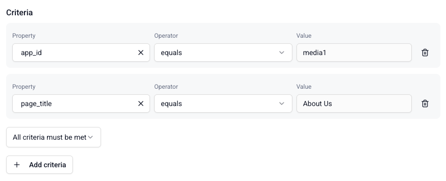

[Attributes](/docs/signals/concepts/index.md#attribute-groups) are defined as part of attribute groups. To create an attribute, you'll need to set:
* A name, ideally one that describes the attribute
* Which event schema to calculate it from
* What property in the schema to consider for the calculation
* What kind of aggregation you want to calculate over time, e.g. `mean` or `last`

## Event selection

Use the event filter to choose which event type to calculate the attribute from.

Click the dropdown to see the available schemas, listed by name and vendor:

* **Snowplow events**: select any built-in Snowplow or [Iglu Central](https://iglucentral.com) schema. For legacy reasons, to calculate an attribute from [structured](/docs/events/custom-events/index.md#structured-events) events find `event (com.google.analytics.measurement-protocol)`.

* **Custom events**: select any schema or data structure that's available within your pipeline.

:::note Searching for schemas
The schema search finds direct matches only, so use the exact name of the schema or vendor.
:::

Once you've selected an event and version, click **Confirm** to add the attribute to your attribute group.

## Aggregation options

Signals supports a number of different aggregation types.

| Aggregation | Description                    | Required property type                |
| ----------- | ------------------------------ | ------------------------------------- |
| Counter     | Count events                   | No property used for this aggregation |
| Sum         | Sum of property values         | Numeric                               |
| Min         | Minimum property value         | Numeric                               |
| Max         | Maximum property value         | Numeric                               |
| Mean        | Average of property values     | Numeric                               |
| First       | First property value seen      | Any                                   |
| Last        | Last property value seen       | Any                                   |
| Unique list | List of unique property values | Any                                   |

A property isn't used for `counter` aggregation. To only count events with a specific property value, use a criteria filter.

## Property selection

You can calculate attributes based on properties in any part of your events:
* [Atomic](/docs/fundamentals/canonical-event/index.md) properties: these are available for all events
* Event schema properties: choose properties within your chosen event
* Entity properties: choose properties from schemas that you are tracking as entities with your chosen event

Click **Confirm** to specify the property for this attribute.

## Time period

Add an optional time period to the attribute to aggregate it over a rolling window. Signals won't include events older than the specified time period in the calculation.

Find the time period option within **More options**. Click **Done** to save it.

### Stream attributes limit

Stream attributes defined with a `period` setting, e.g., last 15 minutes, are limited to the 100 most recent relevant events. Relevant events are those that cause the attribute value to be updated. As a result, if you need to analyze user behavior or aggregate data over longer periods, such as counting page views over several hours or tracking all purchases in the past year, stream attributes may not capture the full picture.

This isn't the case for stream attributes that don't have a `period` window defined. In this case, Signals considers all events—starting from the time the attribute was defined—and values aren't forgotten.

## Filtering with criteria

Use criteria to filter the events used to calculate an attribute. They allow you to be specific about which subsets of events should trigger attribute updates. For example, instead of counting all page views in a user's session, you may wish to calculate only views for the homepage, or a login page.

Find the criteria option within **More options**.

Defining criteria has three steps:
1. Select which property to filter on, similarly to the property selection for the attribute
2. Choose which logical operator to use
3. Enter the value to filter on

If you enter multiple criteria, you will have the option to require `all` or `any` of them to be met for the attribute to update.

Click **Done** to save the criteria when you're finished.
