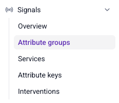

There are three methods for defining attributes in Signals:
* Snowplow Console UI
* [Signals Python SDK](/docs/signals/define-attributes/using-python-sdk/index.md)
* [Signals API](/docs/signals/connection/index.md#signals-api)

## Snowplow Console

To use the UI to manage Signals, log in to [Console](https://console.snowplowanalytics.com) and navigate to the **Signals** section.

Use the configuration interface to define [attribute groups](/docs/signals/define-attributes/attribute-groups/index.md) and [services](/docs/signals/define-attributes/services/index.md).

