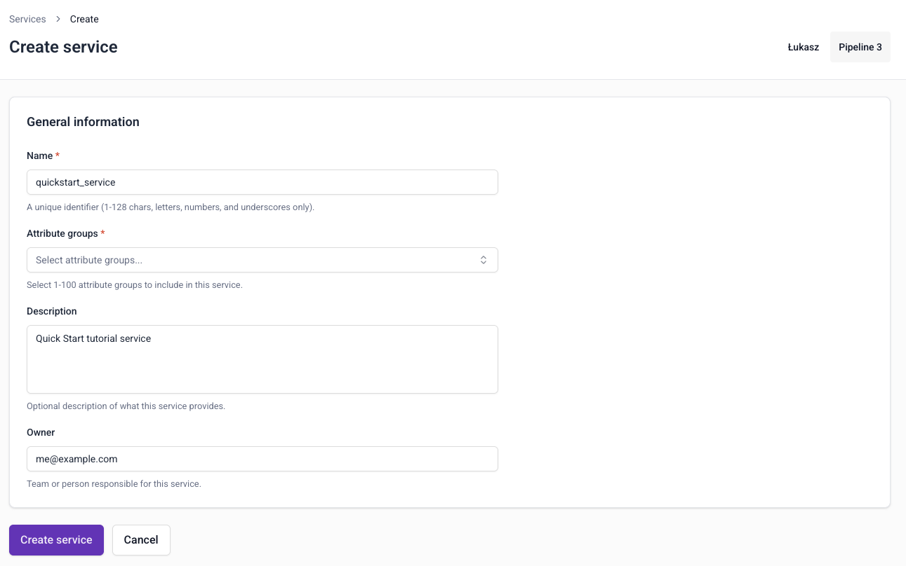
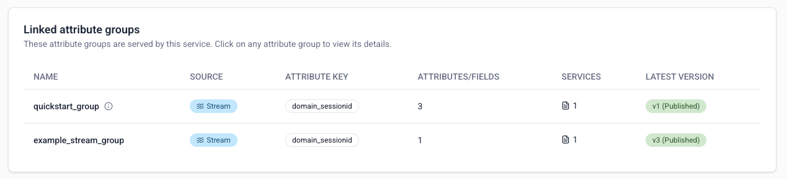
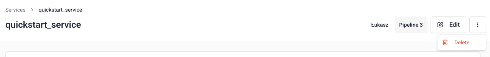

[Services](/docs/signals/concepts/attributes/index.md#services) group attribute groups together for serving to your applications.

To create a service, go to **Signals** > **Services** in Snowplow Console and follow the instructions.

To configure a service, you'll need to specify:
* A unique name
* An optional description
* The email address of the primary owner or maintainer
* Which attribute groups to include

## Versioning

When choosing which attribute groups to include, you'll select a specific version of each attribute group.

Services themselves are not versioned. You can update them to use different attribute groups, or different attribute group versions, at any time.

## Managing services

Services are automatically published as soon as they're created. They're a wrapper for consuming calculated attributes, and don't cause any additional processing themselves.

To edit a service definition, go to the service details page and click the **Edit** button.

To delete a service, go to the service details page and click the `⋮` button, then choose **Delete**.

