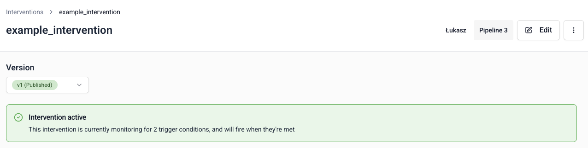

[Interventions](/docs/signals/concepts/index.md#interventions) are automated triggers that enable real-time actions based on user behavior.

There are three methods for defining interventions in Signals:
* BDP Console UI
* [Signals Python SDK](/docs/signals/define-interventions/using-python-sdk/index.md)
* [Signals API](/docs/signals/connection/index.md#signals-api)

To create an intervention using the UI, go to **Signals** > **Interventions** in Snowplow Console and follow the instructions.

The first step is to specify:
* A unique name
* An optional description
* The email address of the primary owner or maintainer

Next, configure when the intervention should trigger.

## Criteria

Criteria are the conditional rules that determine when an intervention should trigger.

Defining intervention criteria has three steps:
1. Select which attribute from a published attribute group to evaluate
2. Choose which logical operator to use
3. Enter the value to trigger on

When adding more than one criteria, you can require all or any of them to be met.

These attributes are both from groups with the `domain_userid` attribute key. Therefore, this intervention is targeted to users. When a [subscribed](/docs/signals/receive-interventions/index.md) user reaches 10 page views while using Chrome, the intervention will trigger.

## Custom targets

Define a custom intervention target scope by selecting [attribute keys](/docs/signals/concepts/index.md#targeting). These are the attribute keys that will receive the information.

By default, the intervention will target the attribute keys of the attribute groups defined in the criteria. Specify attribute keys here if you want different targets.

## Publishing the intervention

Once you're happy with your intervention configuration, click **Create intervention** to save it. It will be saved as a draft, and not yet available to Signals.

Click the **Edit** button if you want to make changes to the intervention.

To send the intervention configuration to your Signals infrastructure, click the **Publish** button. This will allow Signals to start monitoring attribute value changes.

The intervention page also includes sample code to help you subscribe to it. Read more about this in the [receiving interventions](/docs/signals/receive-interventions/index.md) page.

### Versioning

Interventions are versioned. This allows you to iterate on the definitions without breaking downstream processes. All interventions start as `v1`. If you make changes to the definition, the version will be automatically incremented.

Within criteria, the attributes are always evaluated based on the latest published version of the attribute group that contains the attribute. For example, if `attribute_group` v1, v2, and v3 all have the required `attribute`, v3 will be used. If you then publish `attribute_group` v4, which removes `attribute`, v3 will still be used.

## Deleting an intervention

To unpublish or delete an intervention, click the `⋮` button on the details page.

Unpublishing is version specific. You can republish it later if needed. Choose **Delete** to permanently delete all versions of the intervention.
