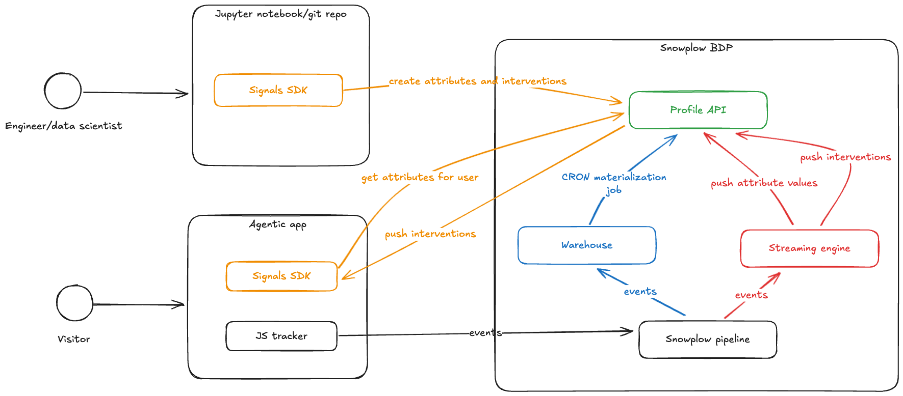
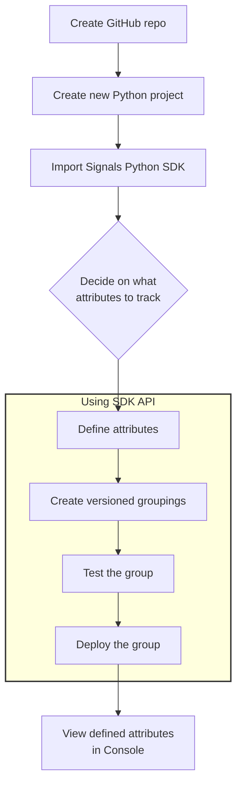
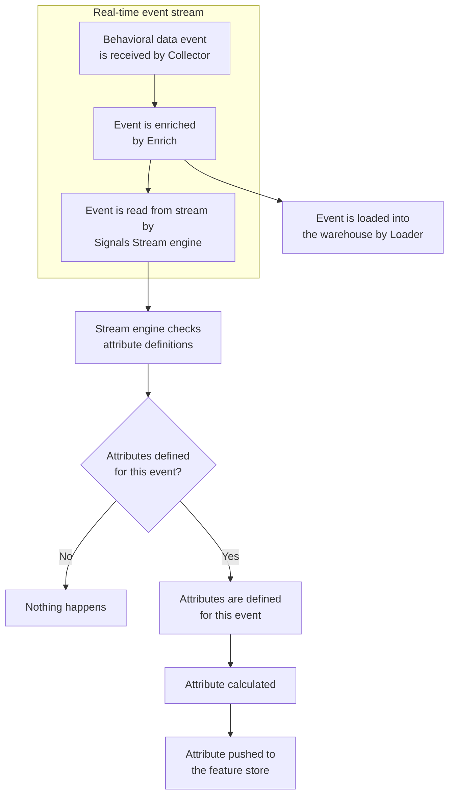

Snowplow Signals is a real-time personalization engine built on Snowplow's behavioral data pipeline. It allows you to compute, access, and act on in-session stream and historical user data, in real time.

Real-time personalization use cases that are unlocked by Signals include:
* Personalized recommendations
* Personalized messaging
* Agentic applications such as chatbots or copilots
* Adaptive UIs
* Dynamic pricing
* Contextually relevant advertising

Your Signals infrastructure is deployed by us into the same cloud as your Snowplow BDP pipeline. You can use the Signals APIs and SDKs to first define the data you're interested in, then to retrieve the calculated attributes to alter your customer's experience and behavior.

As well as attributes, Signals allows you to define interventions. This is a way to specify the business logic, based on attribute values, that should trigger changes in your application.

Every attribute grouping and intervention that is published to the Signals API is versioned, allowing you to maintain strong data governance within the feature store, and to test new Signals configurations without affecting production.

## How does Signals fit into the Snowplow pipeline?

The core Signals infrastructure components are:
* Profile Store feature store
* Streaming engine to compute attributes from Snowplow events in stream
  * These attributes are directly sent to the feature store
* Batch engine to compute attributes from warehouse tables
  * This runs in the warehouse
* Sync service/Materialization engine to periodically update the feature store with batch attributes
* Signals API to define, publish, and fetch attributes and interventions

## Using Signals

To use Signals, there are three key steps:
1. Define attributes and publish the definitions
2. Populate the feature store
3. Use the attributes in your application

### Defining the business logic

Your first step is to define the attributes and interventions you're interested in tracking. This is done using our [Signals Python SDK](https://github.com/snowplow-incubator/snowplow-signals-sdk).

Interventions are defined in a similar way.

For batch attributes, you'll also need to set up a dbt project to run the attribute calculation models, and to provide Signals with details of the created table. Alternatively, you can use any pre-existing table.

You don't have to use both stream and historical sources. It's more powerful to combine attributes from both sources, but feel free to configure just one if that makes more sense for your business.

### Populating the feature store

Stream attributes are calculated automatically.

When Signals is deployed in your Snowplow BDP pipeline, the event stream is read by the stream engine. All tracked events are inspected. If you've configured Signals to calculate an attribute from a certain type of event, when that event type is received, the engine will extract the attribute data and forward it to the feature store, in real time. If that event type isn't registered as containing attribute data, nothing happens.

Batch attributes require some manual configuration and running. Once configured and registered with Signals, the Signals Materialization engine/Sync service will incrementally check on the table every 5 minutes to calculate attributes, and push them to the feature store. Check out the [batch engine tutorial](/tutorials/snowplow-batch-engine/start/) to learn more.

### Using the attributes

Call the Signals API within your application to retrieve relevant attributes and interventions.

If you have a Node.js application, we provide an [SDK](https://github.com/snowplow-incubator/snowplow-signals-typescript-sdk) that wraps the Signals API for easier implementation.

## Example real-time Signals workflow

TODO describe Signals demo ecommerce site
