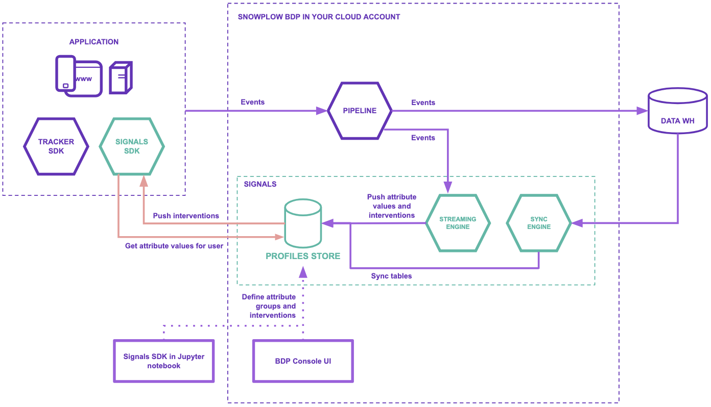

Snowplow Signals is a real-time personalization engine for customer intelligence, built on Snowplow's behavioral data pipeline. It allows you to compute, access, and act on in-session stream and historical user data, in real time.

Real-time personalization use cases that are unlocked by Signals include:
* Personalized recommendations
* Personalized messaging
* Agentic applications such as chatbots or copilots
* Adaptive UIs
* Dynamic pricing
* Contextually relevant advertising
* Paywall optimization

Your Signals infrastructure is deployed by us into the same cloud as your Snowplow BDP pipeline. You can use the Snowplow BDP Console to first define the data you're interested in, then use the Signals APIs and SDKs to retrieve the calculated [attributes](/docs/signals/concepts/index.md) in your applications to alter your customer's experience and behavior.

As well as attributes, Signals allows you to define [interventions](/docs/signals/interventions/index.md). This is a way to specify the business logic, based on attribute values, that should trigger actions such as notifications in your application.

Every attribute group and intervention published to the Signals API is versioned, allowing you to maintain strong data governance within the Profiles Store, and to test new Signals configurations without affecting production.

## How does Signals fit into the Snowplow pipeline?

Signals consists of several new infrastructure components. When running Signals, your Snowplow pipeline will continue to process events as usual.

The core Signals components are:
* **Profiles Store**: stores calculated attributes and configurations
* Signals **SDKs** and **API**: allow you to manage and fetch attributes and interventions
* **Streaming engine**: computes attributes from Snowplow events in stream, and sends them directly to the Profiles Store
* **Sync engine**: periodically updates the Profiles Store with batch attributes
* **Batch engine**: runs in your warehouse to compute attributes from warehouse tables

## Using Signals

Steps for using Signals:
1. Decide on the business logic
2. Apply the configurations to Signals
3. Use the attributes and interventions to take action in your application

:::note Warehouse support
Only Snowflake is supported currently.
:::

Check out the [quick start tutorial](/tutorials/signals-quickstart/start) to get started.

### 1. Decide on the business logic

Your first step is to decide what changes in user behavior you're aiming for. What systems or data will you need to achieve this? This planning will help you decide which attributes you want to calculate, and which interventions you're interested in defining.

You'll also need to decide whether to calculate attributes from your real-time event stream (default), or from warehouse data, or both.

Read more about attributes and interventions on the [concepts](/docs/signals/concepts/index.md) page.

### 2. Apply the configuration

We recommend using the BDP Console to define your [configurations](/docs/signals/configuration/index.md). You could also use the Signals Python SDK, or even the Signals API.

Once you've created your attribute group or intervention configurations, apply them to Signals by publishing them. It will start calculating attributes and populating the Profiles Store.

### 3. Take action in your application

Retrieve calculated attributes in your application using the [Node.js](https://github.com/snowplow-incubator/snowplow-signals-typescript-sdk) or [Python](https://github.com/snowplow-incubator/snowplow-signals-sdk) Signals SDKs. You could also use the Signals API.

Use the attributes to update the user experience, or subscribe to [interventions](/docs/signals/concepts/index.md) to take action based on user behavior.
