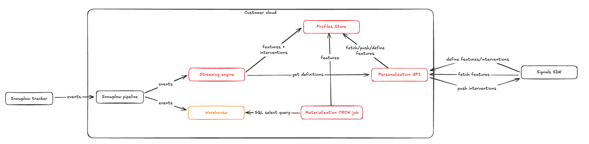

Snowplow Signals is a real-time personalization engine for customer intelligence, built on Snowplow's behavioral data pipeline. It allows you to compute, access, and act on in-session stream and historical user data, in real time.

Real-time personalization use cases that are unlocked by Signals include:
* Personalized recommendations
* Personalized messaging
* Agentic applications such as chatbots or copilots
* Adaptive UIs
* Dynamic pricing
* Contextually relevant advertising
* Paywall optimization

Your Signals infrastructure is deployed by us into the same cloud as your Snowplow BDP pipeline. You can use the Signals APIs and SDKs to first define the data you're interested in, then to retrieve the calculated attributes to alter your customer's experience and behavior.

As well as attributes, Signals allows you to define interventions. This is a way to specify the business logic, based on attribute values, that should trigger actions such as notifications in your application.

Every attribute grouping and intervention that is published to the Signals API is versioned, allowing you to maintain strong data governance within the Profiles Store, and to test new Signals configurations without affecting production.

## How does Signals fit into the Snowplow pipeline?

The core Signals infrastructure components are:
* Profiles Store
* Streaming engine to compute attributes from Snowplow events in stream
  * These attributes are directly sent to the Profiles Store
* Batch engine to compute attributes from warehouse tables
  * This runs in the warehouse
* Sync service/Materialization engine to periodically update the Profiles Store with batch attributes
* Signals API to define, publish, and fetch attributes and interventions

## Using Signals

Steps for using Signals:

0. Deploy the infrastructure - Snowplow will do this for you
1. Define and test attributes
2. Publish the attribute definitions
3. (Optional) Configure the batch engine for historical warehouse attributes
4. Use the attributes in your application

TODO what warehouse(s) are supported

### Defining the business logic

Your first step is to define the attributes and interventions you're interested in tracking. This is done using our [Signals Python SDK](https://github.com/snowplow-incubator/snowplow-signals-sdk). Once defined, apply the attributes configuration to the Signals infrastructure.

Example attributes:
* `add_to_cart_events_count`
* `product_view_events_count`
* `last_login_date`
* `previous_purchases_count`
* `latest_refr_source`

Defining stream attributes:

Interventions are defined in a similar way.

For batch attributes, you'll also need to set up a dbt project to run the attribute calculation models, and to provide Signals with details of the created table. Alternatively, you can use any pre-existing table. Check out the [batch engine tutorial](/tutorials/snowplow-batch-engine/start/) to learn more.

You don't have to use both stream and historical sources. It's more powerful to combine attributes from both sources, but feel free to configure just one if that makes more sense for your business.

Once Signals receives the applied configurations it will start calculating attributes and populating the Profiles Store.

### Retrieving the attributes in your application

Snowplow provide SDKs for Node.js and Python to retrieve attributes in your application.

| Feature             | [Python SDK](https://github.com/snowplow-incubator/snowplow-signals-sdk) | [Node.js SDK](https://github.com/snowplow-incubator/snowplow-signals-typescript-sdk) |
| ------------------- | ------------------------------------------------------------------------ | ------------------------------------------------------------------------------------ |
| Define Attributes   | ✅                                                                        | ❌                                                                                    |
| Retrieve Attributes | ✅                                                                        | ✅                                                                                    |

## How Signals calculates attributes

Stream attributes are calculated automatically.

When Signals is deployed in your Snowplow BDP pipeline, the event stream is read by the stream engine. All tracked events are inspected. If you've configured Signals to calculate an attribute from a certain type of event, when that event type is received, the engine will extract the attribute data and forward it to the Profiles Store, in real time. If that event type isn't registered as containing attribute data, nothing happens.

Real-time stream flow:

Conversely, batch attributes are calculated or pushed to the Profiles Store periodically:

## Example real-time Signals user journey TODO

TODO link to Signals tutorials? description of our sales demo
