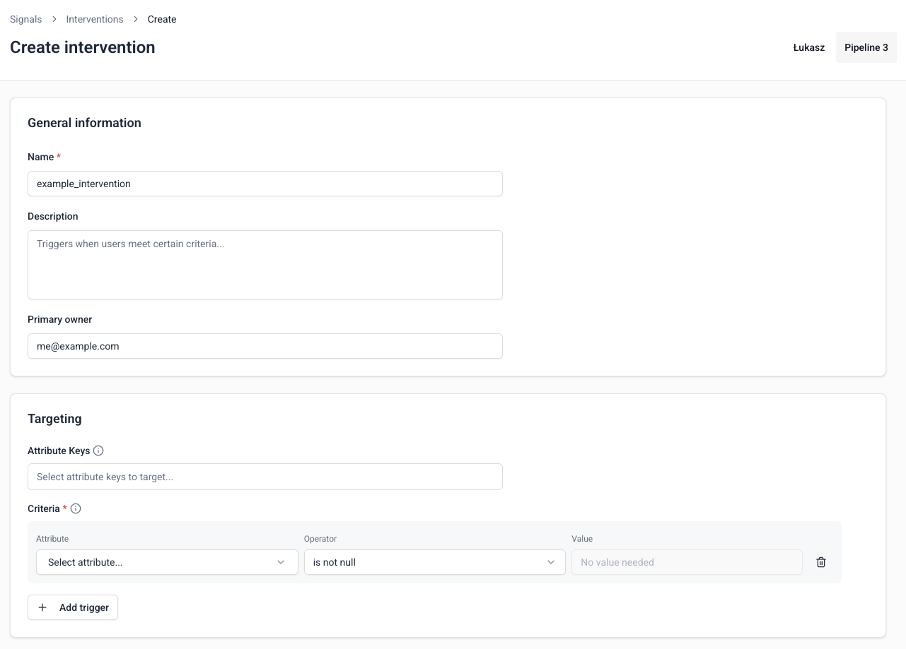
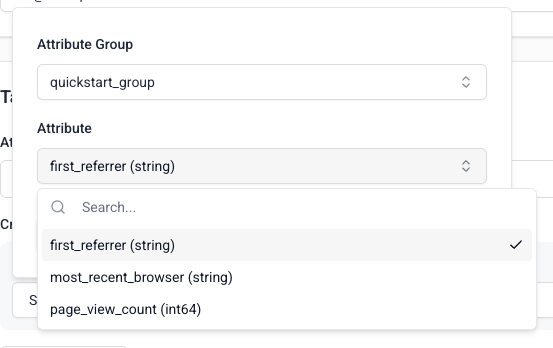
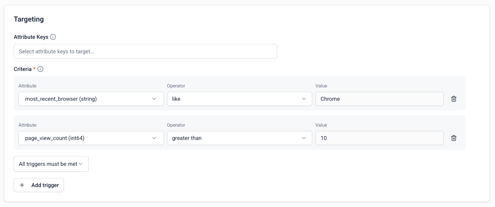
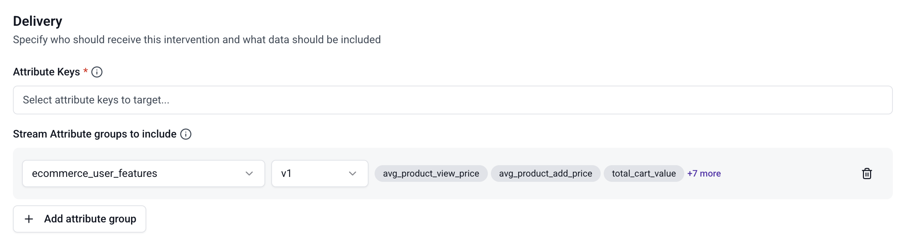
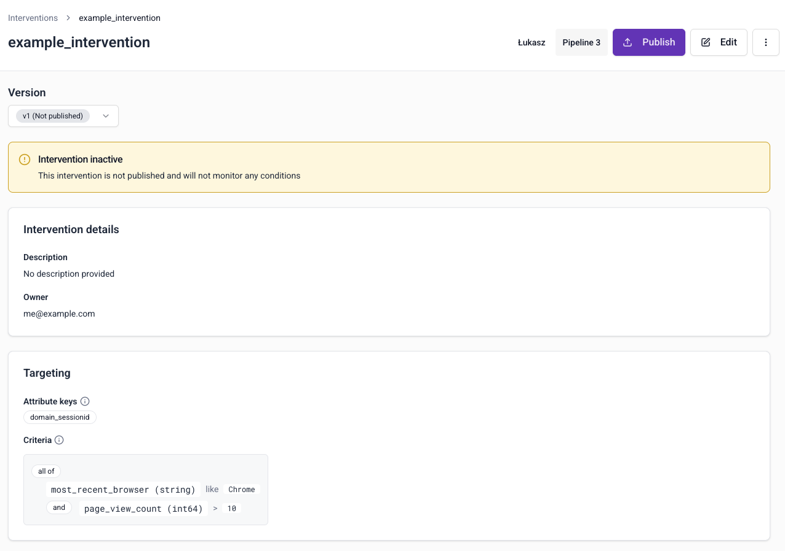
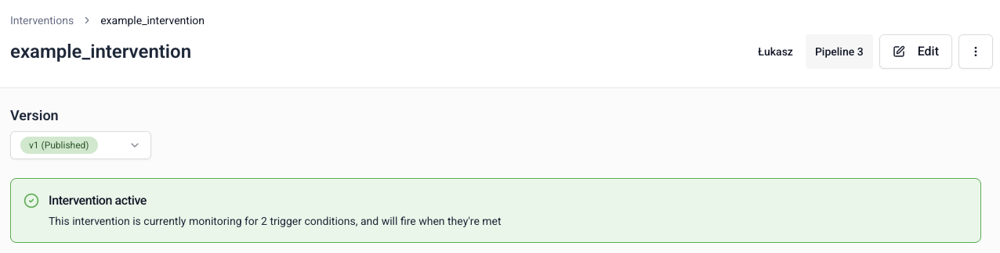
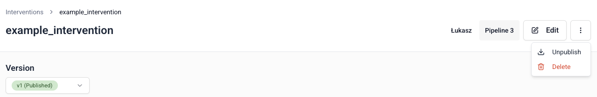
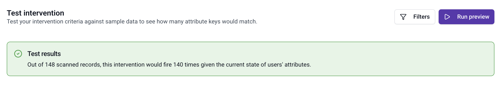
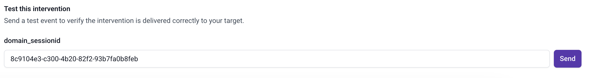

```mdx-code-block
import Tabs from '@theme/Tabs';
import TabItem from '@theme/TabItem';
```

[Interventions](/docs/signals/concepts/index.md#interventions) are automated triggers that enable real-time actions based on user behavior. You'll need to define them, as described on this page, and [subscribe](/docs/signals/applications/subscribe/index.md) to them in your application.

There are three methods for defining interventions in Signals:
* Snowplow Console UI
* [Signals Python SDK](https://pypi.org/project/snowplow-signals/)
* [Signals API](/docs/signals/connection/index.md#signals-api)

Signals has two [types of interventions](/docs/signals/concepts/index.md#types-of-intervention): rule-based interventions, which trigger automatically when their criteria are met, and [direct interventions](#direct-interventions), which you push manually using the SDK or API.

<Tabs groupId="signals-impl" queryString>
<TabItem value="console" label="Console" default>

To create an intervention using the UI, go to **Signals** > **Interventions** in Snowplow Console and follow the instructions.

The first step is to specify:
* A unique name
* An optional description
* The email address of the primary owner or maintainer



Next, configure when the intervention should trigger.

</TabItem>
<TabItem value="sdk" label="Python SDK">

Start by [connecting to Signals](/docs/signals/connection/index.md) to create a `Signals` object. You'll need this connection to publish interventions.

Rule-based interventions use `RuleIntervention` objects. This is the minimum configuration needed to create an intervention definition:

```python
from snowplow_signals import RuleIntervention, InterventionCriterion

hello_intervention = RuleIntervention(
    name="say_hello",
    owner="me@example.com",
    criteria=InterventionCriterion(
        attribute="example_group:test_attribute",
        operator="is not null",
    ),
)

sp_signals.publish([hello_intervention])
```

Once applied and active, this intervention will trigger the first time Signals processes an event that first sets the `example_group` attribute group's `test_attribute` attribute to a value that is not null (e.g. the first time it gets set).

The table below lists all available arguments for a `RuleIntervention`:

| Argument                | Description                                                                                                                                                                   | Type                                                                                                              | Required? |
| ----------------------- | ----------------------------------------------------------------------------------------------------------------------------------------------------------------------------- | ----------------------------------------------------------------------------------------------------------------- | --------- |
| `name`                  | The unique name/identifier of the intervention                                                                                                                                | `string`                                                                                                          | ✅         |
| `owner`                 | Email address for the owner of this intervention definition                                                                                                                   | `string`                                                                                                          | ✅         |
| `description`           | A human-readable description of the intervention                                                                                                                              | `string`                                                                                                          | ❌         |
| `version`               | A numeric version for this definition                                                                                                                                         | `integer`                                                                                                         | ❌         |
| `target_attribute_keys` | List of attribute key names to publish this intervention to. If not defined, defaults to the attribute keys associated with any attribute groups you reference in `criteria`. | `string[]`                                                                                                        | ❌         |
| `criteria`              | Tree of `Criterion` expressions to evaluate against attribute key attributes                                                                                                  | One of: `InterventionCriterion`, `InterventionCriteriaAll`, `InterventionCriteriaAny`, `InterventionCriteriaNone` | ✅         |

</TabItem>
</Tabs>

## Criteria

Criteria are the conditional rules that determine when an intervention should trigger.

:::note[Sent once]
An intervention is sent only the first time the criteria are met. Read an example of how this works on the [fundamentals page](/docs/signals/concepts/index.md#targeting-example).
:::

When a referenced attribute is updated, the updated and previous states are evaluated against the criteria. If the previous state did not meet the conditions but the newly updated state does, the trigger activates. Criteria always refer to the latest published version of the attribute group that contains the attribute.

<Tabs groupId="signals-impl" queryString>
<TabItem value="console" label="Console" default>

Defining intervention criteria has three steps:
1. Select which attribute from a published attribute group to evaluate
2. Choose which logical operator to use
3. Enter the value to trigger on



When adding more than one criterion, you can require all or any of them to be met.



These attributes are both from groups with the `domain_userid` attribute key. Therefore, this intervention is targeted to users. When a [subscribed](/docs/signals/applications/subscribe/index.md) user reaches 10 page views while using Chrome, the intervention will trigger.

</TabItem>
<TabItem value="sdk" label="Python SDK">

The simplest `criteria` tree takes an `InterventionCriterion` instance, with possible arguments:

| Argument    | Description                                                              | Type                                                                                           |
| ----------- | ------------------------------------------------------------------------ | ---------------------------------------------------------------------------------------------- |
| `attribute` | The attribute group and attribute name to evaluate, separated by a colon | `string`                                                                                       |
| `operator`  | The operator used for evaluating the attribute                           | `str`, see table below                                                                         |
| `value`     | If required by the `operator`, the comparison value                      | `str`, `int`, `float`, `bool`, `list[str]`, `list[int]`, `list[float]`, `list[bool]` or `None` |

This table shows the available operators:

| Operator      | Description                 | Value is required? |
| ------------- | --------------------------- | ------------------ |
| `=`           | Equals                      | ✅                  |
| `!=`          | Not equals                  | ✅                  |
| `<`           | Less than                   | ✅                  |
| `>`           | Greater than                | ✅                  |
| `<=`          | Less than or equal          | ✅                  |
| `>=`          | Greater than or equal       | ✅                  |
| `like`        | Pattern matching (SQL LIKE) | ✅                  |
| `not like`    | Pattern not matching        | ✅                  |
| `rlike`       | Regex pattern matching      | ✅                  |
| `not rlike`   | Regex not matching          | ✅                  |
| `in`          | Value in list               | ✅ (list)           |
| `not in`      | Value not in list           | ✅ (list)           |
| `is null`     | Value is null/empty         | ❌                  |
| `is not null` | Value exists                | ❌                  |

For more complex conditions, `criteria` also accepts `InterventionCriteriaAll`, `InterventionCriteriaAny`, and `InterventionCriteriaNone`.
You can use these classes to combine multiple criteria as lists with the following parameters:

| Argument                   | Description                                                                                                  | Parameters                        |
| -------------------------- | ------------------------------------------------------------------------------------------------------------ | --------------------------------- |
| `InterventionCriteriaAll`  | Logically AND all the inner criteria. Only trigger if all the nested criteria are also true/triggered.       | `all`: list of nested `criteria`  |
| `InterventionCriteriaAny`  | Logically OR all the inner criteria. Only trigger if at least one of the nested criteria are true/triggered. | `any`: list of nested `criteria`  |
| `InterventionCriteriaNone` | Logically NOR all the inner criteria. Only trigger if all of the nested criteria are false/untriggered.      | `none`: list of nested `criteria` |

These support nesting, so you can create complex conditions if required:

```python
from snowplow_signals import (
    RuleIntervention,
    InterventionCriterion,
    InterventionCriteriaAll,
    InterventionCriteriaAny,
    InterventionCriteriaNone,
)

criteria = InterventionCriteriaAll(all=[
    InterventionCriterion(attribute="mygroup:pageview_count", operator=">=", value=3),
    InterventionCriteriaAny(any=[...]),
    InterventionCriteriaNone(none=[...]),
])
```

</TabItem>
</Tabs>

## Target and payload

Interventions are delivered to [attribute keys](/docs/signals/concepts/index.md#targeting). By default, the intervention will target the attribute keys of the attribute groups defined in the criteria. Specify attribute keys if you want different targets.

<Tabs groupId="signals-impl" queryString>
<TabItem value="console" label="Console" default>

Define a custom intervention target scope by selecting attribute keys. These are the attribute keys that will receive the information.

You can also select one or more attribute groups to be sent with the intervention. When the intervention triggers, it will include the latest values for all attributes in the selected groups.



</TabItem>
<TabItem value="sdk" label="Python SDK">

Use the `target_attribute_keys` argument to set custom targets. This example shows how to use criteria and targeting together:

```python
from snowplow_signals import (
    RuleIntervention,
    InterventionCriterion,
    InterventionCriteriaAll,
    LinkAttributeKey,
)

cart_abandonment = RuleIntervention(
    name="cart_abandonment_discount",
    owner="marketing@company.com",
    description="Offer discount when high-value cart is abandoned",
    criteria=InterventionCriteriaAll(all=[
        InterventionCriterion(
            attribute="shopping:cart_value",
            operator=">",
            value=75.00
        ),
        InterventionCriterion(
            attribute="shopping:minutes_since_last_activity",
            operator=">=",
            value=15
        ),
    ]),
    target_attribute_keys=[
        LinkAttributeKey(name="domain_userid")
    ]  # Target individual users
)

sp_signals.publish([cart_abandonment])
```

It will trigger based on attribute changes within the `shopping` attribute group, but only if all conditions are met.

</TabItem>
</Tabs>

## Publish and manage the intervention

Interventions only become active once published to your Signals infrastructure. Signals will then start monitoring attribute value changes.

<Tabs groupId="signals-impl" queryString>
<TabItem value="console" label="Console" default>

Once you're happy with your intervention configuration, click **Create intervention** to save it. It will be saved as a draft, and not yet available to Signals.



Click the **Edit** button if you want to make changes to the intervention.

To send the intervention configuration to your Signals infrastructure, click the **Publish** button.



The intervention page also includes sample code to help you subscribe to it. Read more about this on the [subscription](/docs/signals/applications/subscribe/index.md) page.

</TabItem>
<TabItem value="sdk" label="Python SDK">

Use the [`publish()` method](/docs/signals/attributes/index.md#publish-and-manage-configurations) to register rule-based interventions with Signals:

```python
sp_signals.publish([hello_intervention])
```

</TabItem>
</Tabs>

### Versioning

Interventions are versioned. This allows you to iterate on the definitions without breaking downstream processes. All interventions start as `v1`.

Within criteria, the attributes are always evaluated based on the latest published version of the attribute group that contains the attribute. For example, if `attribute_group` v1, v2, and v3 all have the required `attribute`, v3 will be used. If you then publish `attribute_group` v4, which removes `attribute`, v3 will still be used.

<Tabs groupId="signals-impl" queryString>
<TabItem value="console" label="Console" default>

If you make changes to the definition, the version will be automatically incremented.

</TabItem>
<TabItem value="sdk" label="Python SDK">

Use `version=1` for the first version of an intervention. After publishing, if you want to change the definition in any way, iterate the version number.

</TabItem>
</Tabs>

### Unpublish or delete

To unpublish or delete an intervention in Console, click the `⋮` button on the details page.



Unpublishing is version specific. You can republish it later if needed. Choose **Delete** to permanently delete all versions of the intervention.

With the Python SDK, use the [`unpublish()` and `delete()` methods](/docs/signals/attributes/index.md#publish-and-manage-configurations).

## Test the intervention

Signals provides two ways to test an intervention in Snowplow Console: a preview you can run before publishing, and a live test you can trigger once the intervention is published.

### Preview

While defining an intervention, you can preview how many users would have received it by running it against the current state of your warehouse data. Click **Run preview** to see how many attribute keys match the criteria you've defined.



### Send a test intervention

Once the intervention is published, you can send a test by specifying a particular attribute key identifier. Signals will dispatch an intervention to that identifier so you can verify your subscription is set up correctly and diagnose any connection errors before relying on it in production.



## Direct interventions

Direct interventions have no criteria, and are not tied to attribute values. They use `InterventionInstance` objects, and are pushed to Signals using `push_intervention`, rather than being published like other configuration objects.

:::note[Not available in Snowplow Console]
Direct interventions are only available using the [Signals Python SDK](https://pypi.org/project/snowplow-signals/) or [Signals API](/docs/signals/connection/index.md#signals-api).
:::

You can directly push these interventions to any attribute keys. If the intervention is valid, Signals will immediately deliver it to any subscribers for the targeted attribute key IDs.

```python
from snowplow_signals import AttributeKeyIdentifiers, InterventionInstance, Signals

# The specific attribute key IDs to publish the intervention to
targets = AttributeKeyIdentifiers({
  "domain_sessionid": ["8c9104e3-c300-4b20-82f2-93b7fa0b8feb"],
})

sp_signals.push_intervention(
  targets,
  InterventionInstance(
    name="my_intervention",
    version=1,
  )
)
```
