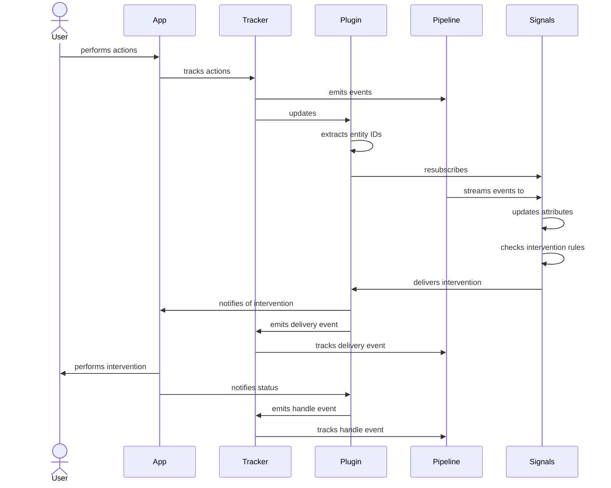

Interventions are a way to communicate that an action should be performed to work towards better outcomes for particular entities.

Each intervention is usually only valid "in the moment", so they have a limited lifetime and are not repeatedly sent if consumers aren't requesting them.
This pairs well with the Signals streaming engine, which:
- processes data in near-real-time for users that are using your offering right now
- can publish interventions at an individual entity level in real time based on changes to its attributes


Your application decides how to react to a delivered intervention.

Because [entities are configurable](/docs/signals/configuration/entities/index.md), the targeting used for interventions can be as broad or specific as you like, including:
- a specific user/session
- a specific pageview that a user is in the middle of
- all users on a specific page
- all users currently on your site/app

## Publishing interventions

Interventions can be published to any combination of entities via the API, or automatically generated when entity-level conditions are met via rules you set.

### Stream-based interventions via Signals

You can [define interventions](/docs/signals/configuration/interventions/index.md) and a set of rules to trigger them via the [Signals Python SDK](/docs/signals/configuration/index.md).

As the Signals streaming engine [processes](/docs/signals/configuration/stream-calculations/index.md) Snowplow events, it will calculate any [attributes you have configured](/docs/signals/configuration/attributes/index.md) as views.
As the attribute values get updated, the streaming engine will evaluate the entity's attributes against the rules you have defined.
If the attribute group matches the rules you define, the rest of your intervention definition gets published as an intervention targeting the entity.

Any users listening for interventions on their entities should then receive the intervention, and your application can then react to it and perform actions.

### Custom intervention via the API

You can also publish custom interventions to any entities you like at any time using the Signals SDK/API.
If the intervention is valid, it will immediately be published to any subscribers for the targeted entity IDs, which can then react and perform actions based on it.

<!-- TODO: SDK does not yet support publishing interventions and we don't seem to be documenting the raw API -->

## Receiving interventions

You can request interventions from the Signals API.
Authenticated users can request interventions in bulk for many entity IDs using the Signals Python SDK, or anonymous users can request interventions for a limited number of specific entity IDs, intended for client devices.

### Intervention payload

Once delivered, interventions contain the following information:

| Argument | Description | Type | Required? |
| --- | --- | --- | --- |
| `intervention_id` | A unique identifier for this triggered instance | `string` | ✅ |
| `name` | The unique name/identifier of the intervention | `string` | ✅ |
| `version` | A numeric version for this intervention's definition (if applicable) | `integer` | ✅ |
| `method` | The type of action the intervention triggers | One of:  `clear_attribute`, `set_attribute`, `script`, `computer_use_agent`, `remote_agent` | ✅ |
| `target_agents` | List of agents intended to handle the action of this intervention | `string[]` | ❌ |
| `script_uri` | URI of the resource to execute to perform the intended action of this intervention | `string` | ❌ |
| `context` | Custom data to provide as context to the agent that will perform the action of this intervention | `object` | ✅ |
| `context.$attributes` | An object containing the target entity's attributes when the intervention was triggered | `object` | ❌ |

:::warning

The intervention payload is under review and likely to change.
Expect the following changes:
- `method`, `target_agents`, `script_uri`, and `context`: deprecated
- `context.$attributes`: To become `attributes`
- `targetEntity`: To contain the entity type/name that is the target of the entity

Handlers will be required to know how to react based on the `name` until Actions are released.

:::

### Retrieving interventions with the Signals SDK

<!-- TODO: SDK does not yet support retrieving interventions and we don't seem to be documenting the raw API -->

### Retrieving interventions on the web with the Browser Tracker plugin

You can deploy the [Signals Interventions plugin](https://github.com/jethron/snowplow-javascript-tracker/tree/signals-plugin) <!-- TODO: Update URL to prod repo once merged --> on your website with the [Snowplow web trackers](/docs/sources/trackers/web-trackers/index.md) to allow individual visitors to subscribe to interventions relevant to them.

In the below example we:

1. use the Browser Tracker to create a Snowplow tracker
2. install the plugin
3. add custom handlers to react to the interventions
4. subscribe to interventions

```typescript
import { newTracker } from '@snowplow/browser-tracker';
import {
  SignalsInterventionsPlugin,
  addInterventionHandlers,
  subscribeToInterventions,
} from '@snowplow/browser-plugin-signals-interventions';

newTracker('sp1', '{{collector_url}}', {
  appId: 'my-app-id',
  plugins: [ SignalsInterventionsPlugin() ], // install the Signals Intervention plugin
});

addInterventionHandlers({
  myHandler(intervention) {
    console.log("intervention received!", intervention); // add custom handlers
  },
});

subscribeToInterventions({
  endpoint: "00000000-0000-0000-0000-000000000000.svc.snplow.net", // subscribe to interventions
});
```

By default the plugin will automatically subscribe to interventions for the `domain_userid` and `domain_sessionid` entities.
Any rule-based interventions triggered by attributes that target those entities will be delivered as they get processed by the stream engine.

You can optionally configure the plugin to listen for additional entities as well.
In the below example, we configure a specific entity ID and instructions for how to extract further entity IDs from Snowplow events that tracker generates.
Entities will be requested for the following entities:

- `domain_userid`: (unique visitor ID value)
- `domain_sessionid`: (unique session ID value)
- `pageview_id`: (unique page view ID value)
- `app`: (configured tracker app ID value)
- `myCustomEntity`: `unique value`

(The `mistake` entity will not be subscribed to because the plugin can not find an ID value to use since that isn't a valid event field)

```typescript
subscribeToInterventions({
  endpoint: "00000000-0000-0000-0000-000000000000.svc.snplow.net", // Signals API endpoint
  entityTargets: {
    pageview_id: "context/com.snowplowanalytics.snowplow/web_page/id",
    app: "app_id",
    mistake: "not_a_real_field",
  },
  entityIds: {
    myCustomEntity: "unique value",
  },
});
```

If you track multiple pageviews and the `pageview_id` entity ID value changes, the plugin will automatically disconnect and resubscribe to the new entity ID value as new values are observed.

If an intervention is published to any of these entities while the subscription is open, the `myHandler` function above will be called with the intervention payload.

#### Intervention tracking

When the plugin receives interventions and dispatches them to handler functions, it will generate Snowplow tracking events.
The following self-describing events are generated, and include the intervention payload as a custom entity:

<!-- TODO: link to iglu central once published -->
- `iglu:com.snowplowanalytics.signals/intervention_receive/jsonschema/1-0-0`: Fires when an intervention is received by the plugin
- `iglu:com.snowplowanalytics.signals/intervention_handle/jsonschema/1-0-0`: Fires when a custom handler is passed the intervention payload and reports successful handling (does not return an error)
- `iglu:com.snowplowanalytics.signals/intervention_handle_error/jsonschema/1-0-0`: Fires when a custom handler is passed the intervention payload and reports failure (throws an error)

#### Limitations of anonymous intervention subscriptions

Unauthenticated subscribers to interventions are subject to the following limitations:

- Only a single ID per entity type allowed per subscription
- No more than 50 types of entity may be subscribed at a time

<!-- TODO: disallowed entity types (user_id/pii reasons), per-ip connection limits -->

#### Dataflow

The communication flow when using the plugin is as follows:


