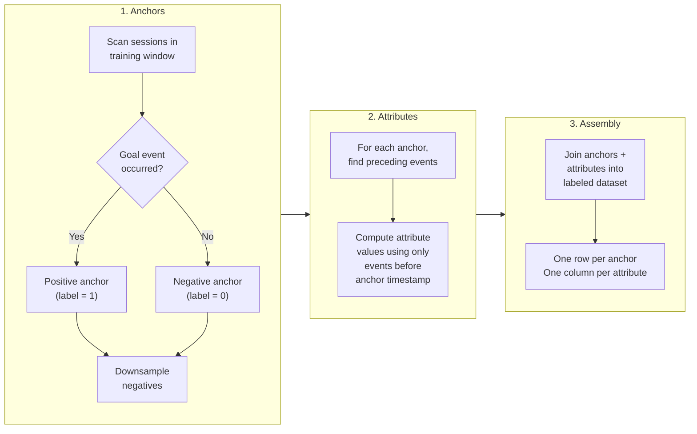

The Signals dataset builder lets you create labeled training datasets for machine learning models directly from your Snowplow event data. It generates point-in-time correct features from your existing [attribute groups](/docs/signals/attributes/attribute-groups/index.md), so the features your model trains on are identical to the features it receives at inference time.

Training a machine learning model on behavioral data requires a dataset where each row represents a moment in time, with features computed only from events that had occurred up to that point. Building these datasets manually is error-prone: it is easy to accidentally include future information (data leakage), which produces models that perform well in testing but fail in production. The dataset builder automates this process, enforcing point-in-time correctness by construction.

Start by [connecting to Signals](/docs/signals/connection/index.md) to create a `Signals` client object.

## Why point-in-time correctness matters

When you serve predictions in real time, your model only has access to events that have happened so far in the session. If your training data includes attributes computed from the full session (including events after the prediction point), your model learns patterns it will never see in production. This is called data leakage, and it is the most common reason ML models degrade after deployment.

The dataset builder prevents this by computing each attribute value using only events that occurred before the anchor timestamp. Because it uses the same attribute group definitions that power your real-time Signals deployment, training and serving are guaranteed to use the same feature logic.

## Workflow

Building and using an ML training dataset follows this process:

1. [Define your attribute groups](/docs/signals/attributes/attribute-groups/index.md) with the features you want your model to learn from (e.g. `product_view_count`, `add_to_cart_count`)
2. Build the dataset SQL bundle by calling the appropriate method - `build_dataset_with_session_anchors()` for auto-generated anchors, or `build_dataset_with_custom_anchors()` for a pre-existing anchor table
3. Optionally inspect or save the generated SQL
4. Execute the SQL against your warehouse to produce the training dataset
5. Train your model on the resulting DataFrame
6. Deploy your model, serving it the same attributes in real time via [Retrieve attributes](/docs/signals/applications/retrieve-attributes/index.md)

## How it works

The dataset builder produces a training dataset in three stages:



1. Anchors: scan sessions within the training window and identify anchor points. Sessions where the goal event occurred produce positive anchors (label=1). Sessions without the goal produce negative anchors (label=0). Negative anchors are downsampled to avoid class imbalance.
2. Attributes: for each anchor, compute attribute values using only the events that preceded the anchor timestamp in that session. This enforces point-in-time correctness, so attributes reflect only what was known at the moment of the anchor.
3. Assembly: join anchors with their computed attribute values into a single labeled dataset, with one row per anchor and one column per attribute.

For example, if you define two attributes (`product_view_count` and `add_to_cart_count`) with a transaction goal, the final dataset looks like this:

| domain_sessionid | anchor_ts | label | product_view_count | add_to_cart_count |
| --- | --- | --- | --- | --- |
| `abc-123` | 2024-01-15 09:32:00 | 1 | 5 | 2 |
| `def-456` | 2024-01-15 10:01:00 | 0 | 3 | 0 |
| `ghi-789` | 2024-01-16 14:22:00 | 1 | 8 | 4 |

Each row captures the attribute values as they were at the anchor timestamp, not at the end of the session. A model trained on this data learns the same signal it will see when serving predictions in real time.

## Define anchors

Anchors are the labeled events that form the rows of your training dataset. Each anchor is a point in a session that receives a label: `1` if the user achieved the goal, `0` if they did not.

Signals provides two approaches: session anchors (automatically derived from your event data) and user-supplied anchors (from a table you provide). You choose between them by calling different methods on the Signals client.

### Session anchors

Use `build_dataset_with_session_anchors()` to automatically generate anchors from your event data. You specify a goal (the criteria that define a positive outcome) and a time window to scan. Signals scans all sessions in the training window and labels each based on whether the goal was achieved. For positive sessions, anchors are placed at the goal event itself. For negative sessions (where the goal was never achieved), anchors are placed at randomly selected events within the session. Negative anchors are then downsampled according to `max_negative_ratio` to avoid class imbalance.

```python
from datetime import datetime, timezone

from snowplow_signals import (
    Criteria,
    Criterion,
    EventProperty,
    TrainingSpan,
)

bundle = sp_signals.build_dataset_with_session_anchors(
    attribute_groups=[my_attribute_group],
    goal_criteria=Criteria(
        any=[
            Criterion.eq(
                EventProperty(
                    vendor="com.snowplowanalytics.snowplow.ecommerce",
                    name="snowplow_ecommerce_action",
                    major_version=1,
                    path="type",
                ),
                "transaction",
            ),
        ]
    ),
    training_span=TrainingSpan(
        start_time=datetime(2024, 1, 1, tzinfo=timezone.utc),
        end_time=datetime(2024, 4, 1, tzinfo=timezone.utc),
    ),
)
```

| Argument | Description | Type | Required? |
| --- | --- | --- | --- |
| `attribute_groups` | Attribute groups that provide the feature columns. Each attribute in these groups becomes a column in the final dataset. | `list[AttributeGroup]` | ✅ |
| `goal_criteria` | Criteria that define a positive anchor (label=1) | `Criteria` | ✅ |
| `training_span` | Time window to scan for anchor events | `TrainingSpan` | ✅ |
| `min_events` | Minimum number of prior in-session events before an anchor is eligible. Increase this to filter out anchors with too little behavioral signal, for example set to `5` to ensure each anchor has at least 5 prior events. | `int` | Default: `1` |
| `max_anchors_per_session` | Maximum anchor events per session. `None` for unlimited. Set this to limit overrepresentation of long sessions, for example set to `1` to ensure each session contributes at most one training example. | `int` or `None` | Default: `None` |
| `max_negative_ratio` | Maximum ratio of negative to positive anchors. Negative anchors are downsampled to this ratio. Lower values produce more balanced datasets; higher values preserve more data. For example, set to `1.0` for a balanced 1:1 dataset. | `float` | Default: `5.0` |
| `excluded_events` | Events to exclude from anchor generation. By default, `page_ping` events are excluded because they do not represent meaningful user actions. | `list` | Default: `page_ping` events excluded |
| `anchors_table` | Custom output table location for the anchors table. By default, a table named `signals_anchors` is created in your warehouse. | `WarehouseTable` | Default: `None` |
| `attributes_table` | Override the output table location for the intermediate attribute tables. During execution, one table is created per attribute key (e.g. `signals_attributes_domain_sessionid`), joining each anchor with its point-in-time attribute values. | `AttributesWarehouseTable` | Default: `None` |
| `dataset_table` | Custom output table location for the final assembled dataset. By default, a table named `signals_training_dataset` is created in your warehouse. | `WarehouseTable` | Default: `None` |
| `max_lookback_days` | How far back from each anchor timestamp to look for events when computing attributes. By default, this is derived from the longest period defined across your attributes. Set a lower value to narrow the event window, or a higher value to include older events. | `int` | Default: derived from attribute periods |

### User-supplied anchors

If you already have a table of labeled anchor events, use `build_dataset_with_custom_anchors()` instead. Your table must contain the following columns:

| Column | Type | Description |
| --- | --- | --- |
| Attribute key column (e.g. `domain_sessionid`) | `VARCHAR` | The attribute key used by your attribute groups. The column name must match the attribute key name. |
| `anchor_ts` | `TIMESTAMP` | The timestamp of the anchor event |
| `label` | `INTEGER` | `1` for positive, `0` for negative. Only required when `anchors_have_label` is `True`. |

For example, if your attribute groups use `domain_sessionid` as the attribute key:

| domain_sessionid | anchor_ts | label |
| --- | --- | --- |
| `abc-123` | 2024-01-15 09:32:00 | 1 |
| `def-456` | 2024-01-15 10:01:00 | 0 |

```python
from snowplow_signals import WarehouseTable

bundle = sp_signals.build_dataset_with_custom_anchors(
    attribute_groups=[my_attribute_group],
    anchors_table=WarehouseTable(
        database="analytics",
        schema="ml",
        table="my_anchor_events",
    ),
    anchors_have_label=True,
)
```

| Argument | Description | Type | Required? |
| --- | --- | --- | --- |
| `attribute_groups` | Attribute groups that provide the feature columns. Each attribute in these groups becomes a column in the final dataset. | `list[AttributeGroup]` | ✅ |
| `anchors_table` | Table containing your pre-built anchor events | `WarehouseTable` | ✅ |
| `anchors_have_label` | Whether the source table contains a `label` column. Set to `False` if your anchors are unlabeled. | `bool` | Default: `True` |
| `attributes_table` | Override the output table location for the intermediate attribute tables. During execution, one table is created per attribute key (e.g. `signals_attributes_domain_sessionid`), joining each anchor with its point-in-time attribute values. | `AttributesWarehouseTable` | Default: `None` |
| `dataset_table` | Override the output table location for the final assembled dataset | `WarehouseTable` | Default: `None` |
| `max_lookback_days` | How far back from each anchor timestamp to look for events when computing attributes. By default, this is derived from the longest period defined across your attributes. | `int` | Default: derived from attribute periods |

## Inspect and save the SQL bundle

Both `build_dataset_with_session_anchors()` and `build_dataset_with_custom_anchors()` return a `DatasetBundle` containing the generated SQL files. Inspecting the generated SQL is useful for understanding exactly what queries will run against your warehouse, verifying the logic before execution, or sharing with your data team for review. You can save them to disk or execute them directly.

### Save SQL to disk

Use `save_to()` to write the generated SQL files, a manifest, and a README to a directory. This is useful for reviewing the SQL before execution or committing it to version control.

```python
bundle.save_to("./dataset_output")
```

This creates:

- Individual SQL files for each stage (`signals_anchors.sql`, `signals_attributes_domain_sessionid.sql`, `signals_training_dataset.sql`)
- `manifest.json` with input configuration and output table mappings
- `README.md` documenting the execution order

## Execute against your warehouse

Once you have a `DatasetBundle`, execute the SQL against your warehouse to produce the training dataset. The dataset builder executes SQL directly against the same data warehouse that your Signals deployment reads from. The warehouse connection is configured separately from your Signals API credentials because the queries run against your warehouse, not through the Signals API.

### Snowflake

Snowflake supports [key-pair authentication](https://docs.snowflake.com/en/user-guide/key-pair-auth) for programmatic access, where `private_key` is the DER-encoded private key from your Snowflake key pair. Wrap your Snowflake connection in a `SnowflakeConnection` and pass it to `execute()`.

```python
import snowflake.connector
from snowplow_signals.execution.snowflake import SnowflakeConnection

sf_conn = SnowflakeConnection(
    snowflake.connector.connect(
        account=os.environ["SNOWFLAKE_ACCOUNT"],
        user=os.environ["SNOWFLAKE_USER"],
        warehouse=os.environ["SNOWFLAKE_WAREHOUSE"],
        private_key=private_key_der,
    )
)

result = bundle.execute(sf_conn)
```

The `execute()` method returns an `ExecutionResult` that holds references to the tables created in your warehouse. You can then call `to_pandas()` on the result to fetch the final dataset as a DataFrame.

It runs three stages in order:

1. Creates the anchors table (`signals_anchors`)
2. Creates one attribute table per attribute key (e.g. `signals_attributes_domain_sessionid`), joining each anchor with its point-in-time attribute values
3. Assembles the final training dataset (`signals_training_dataset`) by joining all tables together

If a stage fails, it raises an `ExecutionError` with the name of the failed stage, the target table, and the underlying cause.

### Get results as a DataFrame

After execution, call `to_pandas()` to pull the training dataset into a pandas DataFrame, ready for model training. By default, it fetches up to 10,000 rows.

```python
df = result.to_pandas()
```

The resulting DataFrame contains one row per anchor, with columns for the attribute key, anchor timestamp, label, and every attribute from your attribute groups:

| | domain_sessionid | anchor_ts | label | product_view_count | add_to_cart_count |
| --- | --- | --- | --- | --- | --- |
| 0 | abc-123 | 2024-01-15 09:32:00 | 1 | 5 | 2 |
| 1 | def-456 | 2024-01-15 10:01:00 | 0 | 3 | 0 |
| 2 | ghi-789 | 2024-01-16 14:22:00 | 1 | 8 | 4 |
