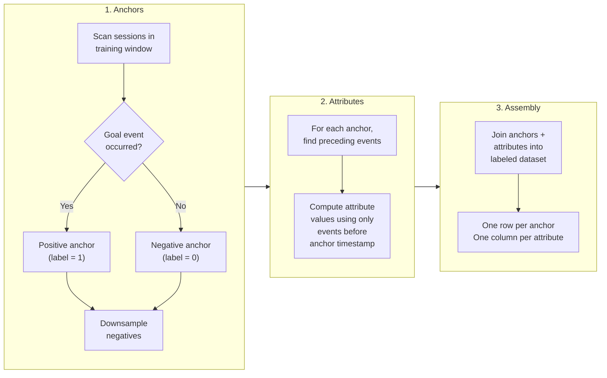

The Signals dataset builder lets you create labeled training datasets for machine learning models directly from your Snowplow event data. It generates point-in-time correct features from your existing [attribute groups](/docs/signals/attributes/attribute-groups/index.md), so the features your model trains on are identical to the features it receives at inference time.

Training a machine learning model on behavioral data requires a dataset where each row represents a moment in time, with features computed only from events that had occurred up to that point. Building these datasets manually is error-prone: it is easy to accidentally include future information (data leakage), which produces models that perform well in testing but fail in production. The dataset builder automates this process, enforcing point-in-time correctness by construction.

To follow along with a working example, open the [dataset builder notebook](https://colab.research.google.com/github/snowplow/documentation/blob/signals-dataset-builder/static/notebooks/signals-dataset-builder.ipynb) in Google Colab.

Start by [connecting to Signals](/docs/signals/connection/index.md) to create a `Signals` client object.

## Why point-in-time correctness matters

When you serve predictions in real time, your model only has access to events that have happened so far in the session. If your training data includes attributes computed from the full session (including events after the prediction point), your model learns patterns it will never see in production. This is called data leakage, and it is the most common reason ML models degrade after deployment.

The dataset builder prevents this by computing each attribute value using only events that occurred before the anchor timestamp. Because it uses the same attribute group definitions that power your real-time Signals deployment, training and serving are guaranteed to use the same feature logic.

## Workflow

Building and using an ML training dataset follows this process:

1. [Define your attribute groups](/docs/signals/attributes/attribute-groups/index.md) with the features you want your model to learn from (e.g. `product_view_count`, `add_to_cart_count`)
2. Submit a dataset run by calling the appropriate method - `submit_dataset_run_with_session_anchors()` for auto-generated anchors, or `submit_dataset_run_with_custom_anchors()` for a pre-existing anchor table
3. Poll for completion with `get_dataset_run_status()`, then retrieve a preview with `get_dataset_run_preview()`
4. Train your model on the resulting DataFrame
5. Deploy your model, serving it the same attributes in real time via [Retrieve attributes](/docs/signals/applications/retrieve-attributes/index.md)

## How it works

The dataset builder produces a training dataset in three stages:


```mermaid
flowchart LR
    subgraph stage1["1. Anchors"]
        direction TB
        A1["Scan sessions in<br>training window"] --> A2{"Goal event<br>occurred?"}
        A2 -- Yes --> A3["Positive anchor<br>(label = 1)"]
        A2 -- No --> A4["Negative anchor<br>(label = 0)"]
        A3 --> A5["Downsample<br>negatives"]
        A4 --> A5
    end

    subgraph stage2["2. Attributes"]
        direction TB
        B1["For each anchor,<br>find preceding events"] --> B2["Compute attribute<br>values using only<br>events before<br>anchor timestamp"]
    end

    subgraph stage3["3. Assembly"]
        direction TB
        C1["Join anchors +<br>attributes into<br>labeled dataset"] --> C2["One row per anchor<br>One column per attribute"]
    end

    stage1 --> stage2 --> stage3
```

1. Anchors: scan sessions within the training window and identify anchor points. Sessions where the goal event occurred produce positive anchors (label=1). Sessions without the goal produce negative anchors (label=0). Negative anchors are downsampled to avoid class imbalance.
2. Attributes: for each anchor, compute attribute values using only the events that preceded the anchor timestamp in that session. This enforces point-in-time correctness, so attributes reflect only what was known at the moment of the anchor.
3. Assembly: join anchors with their computed attribute values into a single labeled dataset, with one row per anchor and one column per attribute.

For example, if you define two attributes (`product_view_count` and `add_to_cart_count`) with a transaction goal, the final dataset looks like this:

| domain_sessionid | anchor_ts | label | product_view_count | add_to_cart_count |
| --- | --- | --- | --- | --- |
| `abc-123` | 2024-01-15 09:32:00 | 1 | 5 | 2 |
| `def-456` | 2024-01-15 10:01:00 | 0 | 3 | 0 |
| `ghi-789` | 2024-01-16 14:22:00 | 1 | 8 | 4 |

Each row captures the attribute values as they were at the anchor timestamp, not at the end of the session. A model trained on this data learns the same signal it will see when serving predictions in real time.

## Define anchors

Anchors are the labeled events that form the rows of your training dataset. Each anchor is a point in a session that receives a label: `1` if the user achieved the goal, `0` if they did not.

Signals provides two approaches: session anchors (automatically derived from your event data) and user-supplied anchors (from a table you provide). You choose between them by calling different methods on the Signals client.

### Session anchors

Use `submit_dataset_run_with_session_anchors()` to automatically generate anchors from your event data and build the training dataset server-side. You specify a goal (the criteria that define a positive outcome) and a time window to scan. Signals scans all sessions in the training window and labels each based on whether the goal was achieved. For positive sessions, anchors are placed at the goal event itself. For negative sessions (where the goal was never achieved), anchors are placed at randomly selected events within the session. Negative anchors are then downsampled according to `max_negative_ratio` to avoid class imbalance.

The `goal_criteria` argument uses the same `Criteria` and `Criterion` classes as [attribute criteria](/docs/signals/attributes/attributes/index.md). You can filter on atomic fields, event properties, or entity properties.

To match on an event name (an atomic field):

```python
from datetime import datetime, timezone

from snowplow_signals import (
    AtomicProperty,
    Criteria,
    Criterion,
    TrainingSpan,
)

run = sp_signals.submit_dataset_run_with_session_anchors(
    attribute_groups=[my_attribute_group],
    goal_criteria=Criteria(
        all=[
            Criterion.eq(AtomicProperty(name="event"), "transaction"),
        ]
    ),
    training_span=TrainingSpan(
        start_time=datetime(2024, 1, 1, tzinfo=timezone.utc),
        end_time=datetime(2024, 4, 1, tzinfo=timezone.utc),
    ),
)
```

To filter on a property within a self-describing event:

```python
from snowplow_signals import Criteria, Criterion, EventProperty, TrainingSpan

run = sp_signals.submit_dataset_run_with_session_anchors(
    attribute_groups=[my_attribute_group],
    goal_criteria=Criteria(
        all=[
            Criterion.eq(
                EventProperty(
                    vendor="com.snowplowanalytics.snowplow.ecommerce",
                    name="snowplow_ecommerce_action",
                    major_version=1,
                    path="type",
                ),
                "transaction",
            ),
        ]
    ),
    training_span=TrainingSpan(
        start_time=datetime(2024, 1, 1, tzinfo=timezone.utc),
        end_time=datetime(2024, 4, 1, tzinfo=timezone.utc),
    ),
)
```

| Argument | Description | Type | Required? |
| --- | --- | --- | --- |
| `attribute_groups` | Attribute groups that provide the feature columns. Each attribute in these groups becomes a column in the final dataset. | `list[AttributeGroup]` | ✅ |
| `goal_criteria` | Criteria that define a positive anchor (label=1) | `Criteria` | ✅ |
| `training_span` | Time window to scan for anchor events | `TrainingSpan` | ✅ |
| `min_events` | Minimum number of prior in-session events before an anchor is eligible. Increase this to filter out anchors with too little behavioral signal, for example set to `5` to ensure each anchor has at least 5 prior events. | `int` | Default: `1` |
| `max_anchors_per_session` | Maximum anchor events per session. `None` for unlimited. Set this to limit overrepresentation of long sessions, for example set to `1` to ensure each session contributes at most one training example. | `int` or `None` | Default: `None` |
| `max_negative_ratio` | Maximum ratio of negative to positive anchors. Negative anchors are downsampled to this ratio. Lower values produce more balanced datasets; higher values preserve more data. For example, set to `1.0` for a balanced 1:1 dataset. | `float` | Default: `5.0` |
| `excluded_events` | Events to exclude from anchor generation. By default, `page_ping` events are excluded because they do not represent meaningful user actions. | `list` | Default: `page_ping` events excluded |
| `anchors_table` | Override the output location for the anchors table. Only the `table` field is required - `database` and `schema` default to the output database and schema from your [Signals warehouse connection](/docs/signals/setup/index.md). The default table name is `signals_anchors`. | `WarehouseTable` | Default: `None` |
| `attributes_table` | Override the output location for the intermediate attribute tables. During execution, one table is created per attribute key (e.g. `signals_attributes_domain_sessionid`), joining each anchor with its point-in-time attribute values. Supports `database`, `schema`, and `table_prefix` fields - all default to the output database and schema from your [Signals warehouse connection](/docs/signals/setup/index.md). | `AttributesWarehouseTable` | Default: `None` |
| `dataset_table` | Override the output location for the final assembled dataset. Only the `table` field is required - `database` and `schema` default to the output database and schema from your [Signals warehouse connection](/docs/signals/setup/index.md). The default table name is `signals_training_dataset`. | `WarehouseTable` | Default: `None` |
| `max_lookback_days` | How far back from each anchor timestamp to look for events when computing attributes. By default, this is derived from the longest period defined across your attributes. Set a lower value to narrow the event window, or a higher value to include older events. | `int` | Default: derived from attribute periods |

#### Customizing output tables

By default, the dataset builder creates tables using the output database and schema from your [Signals warehouse connection](/docs/signals/setup/index.md). To write tables to a different location, pass a `WarehouseTable`. Only `table` is required - `database` and `schema` are optional overrides.

```python
from snowplow_signals import WarehouseTable

run = sp_signals.submit_dataset_run_with_session_anchors(
    ...
    dataset_table=WarehouseTable(
        table="my_training_dataset",   # required
        database="analytics",          # optional, defaults to Signals connection
        schema="ml",                   # optional, defaults to Signals connection
    ),
)
```

### User-supplied anchors

If you already have a table of labeled anchor events, use `submit_dataset_run_with_custom_anchors()` instead. Your table must contain the following columns:

| Column | Type | Description |
| --- | --- | --- |
| Attribute key column (e.g. `domain_sessionid`) | `VARCHAR` | The attribute key used by your attribute groups. The column name must match the attribute key name. |
| `anchor_ts` | `TIMESTAMP` | The timestamp of the anchor event |
| `label` | `INTEGER` | `1` for positive, `0` for negative. Only required when `anchors_have_label` is `True`. |

For example, if your attribute groups use `domain_sessionid` as the attribute key:

| domain_sessionid | anchor_ts | label |
| --- | --- | --- |
| `abc-123` | 2024-01-15 09:32:00 | 1 |
| `def-456` | 2024-01-15 10:01:00 | 0 |

```python
from snowplow_signals import WarehouseTable

run = sp_signals.submit_dataset_run_with_custom_anchors(
    attribute_groups=[my_attribute_group],
    anchors_table=WarehouseTable(
        database="analytics",
        schema="ml",
        table="my_anchor_events",
    ),
    anchors_have_label=True,
)
```

| Argument | Description | Type | Required? |
| --- | --- | --- | --- |
| `attribute_groups` | Attribute groups that provide the feature columns. Each attribute in these groups becomes a column in the final dataset. | `list[AttributeGroup]` | ✅ |
| `anchors_table` | Table containing your pre-built anchor events | `WarehouseTable` | ✅ |
| `anchors_have_label` | Whether the source table contains a `label` column. Set to `False` if your anchors are unlabeled. | `bool` | Default: `True` |
| `attributes_table` | Override the output location for the intermediate attribute tables. During execution, one table is created per attribute key (e.g. `signals_attributes_domain_sessionid`), joining each anchor with its point-in-time attribute values. Supports `database`, `schema`, and `table_prefix` fields - all default to the output database and schema from your [Signals warehouse connection](/docs/signals/setup/index.md). | `AttributesWarehouseTable` | Default: `None` |
| `dataset_table` | Override the output location for the final assembled dataset. Only the `table` field is required - `database` and `schema` default to the output database and schema from your [Signals warehouse connection](/docs/signals/setup/index.md). | `WarehouseTable` | Default: `None` |
| `max_lookback_days` | How far back from each anchor timestamp to look for events when computing attributes. By default, this is derived from the longest period defined across your attributes. | `int` | Default: derived from attribute periods |

## Poll for completion and retrieve results

The `submit_dataset_run_with_session_anchors()` and `submit_dataset_run_with_custom_anchors()` methods return a `DatasetRunResponse` immediately. The dataset is built server-side, so you need to poll for completion before retrieving results.

### Check run status

Use `get_dataset_run_status()` to check whether the run has finished. The `status` field is one of `pending`, `success`, or `failed`.

```python
status = sp_signals.get_dataset_run_status(run.id)
print(status.status)  # "pending", "success", or "failed"
```

To wait for completion in a notebook or script:

```python
import time
from snowplow_signals import DatasetRunStatus

while True:
    status = sp_signals.get_dataset_run_status(run.id)
    if status.status == DatasetRunStatus.SUCCESS:
        break
    if status.status == DatasetRunStatus.FAILED:
        raise RuntimeError("Dataset run failed")
    time.sleep(5)
```

### Get results as a DataFrame

Once the run status is `success`, call `get_dataset_run_preview()` to fetch a preview of the completed dataset. By default, it returns up to 100 rows. You can set `limit` up to 10,000.

```python
preview = sp_signals.get_dataset_run_preview(run.id, limit=10000)
df = preview.to_pandas()
```

The resulting DataFrame contains one row per anchor, with columns for the attribute key, anchor timestamp, label, and every attribute from your attribute groups:

| | domain_sessionid | anchor_ts | label | product_view_count | add_to_cart_count |
| --- | --- | --- | --- | --- | --- |
| 0 | abc-123 | 2024-01-15 09:32:00 | 1 | 5 | 2 |
| 1 | def-456 | 2024-01-15 10:01:00 | 0 | 3 | 0 |
| 2 | ghi-789 | 2024-01-16 14:22:00 | 1 | 8 | 4 |

The full dataset is also written to your warehouse at the table location shown in `run.dataset`. You can query this table directly for the complete result set.

### Cancel a run

To cancel a dataset build that is still in progress:

```python
sp_signals.cancel_dataset_run(run.id)
```

## Inspect the generated SQL

If you want to review the SQL that the dataset builder produces without executing it, use `build_dataset_with_session_anchors()` or `build_dataset_with_custom_anchors()`. These return a `DatasetBundle` containing the generated SQL files, which you can save to disk for inspection or manual execution.

```python
bundle = sp_signals.build_dataset_with_session_anchors(
    attribute_groups=[my_attribute_group],
    goal_criteria=goal,
    training_span=span,
)

bundle.save_to("./dataset_output")
```

This creates:

- Individual SQL files for each stage (`signals_anchors.sql`, `signals_attributes_domain_sessionid.sql`, `signals_training_dataset.sql`)
- `manifest.json` with input configuration and output table mappings
- `README.md` documenting the execution order
