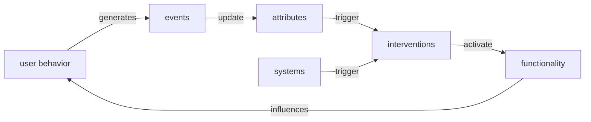
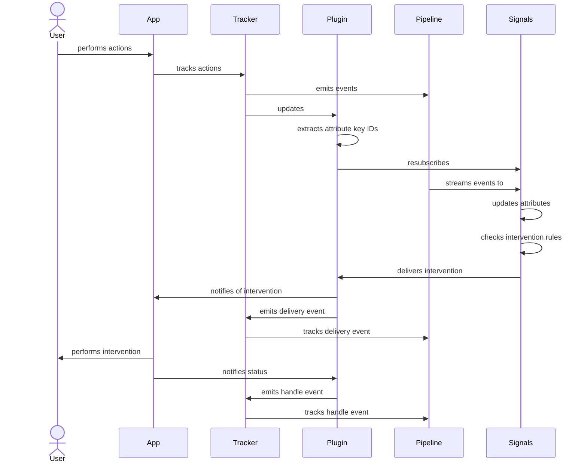

Interventions are a way to communicate that an action should be performed to work towards better outcomes for particular users.

Each intervention is usually only valid "in the moment", so they have a limited lifetime and are not repeatedly sent if consumers aren't requesting them.
This pairs well with the Signals streaming engine, which:
- Processes data in near-real-time for users that are using your offering right now
- Can publish interventions at an individual attribute key level in real time based on changes to its attributes



Your application decides how to react to a delivered intervention.

Because [attribute keys are configurable](/docs/signals/define-attributes/attribute-groups/index.md), the targeting used for interventions can be as broad or specific as you like, including:
- A specific user/session
- A specific pageview that a user is in the middle of
- All users on a specific page
- All users currently on your site/app

## Defining interventions

All configuration is defined using the Signals Python SDK, as shown here, or the Signals API.

### Minimal example

This is the minimum configuration needed to create an intervention definition:

```python
from snowplow_signals import RuleIntervention, InterventionCriterion

hello_intervention = RuleIntervention(
    name="say_hello",
    owner="me@example.com",
    criteria=InterventionCriterion(
        attribute="example_group:test_attribute",
        operator="is not null",
    ),
)
```

Once applied and active, this intervention will trigger the first time Signals processes an event that first sets the `example_group` attribute group's `test_attribute` attribute to a value that is not null (e.g. the first time it gets set).

### Options

The table below lists all available arguments for a `RuleIntervention`:

| Argument                | Description                                                                                                                                                                                                                                                                                                    | Type                                                                                                              | Required? |
| ----------------------- | -------------------------------------------------------------------------------------------------------------------------------------------------------------------------------------------------------------------------------------------------------------------------------------------------------------- | ----------------------------------------------------------------------------------------------------------------- | --------- |
| `name`                  | The unique name/identifier of the intervention                                                                                                                                                                                                                                                                 | `string`                                                                                                          | ✅         |
| `owner`                 | Email address for the owner of this intervention definition                                                                                                                                                                                                                                                    | `string`                                                                                                          | ✅         |
| `description`           | A human-readable description of the intervention                                                                                                                                                                                                                                                               | `string`                                                                                                          | ❌         |
| `version`               | A numeric version for this definition                                                                                                                                                                                                                                                                          | `integer`                                                                                                         | ❌         |
| `target_attribute_keys` | List of attribute key names to publish this intervention to. Any attribute keys in this list that have a value in the event that triggered the update will be targeted with the intervention. If not defined, defaults to the attribute keys associated with any attribute groups you reference in `criteria`. | `string[]`                                                                                                        | ❌         |
| `criteria`              | Tree of `Criterion` expressions to evaluate against attribute key attributes                                                                                                                                                                                                                                   | One of: `InterventionCriterion`, `InterventionCriteriaAll`, `InterventionCriteriaAny`, `InterventionCriteriaNone` | ✅         |

#### Evaluating attributes

The `criteria` tree defines the conditions that an attribute key's attributes should meet to be eligible for the intervention to trigger.

When a referenced attribute is updated, the updated and previous states are evaluated against the criteria; if the previous state did not meet the conditions but the newly updated state does, the trigger activates and the intervention gets published to the attribute keys that have a value and are defined in the `target_attributes_key` setting.
Criterion always refer to the latest published version of the attribute group that contained that attribute.

The simplest `criteria` tree takes an `InterventionCriterion` instance, with possible arguments:

| Argument    | Description                                                                | Type                                                                                                                        |
| ----------- | -------------------------------------------------------------------------- | --------------------------------------------------------------------------------------------------------------------------- |
| `attribute` | The attribute group and attribute name (separate by a colon) to evaluate.  | `string`                                                                                                                    |
| `operator`  | The operator used to compare the `attribute` to the `value` (if required). | One of: `=`, `!=`, `<`, `>`, `<=`, `>=`, `like`, `not like`, `in`, `not in`, `rlike`, `not rlike`, `is null`, `is not null` |
| `value`     | If required by the `operator`, the comparison value.                       | `str`, `int`, `float`, `bool`, `list[str]`, `list[int]`, `list[float]`, `list[bool]` or `None`                              |

For more complex conditions, `criteria` also accepts `InterventionCriteriaAll`, `InterventionCriteriaAny`, and `InterventionCriteriaNone`.
You can use these classes to combine multiple criteria as lists with the following parameters:

| Argument                   | Description                                                                                                  | Parameters                        |
| -------------------------- | ------------------------------------------------------------------------------------------------------------ | --------------------------------- |
| `InterventionCriteriaAll`  | Logically AND all the inner criteria. Only trigger if all the nested criteria are also true/triggered.       | `all`: list of nested `criteria`  |
| `InterventionCriteriaAny`  | Logically OR all the inner criteria. Only trigger if at least one of the nested criteria are true/triggered. | `any`: list of nested `criteria`  |
| `InterventionCriteriaNone` | Logically NOR all the inner criteria. Only trigger if all of the nested criteria are false/untriggered.      | `none`: list of nested `criteria` |

These support nesting, so you can create complex conditions if required:

```python
from snowplow_signals import (
    RuleIntervention,
    InterventionCriterion,
    InterventionCriteriaAll,
    InterventionCriteriaAny,
    InterventionCriteriaNone,
)

criteria = InterventionCriteriaAll(all=[
    InterventionCriterion(attribute="mygroup:pageview_count", operator=">=", value=3),
    InterventionCriteriaAny(any=[...]),
    InterventionCriteriaNone(none=[...]),
])
```

## Publishing interventions

Interventions can be published to current subscribers of any combination of attribute keys via the API -- or automatically published when attribute changes meet rules you set.

### Automatic stream-based interventions via Signals

You can define interventions with a set of rules to trigger them via the [Signals Python SDK](https://github.com/snowplow-incubator/snowplow-signals-sdk).

As the Signals streaming engine processes Snowplow events, it will calculate any attributes you have configured.
As the attribute values get updated, the streaming engine will evaluate the associated attribute key's attributes against the rules you have defined.
If the attributes match the rule conditions, the rest of your intervention definition gets published as an intervention targeting that attribute key.

Any users currently subscribed to interventions on their attribute keys will then receive the intervention, and your application can then react to it and perform actions.

### Custom intervention via the API

You can also publish custom interventions to any attribute keys you like at any time using the Signals SDK and API.
If the intervention is valid, it will immediately be published to any subscribers for the targeted attribute key IDs, which can then react and perform actions based on it.

```python
from snowplow_signals import AttributeKeyIdentifiers, InterventionInstance, Signals

# regular signals SDK authentication
sp_signals = Signals(
    api_url=SIGNALS_DEPLOYED_URL,
    api_key=CONSOLE_API_KEY,
    api_key_id=CONSOLE_API_KEY_ID,
    org_id=ORG_ID,
)

# attribute keys to publish the intervention to
targets = AttributeKeyIdentifiers({
  "domain_sessionid": ["8c9104e3-c300-4b20-82f2-93b7fa0b8feb"],
})

sp_signals.push_intervention(
  targets,
  InterventionInstance(
    name="my_intervention",
    version=1,
  )
)
```

## Receiving interventions

You can request interventions from the Signals API.
You and your applications can request interventions for specific attribute keys using the Signals Python SDK, and anonymous users can request interventions for their own attribute keys directly from your apps and webpages.

### Intervention payload

When delivered, interventions contain the following information:

| Argument                    | Description                                                                                    | Type      | Required? |
| --------------------------- | ---------------------------------------------------------------------------------------------- | --------- | --------- |
| `intervention_id`           | A unique identifier for this triggered intervention                                            | `string`  | ✅         |
| `name`                      | The unique name/identifier of the intervention                                                 | `string`  | ✅         |
| `version`                   | A numeric version for this intervention's definition (if applicable)                           | `integer` | ✅         |
| `attributes`                | An object containing the target attribute key's attributes when the intervention was triggered | `object`  | ✅         |
| `target_attribute_key`      | An object containing the attribute key information used to target this intervention            | `object`  | ✅         |
| `target_attribute_key.name` | They name of the attribute key used to target this intervention                                | `string`  | ✅         |
| `target_attribute_key.id`   | The attribute key value used to target this intervention                                       | `string`  | ✅         |

### Limitations of intervention subscriptions

All subscribers to interventions are subject to the following limitations:

- Only a single ID per attribute key is allowed per subscription
- No more than 5 attribute keys may be subscribed at a time (this is configurable via support ticket)
- You can not subscribe to the `user_id` attribute key
- You can only subscribe to attribute key IDs that are not enumerable (i.e. UUIDs) (this is configurable via support ticket)

<!-- TODO: per-ip connection limits? -->

### Retrieving interventions with the Signals SDK

The Signals SDK allows subscribing to interventions for arbitrary attribute keys.

```python
from snowplow_signals import AttributeKeyIdentifiers, InterventionInstance, Signals

# regular signals SDK authentication
sp_signals = Signals(
    api_url=SIGNALS_DEPLOYED_URL,
    api_key=CONSOLE_API_KEY,
    api_key_id=CONSOLE_API_KEY_ID,
    org_id=ORG_ID,
)

# attribute keys to subscribe to
targets = AttributeKeyIdentifiers({
  "domain_sessionid": ["8c9104e3-c300-4b20-82f2-93b7fa0b8feb"],
})

subscription = sp_signals.pull_interventions(targets)

subscription.add_handler(print) # add a custom handler to be called with each intervention received

subscription.start() # open the subscription request and begin fetching interventions as they are published

intervention_instance = subscription.get() # blocks waiting for an intervention

# the intervention will be printed because we added `print` as a handler above

print(intervention_instance) # print the received intervention a second time

subscription.stop() # cancel the subscription and abort the connection/background thread
```

### Retrieving interventions on the web with the Browser Tracker plugin

You can deploy the [Signals Interventions plugin](https://github.com/snowplow-incubator/signals-browser-plugin) <!-- TODO: Update URL to non-private repo --> on your website with the [Snowplow web trackers](/docs/sources/trackers/web-trackers/index.md) to allow individual visitors to subscribe to interventions relevant to them.

In the below example we:

1. use the Browser Tracker to create a Snowplow tracker
2. install the plugin
3. add custom handlers to react to the interventions
4. subscribe to interventions

```typescript
import { newTracker } from '@snowplow/browser-tracker';
import {
  SignalsInterventionsPlugin,
  addInterventionHandlers,
  subscribeToInterventions,
} from '@snowplow/browser-plugin-signals-interventions';

newTracker('sp1', '{{collector_url}}', {
  appId: 'my-app-id',
  plugins: [ SignalsInterventionsPlugin() ], // install the Signals Intervention plugin
});

addInterventionHandlers({
  myHandler(intervention) {
    console.log("intervention received!", intervention); // add custom handlers
  },
});

subscribeToInterventions({
  endpoint: "000000000000.signals.snowplowanalytics.com", // subscribe to interventions
});
```

By default the plugin will automatically subscribe to interventions for the `domain_userid` and `domain_sessionid` attribute keys.
Any rule-based interventions triggered by attributes that target those attribute keys will be published as they get processed by the stream engine.

You can optionally configure the plugin to listen for additional attribute keys as well.
In the below example, we configure a specific attribute key and instructions for how to extract further attribute keys from Snowplow events that the tracker generates.
Interventions will be requested targeting the following attribute keys:

- `domain_userid`: (unique visitor ID value)
- `domain_sessionid`: (unique session ID value)
- `pageview_id`: (unique page view ID value)
- `app`: (configured tracker app ID value)
- `myCustomAttributeKey`: `unique value`

(The `mistake` attribute key will not be subscribed to because the plugin can not find an ID value to use since that isn't a valid event field)

```typescript
subscribeToInterventions({
  endpoint: "000000000000.signals.snowplowanalytics.com", // Signals API endpoint
  attributeKeyTargets: {
    pageview_id: "context/com.snowplowanalytics.snowplow/web_page/id",
    app: "app_id",
    mistake: "not_a_real_field",
  },
  attributeKeyIds: {
    myCustomAttributeKey: "unique value",
  },
});
```

If you track multiple pageviews and the `pageview_id` attribute key value changes, the plugin will automatically disconnect and resubscribe to the new attribute key value as value changes are observed.

If an intervention is published to any of these attribute keys while the subscription is open, the `myHandler` function above will be called with the intervention payload.

#### Intervention tracking

When the plugin receives interventions and dispatches them to handler functions, it will generate Snowplow tracking events.
The following self-describing events are generated, and include the intervention payload as a custom entity:

<!-- TODO: link to iglu central once published -->
- `iglu:com.snowplowanalytics.signals/intervention_receive/jsonschema/1-0-0`: Fires when an intervention is received by the plugin
- `iglu:com.snowplowanalytics.signals/intervention_handle/jsonschema/1-0-0`: Fires when a custom handler is passed the intervention payload and reports successful handling (does not return an error)
- `iglu:com.snowplowanalytics.signals/intervention_handle_error/jsonschema/1-0-0`: Fires when a custom handler is passed the intervention payload and reports failure (throws an error)

#### Dataflow

The communication flow when using the plugin is as follows:


