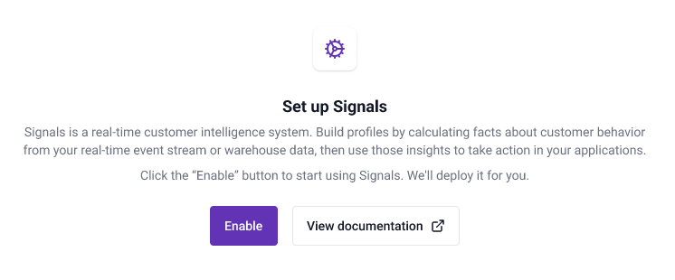
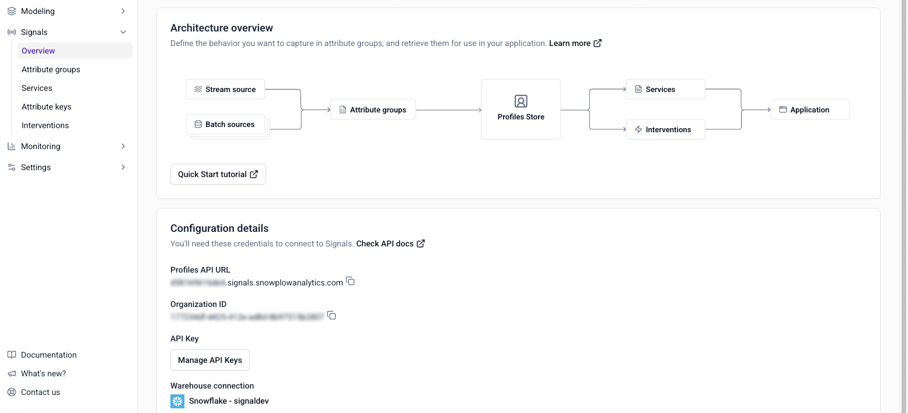

Before you can define attributes or interventions, you'll need to enable Signals for your organization. This is a one-time task, done in [Snowplow Console](https://console.snowplowanalytics.com).

If you don't have a Snowplow account yet, sign up for a [Snowplow free trial](https://snowplow.io/get-started/snowplow-free-trial) to experience Signals in Console.

## Enable Signals

Log in to Console and navigate to the **Signals** section. Click **Enable** to start setting up Signals.

:::note[Warehouse connection]
Signals can also be deployed without connecting to a warehouse. Only Snowflake and BigQuery are supported currently.
:::

You'll need to:
* Select which warehouse to use
* Specify your warehouse account details
* Specify your Snowplow atomic events table
* Run the provided script

Click **Test and create connection** to trigger the Signals deployment. You'll be able to start using Signals as soon as the infrastructure is ready.

## Next steps

Once the infrastructure is ready, navigate to the **Signals** section to manage Signals in the UI. Use the configuration interface to define [attribute groups](/docs/signals/attributes/attribute-groups/index.md), [services](/docs/signals/applications/services/index.md), and [interventions](/docs/signals/interventions/index.md).

To work with Signals programmatically, using the SDKs or API instead of (or alongside) Console, see [Connect to Signals](/docs/signals/connection/index.md).
