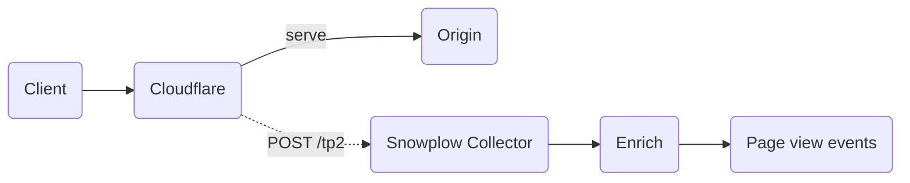

If your website is served through Cloudflare, you can send page view events to Snowplow via a [Cloudflare Worker](https://developers.cloudflare.com/workers/) to capture visits from bots, AI agents, and other clients that don't execute JavaScript. Snowplow processes each request as a [page view event](/docs/fundamentals/events/index.md), which appears alongside your existing web analytics events.

See [CDN trackers](/docs/sources/cdn-trackers/index.md) for background on how CDN-level tracking compares to client-side web tracking.

Depending on your monthly number of requests, you will likely require a [Workers Paid plan](https://developers.cloudflare.com/workers/platform/pricing/).

## How it works

The Worker intercepts every request to your website, forwards it to the origin as usual, and sends a page view event to the Snowplow Collector in the background.



## Set up

Follow Cloudflare documentation to:
* [Create a worker](https://developers.cloudflare.com/workers/get-started/dashboard/) and add the worker script below
* [Route your website to the worker](https://developers.cloudflare.com/workers/configuration/routing/routes/#set-up-a-route-in-the-dashboard)

If you are already using Workers, you will need to add the code to your existing worker script.

### Worker script

See the comments in the script for the parts you need to customize. The script includes built-in filtering for user agents and URI paths — see [filter events before ingestion](#filter-events-before-ingestion) for details.

<details>
<summary>Reference worker script</summary>

```javascript
// Add your Snowplow collector domain name here.
// IMPORTANT: Do not use domains registered via Cloudflare,
//            as that can lead to DNS resolution issues inside a worker script.
//            CDI customers can opt for the <name>.collector.snplow.net domain instead.
// highlight-start
const collectorUrl =
  "https://<collector-domain>/com.snowplowanalytics.snowplow/tp2";
// highlight-end

// Headers to forward to Snowplow.
const forwardHeaders = ["referer", "signature-agent", "signature-input", "signature"];

// App id to include with the events.
// highlight-start
const appId = "my-app"
// highlight-end

// Case-insensitive substrings used to identify AI-agent traffic
// in the User-Agent header. Extend as needed.
// highlight-start
const agentUaSubstrings = [
  "claude",       // Claude Code, Claude Desktop, anthropic-* clients
  "chatgpt",      // ChatGPT app
  "gptbot",       // OpenAI's crawler
  "openai",       // other OpenAI clients
  "gemini",       // Google Gemini
  "perplexity",   // Perplexity
  "copilot",      // GitHub Copilot / Microsoft Copilot
];
// highlight-end

// Returns true if the User-Agent matches a known AI agent.
function isAgent(userAgent) {
  if (!userAgent) return false;
  const lower = userAgent.toLowerCase();
  return agentUaSubstrings.some((needle) => lower.includes(needle));
}

// Returns true if the request looks like a page rather than a static asset.
// Requests without a file extension (e.g. /about, /api/users) pass through,
// as do known content files like /llms.txt.
function shouldTrackRequest(pathname) {
  // highlight-start
  const dotIndex = pathname.lastIndexOf('.');
  if (dotIndex === -1 || dotIndex < pathname.lastIndexOf('/')) return true;
  return pathname.endsWith('llms.txt');
  // highlight-end
}

async function trackRequest(request) {
  const headers = {
    "content-type": "application/json",
    // This prevents the tracking of the user or agent IP address.
    // We recommend anonymous tracking for two reasons:
    //   1) There is no mechanism for the user to opt out,
    //      since the IP address will be collected upon the very first visit.
    //   2) With a focus on bot/agent traffic, IP address is not very relevant.
    "sp-anonymous": "*",
  };
  for (const name of forwardHeaders) {
    const value = request.headers.get(name);
    if (value) headers[name] = value;
  }

  const payload = {
    schema: "iglu:com.snowplowanalytics.snowplow/payload_data/jsonschema/1-0-4",
    data: [
      {
        e: "pv",
        ua: request.headers.get("user-agent"),
        aid: appId,
        p: "srv",
        tv: "cf-worker-1.0.0",
        url: request.url,
      },
    ],
  };

  await fetch(collectorUrl, {
    method: "POST",
    headers,
    body: JSON.stringify(payload),
  });
}

export default {
  async fetch(request, env, ctx) {
    const url = new URL(request.url);
    const response = await fetch(request);

    const ua = request.headers.get("user-agent");
    if (isAgent(ua) && shouldTrackRequest(url.pathname)) {
      ctx.waitUntil(trackRequest(request));
    }

    return response;
  },
};
```

</details>

:::note[No impact on response time]

The [`ctx.waitUntil`](https://developers.cloudflare.com/workers/runtime-apis/context/#waituntil) call ensures that the request is tracked. It does not add extra latency or block the response to the client.

:::

## Filter events before ingestion

Without filtering, the Worker sends a Snowplow event for every request, including images, fonts, JavaScript files, and other static assets. The reference script above includes two filters to keep event volume manageable:

1. **User agent filtering** — the `isAgent` function retains only requests from known AI agents (Claude, ChatGPT, Gemini, etc.) based on case-insensitive substrings in the `User-Agent` header. Extend the `agentUaSubstrings` array to match additional agents.

2. **URI filtering** — the `shouldTrackRequest` function drops requests for static assets. It treats any path with a file extension as an asset, except for specific content files like `/llms.txt`. Paths without an extension (e.g., `/about`, `/api/users`) pass through as page views.

A request must pass both checks to be tracked. To track all traffic regardless of user agent, remove the `isAgent(ua)` check from the main handler.

## Event fields

Each tracked request produces a page view event with the following fields (as well as all relevant fields added by enrichments, e.g., `page_urlpath`, `page_urlquery`):

| Field | Value | Description |
|-------|-------|-------------|
| `event` | `page_view` | Event type |
| `platform` | `srv` | Server-side, to distinguish from browser events |
| `app_id` | your app id | Application identifier, so you can filter these events in your data |
| `v_tracker` | `cf-worker-1.0.0` | Tracker version |
| `useragent` | from the original request | The visitor's `User-Agent` header |
| `page_url` | from the original request | The URL of the requested page |
| `refr_url` | from the original request | The referring URL, if present |
