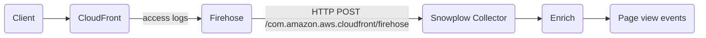

If your website is served through Amazon CloudFront, you can forward access logs to Snowplow to capture page views from bots, AI agents, and other clients that don't execute JavaScript. Snowplow processes each log entry as a [page view event](/docs/fundamentals/events/index.md), which integrates naturally with your existing web analytics.

This integration uses [CloudFront standard logging](https://docs.aws.amazon.com/AmazonCloudFront/latest/DeveloperGuide/AccessLogs.html) with Amazon Data Firehose as the delivery mechanism. Firehose forwards log batches to the Snowplow Collector via HTTP, where they are processed by the CloudFront Firehose adapter in Enrich. This adapter is available from Enrich 6.12.0.

:::note[CDN tracking vs. web tracking]

CDN-level tracking captures all requests, including from bots and agents that don't run JavaScript. However, for single-page applications, multiple client-side page views typically correspond to only a single CDN request. Treat CDN events and browser events as complementary rather than equivalent.

:::

## How it works

CloudFront sends batches of access log records to a Firehose stream. Firehose forwards each batch to the Snowplow Collector, and Enrich produces one page view event per log entry.



The following CloudFront log fields are mapped to Snowplow event fields:

| CloudFront field | Snowplow field | Notes |
|---|---|---|
| `x-host-header` | `page_url` | Combined with `cs-uri-stem` and `cs-uri-query` to form the full URL |
| `cs-uri-stem` | `page_urlpath` | |
| `cs-uri-query` | `page_urlquery` | |
| `cs(Referer)` | `page_referrer` | |
| `cs(User-Agent)` | `useragent` | |
| `timestamp(ms)` | `dvce_sent_tstamp` | Milliseconds since epoch |
| `c-ip` | `user_ipaddress` | Optional — see note on IP collection below |

In addition to the mapped fields, every event has the following fixed values:

| Field | Value |
|---|---|
| `event` | `page_view` |
| `platform` | `srv` |
| `v_tracker` | `com.amazon.aws.cloudfront/firehose` |
| `app_id` | `cloudfront` by default; override with the `aid` query parameter |

To set a custom `app_id`, append `?aid=<value>` to the collector endpoint URL when configuring Firehose.

:::note[IP address collection]

CloudFront access logs contain the visitor IP address in the `c-ip` field, and there is no mechanism for visitors to opt out of IP collection at the CDN level. For this reason, we recommend omitting `c-ip` from the fields you enable in CloudFront. If you do include it, consider pairing this with the [IP anonymization enrichment](/docs/pipeline/enrichments/available-enrichments/ip-anonymization-enrichment/index.md).

:::

## Set up

You need a CloudFront distribution, permission to create IAM roles, S3 buckets, and Firehose streams in your AWS account, and your Snowplow Collector endpoint.

### Create an S3 bucket

Firehose requires an S3 bucket as a backup destination for records it cannot deliver. Create a bucket in `us-east-1`.

:::note[Region requirement]

CloudFront standard logging via Firehose requires the Firehose stream to be in the `us-east-1` region. This is an AWS constraint — streams in other regions will not receive CloudFront log records.

:::

### Create a Firehose stream

Create an Amazon Data Firehose stream in `us-east-1` with the following settings:

| Setting | Value |
|---|---|
| Source | Direct PUT |
| Destination | HTTP endpoint |
| HTTP endpoint URL | `https://<collector-host>/com.amazon.aws.cloudfront/firehose` |
| Content encoding | **None** — do not enable GZIP |
| Buffering — interval | 300 seconds |
| Buffering — size | 5 MiB |
| S3 backup | Your bucket from the previous step |

For the retry duration, 3600 seconds (one hour) is a reasonable default. Longer retries reduce the risk of data loss if the Collector is temporarily unavailable.

:::warning[Do not enable content encoding]

The CloudFront Firehose adapter does not support GZIP-compressed payloads. If content encoding is enabled, Enrich will reject the requests.

:::

### Enable CloudFront standard logging

In the CloudFront console, open your distribution and navigate to **Standard logging**. Enable it, set the format to **JSON**, and select the Firehose stream you created.

Choose which log fields to include. At minimum, include:

- `timestamp(ms)` — used as the event send timestamp
- `x-host-header` — required to construct the page URL; without it, no URL is produced
- `cs-uri-stem` — path component of the URL
- `cs-uri-query` — query string component of the URL
- `cs(User-Agent)` — visitor user agent
- `cs(Referer)` — referring URL

We recommend **not** including `c-ip`. See the note on IP address collection above.

## Filter events before ingestion

CloudFront logs every request, including images, fonts, JavaScript files, and other static assets. Without filtering, you will ingest a much higher event volume than necessary — potentially five times or more compared to client-side events — which increases cost and Collector load.

You can filter records before they reach Snowplow using Firehose's [data transformation](https://docs.aws.amazon.com/firehose/latest/dev/create-transform.html) feature. When enabled, Firehose invokes an AWS Lambda function on each batch. The Lambda tags individual records as `Ok`, `Dropped`, or `ProcessingFailed`; only `Ok` records are delivered to the Collector.

The following is a reference Lambda implementation that retains only records whose user agent matches known AI agents and drops everything else:

```python
"""
Firehose data-transformation Lambda for CloudFront ingestion.

Retains only access-log records whose cs(User-Agent) field matches a
known AI agent. Everything else is dropped before it reaches the Collector.

Runtime: Python 3.12
Handler: lambda_handler
Timeout: 60s
Memory: 128 MB
"""

import base64
import json
import logging

logger = logging.getLogger()
logger.setLevel(logging.INFO)

# Extend this list to match additional agents.
AGENT_UA_SUBSTRINGS = (
    "claude",       # Claude, Anthropic clients
    "chatgpt",      # ChatGPT
    "gptbot",       # OpenAI crawler
    "openai",       # Other OpenAI clients
    "gemini",       # Google Gemini
    "perplexity",   # Perplexity
    "copilot",      # GitHub Copilot / Microsoft Copilot
)

USER_AGENT_FIELD = "cs(User-Agent)"


def is_agent(user_agent):
    if not user_agent or user_agent == "-":
        return False
    lower = user_agent.lower()
    return any(needle in lower for needle in AGENT_UA_SUBSTRINGS)


def classify(record):
    try:
        payload = base64.b64decode(record["data"])
        log_entry = json.loads(payload)
    except Exception as e:
        logger.warning("Could not parse record %s: %s", record.get("recordId"), e)
        return "ProcessingFailed"
    ua = log_entry.get(USER_AGENT_FIELD, "")
    return "Ok" if is_agent(ua) else "Dropped"


def lambda_handler(event, context):
    output = []
    for record in event["records"]:
        result = classify(record)
        output.append({
            "recordId": record["recordId"],
            "result": result,
            "data": record["data"],
        })
    return {"records": output}
```

You can extend `AGENT_UA_SUBSTRINGS` to include additional user agents, or replace the filtering logic to suit your use case — for example, to also drop requests for static assets based on the `cs-uri-stem` field.
