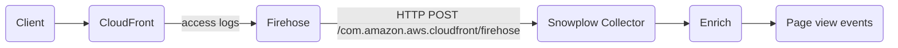

If your website is served through Amazon CloudFront, you can forward access logs to Snowplow to capture page views from bots, AI agents, and other clients that don't execute JavaScript. Snowplow processes each log entry as a [page view event](/docs/fundamentals/events/index.md), which appears alongside your existing web analytics events.

See [CDN trackers](/docs/sources/cdn-trackers/index.md) for background on how CDN-level tracking compares to client-side web tracking.

:::note[Availability]

This integration requires Enrich 6.12 or newer.

:::

## How it works

This integration uses [CloudFront standard logging](https://docs.aws.amazon.com/AmazonCloudFront/latest/DeveloperGuide/AccessLogs.html) with Amazon Data Firehose as the delivery mechanism.

CloudFront sends batches of access log records to a Firehose stream. Firehose forwards each batch to the Snowplow Collector, and Enrich produces one page view event per log entry.


```mermaid
flowchart LR
  client(Client) --> cf(CloudFront)
  cf -->|access logs| firehose(Firehose)
  firehose -->|"HTTP POST /com.amazon.aws.cloudfront/firehose"| collector(Snowplow Collector)
  collector --> enrich(Enrich)
  enrich --> events(Page view events)
```

Enrich maps CloudFront log fields to Snowplow event fields — see [event fields](#event-fields) for the full reference.

:::note[IP address collection]

CloudFront access logs contain the visitor IP address in the `c-ip` field, and there is no mechanism for visitors to opt out of IP collection at the CDN level. For this reason, omit `c-ip` from the fields you enable in CloudFront. If you do include it, consider pairing this with the [IP anonymization enrichment](/docs/pipeline/enrichments/available-enrichments/ip-anonymization-enrichment/index.md).

:::

## Set up

You need a CloudFront distribution, permission to create IAM roles, S3 buckets, and Firehose streams in your AWS account, and your Snowplow Collector endpoint.

### Create an S3 bucket

Firehose requires an S3 bucket as a backup destination for records it cannot deliver. Create a bucket in `us-east-1`.

:::note[Region requirement]

CloudFront standard logging via Firehose requires the Firehose stream to be in the `us-east-1` region. This is an AWS constraint — streams in other regions will not receive CloudFront log records.

:::

### Create a Firehose stream

Create an Amazon Data Firehose stream in `us-east-1` with the following settings:

| Setting | Value |
|---|---|
| Source | Direct PUT |
| Destination | HTTP endpoint |
| HTTP endpoint URL | `https://<collector-host>/com.amazon.aws.cloudfront/firehose` |
| Content encoding | **None** — do not enable GZIP |
| Buffering — interval | 300 seconds |
| Buffering — size | 5 MiB |
| S3 backup | Your bucket from the previous step |

For the retry duration, 3600 seconds (one hour) is a reasonable default. Longer retries reduce the risk of data loss if the Collector is temporarily unavailable.

:::warning[Do not enable content encoding]

The CloudFront Firehose adapter does not support GZIP-compressed payloads. If content encoding is enabled, Enrich will reject the requests.

:::

### Enable CloudFront standard logging

In the CloudFront console, open your distribution and navigate to **Standard logging**. Enable it, set the format to **JSON**, and select the Firehose stream you created.

Choose which log fields to include. At minimum, include:

- `timestamp(ms)` — used as the event send timestamp
- `x-host-header` — required to construct the page URL; without it, no URL is produced
- `cs-uri-stem` — path component of the URL
- `cs-uri-query` — query string component of the URL
- `cs(User-Agent)` — visitor user agent
- `cs(Referer)` — referring URL

Avoid including `c-ip`. See the note on IP address collection above.

## Filter events before ingestion

CloudFront logs every request, including images, fonts, JavaScript files, and other static assets. Without filtering, you will ingest a much higher event volume than necessary — potentially five times or more compared to client-side events — which increases cost and Collector load.

You can filter records before they reach Snowplow using Firehose's [data transformation](https://docs.aws.amazon.com/firehose/latest/dev/create-transform.html) feature. When enabled, Firehose invokes an AWS Lambda function on each batch. The Lambda tags individual records as `Ok`, `Dropped`, or `ProcessingFailed`; only `Ok` records are delivered to the Collector.

A typical filtering strategy combines two checks:

1. **User agent filtering** — retain only requests from known AI agents (Claude, ChatGPT, etc.)
2. **URI filtering** — drop requests for static assets (CSS, JS, images, fonts) that aren't meaningful page views

The following is a reference Lambda implementation that applies both filters. A record must pass both checks to be delivered to the Collector: the user agent must match a known AI agent, _and_ the URI must not end with a known asset extension.

<details>
<summary>Reference Lambda — user agent + URI filtering</summary>

```python
"""
Firehose data-transformation Lambda for CloudFront ingestion.

Keeps only access-log records that satisfy BOTH conditions:
  1. cs(User-Agent) looks like an AI agent (Claude, ChatGPT, etc.)
  2. cs-uri-stem is NOT an asset request (CSS, JS, images, fonts, media)

Page hits and any non-asset URL pass through: static HTML (.html / .htm), the
site root (/), dynamic backends (.php, .aspx, .jsp), REST/SPA routes
(extension-less, e.g. /about or /api/users). Only unambiguous static assets are
dropped.

Runtime: Python 3.12
Handler: lambda_handler
Timeout: 60s
Memory: 128 MB
"""

import base64
import json
import logging

logger = logging.getLogger()
logger.setLevel(logging.INFO)

# Case-insensitive substrings used to identify AI-agent traffic in the
# User-Agent header. Extend as needed.
AGENT_UA_SUBSTRINGS = (
    "claude",        # Claude Code, Claude Desktop, anthropic-* clients
    "chatgpt",       # ChatGPT app
    "gptbot",        # OpenAI's crawler
    "openai",        # other OpenAI clients
    "gemini",        # Google Gemini
    "perplexity",    # Perplexity
    "copilot",       # GitHub Copilot / Microsoft Copilot
)

# Case-insensitive suffixes identifying static assets. URIs ending in any of
# these are dropped. Everything else — including HTML pages, dynamic backends,
# extension-less REST/SPA routes, and the site root — passes through.
ASSET_EXTENSIONS = (
    # Styles
    ".css",
    # Scripts
    ".js", ".mjs", ".map",
    # Images
    ".png", ".jpg", ".jpeg", ".gif", ".svg", ".webp", ".ico", ".bmp",
    ".tif", ".tiff", ".avif", ".heic",
    # Fonts
    ".woff", ".woff2", ".ttf", ".otf", ".eot",
    # Audio / Video
    ".mp3", ".wav", ".ogg", ".m4a", ".flac",
    ".mp4", ".webm", ".mov", ".m4v", ".avi", ".mkv", ".flv",
    # Archives / downloads
    ".zip", ".tar", ".gz", ".tgz", ".bz2", ".7z", ".rar",
)

USER_AGENT_FIELD = "cs(User-Agent)"
URI_STEM_FIELD = "cs-uri-stem"


def is_agent(user_agent):
    """Return True if user_agent looks like an AI agent."""
    if not user_agent or user_agent == "-":
        return False
    lower = user_agent.lower()
    return any(needle in lower for needle in AGENT_UA_SUBSTRINGS)


def is_asset_request(uri_stem):
    """Return True if uri_stem ends with a known static-asset extension."""
    if not uri_stem or uri_stem == "-":
        return False
    return uri_stem.lower().endswith(ASSET_EXTENSIONS)


def classify(record):
    """Decide what to do with a single Firehose record."""
    try:
        payload = base64.b64decode(record["data"])
        log_entry = json.loads(payload)
    except Exception as e:
        logger.warning("Could not parse record %s: %s", record.get("recordId"), e)
        return "ProcessingFailed"

    ua = log_entry.get(USER_AGENT_FIELD, "")
    stem = log_entry.get(URI_STEM_FIELD, "")
    if is_agent(ua) and not is_asset_request(stem):
        return "Ok"
    return "Dropped"


def lambda_handler(event, context):
    output = []
    for record in event["records"]:
        result = classify(record)
        output.append({
            "recordId": record["recordId"],
            "result": result,
            "data": record["data"],
        })
    return {"records": output}
```

</details>

You can adjust both filter lists to suit your use case. For example, if you want to be more conservative with URI filtering, a minimal set of `(".css", ".js", ".png", ".jpg", ".jpeg", ".gif", ".svg", ".ico", ".woff", ".woff2")` covers the most common static assets.

## Event fields

Each log entry produces a page view event. The following table shows how CloudFront log fields map to Snowplow event fields:

| Field | Value | Notes |
|-------|-------|-------|
| `event` | `page_view` | Event type |
| `platform` | `srv` | Server-side, to distinguish from browser events |
| `app_id` | `cloudfront` | Override with the `aid` query parameter on the collector endpoint URL |
| `v_tracker` | `com.amazon.aws.cloudfront/firehose` | Tracker version |
| `useragent` | from `cs(User-Agent)` | The visitor's `User-Agent` header |
| `page_url` | from `x-host-header`, `cs-uri-stem`, `cs-uri-query` | Combined to form the full URL |
| `page_urlpath` | from `cs-uri-stem` | Path component of the URL |
| `page_urlquery` | from `cs-uri-query` | Query string component of the URL |
| `page_referrer` | from `cs(Referer)` | The referring URL, if present |
| `dvce_sent_tstamp` | from `timestamp(ms)` | Milliseconds since epoch |
| `user_ipaddress` | from `c-ip` | Only if `c-ip` is included in the log fields |
