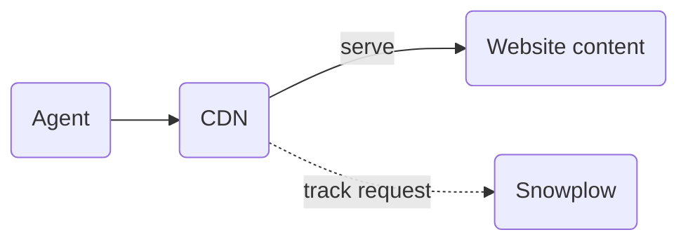

You might want to track page views by bots and AI agents to understand how they consume your content. Regular [web tracking](/docs/sources/web-trackers/index.md), however, does not capture these events because many bots and agents don't execute JavaScript.

If your website is deployed through a CDN, you can track events at that level, which would include _all_ requests.



:::note[CDN tracking vs. web tracking]

CDN-level tracking is complementary to client-side web tracking. While it surfaces traffic invisible to client-side tracking, it has its own blind spots.

For example, for single-page applications (SPAs), client-side tracking will correctly capture multiple page views. At the CDN level, the same set of page views would correspond to only a single request.

:::

## Cloudflare

You can add Snowplow tracking to Cloudflare via a [Cloudflare Worker](https://developers.cloudflare.com/workers/). Depending on your monthly number of requests, you will likely require a [Workers Paid plan](https://developers.cloudflare.com/workers/platform/pricing/).

Follow Cloudflare documentation to:
* [Create a worker](https://developers.cloudflare.com/workers/get-started/dashboard/) and add the following script
* [Route your website to the worker](https://developers.cloudflare.com/workers/configuration/routing/routes/#set-up-a-route-in-the-dashboard)

If you are already using Workers, you will need to add the code to your existing worker script.

:::note[Customization]

See the comments in the script for various parts you need to customize.

:::

```javascript
// Add your Snowplow collector domain name here.
// IMPORTANT: Do not use domains registered via Cloudflare,
//            as that can lead to DNS resolution issues inside a worker script.
//            CDI customers can opt for the <name>.collector.snplow.net domain instead.
// highlight-start
const collectorUrl =
  "https://<collector-domain>/com.snowplowanalytics.snowplow/tp2";
// highlight-end

// Headers to forward to Snowplow.
const forwardHeaders = ["referer", "signature-agent", "signature-input", "signature"];

// App id to include with the events.
// highlight-start
const appId = "my-app"
// highlight-end

// A helper function to decide which requests to track.
// If you track everything, you will receive Snowplow events for requests to static assets, including images, fonts, etc. This is probably too much.
// The example below filters it to just page requests and /llms.txt.
function shouldTrackRequest(pathname) {
  // highlight-start
  const dotIndex = pathname.lastIndexOf('.');
  if (dotIndex === -1 || dotIndex < pathname.lastIndexOf('/')) return true;
  return pathname.endsWith('llms.txt');
  // highlight-end
}

async function trackRequest(request) {
  const headers = {
    "content-type": "application/json",
    // This prevents the tracking of the user or agent IP address.
    // We recommend anonymous tracking for two reasons:
    //   1) There is no mechanism for the user to opt out,
    //      since the IP address will be collected upon the very first visit.
    //   2) With a focus on bot/agent traffic, IP address is not very relevant.
    "sp-anonymous": "*",
  };
  for (const name of forwardHeaders) {
    const value = request.headers.get(name);
    if (value) headers[name] = value;
  }

  const payload = {
    schema: "iglu:com.snowplowanalytics.snowplow/payload_data/jsonschema/1-0-4",
    data: [
      {
        e: "pv",
        ua: request.headers.get("user-agent"),
        aid: appId,
        p: "srv",
        tv: "cf-worker-1.0.0",
        url: request.url,
      },
    ],
  };

  await fetch(collectorUrl, {
    method: "POST",
    headers,
    body: JSON.stringify(payload),
  });
}

export default {
  async fetch(request, env, ctx) {
    const url = new URL(request.url);
    const response = await fetch(request);

    if (shouldTrackRequest(url.pathname)) {
      ctx.waitUntil(trackRequest(request));
    }

    return response;
  },
};
```

:::note[No impact on response time]

The [`ctx.waitUntil`](https://developers.cloudflare.com/workers/runtime-apis/context/#waituntil) call ensures that the request is tracked. It does not add extra latency or block the response to the client.

:::

You will receive the following fields in the events (as well as all relevant fields added by enrichments, e.g., `page_urlpath`, `page_urlquery`):

| Field | Value | Description |
|-------|-------|-------------|
| `event` | `page_view` | Event type: page view |
| `platform` | `srv` | Platform: server-side, to distinguish from browser events |
| `app_id` | your app id | Application identifier, so you can filter these events in your data |
| `v_tracker` | `cf-worker-1.0.0` | Tracker version |
| `useragent` | from the original request | The visitor's `User-Agent` header |
| `page_url` | from the original request | The URL of the requested page |

## CloudFront

If your website is served through Amazon CloudFront, you can forward standard access logs to Snowplow using Amazon Data Firehose. Firehose delivers log batches to the Snowplow Collector via HTTP, and Enrich produces one page view event per log entry.

See [CloudFront access logs via Firehose](/docs/sources/cdn-trackers/cloudfront/index.md) for setup instructions, including how to configure the Firehose stream, which log fields to enable, and how to filter events before ingestion using a Lambda function.