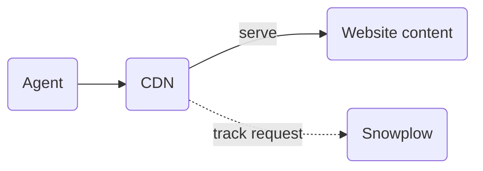

You might want to track page views by bots and AI agents to understand how they consume your content. Regular [web tracking](/docs/sources/web-trackers/index.md), however, does not capture these events because many bots and agents don't execute JavaScript.

If your website is deployed through a CDN, you can track events at that level, which would include _all_ requests.

```mermaid
flowchart LR
  agent(Agent) --> cdn(CDN) -->|serve| website(Website content)
  cdn -.->|track request| snowplow(Snowplow)
```

:::note[CDN tracking vs. web tracking]

CDN-level tracking is complementary to client-side web tracking. While it surfaces traffic invisible to client-side tracking, it has its own blind spots.

For example, for single-page applications (SPAs), client-side tracking will correctly capture multiple page views. At the CDN level, the same set of page views would correspond to only a single request.

:::

## Supported CDNs

* [Cloudflare](/docs/sources/cdn-trackers/cloudflare/index.md) — track requests using a Cloudflare Worker that sends page view events to Snowplow
* [CloudFront](/docs/sources/cdn-trackers/cloudfront/index.md) — forward CloudFront standard access logs to Snowplow via Amazon Data Firehose
