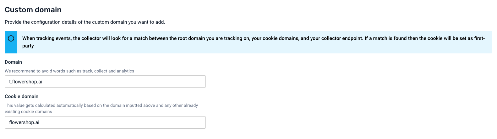
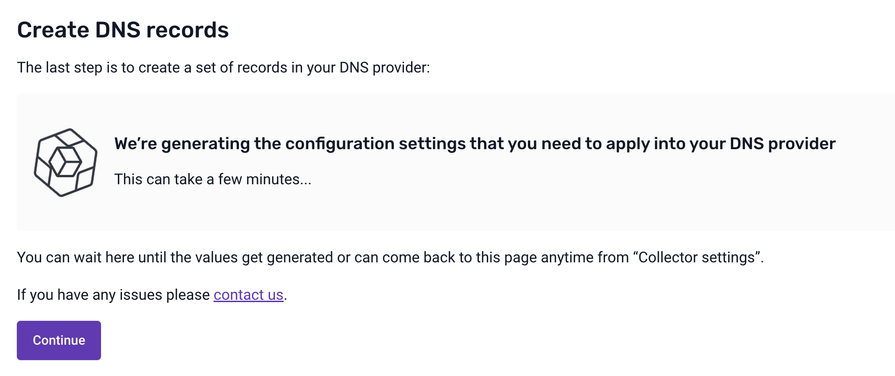
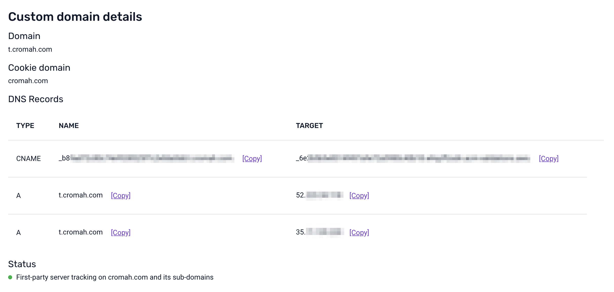
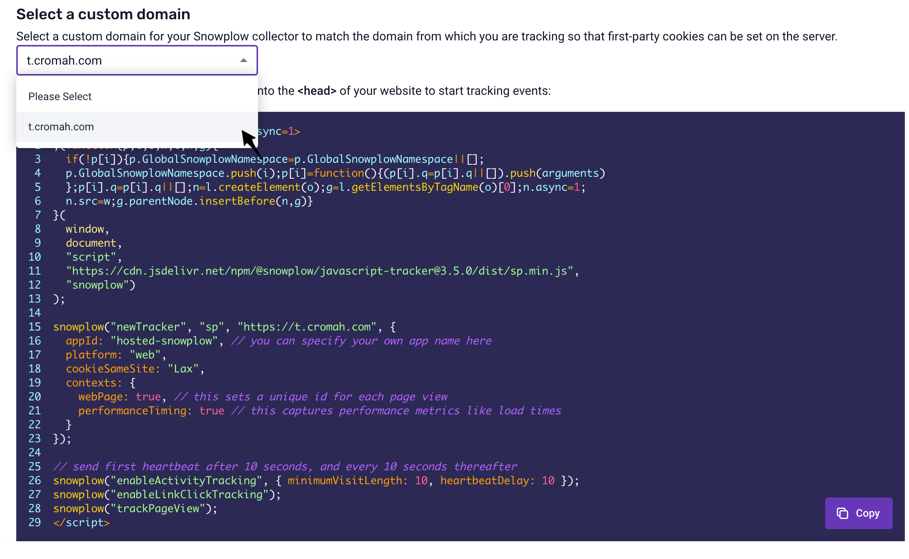

# First-party tracking

This feature lets you configure a custom collector domain to match your primary domain, enabling first-party cookies.

When your collector domain (e.g. `collector.snwplow.net`) does not match your primary domain (e.g. `flowershop.ai`), web browsers can impose limitations on the collected data. For example, cookies set by the collector might be only kept for 7 days.

With first-party tracking, you can configure a custom collector domain (e.g. `c.flowershop.ai`) to match your primary domain (e.g. `flowershop.ai`), sidestepping these limitations.

Note that in light of the [latest ITP restrictions](https://webkit.org/tracking-prevention/#cname-and-third-party-ip-address-cloaking-defense), you will also need to [use a Cookie Extension service](/docs/events/cookie-extension/index.md) to fully persist the cookies.

:::info

Before starting, ensure you can access and edit the configuration of your hosting/DNS provider. This is necessary to complete the implementation.

:::

:::info

The flow described below might differ depending on the version of Snowplow BDP you are using.

:::

## Selecting the domain names

When configuring first-party tracking, you first need to set a collector domain where the events will be sent to by the web browser. This must be a subdomain of your primary domain. For example, for `flowershop.ai` it could be `t.flowershop.ai` or `c.app.flowershop.ai`.

:::tip
Avoid words such as “track”, “collect” or “analytics”, as ad blockers may prevent data from being sent to domains containing these words.
:::

You also need to select a cookie domain. This will determine on which websites the cookie will be available. For example, if your cookie domain is `flowershop.ai`, the cookie will be available on `flowershop.ai`, as well as any subdomains.

:::note
For Snowplow collector to be able to set the cookie, the cookie domain must be a parent domain of the collector domain.
:::

Here are a few examples:

| Collector domain      | Cookie domain       | Cookie available on                                      |
| :-------------------- | :------------------ | :------------------------------------------------------- |
| `t.flowershop.ai`     | `flowershop.ai`     | `flowershop.ai`,   `app.flowershop.ai`, etc          |
| `c.app.flowershop.ai` | `app.flowershop.ai` | `app.flowershop.ai`,   `beta.app.flowershop.ai`, etc |

When you enter a collector domain, we will automatically suggest a cookie domain. You can edit it to suit your use case.

How to choose the cookie domain

Setting the cookie domain to your primary domain has the benefit of allowing you to track users across any subdomains.
For example, a cookie domain of `flowershop.ai` would work across all the following subdomains (and would allow you to track the same user ids):

- `docs.flowershop.ai`
- `app.flowershop.ai`
- `test.app.flowershop.ai`
- `flowershop.ai`

In some cases, you may wish to separate the tracking of user behavior for different subdomains.

For example, if you own both `gardening.primary-domain.co.uk` and `insurance.primary-domain.co.uk` and only want to track users on `gardening.primary-domain.co.uk`, you can select that as your cookie domain and `c.gardening.primary-domain.co.uk` as your collector domain.

## Configuring DNS records
In the next step, BDP will generate the required DNS records. This may take several minutes.

When the records are ready, you will receive a confirmation by email.

Once the DNS records are available, copy them into your domain provider.

The set of DNS records will contain a special record that allows BDP to verify that the setup is correct.

:::info
You will have to conclude this step within 72 hours. If BDP is unable to verify the setup within that timeframe, you will have to restart the process from the beginning.
:::

Once BDP verifies your DNS setup, the status in the bottom left will change and you will receive a confirmation by email.

## Updating your tracking code

Once the new custom domain is verified, you can implement the tracking code.

This can be done in several ways:

- If you have not yet implemented tracking and wish to implement the JavaScript tracking snippet, navigate to “Start tracking events”. You can select the new custom domain from the dropdown and the code snippet will automatically update.
- If you already have tracking implemented and are using the JavaScript tracker, follow the above step or update the collector URL manually.
- If you wish to implement tracking or already have tracking with one of our other trackers then you will need to manually change the collector URL.

